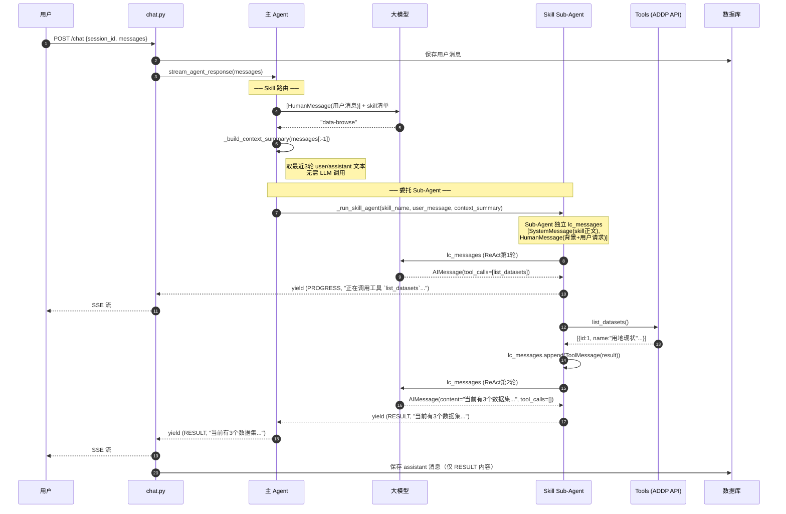
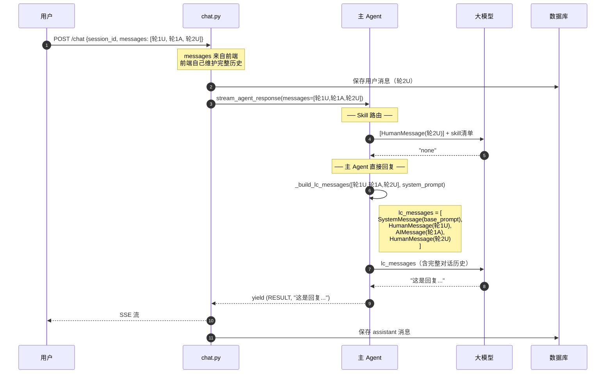

# Agent 时序图与上下文分析

## 时序图

### 单轮对话（有 Skill）



---

### 多轮对话（第2轮，无 Skill）



---

## 当前架构的 Token 消耗分析

### 每轮请求的 LLM 调用次数

| 场景 | 调用次数 | 内容 |
|------|----------|------|
| 有 Skill，工具 N 次 | 2 + N | 路由1次 + ReAct(1+N)次 |
| 无 Skill | 2 | 路由1次 + 主Agent回复1次 |

---

## 现存问题与改进建议

### 问题1：路由调用是浪费 ❌

**现状**：每轮请求都有一次独立的 LLM 路由调用，仅传入用户消息 + skill 清单，不携带历史上下文。

**问题**：
- 无历史上下文 → 无法根据多轮对话语境路由（如"查一下那个数据集的详情"，缺乏上下文会路由错）
- 每次增加一次额外 LLM 调用，延迟约 1-2s

**更好的做法**：把路由判断合并到主 Agent 的第一次 LLM 调用中，通过 system prompt 里的 skill 清单 + function calling，让 LLM 一次同时决定"用哪个 skill"和"怎么回答"，省去独立路由调用。

---

### 问题2：多轮对话时，历史消息原文全量传入 ❌

**现状（无 Skill 路径）**：
```python
lc_messages = [system, 轮1U, 轮1A, 轮2U, 轮2A, ...]
```
每轮都携带所有历史原文，token 随轮数线性增长。

**对比（有 Skill 路径）**：
```
Sub-Agent 只看 context_summary（最近3轮摘要文本）
```

有 Skill 和无 Skill 两条路径的历史处理策略**不一致**，应该统一。

**更好的做法**：对无 Skill 路径，超过一定轮数后也应对历史做截断/压缩，而不是原文全量堆叠。

---

### 问题3：context_summary 是截断而不是摘要 ⚠️

**现状**：
```python
recent = messages[-(max_turns * 2):]  # 取最近6条消息原文
```

这是**截断**（丢弃更早的历史），不是**摘要**（压缩语义）。如果某次关键的对话背景在第4轮之前，Sub-Agent 就看不到了。

**更好的做法**：Claude Code 的做法是在上下文接近上限时触发一次 LLM 摘要调用，把早期历史压缩成摘要文本，保留语义而不是简单截断。但这需要主 Agent 维护自己的 session 历史（目前没有）。

---

### 问题4：主 Agent 没有维护 Session 历史，完全依赖前端 ❌

**现状**：`chat.py` 把前端发来的 `body.messages` 直接传给 `stream_agent_response()`。

**问题**：
- 前端需要每次把完整历史都发过来（HTTP Body 随轮数增大）
- 后端 DB 里已经存了历史消息，但没有被利用 — **存了不用，是浪费**
- 如果前端维护历史有 bug（丢消息、乱序），后端无法校验

**更好的做法**：`chat.py` 用 `session_id` 从 DB 查最近 N 条历史，自己构建 `messages`，前端只需要发当前这条用户消息，不需要携带历史。

---

### 问题5：Sub-Agent 的 lc_messages 全程堆叠 ToolMessage ⚠️

**现状**：Sub-Agent 的 `lc_messages` 在 ReAct 循环中不断追加 `AIMessage + ToolMessage`，全量堆叠。如果工具返回大量数据（如查询结果几十条记录），每次迭代都带着这些数据传给 LLM。

已有的截断仅用于日志：
```python
truncated = tool_result[:2000] + (f"...[共 {len(tool_result)} 字符]" if len(tool_result) > 2000 else "")
logger.info(...)  # 只截断了日志，ToolMessage 原文入 lc_messages
```

**更好的做法**：`ToolMessage` 内容也应该截断到合理长度（如 3000 字符）后再放入 `lc_messages`，避免单个工具结果撑爆上下文。

---

## 改进建议汇总（优先级从高到低）

```
1. 后端从 DB 读历史，前端只发当前消息        [架构级，解决根本问题]
2. ToolMessage 结果截断后再放入 lc_messages   [简单修复，防爆上下文]
3. 无 Skill 路径也限制历史长度（N轮）         [与有Skill路径对齐]
4. 路由合并到主 Agent 第一次 LLM 调用         [减少延迟，需要重构]
5. 历史摘要（vs 截断）                        [复杂度高，可后续做]
```

**最值得优先做的是第1条和第2条**：第1条从架构上解决历史管理混乱的问题，第2条是一行代码的防御性修复。
