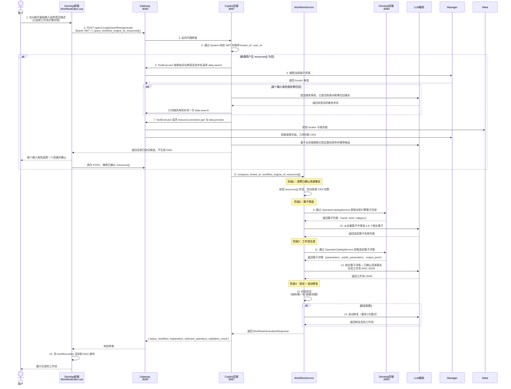
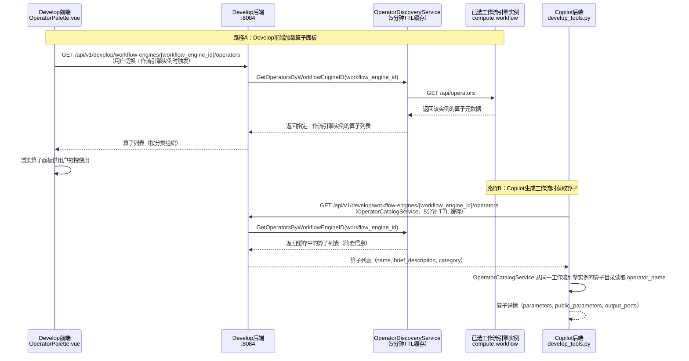
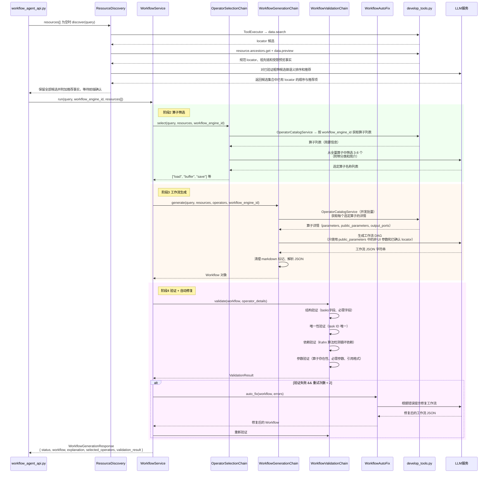

# Copilot × Develop 调用关系说明

## 概述

Copilot 是一个**纯后端 API 服务**（Python FastAPI，端口 8087），没有独立前端。Develop 的查询工作台、工作流编辑器和 Notebook 编辑器分别嵌入 AI 助手：查询工作台把当前 Query Engine、查询语言、可选的已确认资源和编辑器已有查询交给 Copilot 生成候选查询文本；工作流编辑器把工作流运行时和已确认资源交给 Copilot 生成 DAG；Notebook 编辑器把当前 Session Catalog 中用户确认的资源事实交给 Copilot 生成 Python/GeoPandas 单元。三种结果都只作为候选，保存、插入和执行继续归 Develop。

---

## 组件职责总览

| 层级 | 组件 | 职责 |
|------|------|------|
| **Develop 前端** | `WorkflowEditor.vue` | AI 助手面板 UI；用户输入自然语言、选择工作流引擎实例；接收并渲染生成的工作流 DAG |
| **Develop 前端** | `QueryEditor.vue` | 查询 AI 助手；固定当前 Query Engine 与 capability 查询语言，确认该引擎内的数据资源并把候选查询回填 Monaco Editor |
| **Develop 前端** | `NotebookEditor.vue` | Notebook AI 助手；只使用当前 Notebook Session Catalog，逐角色确认数据源后展示并插入 Python 单元 |
| **Develop 前端** | `OperatorPalette.vue` | 算子面板；按工作流引擎实例加载可用算子列表供用户拖拽使用 |
| **Develop 前端** | `api/copilot.js` | 封装对 Copilot 后端的 HTTP 调用 |
| **Gateway** | `gateway:8000` | 统一路由入口；将 `/api/copilot/*` 反向代理到 Copilot 后端 |
| **Develop 后端** | `operator_discovery_service.go` | 算子发现服务；按工作流引擎实例查询算子元数据；汇总入口仅用于调试/全局查看 |
| **Copilot 后端** | `workflow_agent_api.py` | 工作流生成 API 端点；缺少资源事实时先返回 owner 校验后的候选 |
| **Copilot 后端** | `query_agent_api.py` | 查询生成 API 端点；只在请求的当前 Query Engine 内发现资源，确认后按引擎 capability 生成候选查询语言 |
| **Develop 后端** | `notebook_copilot_service.go` | Notebook Session 候选粗筛、缺失角色补充检索、候选确认和 Catalog facts 重新校验 |
| **Copilot 后端** | `notebook_agent_api.py`、`notebook_service.py` | Notebook 输入角色理解、候选语义排序和受控 Python/GeoPandas 单元生成；不执行代码、不做租户级搜索 |
| **Copilot 后端** | `resource_intent_chain.py`、`resource_discovery.py`、`resource_recommendation_chain.py` | 查询与工作流共享的资源发现；提取独立输入意图并补充跨语言技术名，再复用 common-python ToolExecutor 执行 `data.search → resource.ancestors.get → data.preview`，最后由 LLM 对已验证候选排序并标记推荐项，不过滤仍然合理的候选 |
| **Copilot 后端** | `workflow_pipeline.py` | 消费已确认资源事实，协调算子筛选、生成、验证全流程 |
| **Copilot 后端** | `operator_selection_chain.py` | LLM Chain；从全量算子列表中筛选 3-8 个最相关算子 |
| **Copilot 后端** | `workflow_generation_chain.py` | LLM Chain；根据选定算子的 Public Operator Spec 生成完整 DAG JSON |
| **Copilot 后端** | `workflow_validation_chain.py` | 四层验证；结构、唯一性、依赖关系、参数合法性 |
| **Copilot 后端** | `develop_tools.py` | LangChain Tools；封装对 Develop 后端算子 API 的调用（发现 + 详情） |
| **工作流引擎** | `python-workflow` / `spark-workflow` / `math-workflow` | 暴露 `/api/operators` 端点；提供算子元数据（参数定义、输出定义、workflow_example） |
| **LLM 服务** | 通义千问 / OpenAI / Claude / Ollama | 执行算子筛选、工作流生成、自动修复等推理任务 |

## 查询工作台生成主流程

1. Develop 前端提交自然语言、当前 `engine_id`、当前 `query_language`、可选的具体 data item locator 和可选 `current_query`。执行范围 locator 不提交给 Copilot。
2. Copilot 通过 `engine.list` 验证当前用户可访问该 Query Engine，并校验查询语言属于 `capabilities.compute.query.languages`。
3. 已提交具体 data item locator 时执行 `resource.ancestors.get` 与 `data.preview`；`resources=[]` 且 MQL `current_query` 已通过 `find/aggregate/count/distinct` 明确主 collection 时，直接使用编辑器上下文；其他未提交资源的情况提取独立输入角色，调用带当前 `engine_id` 的 `data.search` 粗筛，再校验 locator 和预览事实。
4. 同一角色多候选时返回全部候选给用户单选；候选不得来自其他 Engine。
5. 用户确认后，Copilot 仅根据当前引擎类型、查询语言、已验证路径、字段、几何列、CRS、受限样本和允许的编辑器已有查询生成候选查询文本。MongoDB database 只作为 Develop 执行范围，MQL 主 collection 来自命令对象；不得硬编码 PostgreSQL、schema、geometry 字段或空间函数。
6. 前端把候选文本写入 Monaco Editor，不自动执行。用户执行时继续进入 Develop preflight、效果授权、高风险确认与统一 execution API。

Agent 使用根 `skills/query-generation` 和 `query.draft.generate` Tool 复用同一流程；ToolExecutor、SDK、资源事实解析和 Copilot WorkflowService 均来自 `common-python`/Copilot，不在 Agent 复制。

## Notebook 编辑器生成主流程

1. Develop 创建短期 Notebook Session，并以该 Session 的授权 Catalog 作为唯一数据范围。
2. 首次请求只让 Copilot 提取独立输入角色及中英文检索词；Develop 在 Session Catalog 内粗筛。某个角色零召回时，Copilot 只为该角色补充一次未尝试的检索词，Develop 再次扫描同一 Catalog。
3. Develop 将全部候选返回前端，LLM 只能排序和标记推荐项；多个候选必须由用户逐角色确认。
4. 确认后 Develop 重新校验原生路径并读取字段、几何列、几何类型和 CRS，调用 `notebook.draft.generate`。
5. Copilot 只生成通过 `addp_common.notebook.engines` 读取数据的 Pandas/GeoPandas Python 单元。空间表使用 `to_geopandas(...)`；不得生成 `engine.sql(...)`、旁路连接或硬编码字段/CRS。
6. Develop 展示代码，用户确认后由同源 JupyterLab bridge 插入新单元，不自动执行。

---

## 时序图 1：Develop 前端发起工作流生成（主流程）



---

## 时序图 2：算子发现机制（如何知道有哪些算子可用）



---

## 时序图 3：Copilot 内部工作流生成详细流程



---

## 工作流引擎选择机制

工作流引擎的选择发生在 **Develop 前端**，用户在 `WorkflowEditor.vue` 中选择具体工作流引擎实例后，前端只把 `workflow_engine_id` 作为参数传给 Copilot。Copilot 不接收 `engine_type`，也不根据内置类型名选择算子；算子发现、详情获取和工作流验证都以该实例 ID 为准。

### 引擎实例与扩展性

工作流引擎是 ADDP 扩展引擎的一种。内置的 GeoPython Workflow、Spark Workflow、Math Workflow 与用户动态注册的工作流引擎都通过 System 引擎实例进入体系；只要实例具备 `compute.workflow` 能力，Develop 和 Copilot 就通过同一条 `workflow_engine_id` 路径消费它的算子。

### 引擎选择与运行时绑定

Copilot 生成接口接收 `workflow_engine_id` 和可选的 `resources[]`：

- `workflow_engine_id`：决定**使用哪个工作流引擎实例**发现算子、获取算子详情和验证工作流；不写入算子 params。工作流实际执行时由 Develop 的执行配置 `engine_id` 指向同一类工作流运行时实例
- `resources[]`：调用方通过 owner Tool 验证的全部输入资源事实。Develop 普通用户首次请求为空时，Copilot 只负责通过共享 `ResourceResolutionService` 返回候选并等待前端确认；Agent 调用和确认后的请求必须直接携带该字段，WorkflowService 不重新搜索或推断数据源
- Spark 工作流执行还需要在 `engine_specific.spark_cluster_id` 中绑定真实 `spark` 通用引擎；该 ID 只用于运行时连接 Spark 集群，不能和工作流运行时 `engine_id` 或数据源 locator 混用

### 参数传递路径

```
Develop前端（用户选择引擎）
  → POST /api/v1/copilot/workflow/generate（用户身份来自 Bearer JWT）
    { workflow_engine_id: 1, resources: [{ role, locator, geometry_column, crs }] }
  → Copilot WorkflowService
    → OperatorCatalogService: GET /api/v1/develop/workflow-engines/1/operators
    → 算子筛选 → 工作流生成（算子均来自该工作流引擎实例）
  → 返回工作流 JSON（包含算子名称，均为所选工作流引擎实例支持的算子）
  → Develop 执行时使用 execution_config.engine_id 指定工作流运行时实例
  → 若所选工作流引擎实例为 Spark Workflow，再使用 execution_config.engine_specific.spark_cluster_id 指定真实 spark 通用引擎
```

工作流任务参数中的数据资源身份统一使用 `locator` 或 `target_parent_locator + target_name`。`engine_id`、`connection_info`、`schema`、`table`、`path` 是 Develop 执行前派生给运行时的内部参数，不由 Copilot 写入任务 params。

### 数据源事实约定

- Manager 混合检索只负责语义匹配，搜索结果的 `locator` 必须是由 Meta 事实建立的已有资源身份。
- Copilot 的资源发现阶段先从需求提取独立输入数据意图；中文或其他自然语言资源名必须补充常用英文技术名，再对每个输入使用共享 `ToolExecutor` 依次调用 `data.search`、`resource.ancestors.get` 和 `data.preview`。某个角色首轮零召回时，只把该角色、已尝试检索词和零召回事实反馈给 LLM，过滤重复词后受限补充一次搜索；已召回角色不得重复发现。只有 ancestors 返回的 `target_locator` 与搜索 locator 一致、且预览返回受限字段/空间事实时，候选才进入 LLM 语义排序。LLM 只能对候选集合中已有的 locator 排序和标记推荐项，不得删除仍然合理的候选；歧义判断基于全部已验证候选。同一输入角色存在多个候选时，前端必须展示引擎、逻辑全名、locator、数据类型和空间事实，并要求用户选择一个；只有单一候选可以默认选中。
- Copilot 不得根据 `engine_id + schema/table/bucket/path` 自行拼接 locator，也不得从已删除的 Develop catalog 查询路径推导资源身份。
- 未找到候选、候选不唯一、置信度不足或 Meta 无法校验 locator 时，ResourceResolutionService 必须返回 `need_clarification`，不得继续调用工作流生成 LLM。
- 工作流生成后必须再校验资源事实：所有 `load.locator` 和 `save.target_parent_locator` 都必须来自本次已验证数据源上下文。LLM 新增任何未验证 locator 时统一返回 `need_clarification`，不进入自动修复。

---

## 算子元数据结构

每个算子向 Develop 后端暴露标准化的元数据。`parameters` 是工作流运行时真实执行参数，`public_parameters` 是前端、用户和 AI 共同使用的公开契约。Copilot 只能根据 `public_parameters` 生成和验证 workflow definition，不能消费 Runtime Operator Spec 中的 `parameters` 或 `detailed_description.workflow_example`。

```json
{
  "id": "buffer",
  "name": "buffer",
  "display_name": "缓冲区分析",
  "category": "空间分析",
  "category_path": ["空间分析"],
  "engine_type": "geopython_workflow",
  "brief_description": "对几何对象生成指定距离的缓冲区",
  "detailed_description": "...",
  "parameters": [
    {
      "name": "input_gdf",
      "type": "GeoDataFrame",
      "required": true,
      "description": "运行时输入"
    },
    {
      "name": "distance",
      "type": "float",
      "required": true,
      "description": "缓冲区距离"
    }
  ],
  "public_parameters": [
    {
      "name": "distance",
      "type": "float",
      "required": true,
      "description": "缓冲区距离",
      "notes": "单位由 unit 参数决定"
    },
    {
      "name": "unit",
      "type": "string",
      "required": false,
      "default": "meters",
      "enum": ["meters", "kilometers", "degrees"]
    }
  ],
  "output_ports": [
    {
      "name": "result",
      "type": "GeoDataFrame",
      "description": "缓冲区结果"
    }
  ],
  "use_cases": ["POI 服务范围分析", "洪水淹没区域计算"],
  "notes": ["输入几何必须已设置正确的坐标系"]
}
```

### 字段作用分工

| 字段 | 用于算子面板（OperatorPalette） | 用于 LLM 生成工作流 | 用于验证（ValidationChain） |
|------|-------------------------------|--------------------|-----------------------------|
| `name` / `display_name` | 展示算子名称 | 算子引用标识 | 算子存在性检查 |
| `category` | 分类展示 | LLM 筛选参考 | - |
| `brief_description` | 悬浮提示 | LLM 筛选参考 | - |
| `parameters` | - | - | -（仅供 Develop Adapter 构造运行时请求） |
| `public_parameters` | 参数配置面板渲染 | 非 UI 参数的名称、类型和约束 | 必需参数、参数名称验证 |
| `output_ports` | - | 输出引用参考 | 参数引用格式验证 |

`public_parameters` 中 `param_type=ui` 的条目只描述前端控件，不能写入 workflow task `params`。资源参数通过同一数组中的 `locator`、`target_parent_locator` 和 `target_name` 声明。

## 错误传播约定

- LLM 调用失败、Develop API 失败或算子公开契约缺失时，Copilot 必须立即终止当前生成流程并向 API 层传播真实原因。
- 不得将上游异常转换为空算子列表或空算子详情，否则会将真实故障误报为“无法获取算子详情”。
- API 以非 2xx 状态返回生成失败，`detail` 保留可操作的上游错误信息，Develop 前端直接展示该字段。
