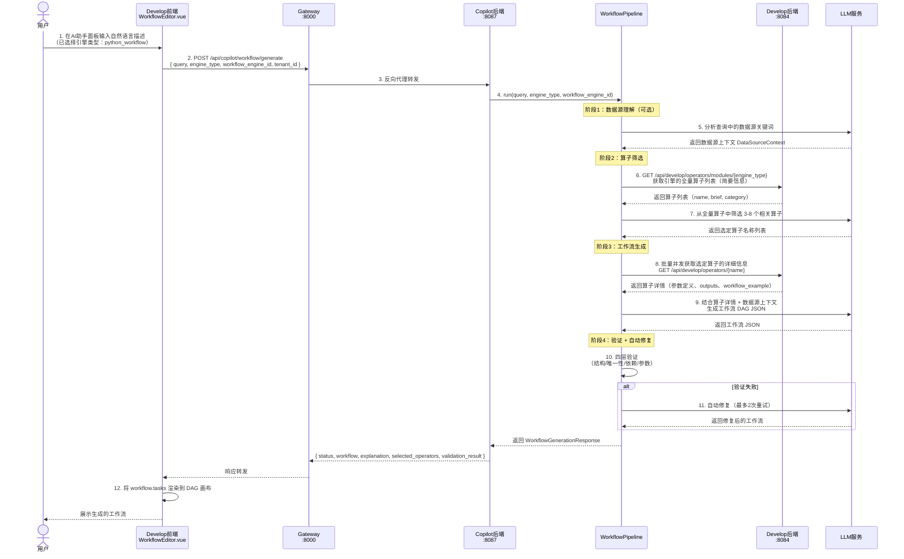
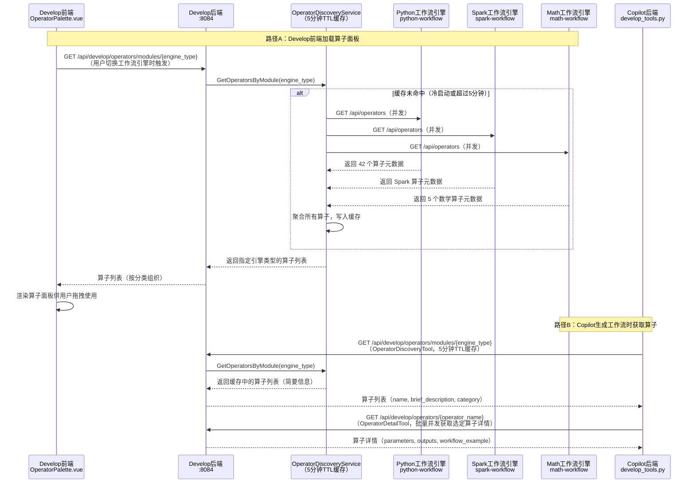
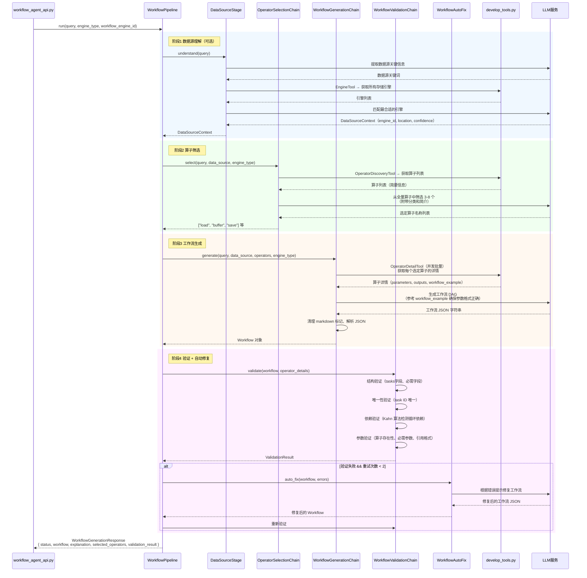

# Copilot × Develop 调用关系说明

## 概述

Copilot 是一个**纯后端 API 服务**（Python FastAPI，端口 8087），没有独立前端。Develop 模块的工作流编辑器（`WorkflowEditor.vue`）内嵌了 AI 助手面板，用户在该面板中输入自然语言描述，前端将引擎类型等上下文随请求一起发给 Copilot，由 Copilot 后端驱动 LLM 完成工作流 DAG JSON 的生成，再返回给前端渲染到画布。

---

## 组件职责总览

| 层级 | 组件 | 职责 |
|------|------|------|
| **Develop 前端** | `WorkflowEditor.vue` | AI 助手面板 UI；用户输入自然语言、选择引擎类型；接收并渲染生成的工作流 DAG |
| **Develop 前端** | `OperatorPalette.vue` | 算子面板；按引擎类型加载可用算子列表供用户拖拽使用 |
| **Develop 前端** | `api/copilot.js` | 封装对 Copilot 后端的 HTTP 调用 |
| **Gateway** | `gateway:8000` | 统一路由入口；将 `/api/copilot/*` 反向代理到 Copilot 后端 |
| **Develop 后端** | `operator_discovery_service.go` | 算子发现服务；并发查询所有已注册的工作流引擎，聚合算子元数据，5 分钟 TTL 缓存 |
| **Copilot 后端** | `workflow_agent_api.py` | 工作流生成 API 端点；接收请求，调用 WorkflowPipeline |
| **Copilot 后端** | `workflow_pipeline.py` | 5 阶段流水线编排器；协调数据源理解、算子筛选、生成、验证全流程 |
| **Copilot 后端** | `operator_selection_chain.py` | LLM Chain；从全量算子列表中筛选 3-8 个最相关算子 |
| **Copilot 后端** | `workflow_generation_chain.py` | LLM Chain；根据选定算子的详情（含 workflow_example）生成完整 DAG JSON |
| **Copilot 后端** | `workflow_validation_chain.py` | 四层验证；结构、唯一性、依赖关系、参数合法性 |
| **Copilot 后端** | `develop_tools.py` | LangChain Tools；封装对 Develop 后端算子 API 的调用（发现 + 详情） |
| **工作流引擎** | `python-workflow` / `spark-workflow` / `math-workflow` | 暴露 `/api/operators` 端点；提供算子元数据（参数定义、输出定义、workflow_example） |
| **LLM 服务** | 通义千问 / OpenAI / Claude / Ollama | 执行算子筛选、工作流生成、自动修复等推理任务 |

---

## 时序图 1：Develop 前端发起工作流生成（主流程）



---

## 时序图 2：算子发现机制（如何知道有哪些算子可用）



---

## 时序图 3：Copilot 内部工作流生成详细流程



---

## 工作流引擎选择机制

工作流引擎的选择发生在 **Develop 前端**，用户在 `WorkflowEditor.vue` 中选择引擎类型后，该信息作为参数随 Copilot API 请求传递，贯穿整个生成流程。

### 三种引擎对比

| 引擎类型 | 参数值 | 适用场景 | 算子数量 |
|---------|--------|---------|---------|
| Python 工作流 | `python_workflow` | 空间数据处理（GIS 操作）、中小规模数据 | 42 个（24 空间 + 18 非空间） |
| Spark 工作流 | `spark_workflow` | 大规模分布式数据处理 | 若干（含空间分析、SQL 查询等） |
| Math 工作流 | `math_workflow` | 基础数学运算演示/测试 | 5 个（加减乘除、平均） |

### 引擎 ID 的作用

除了 `engine_type`（引擎类型），请求还携带 `workflow_engine_id`（引擎实例 ID）。两者作用不同：

- `engine_type`：决定**用哪类引擎**的算子，Copilot 据此获取对应的算子元数据
- `workflow_engine_id`：指向系统中注册的**具体引擎实例**（如某个 Python 运行时服务），用于数据源匹配和最终执行

### 参数传递路径

```
Develop前端（用户选择引擎）
  → POST /api/copilot/workflow/generate
    { engine_type: "python_workflow", workflow_engine_id: 1 }
  → Copilot WorkflowPipeline
    → OperatorDiscoveryTool: GET /api/develop/operators/modules/python_workflow
    → 算子筛选 → 工作流生成（算子均来自 python_workflow 命名空间）
  → 返回工作流 JSON（包含算子名称，均为 python_workflow 引擎支持的算子）
  → 工作流执行时使用 workflow_engine_id 指定执行实例
```

---

## 算子元数据结构

每个算子向 Develop 后端暴露标准化的元数据，其中 `workflow_example` 是 LLM 生成工作流时最重要的参考字段。

```json
{
  "id": "buffer",
  "name": "buffer",
  "display_name": "缓冲区分析",
  "category": "空间分析",
  "module": "python_workflow",
  "brief_description": "对几何对象生成指定距离的缓冲区",
  "detailed_description": "...",
  "parameters": [
    {
      "name": "distance",
      "type": "float",
      "required": true,
      "description": "缓冲区距离",
      "notes": "单位由 unit 参数决定"
    },
    {
      "name": "unit",
      "type": "string",
      "required": false,
      "default": "meters",
      "enum": ["meters", "kilometers", "degrees"]
    }
  ],
  "outputs": [
    {
      "name": "result",
      "type": "GeoDataFrame",
      "description": "缓冲区结果"
    }
  ],
  "workflow_example": {
    "id": "buffer_task",
    "operator": "buffer",
    "params": {
      "distance": 100,
      "unit": "meters"
    },
    "depends_on": ["load_task"]
  },
  "use_cases": ["POI 服务范围分析", "洪水淹没区域计算"],
  "notes": ["输入几何必须已设置正确的坐标系"]
}
```

### 字段作用分工

| 字段 | 用于算子面板（OperatorPalette） | 用于 LLM 生成工作流 | 用于验证（ValidationChain） |
|------|-------------------------------|--------------------|-----------------------------|
| `name` / `display_name` | 展示算子名称 | 算子引用标识 | 算子存在性检查 |
| `category` | 分类展示 | LLM 筛选参考 | - |
| `brief_description` | 悬浮提示 | LLM 筛选参考 | - |
| `parameters` | 参数配置面板渲染 | 参数名/类型参考 | 必需参数、参数名称验证 |
| `outputs` | - | 输出引用参考 | 参数引用格式验证 |
| `workflow_example` | - | **最重要**：LLM 参考此格式生成 tasks | - |
