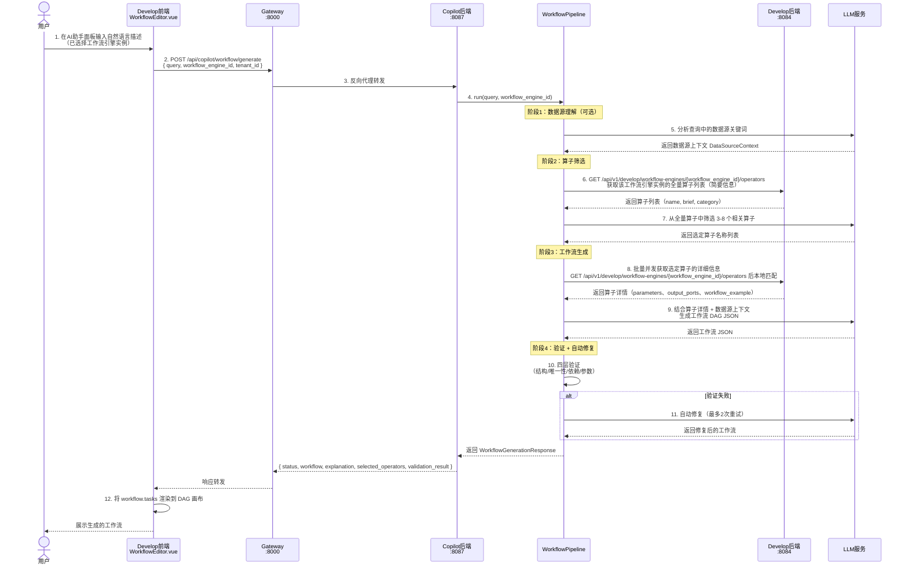
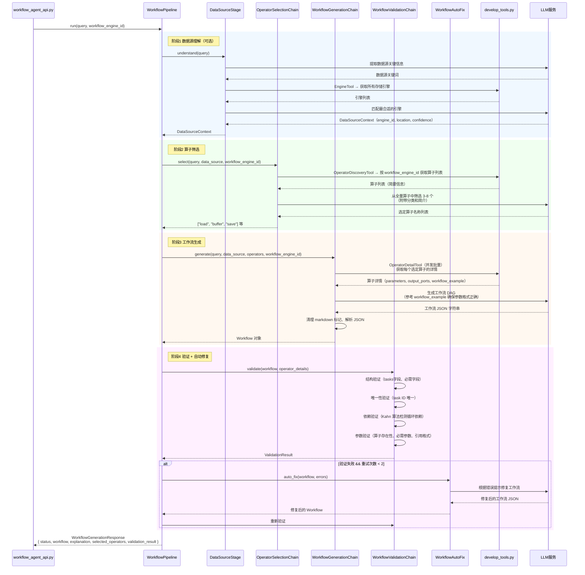

# Copilot × Develop 调用关系说明

## 概述

Copilot 是一个**纯后端 API 服务**（Python FastAPI，端口 8087），没有独立前端。Develop 模块的工作流编辑器（`WorkflowEditor.vue`）内嵌了 AI 助手面板，用户在该面板中输入自然语言描述，前端将已选择的工作流引擎实例 ID 随请求发给 Copilot，由 Copilot 后端驱动 LLM 完成工作流 DAG JSON 的生成，再返回给前端渲染到画布。

---

## 组件职责总览

| 层级 | 组件 | 职责 |
|------|------|------|
| **Develop 前端** | `WorkflowEditor.vue` | AI 助手面板 UI；用户输入自然语言、选择工作流引擎实例；接收并渲染生成的工作流 DAG |
| **Develop 前端** | `OperatorPalette.vue` | 算子面板；按工作流引擎实例加载可用算子列表供用户拖拽使用 |
| **Develop 前端** | `api/copilot.js` | 封装对 Copilot 后端的 HTTP 调用 |
| **Gateway** | `gateway:8000` | 统一路由入口；将 `/api/copilot/*` 反向代理到 Copilot 后端 |
| **Develop 后端** | `operator_discovery_service.go` | 算子发现服务；按工作流引擎实例查询算子元数据；汇总入口仅用于调试/全局查看 |
| **Copilot 后端** | `workflow_agent_api.py` | 工作流生成 API 端点；接收请求，调用 WorkflowPipeline |
| **Copilot 后端** | `workflow_pipeline.py` | 5 阶段流水线编排器；协调数据源理解、算子筛选、生成、验证全流程 |
| **Copilot 后端** | `operator_selection_chain.py` | LLM Chain；从全量算子列表中筛选 3-8 个最相关算子 |
| **Copilot 后端** | `workflow_generation_chain.py` | LLM Chain；根据选定算子的详情（含 workflow_example）生成完整 DAG JSON |
| **Copilot 后端** | `workflow_validation_chain.py` | 四层验证；结构、唯一性、依赖关系、参数合法性 |
| **Copilot 后端** | `develop_tools.py` | LangChain Tools；封装对 Develop 后端算子 API 的调用（发现 + 详情） |
| **工作流引擎** | `python-workflow` / `spark-workflow` / `math-workflow` | 暴露 `/api/operators` 端点；提供算子元数据（参数定义、输出定义、workflow_example） |
| **LLM 服务** | 通义千问 / OpenAI / Claude / Ollama | 执行算子筛选、工作流生成、自动修复等推理任务 |

---

## 时序图 1：Develop 前端发起工作流生成（主流程）



---

## 时序图 2：算子发现机制（如何知道有哪些算子可用）


---

## 时序图 3：Copilot 内部工作流生成详细流程



---

## 工作流引擎选择机制

工作流引擎的选择发生在 **Develop 前端**，用户在 `WorkflowEditor.vue` 中选择具体工作流引擎实例后，前端只把 `workflow_engine_id` 作为参数传给 Copilot。Copilot 不接收 `engine_type`，也不根据内置类型名选择算子；算子发现、详情获取和工作流验证都以该实例 ID 为准。

### 引擎实例与扩展性

工作流引擎是 ADDP 扩展引擎的一种。内置的 Python Workflow、Spark Workflow、Math Workflow 与用户动态注册的工作流引擎都通过 System 引擎实例进入体系；只要实例具备 `compute.workflow` 能力，Develop 和 Copilot 就通过同一条 `workflow_engine_id` 路径消费它的算子。

### 引擎选择与运行时绑定

Copilot 生成接口只接收 `workflow_engine_id`：

- `workflow_engine_id`：决定**使用哪个工作流引擎实例**发现算子、获取算子详情和验证工作流；不写入算子 params。工作流实际执行时由 Develop 的执行配置 `engine_id` 指向同一类工作流运行时实例
- Spark 工作流执行还需要在 `engine_specific.spark_cluster_id` 中绑定真实 `spark` 通用引擎；该 ID 只用于运行时连接 Spark 集群，不能和工作流运行时 `engine_id` 或数据源 locator 混用

### 参数传递路径

```
Develop前端（用户选择引擎）
  → POST /api/copilot/workflow/generate
    { workflow_engine_id: 1 }
  → Copilot WorkflowPipeline
    → OperatorDiscoveryTool: GET /api/v1/develop/workflow-engines/1/operators
    → 算子筛选 → 工作流生成（算子均来自该工作流引擎实例）
  → 返回工作流 JSON（包含算子名称，均为所选工作流引擎实例支持的算子）
  → Develop 执行时使用 execution_config.engine_id 指定工作流运行时实例
  → 若所选工作流引擎实例为 Spark Workflow，再使用 execution_config.engine_specific.spark_cluster_id 指定真实 spark 通用引擎
```

工作流任务参数中的数据资源身份统一使用 `locator` 或 `target_parent_locator + target_name`。`engine_id`、`connection_info`、`schema`、`table`、`path` 是 Develop 执行前派生给运行时的内部参数，不由 Copilot 写入任务 params。

---

## 算子元数据结构

每个算子向 Develop 后端暴露标准化的元数据，其中 `workflow_example` 是 LLM 生成工作流时最重要的参考字段。

```json
{
  "id": "buffer",
  "name": "buffer",
  "display_name": "缓冲区分析",
  "category": "空间分析",
  "category_path": ["空间分析"],
  "engine_type": "python_workflow",
  "brief_description": "对几何对象生成指定距离的缓冲区",
  "detailed_description": "...",
  "parameters": [
    {
      "name": "distance",
      "type": "float",
      "required": true,
      "description": "缓冲区距离",
      "notes": "单位由 unit 参数决定"
    },
    {
      "name": "unit",
      "type": "string",
      "required": false,
      "default": "meters",
      "enum": ["meters", "kilometers", "degrees"]
    }
  ],
  "output_ports": [
    {
      "name": "result",
      "type": "GeoDataFrame",
      "description": "缓冲区结果"
    }
  ],
  "workflow_example": {
    "id": "buffer_task",
    "operator": "buffer",
    "params": {
      "distance": 100,
      "unit": "meters"
    },
    "depends_on": ["load_task"]
  },
  "use_cases": ["POI 服务范围分析", "洪水淹没区域计算"],
  "notes": ["输入几何必须已设置正确的坐标系"]
}
```

### 字段作用分工

| 字段 | 用于算子面板（OperatorPalette） | 用于 LLM 生成工作流 | 用于验证（ValidationChain） |
|------|-------------------------------|--------------------|-----------------------------|
| `name` / `display_name` | 展示算子名称 | 算子引用标识 | 算子存在性检查 |
| `category` | 分类展示 | LLM 筛选参考 | - |
| `brief_description` | 悬浮提示 | LLM 筛选参考 | - |
| `parameters` | 参数配置面板渲染 | 参数名/类型参考 | 必需参数、参数名称验证 |
| `output_ports` | - | 输出引用参考 | 参数引用格式验证 |
| `workflow_example` | - | **最重要**：LLM 参考此格式生成 tasks | - |
