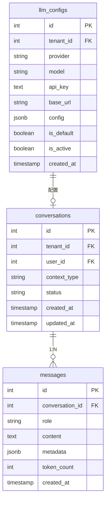

# Copilot 模块数据库架构

## 一、模块概览

Copilot 模块是 ADDP 平台的 AI 辅助模块，使用 PostgreSQL 的 `copilot` schema，基于 Python + FastAPI + SQLAlchemy 构建。负责提供 AI 辅助的 SQL 生成和 GIS 工作流生成能力。

### 模块定位

- **AI 助手**：基于大语言模型（LLM）的智能对话系统
- **SQL 生成**：自然语言转 SQL 查询
- **工作流生成**：自然语言转 GIS 工作流 DAG
- **对话记忆**：存储对话历史，支持上下文理解
- **多 LLM 支持**：支持 OpenAI、Claude、Ollama、DashScope 等

---

## 二、数据库表清单

| 表名 | 用途 | 核心功能 | 行数估算 |
|------|------|---------|---------|
| `conversations` | 对话会话表 | 管理对话会话和上下文类型 | 数百-数千 |
| `messages` | 对话消息表 | 存储对话中的每条消息 | 数千-数万 |
| `llm_configs` | LLM 配置表 | 管理 AI 模型配置 | 数十 |

---

## 三、表关系图

### 3.1 ER 图（Mermaid）



### 3.2 关系说明

#### 核心关系

**对话与消息（1:N）**：
- `conversations.id` ← `messages.conversation_id`
- 一个对话包含多条消息
- 删除对话时级联删除所有消息（CASCADE）

**租户与对话（1:N）**：
- `system.tenants.id` ← `conversations.tenant_id`（逻辑外键）
- 按租户隔离对话数据

**用户与对话（1:N）**：
- `system.users.id` ← `conversations.user_id`（逻辑外键）
- 用户可以有多个对话会话

**租户与 LLM 配置（1:N）**：
- `system.tenants.id` ← `llm_configs.tenant_id`（逻辑外键）
- 每个租户可配置多个 LLM
- `tenant_id=NULL` 表示全局配置

#### 外键约束

| 子表 | 字段 | 父表 | 字段 | 约束类型 | 说明 |
|------|------|------|------|---------|------|
| `messages` | `conversation_id` | `conversations` | `id` | CASCADE | 级联删除 |

**注意**：与 system 模块的关联是逻辑外键，未在数据库层面设置约束。

---

## 四、数据流向

### 4.1 SQL 生成流程

```
1. 用户请求 SQL 生成（POST /copilot/sql/generate）
   ↓
2. 创建或获取 conversation（context_type='sql'）
   ↓
3. 查询元数据，匹配最佳数据源
   ↓
4. 调用 LLM（根据 llm_configs）生成 SQL
   ↓
5. 保存 user message 和 assistant message
   ↓
6. 返回 SQL、候选数据源、conversation_id
```

### 4.2 工作流生成流程

```
1. 已登录用户请求工作流生成（POST /api/v1/copilot/workflow/generate，身份来自 Bearer JWT）
   ↓
2. 校验调用方提交的 owner Tool 已验证 `resources[]`
   ↓
3. 调用 LLM（两阶段模式）生成工作流；Copilot 不重复搜索资源
   ↓
4. 保存 user message 和 assistant message
   ↓
5. 将 workflow DAG 存储到 message.metadata
   ↓
6. 返回 workflow、explanation、conversation_id
```

### 4.3 对话记忆加载流程

```
1. 用户发送后续请求（带 conversation_id）
   ↓
2. 从 messages 表查询最近 N 条消息
   ↓
3. 构建对话上下文（user + assistant messages）
   ↓
4. 传递给 LLM Agent 作为 memory
   ↓
5. LLM 基于上下文理解当前请求
```

---

## 五、关键设计决策

### 5.1 多租户隔离策略

#### 设计理念

- **conversations 表隔离**：通过 `tenant_id` 字段隔离对话
- **messages 表间接隔离**：通过 `conversation_id` 关联实现
- **llm_configs 租户级配置**：支持租户自定义 LLM

#### 实现细节

**对话隔离**：

```python
# 查询租户对话
query = db.query(Conversation).filter(Conversation.tenant_id == current_tenant_id)

# SuperAdmin 查询所有对话
query = db.query(Conversation)  # 无限制
```

**LLM 配置查询优先级**：

```python
# 1. 查询租户默认配置
config = db.query(LLMConfig).filter(
    LLMConfig.tenant_id == current_tenant_id,
    LLMConfig.is_default == True,
    LLMConfig.is_active == True
).first()

# 2. 如果没有，查询全局默认配置
if not config:
    config = db.query(LLMConfig).filter(
        LLMConfig.tenant_id == None,
        LLMConfig.is_default == True,
        LLMConfig.is_active == True
    ).first()

# 3. 如果还没有，使用系统硬编码配置
if not config:
    config = get_default_system_config()
```

---

### 5.2 对话上下文管理

#### 设计理念

- **分离 SQL 和 Workflow 上下文**：通过 `context_type` 区分
- **存储完整历史**：messages 表保留所有消息
- **上下文窗口**：Agent 读取最近 N 条消息（避免超出 Token 限制）

#### 实现策略

**SQL 对话上下文**：

```python
# 查询最近 10 条消息
messages = db.query(Message).filter(
    Message.conversation_id == conversation_id
).order_by(Message.created_at.desc()).limit(10).all()

# 反转顺序（从旧到新）
messages = list(reversed(messages))

# 构建上下文
context = [
    {"role": msg.role, "content": msg.content}
    for msg in messages
]
```

**Workflow 对话上下文**：

```python
# 读取完整对话（Workflow 对话通常较短）
messages = db.query(Message).filter(
    Message.conversation_id == conversation_id
).order_by(Message.created_at).all()

# 包含 metadata（工作流定义）
context = [
    {
        "role": msg.role,
        "content": msg.content,
        "metadata": msg.extra_data
    }
    for msg in messages
]
```

---

### 5.3 JSONB 字段使用

Copilot 模块大量使用 JSONB 字段存储灵活数据：

| 表 | 字段 | 用途 |
|---|------|------|
| `messages` | `metadata` | 存储数据源候选、工作流定义、执行结果 |
| `llm_configs` | `config` | 存储 LLM 配置（temperature、max_tokens 等） |

**优势**：
- 灵活扩展，无需修改表结构
- 支持不同类型的元数据
- PostgreSQL 原生支持 JSONB 索引和查询

**最佳实践**：
- 使用 Python dataclass/Pydantic 定义结构
- 提供 JSON Schema 校验
- 避免过度嵌套（最多 3 层）

---

### 5.4 API Key 加密存储

#### 设计理念

- **与 System 模块一致**：使用相同的 AES-256-GCM 加密算法
- **共享加密密钥**：使用 `ENCRYPTION_KEY` 环境变量
- **自动加密/解密**：Service 层自动处理

#### 实现细节

**加密存储**：

```python
from cryptography.hazmat.primitives.ciphers.aead import AESGCM
import base64
import os

def encrypt_api_key(api_key: str, encryption_key: bytes) -> str:
    """加密 API Key"""
    aesgcm = AESGCM(encryption_key)
    nonce = os.urandom(12)
    ciphertext = aesgcm.encrypt(nonce, api_key.encode(), None)
    encrypted = base64.b64encode(nonce + ciphertext).decode()
    return f"AES256GCM:{encrypted}"
```

**解密读取**：

```python
def decrypt_api_key(encrypted_key: str, encryption_key: bytes) -> str:
    """解密 API Key"""
    if not encrypted_key.startswith("AES256GCM:"):
        return encrypted_key  # 未加密
    encrypted = base64.b64decode(encrypted_key.split(":", 1)[1])
    nonce = encrypted[:12]
    ciphertext = encrypted[12:]
    aesgcm = AESGCM(encryption_key)
    plaintext = aesgcm.decrypt(nonce, ciphertext, None)
    return plaintext.decode()
```

---

### 5.5 级联删除策略

#### 当前策略

| 表 | 删除方式 | 原因 |
|---|---------|------|
| `conversations` | 硬删除（级联） | 删除对话时自动删除所有消息 |
| `messages` | 级联删除 | 跟随对话删除 |
| `llm_configs` | 硬删除 | 配置删除后不保留 |

#### 建议策略

- 考虑为 conversations 添加 `deleted_at` 字段实现软删除
- 保留对话历史用于数据分析和审计
- 定期归档旧对话到对象存储

---

## 六、性能优化

### 6.1 索引策略

#### Conversations 表索引

```sql
CREATE INDEX idx_conversations_tenant ON copilot.conversations(tenant_id);
CREATE INDEX idx_conversations_user ON copilot.conversations(user_id);
```

#### Messages 表索引

```sql
CREATE INDEX idx_messages_conversation ON copilot.messages(conversation_id);
```

**查询优化**：
- 对话列表查询：使用 `tenant_id` 索引 + 分页
- 消息历史查询：使用 `conversation_id` 索引
- 避免全表扫描

### 6.2 对话历史截断

**问题**：对话过长导致 Token 超限

**解决方案**：

```python
MAX_CONTEXT_MESSAGES = 20  # 最多保留 20 条消息

def get_recent_messages(conversation_id: int, limit: int = MAX_CONTEXT_MESSAGES):
    """获取最近 N 条消息作为上下文"""
    return db.query(Message).filter(
        Message.conversation_id == conversation_id
    ).order_by(Message.created_at.desc()).limit(limit).all()
```

### 6.3 LLM 配置缓存

**应用层缓存**：

```python
from functools import lru_cache

@lru_cache(maxsize=100)
def get_default_llm_config(tenant_id: int) -> LLMConfig:
    """缓存租户默认 LLM 配置"""
    # 查询逻辑...
    return config

# 配置更新时清除缓存
def update_llm_config(config_id: int, data: dict):
    get_default_llm_config.cache_clear()
    # 更新逻辑...
```

---

## 七、安全机制

### 7.1 API Key 保护

- **存储加密**：AES-256-GCM 加密
- **响应脱敏**：外部 API 返回 `******`
- **内部解密**：Service 层自动解密供 Agent 使用
- **环境变量**：`ENCRYPTION_KEY` 不提交到代码仓库

### 7.2 租户隔离

- **对话隔离**：自动添加 `WHERE tenant_id = <当前租户>`
- **用户隔离**：普通用户只能访问自己的对话
- **配置隔离**：租户只能查看本租户和全局配置

### 7.3 输入验证

**防止注入攻击**：
- 用户输入经过 Pydantic 验证
- SQL 生成后由 DBA 审核（未来功能）
- 工作流定义结构化验证

---

## 八、监控和告警

### 8.1 关键指标

| 指标 | 说明 | 告警阈值 |
|------|------|---------|
| LLM 调用失败率 | API 调用失败次数 / 总次数 | > 10% |
| SQL 生成成功率 | 有效 SQL / 总请求数 | < 80% |
| 对话会话数增长 | 每日新增对话数 | - |
| Token 消耗 | 每日 Token 总消耗 | > 100万 |
| 平均响应时间 | LLM API 调用耗时 | > 5s |

### 8.2 日志监控

**错误日志**：
- LLM API 调用失败（记录 provider、model、错误信息）
- SQL 生成失败（记录查询、错误原因）
- 工作流验证失败（记录输入、验证错误）

**访问日志**：
- 所有 API 请求（记录耗时、Token 消耗）
- 慢查询（查询时间 > 2s）

---

## 九、相关文档

### 单表文档

- [conversations 表](./tables/conversations表.md) - 对话会话表
- [messages 表](./tables/messages表.md) - 对话消息表
- [llm_configs 表](./tables/llm_configs表.md) - LLM 配置表

### 模块文档

- [Copilot 模块说明](../CLAUDE.md) - 模块整体架构和设计理念
- [ADDP 平台架构](../../CLAUDE.md) - 平台级架构文档
