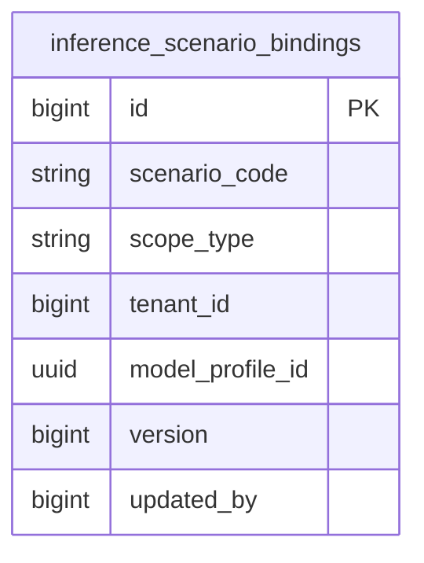

# Copilot 模块数据库架构

Copilot 使用 PostgreSQL `copilot` schema，只持有领域辅助所需的业务事实。Provider Connection、Model Deployment、Model Profile 和凭据由 Inference 模块拥有，Copilot 不复制这些资源。

## 表清单

| 表名 | 用途 |
| --- | --- |
| `inference_scenario_bindings` | 保存 Copilot 场景到 Inference Model Profile 的平台默认和 Tenant 显式绑定。 |



## 推理场景

| 场景 | 调用入口 | 说明 |
| --- | --- | --- |
| `resource_resolution` | Query、Workflow、Notebook、Transfer 的输入阶段 | 提取输入资源意图、发现和校验 owner 候选；不生成领域结果。 |
| `query_generation` | `/query/generate` | 根据当前 Query Engine capability 和已确认资源事实生成候选查询语言。 |
| `workflow_generation` | `/workflow/generate` | 根据已确认资源事实和工作流 Runtime 算子目录生成候选 DAG。 |
| `notebook_generation` | `/notebook/generate` | 根据 Develop Session 已提供的候选和已确认资源事实生成 Python 单元。 |
| `transfer_generation` | `/transfer/generate` | 在 Transfer 已确认的单一源、目标和任务边界内生成候选任务草稿。 |
| `navigation_guide` | `/navigate/guide` | 根据当前 Tenant 用户意图给出 Console 导航建议。 |
| `knowledge_graph_extraction` | `/kg-build/extract` | 为 Graph 的当前 Tenant 抽取候选实体和关系。 |

每个场景固定按以下顺序解析；资源解析场景与领域生成场景分别绑定，不允许跨场景 fallback：

```text
当前 Tenant 显式绑定 > 同场景的平台默认绑定 > inference_scenario_not_configured
```

不存在硬编码模型、环境变量模型、任意可用 Profile 或另一个场景的回退。绑定只保存 `model_profile_id`；Inference 在调用时校验 Profile scope、Provider Tenant 授权、Deployment 状态和 chat 能力。

## 范围和更新

- `scope_type=platform` 时 `tenant_id` 必须为空，每个场景只有一个平台默认绑定。
- `scope_type=tenant` 时 `tenant_id` 必须为当前 AuthContext Tenant，每个 Tenant 和场景只有一个显式绑定。
- 更新使用 `version` 乐观锁；创建时版本必须为 `0`，成功后从 `1` 开始递增。
- Platform Context 维护平台默认，Tenant Context 维护当前 Tenant 覆盖；API 不接受请求体自报 Tenant。
- `updated_by` 记录当前 Principal ID，不把终端用户 Token 或身份字段保存到推理请求。

## 安全边界

- Copilot 通过 `addp-copilot` Client Credentials 获取短期 Tenant Service Access Token，再调用 `addp.inference/v1`。
- Copilot 表、API、日志和任务结果不得出现 Provider credential、endpoint、adapter type 或上游模型名。
- Graph 调用知识图谱抽取时使用 Graph 自己的 Tenant Service Access Token；Copilot 从 AuthContext 取得 Tenant，不接受 `X-Internal-API-Key` 或 `X-Tenant-ID`。
- Inference 响应中的 `deployment_id/profile_version/usage` 可用于审计或执行快照，但不反向暴露 Provider 细节。

## 相关文档

- [inference_scenario_bindings 表](./tables/inference_scenario_bindings表.md)
- [ADDP AI 推理接口规范](../../docs/spec/addp%20AI推理接口规范.md)
