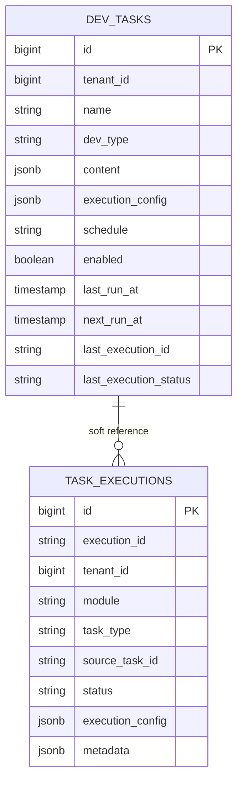

# Develop 模块数据库架构

Develop 模块负责 SQL 查询、算子工作流和脚本开发任务。当前任务定义保存在 `develop.dev_tasks`，执行记录统一写入 `common.task_executions`。Notebook 是 `script` 任务的当前实现形态，通过 `content.notebook_path` 标识。

## 表清单

| 表名 | Owner | 用途 |
| --- | --- | --- |
| `develop.dev_tasks` | Develop | 开发任务定义，支持 `query` / `workflow` / `script` |
| `common.task_executions` | Common | Develop 每次执行的统一 execution 记录，`module=develop` |

Develop 不维护私有执行记录表，执行记录统一写入 `common.task_executions`。

## 关系

关系说明：

- `common.task_executions.module = 'develop'`。
- `common.task_executions.task_type = dev_tasks.dev_type`。
- `common.task_executions.source_task_id` 以字符串软引用 `develop.dev_tasks.id`。
- 临时执行不创建 `dev_tasks`，`source_task_id` 为空，执行配置快照写入 `execution_config`。

## TaskProvider

Develop 作为一个 TaskProvider 注册到 System，声明以下任务类型：

| task_type | 任务定义 |
| --- | --- |
| `query` | SQL / 原生查询任务 |
| `workflow` | 已保存的算子工作流任务 |
| `script` | 脚本任务，当前可由 Notebook 形态承载 |

标准入口：

| API | 说明 |
| --- | --- |
| `GET /api/v1/develop/tasks?task_type=` | 列出可编排任务 |
| `GET /api/v1/develop/tasks/{task_type}/{id}` | 获取任务详情 |
| `POST /api/v1/develop/tasks/{task_type}/{id}/execute` | 通过 TaskProvider 执行任务 |
| `GET /api/v1/develop/executions/{execution_id}` | 查询 execution |

## 算子工作流边界

算子工作流是 Develop 内部的细粒度 DAG。它进入 Orchestrator 前必须先保存为 `dev_tasks.dev_type=workflow` 的任务定义。Orchestrator 只引用 `provider=develop, task_type=workflow, task_id=...`，不直接编排算子节点。

## 调度边界

`develop.dev_tasks` 保留 `schedule`、`enabled`、`next_run_at` 字段语义，但当前没有稳定的 owner scheduler 执行链路。因此 Develop 暂不在 TaskProvider capabilities 中声明 `supports_schedule=true`。
