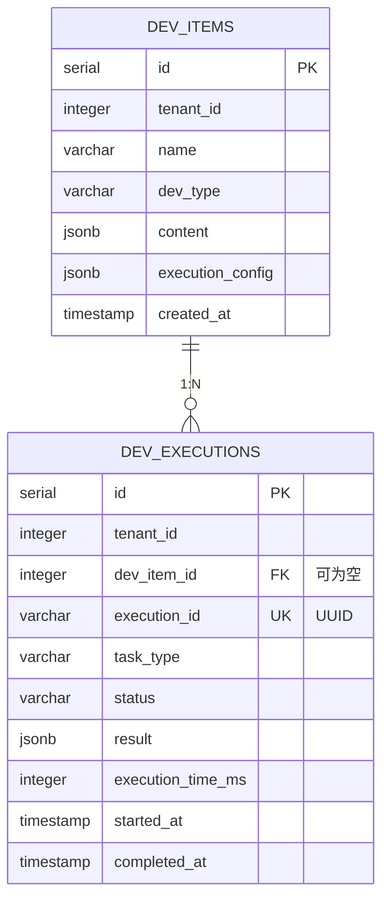

# Develop 模块数据库架构

## 一、模块概览

Develop 模块使用 PostgreSQL 的 `develop` schema，负责开发工作台功能（SQL 查询、GIS 工作流、Jupyter Notebook 集成）。

### 核心职责

- **统一开发项管理**：支持 query、workflow、notebook 三种开发类型
- **执行历史追踪**：记录所有执行记录，支持性能监控和故障排查
- **灵活内容存储**：使用 JSONB 存储不同类型的开发项内容和执行结果

---

## 二、数据库表清单

| 表名 | 用途 | 行数估算 |
|------|------|---------|
| `dev_items` | 开发项定义（SQL/工作流/Notebook） | 1000-10000 |
| `dev_executions` | 执行记录（历史追踪） | 100000+ |

---

## 三、表关系图

### 3.1 ER图（Mermaid）



### 3.2 关系说明

**核心关系**：
- `dev_items.id` ← `dev_executions.dev_item_id` (1:N，可为空)
  - 一个开发项可以有多次执行记录
  - **注意**：dev_item_id 可为空，支持临时执行（不保存为开发项）

**外键约束**：
- `dev_executions.dev_item_id` → `dev_items.id` (ON DELETE SET NULL)
  - 删除开发项时，执行记录的 dev_item_id 设为 NULL，保留历史记录

**租户隔离**：
- 所有表都有 `tenant_id` 字段，查询时必须加上租户过滤条件
- 索引包含 tenant_id，优化租户级查询性能

---

## 四、数据流向

### 4.1 开发项创建与执行流程

```
1. 用户创建开发项
   ↓
2. dev_items 表插入记录
   ├─ dev_type: 'query' | 'workflow' | 'notebook'
   ├─ content: JSONB（SQL 语句、工作流定义等）
   └─ execution_config: JSONB（引擎配置、参数等）
   ↓
3. 用户执行开发项
   ↓
4. dev_executions 表插入记录
   ├─ execution_id: UUID（唯一标识）
   ├─ status: 'pending' → 'running'
   ├─ started_at: 记录开始时间
   └─ dev_item_id: 关联到 dev_items（可为空）
   ↓
5. 执行完成
   ↓
6. dev_executions 更新记录
   ├─ status: 'success' | 'failed'
   ├─ result: JSONB（执行结果）
   ├─ completed_at: 记录完成时间
   └─ execution_time_ms: 记录耗时
   ↓
7. dev_items 更新最后执行状态
   ├─ last_execution_id: 最新执行记录 ID
   ├─ last_execution_status: 最新执行状态
   └─ last_executed_at: 最新执行时间
```

### 4.2 临时执行流程（不保存开发项）

```
1. 用户临时执行 SQL/工作流
   ↓
2. 直接插入 dev_executions 记录
   ├─ dev_item_id: NULL（不关联开发项）
   └─ 其他字段同上
   ↓
3. 执行完成，返回结果
   ↓
4. 用户可选择将成功的执行保存为开发项
   ↓
5. 创建 dev_items 记录，关联 execution_id
```

---

## 五、关键设计决策

### 5.1 JSONB 字段使用

**dev_items.content**（开发项内容）：
- **query 类型**：`{"sql": "SELECT * FROM cities", "engine_id": 1}`
- **workflow 类型**：`{"steps": [...], "dag": {...}}`
- **notebook 类型**：`{"cells": [...], "metadata": {...}}`

**好处**：
- 灵活存储不同类型的开发项内容
- 无需为每种类型创建单独的表
- 支持动态扩展新的开发类型

**dev_executions.result**（执行结果）：
- **query 类型**：`{"columns": [...], "rows": [...]}`
- **workflow 类型**：`{"step_results": [...], "output_file": "..."}`
- **notebook 类型**：`{"outputs": [...], "figures": [...]}`

**好处**：
- 存储结构化执行结果
- 支持复杂的嵌套结构（工作流多步骤结果）
- 支持 JSONB 索引查询（如查询特定字段）

### 5.2 租户隔离

**策略**：
- 所有表都有 `tenant_id` 字段
- 所有查询都通过中间件自动添加 `tenant_id` 过滤
- 索引包含 `tenant_id`，优化租户级查询

**实现**：
```go
// 自动注入租户 ID
func TenantFilter() gin.HandlerFunc {
    return func(c *gin.Context) {
        tenantID := GetTenantIDFromToken(c)
        c.Set("tenant_id", tenantID)
        c.Next()
    }
}

// 查询时自动添加租户过滤
db.Where("tenant_id = ?", tenantID).Find(&devItems)
```

### 5.3 软删除策略

**dev_items 表**：
- 使用 `deleted_at` 字段实现软删除
- 索引：`idx_dev_items_deleted`
- 查询时自动过滤已删除记录

**dev_executions 表**：
- **不使用软删除**，因为执行记录是历史数据，不应删除
- 通过定期归档清理旧记录（移动到归档表或对象存储）

### 5.4 执行 ID 设计

**UUID 唯一标识**：
- `dev_executions.execution_id` 使用 UUID
- 避免数据库自增 ID 泄露执行次数
- 支持分布式系统（多个 Develop 实例）

**唯一索引**：
- `idx_dev_executions_execution_id` 唯一索引
- 防止重复执行

### 5.5 大结果集处理

**问题**：执行结果可能非常大（如返回百万行数据）

**解决方案**：
1. **限制返回行数**：前端查询默认 LIMIT 1000
2. **分页支持**：大结果集自动分页
3. **对象存储**：超过 10MB 的结果存储到 MinIO，result JSONB 仅保留对象路径
   ```json
   {
     "type": "large_result",
     "storage_url": "s3://bucket/results/uuid-xxxx.json",
     "total_rows": 1000000,
     "columns": [...]
   }
   ```

---

## 六、性能优化

### 6.1 索引策略

**dev_items 表**：
- `idx_dev_items_tenant_type`（tenant_id, dev_type）- 按租户和类型查询
- `idx_dev_items_query_type`（query_type）- 按查询类型过滤
- `idx_dev_items_status`（status）- 按状态过滤
- `idx_dev_items_deleted`（deleted_at）- 软删除查询

**dev_executions 表**：
- `idx_dev_executions_tenant_status`（tenant_id, status）- 按租户和状态查询
- `idx_dev_executions_item`（dev_item_id）- 按开发项查询历史
- `idx_dev_executions_execution_id`（execution_id）- UUID 唯一索引

### 6.2 查询优化

**场景 1：查询某个开发项的执行历史**（高频）
```sql
-- 优化前
SELECT * FROM develop.dev_executions 
WHERE dev_item_id = 5 
ORDER BY created_at DESC LIMIT 10;

-- 优化后（利用索引）
SELECT id, execution_id, status, execution_time_ms, created_at 
FROM develop.dev_executions 
WHERE dev_item_id = 5 
ORDER BY created_at DESC LIMIT 10;
```

**场景 2：查询租户的所有执行中任务**（高频）
```sql
-- 利用 idx_dev_executions_tenant_status 索引
SELECT id, execution_id, task_type, started_at
FROM develop.dev_executions 
WHERE tenant_id = 1 AND status = 'running';
```

### 6.3 归档策略

**执行记录归档**：
- 每月自动归档 30 天前的成功执行记录
- 归档到 `develop.dev_executions_archive` 表或对象存储
- 保留失败记录 90 天（用于故障分析）

**实现**：
```sql
-- 归档 30 天前的成功记录
INSERT INTO develop.dev_executions_archive 
SELECT * FROM develop.dev_executions 
WHERE status = 'success' 
  AND completed_at < NOW() - INTERVAL '30 days';

-- 删除已归档记录
DELETE FROM develop.dev_executions 
WHERE status = 'success' 
  AND completed_at < NOW() - INTERVAL '30 days';
```

---

## 七、数据一致性保证

### 7.1 事务处理

**开发项保存与执行**：
```go
// 开启事务
tx := db.Begin()

// 1. 创建开发项
devItem := &DevItem{...}
tx.Create(devItem)

// 2. 创建执行记录
execution := &DevExecution{
    DevItemID: &devItem.ID,
    ...
}
tx.Create(execution)

// 3. 提交事务
tx.Commit()
```

### 7.2 并发控制

**租户级并发限制**：
- 每个租户最多同时执行 10 个任务
- 使用 Redis 计数器实现：
  ```go
  key := fmt.Sprintf("develop:running:%d", tenantID)
  count := redis.Incr(key)
  if count > 10 {
      return errors.New("超过并发限制")
  }
  ```

---

## 八、相关文档

- [dev_items表](tables/dev_items表.md) - 开发项定义表
- [dev_executions表](tables/dev_executions表.md) - 执行记录表
- [Develop 模块说明](../CLAUDE.md) - 模块整体架构
