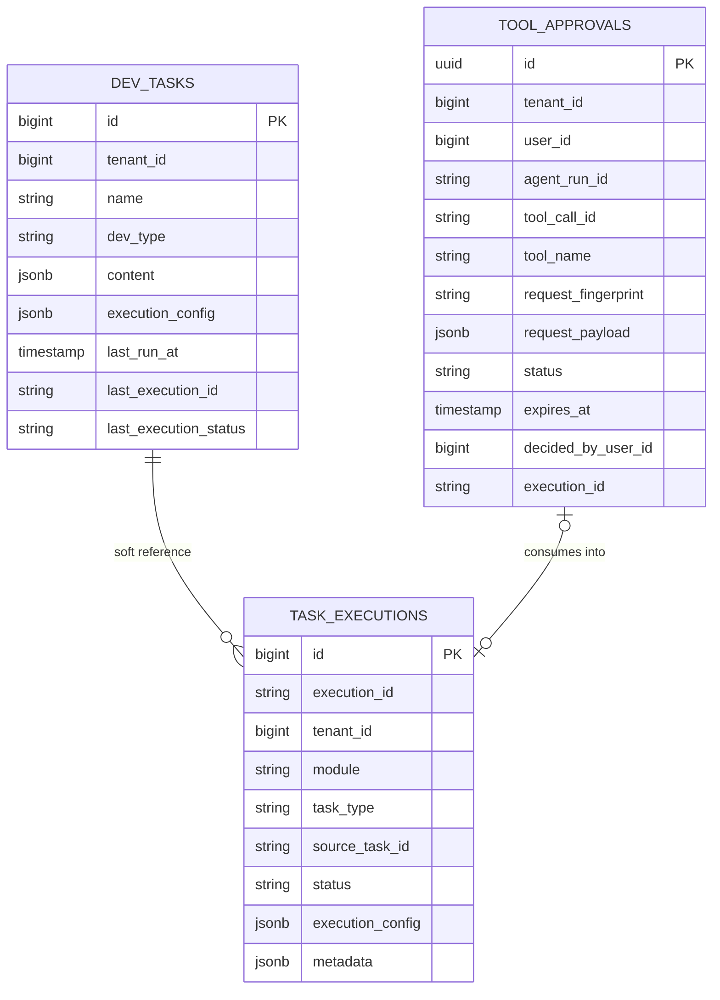

# Develop 模块数据库架构

Develop 模块负责 SQL 查询、算子工作流和脚本开发任务。当前任务定义保存在 `develop.dev_tasks`，委托 Tool 审批保存在 `develop.tool_approvals`，执行记录统一写入 `common.task_executions`。Notebook 是 `script` 任务的当前实现形态，通过 `content.notebook_path` 标识。

## 表清单

| 表名 | Owner | 用途 |
| --- | --- | --- |
| `develop.dev_tasks` | Develop | 开发任务定义，支持 `query` / `workflow` / `script` |
| `develop.tool_approvals` | Develop | `workflow.run` 委托审批、原请求和一次性消费事实 |
| `common.task_executions` | Common | Develop 每次执行的统一 execution 记录，`module=develop` |

Develop 不维护私有执行记录表，执行记录统一写入 `common.task_executions`。

## 关系

关系说明：

- `common.task_executions.module = 'develop'`。
- `common.task_executions.task_type = dev_tasks.dev_type`。
- `common.task_executions.source_task_id` 以字符串软引用 `develop.dev_tasks.id`。
- 临时执行不创建 `dev_tasks`，`source_task_id` 为空，执行配置快照写入 `execution_config`；普通 SQL 使用 `execution_config.engine_id`，DuckDB 联邦查询使用 `execution_config.query_mode="duckdb"`，请求体不得再使用顶层 `engine_id`。
- 委托 `workflow.run` 首次调用只创建 `tool_approvals`；批准后的恢复调用使用 `approval_id + request_fingerprint` 原子消费审批并创建 execution。
- 完整 workflow 审批请求只保存在 Develop，Agent 只保存 owner Interaction 投影。

字段边界：

- `develop.dev_tasks.dev_type` 是 Develop 私有表字段，只在 Develop 内部 CRUD、列表过滤和执行分派中使用。
- `task_type` 是 TaskProvider、Orchestrator、Monitor 与 `common.task_executions` 使用的统一对外契约字段。
- Develop 暴露给 TaskProvider 的 `task_type` 取值与内部 `dev_type` 一一映射，但外部模块不得直接依赖 `dev_type` 字段。

## TaskProvider

Develop 作为一个 TaskProvider 注册到 System，声明以下任务类型：

| task_type | 任务定义 |
| --- | --- |
| `query` | SQL / 原生查询任务 |
| `workflow` | 已保存的算子工作流任务 |
| `script` | 脚本任务，当前可由 Notebook 形态承载 |

标准入口：

| API | 说明 |
| --- | --- |
| `GET /api/v1/develop/internal/tasks?task_type=` | 服务间列出可编排任务 |
| `GET /api/v1/develop/internal/tasks/{task_type}/{id}` | 服务间获取任务详情 |
| `POST /api/v1/develop/internal/tasks/{task_type}/{id}/execute` | 通过 TaskProvider 执行任务 |
| `GET /api/v1/develop/internal/executions/{execution_id}` | 服务间查询 execution |

以上 TaskProvider 路由只接受内部 API Key 和显式 Tenant ID，不建立 User AuthContext；用户查看执行详情仍使用 canonical Bearer AuthContext 调用 `/api/v1/develop/executions/{execution_id}`。

## 算子工作流边界

算子工作流是 Develop 内部的细粒度 DAG。它进入 Orchestrator 前必须先保存为 `dev_tasks.dev_type=workflow` 的任务定义。Orchestrator 只引用 `provider=develop, task_type=workflow, task_id=...`，不直接编排算子节点。

## 调度边界

Develop 当前没有 owner scheduler / `next_run_at` due claim 闭环，因此不保存、不暴露 `schedule`、`enabled`、`next_run_at`，并且在 TaskProvider capabilities 中声明 `supports_schedule=false`。
