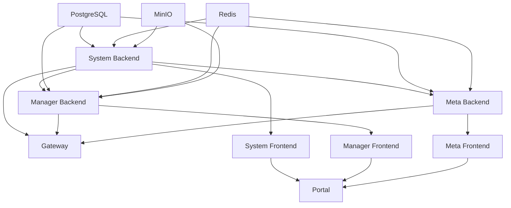

# 服务启动顺序指南

## 一、为什么需要启动顺序？

ADDP 采用微服务架构，服务之间存在依赖关系：

```
基础设施层 → System 模块 → Manager/Meta 模块 → Gateway → 前端
```

**依赖关系**:
- Manager/Meta 依赖 System（认证、配置中心、资源管理）
- Gateway 依赖所有后端服务（API 路由）
- 前端依赖后端服务（数据获取）

**如果顺序错误会发生什么？**
- ❌ Meta 启动时 System 未就绪 → 401 错误："internal API key not configured"
- ❌ Manager 无法获取 System 配置 → 降级使用本地配置，可能导致 JWT_SECRET 不一致
- ❌ Gateway 路由失败 → 前端请求全部 502

## 二、Docker Compose 模式（生产环境）

### 当前配置

Docker Compose 通过 `depends_on` 和 `healthcheck` 控制启动顺序。

**启动层级**:
```
Level 1: 基础设施
├── PostgreSQL (healthcheck: pg_isready)
├── Redis (healthcheck: redis-cli ping)
└── MinIO (healthcheck: curl /minio/health/live)
         ↓ depends_on + condition: service_healthy
Level 2: System Backend
├── 等待 PostgreSQL healthy
└── healthcheck: /health 接口
         ↓ depends_on + condition: service_started
Level 3: Manager/Meta Backend
├── 等待 System Backend started
├── 等待基础设施 healthy
└── 无 healthcheck
         ↓ depends_on
Level 4: Gateway
├── 等待 System Backend
└── 等待 Manager Backend
         ↓ depends_on
Level 5: 前端服务
└── 等待对应后端 started
```

### 问题与改进建议

**问题 1**: Manager/Meta 使用 `condition: service_started` 而不是 `service_healthy`

```yaml
# ❌ 当前配置
manager-backend:
  depends_on:
    system-backend:
      condition: service_started  # 只等待进程启动，不等待服务就绪

# ✅ 改进后
manager-backend:
  depends_on:
    system-backend:
      condition: service_healthy  # 等待服务健康检查通过
```

**问题 2**: Manager/Meta 没有 healthcheck

建议添加：
```yaml
manager-backend:
  healthcheck:
    test: ["CMD", "wget", "--quiet", "--tries=1", "--spider", "http://localhost:8081/health"]
    interval: 30s
    timeout: 10s
    retries: 3
    start_period: 40s  # 给服务足够的启动时间

meta-backend:
  healthcheck:
    test: ["CMD", "wget", "--quiet", "--tries=1", "--spider", "http://localhost:8082/health"]
    interval: 30s
    timeout: 10s
    retries: 3
    start_period: 40s
```

**问题 3**: System Backend 的 `start_period` 可能不够

```yaml
system-backend:
  healthcheck:
    test: ["CMD", "wget", "--quiet", "--tries=1", "--spider", "http://localhost:8080/health"]
    interval: 30s
    timeout: 10s
    retries: 3
    start_period: 40s  # 增加启动时间窗口
```

### 完整改进方案

```yaml
system-backend:
  # ... 其他配置
  depends_on:
    postgres:
      condition: service_healthy
  healthcheck:
    test: ["CMD", "wget", "--quiet", "--tries=1", "--spider", "http://localhost:8080/health"]
    interval: 30s
    timeout: 10s
    retries: 3
    start_period: 40s

manager-backend:
  # ... 其他配置
  depends_on:
    postgres:
      condition: service_healthy
    redis:
      condition: service_healthy
    minio:
      condition: service_healthy
    system-backend:
      condition: service_healthy  # ✅ 改为 healthy
  healthcheck:
    test: ["CMD", "wget", "--quiet", "--tries=1", "--spider", "http://localhost:8081/health"]
    interval: 30s
    timeout: 10s
    retries: 3
    start_period: 40s

meta-backend:
  # ... 其他配置
  depends_on:
    postgres:
      condition: service_healthy
    redis:
      condition: service_healthy
    system-backend:
      condition: service_healthy  # ✅ 改为 healthy
  healthcheck:
    test: ["CMD", "wget", "--quiet", "--tries=1", "--spider", "http://localhost:8082/health"]
    interval: 30s
    timeout: 10s
    retries: 3
    start_period: 40s

gateway:
  # ... 其他配置
  depends_on:
    system-backend:
      condition: service_healthy  # ✅ 改为 healthy
    manager-backend:
      condition: service_healthy  # ✅ 改为 healthy
```

## 三、开发模式（本地启动）

### 方案 A: 手动启动脚本（推荐）

创建 `scripts/dev-start.sh`:

```bash
#!/bin/bash
set -e

echo "🚀 启动 ADDP 开发环境"
echo ""

# 颜色定义
GREEN='\033[0;32m'
YELLOW='\033[1;33m'
NC='\033[0m' # No Color

# 1. 启动基础设施
echo -e "${YELLOW}Step 1/5: 启动基础设施（PostgreSQL, Redis, MinIO）${NC}"
make up-infra
sleep 5

# 等待基础设施就绪
echo "等待 PostgreSQL 就绪..."
until docker exec addp-postgres pg_isready -U addp > /dev/null 2>&1; do
  echo -n "."
  sleep 1
done
echo -e "${GREEN}✓ PostgreSQL 就绪${NC}"

echo "等待 Redis 就绪..."
until docker exec addp-redis redis-cli ping > /dev/null 2>&1; do
  echo -n "."
  sleep 1
done
echo -e "${GREEN}✓ Redis 就绪${NC}"

echo "等待 MinIO 就绪..."
until curl -f http://localhost:9000/minio/health/live > /dev/null 2>&1; do
  echo -n "."
  sleep 1
done
echo -e "${GREEN}✓ MinIO 就绪${NC}"
echo ""

# 2. 启动 System Backend
echo -e "${YELLOW}Step 2/5: 启动 System Backend${NC}"
cd system/backend
go run cmd/server/main.go &
SYSTEM_PID=$!
cd ../..

# 等待 System Backend 就绪
echo "等待 System Backend 就绪..."
until curl -f http://localhost:8080/health > /dev/null 2>&1; do
  echo -n "."
  sleep 1
done
echo -e "${GREEN}✓ System Backend 就绪 (PID: $SYSTEM_PID)${NC}"
echo ""

# 3. 启动 Manager Backend
echo -e "${YELLOW}Step 3/5: 启动 Manager Backend${NC}"
cd manager/backend
go run cmd/server/main.go &
MANAGER_PID=$!
cd ../..

# 等待 Manager Backend 就绪
echo "等待 Manager Backend 就绪..."
until curl -f http://localhost:8081/health > /dev/null 2>&1; do
  echo -n "."
  sleep 1
done
echo -e "${GREEN}✓ Manager Backend 就绪 (PID: $MANAGER_PID)${NC}"
echo ""

# 4. 启动 Meta Backend
echo -e "${YELLOW}Step 4/5: 启动 Meta Backend${NC}"
cd meta/backend
go run cmd/server/main.go &
META_PID=$!
cd ../..

# 等待 Meta Backend 就绪
echo "等待 Meta Backend 就绪..."
until curl -f http://localhost:8082/health > /dev/null 2>&1; do
  echo -n "."
  sleep 1
done
echo -e "${GREEN}✓ Meta Backend 就绪 (PID: $META_PID)${NC}"
echo ""

# 5. 启动 Gateway
echo -e "${YELLOW}Step 5/5: 启动 Gateway${NC}"
cd gateway
go run cmd/gateway/main.go &
GATEWAY_PID=$!
cd ..

# 等待 Gateway 就绪
echo "等待 Gateway 就绪..."
until curl -f http://localhost:8000/health > /dev/null 2>&1; do
  echo -n "."
  sleep 1
done
echo -e "${GREEN}✓ Gateway 就绪 (PID: $GATEWAY_PID)${NC}"
echo ""

# 6. 启动前端（可选）
echo -e "${YELLOW}启动前端服务...${NC}"
cd system/frontend && npm run dev &
cd ../..
cd manager/frontend && npm run dev &
cd ../..
cd portal/frontend && npm run dev &
cd ../..

echo ""
echo -e "${GREEN}========================================${NC}"
echo -e "${GREEN}✓ 所有服务启动完成！${NC}"
echo -e "${GREEN}========================================${NC}"
echo ""
echo "服务地址:"
echo "  Portal:   http://localhost:5170"
echo "  System:   http://localhost:8080"
echo "  Manager:  http://localhost:8081"
echo "  Meta:     http://localhost:8082"
echo "  Gateway:  http://localhost:8000"
echo ""
echo "进程 PID:"
echo "  System:   $SYSTEM_PID"
echo "  Manager:  $MANAGER_PID"
echo "  Meta:     $META_PID"
echo "  Gateway:  $GATEWAY_PID"
echo ""
echo "停止所有服务: make dev-stop"
```

创建 `scripts/dev-stop.sh`:

```bash
#!/bin/bash

echo "🛑 停止 ADDP 开发环境"

# 停止 Go 进程
pkill -f "go run cmd/server/main.go"
pkill -f "go run cmd/gateway/main.go"

# 停止 npm 进程
pkill -f "vite"

# 停止 Docker 基础设施
make down-infra

echo "✓ 所有服务已停止"
```

### 方案 B: Makefile 命令（简化版）

在 `Makefile` 中添加：

```makefile
# 开发环境启动（按顺序）
.PHONY: dev-start
dev-start:
	@echo "🚀 启动开发环境（按依赖顺序）"
	@bash scripts/dev-start.sh

# 开发环境停止
.PHONY: dev-stop
dev-stop:
	@bash scripts/dev-stop.sh

# 检查服务健康
.PHONY: dev-health
dev-health:
	@echo "检查服务健康状态..."
	@curl -sf http://localhost:8080/health > /dev/null && echo "✓ System healthy" || echo "✗ System unhealthy"
	@curl -sf http://localhost:8081/health > /dev/null && echo "✓ Manager healthy" || echo "✗ Manager unhealthy"
	@curl -sf http://localhost:8082/health > /dev/null && echo "✓ Meta healthy" || echo "✗ Meta unhealthy"
	@curl -sf http://localhost:8000/health > /dev/null && echo "✓ Gateway healthy" || echo "✗ Gateway unhealthy"
```

### 方案 C: Tmux 自动化（高级）

创建 `scripts/dev-tmux.sh`:

```bash
#!/bin/bash
SESSION="addp-dev"

# 创建新会话
tmux new-session -d -s $SESSION

# 窗口 0: 基础设施
tmux rename-window -t $SESSION:0 'infra'
tmux send-keys -t $SESSION:0 'make up-infra && docker-compose logs -f' C-m

# 等待基础设施就绪
sleep 10

# 窗口 1: System Backend
tmux new-window -t $SESSION:1 -n 'system'
tmux send-keys -t $SESSION:1 'cd system/backend && go run cmd/server/main.go' C-m

# 等待 System 就绪
sleep 5

# 窗口 2: Manager Backend
tmux new-window -t $SESSION:2 -n 'manager'
tmux send-keys -t $SESSION:2 'cd manager/backend && go run cmd/server/main.go' C-m

# 窗口 3: Meta Backend
tmux new-window -t $SESSION:3 -n 'meta'
tmux send-keys -t $SESSION:3 'cd meta/backend && go run cmd/server/main.go' C-m

# 窗口 4: Gateway
tmux new-window -t $SESSION:4 -n 'gateway'
tmux send-keys -t $SESSION:4 'cd gateway && go run cmd/gateway/main.go' C-m

# 窗口 5: 前端
tmux new-window -t $SESSION:5 -n 'frontend'
tmux send-keys -t $SESSION:5 'cd portal/frontend && npm run dev' C-m

# 附加到会话
tmux attach-session -t $SESSION
```

使用方法：
```bash
chmod +x scripts/dev-tmux.sh
./scripts/dev-tmux.sh
```

## 四、服务依赖图



## 五、健康检查接口

所有后端服务应实现 `/health` 接口：

```go
// 示例实现
router.GET("/health", func(c *gin.Context) {
    c.JSON(200, gin.H{
        "status": "healthy",
        "service": "system-backend",
        "timestamp": time.Now().Unix(),
    })
})
```

**检查清单**:
- [ ] System Backend 实现了 `/health` ✅
- [ ] Manager Backend 实现了 `/health` ❓
- [ ] Meta Backend 实现了 `/health` ❓
- [ ] Gateway 实现了 `/health` ❓

## 六、最佳实践

### 开发环境

1. **使用启动脚本** - 避免手动启动导致的顺序问题
2. **实现健康检查** - 确保服务真正就绪后再启动依赖服务
3. **日志分离** - 使用 Tmux 或多个终端窗口查看不同服务日志
4. **优雅降级** - 服务启动失败时应有明确的错误提示

### 生产环境

1. **使用 `condition: service_healthy`** - 不要使用 `service_started`
2. **设置合理的 `start_period`** - 给服务足够的启动时间
3. **监控健康检查** - 使用 Prometheus + Grafana 监控服务状态
4. **实现 Readiness Probe** - Kubernetes 环境下区分 liveness 和 readiness

## 七、故障排查

### 问题 1: Manager/Meta 启动时报 401 错误

**原因**: System Backend 还未完全启动

**解决**:
1. 开发模式：等待 System Backend `/health` 返回 200 后再启动
2. Docker 模式：改用 `condition: service_healthy`

### 问题 2: 服务启动但健康检查一直失败

**排查步骤**:
1. 检查端口是否正确
2. 检查服务是否真正监听（`lsof -i :8080`）
3. 手动调用健康检查接口（`curl http://localhost:8080/health`）
4. 检查防火墙和网络配置

### 问题 3: Docker Compose 启动超时

**原因**: `start_period` 不够长

**解决**: 增加 `start_period` 到 60s 或更长

## 八、参考资料

- [Docker Compose depends_on](https://docs.docker.com/compose/compose-file/compose-file-v3/#depends_on)
- [Docker Compose healthcheck](https://docs.docker.com/compose/compose-file/compose-file-v3/#healthcheck)
- [Kubernetes Readiness/Liveness Probes](https://kubernetes.io/docs/tasks/configure-pod-container/configure-liveness-readiness-startup-probes/)
