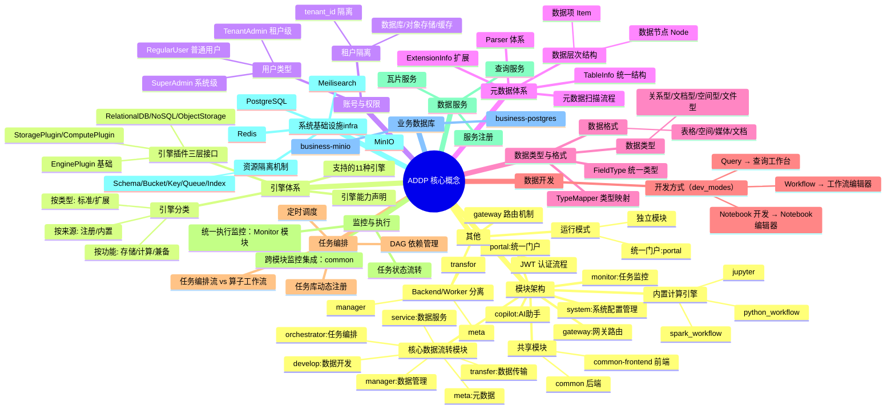
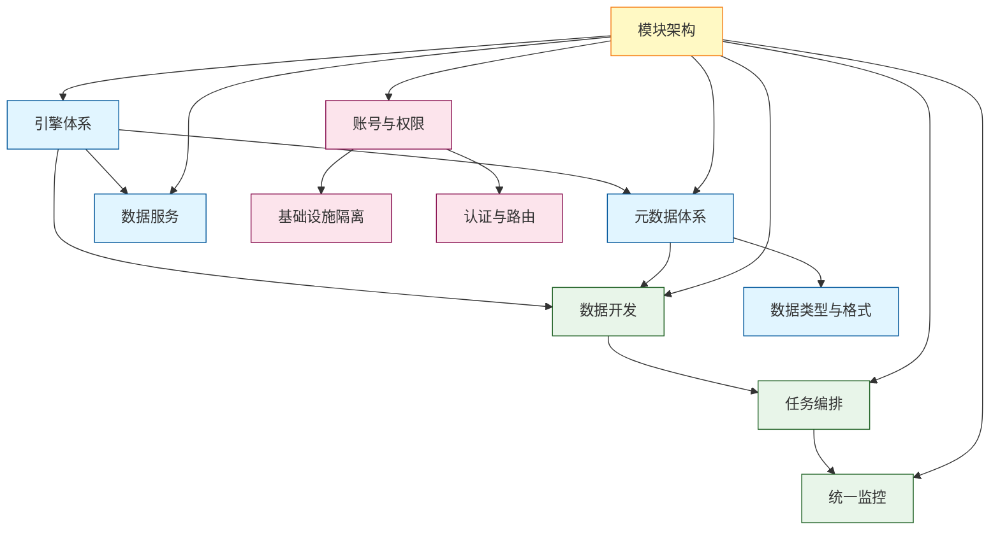

# ADDP 核心概念关系图

本文档是 ADDP 核心概念的总览索引页,使用可视化图表展示核心概念全景,并提供详细文档的导航链接。

---

## 目录

1. [核心概念全景图](#核心概念全景图)
2. [核心概念导航](#核心概念导航)
3. [文档索引](#文档索引)

---

## 核心概念全景图

ADDP 平台的核心概念体系:

---

## 核心概念导航

### 1. [模块架构](addp模块架构图.md)

**ADDP 各个模块及其依赖关系**

- 模块总览图 (Portal、Gateway、System、Manager、Meta、Transfer、Orchestrator、Develop、Service、Monitor)
- 模块分层架构 (前端层、网关层、服务层、数据层)
- 共享模块 (common、common-frontend)
- 计算引擎 (python_workflow、spark_workflow、jupyter)
- 基础设施 (PostgreSQL、Redis、MinIO、Meilisearch)

📄 **[阅读完整文档 →](addp模块架构图.md)**

---

### 2. [引擎体系](concepts/addp引擎体系图.md)

**引擎系统架构、分类体系和能力声明机制**

- 引擎插件三层接口架构 (EnginePlugin、StoragePlugin/ComputePlugin、RelationalDB/NoSQL/ObjectStorage)
- 引擎分类体系 (按功能、按来源、按注册方式)
- 支持的 11 种引擎列表
- 引擎能力声明 (capabilities、dev_modes)
- 引擎插件系统

📄 **[阅读完整文档 →](concepts/addp引擎体系图.md)**

---

### 3. [账号与权限](concepts/addp账号与权限体系图.md)

**用户类型、租户隔离机制和权限控制模型**

- 用户类型层次 (SuperAdmin、TenantAdmin、RegularUser)
- 租户隔离机制 (数据库、对象存储、缓存、API 层隔离)
- RBAC 权限模型 (基于角色的访问控制)
- JWT 认证流程

📄 **[阅读完整文档 →](concepts/addp账号与权限体系图.md)**

---

### 4. [元数据体系](concepts/addp元数据体系图.md)

**元数据管理体系,包括层次结构、Parser 体系和统一数据结构**

- 元数据层次结构 (数据节点 Node、数据项 Item)
- Parser 体系架构 (FileTableParser、DBTableParser、DocCollectionParser、ObjectInfoParser)
- TableInfo 统一数据结构
- ExtensionInfo 扩展机制
- 元数据扫描流程

📄 **[阅读完整文档 →](concepts/addp元数据体系图.md)**

---

### 5. [数据类型与格式](concepts/addp数据类型与格式体系图.md)

**数据类型分类、数据格式支持和类型映射机制**

- 数据类型分类 (关系型、文档型、空间型、文件型)
- 数据格式体系 (空间数据格式、表格数据格式、媒体数据格式)
- FieldType 统一类型系统
- TypeMapper 类型映射

📄 **[阅读完整文档 →](concepts/addp数据类型与格式体系图.md)**

---

### 6. [数据开发](concepts/addp数据开发体系图.md)

**三种数据开发方式及其与引擎能力的关系**

- 三种开发方式概述 (查询开发、算子工作流、Notebook 开发)
- 查询开发 (Query) - SQL/MQL 查询
- 算子工作流 (Workflow) - 可视化 DAG 工作流
- Notebook 开发 - Jupyter Notebook 交互式开发
- dev_modes 与开发界面映射

📄 **[阅读完整文档 →](concepts/addp数据开发体系图.md)**

---

### 7. [任务编排](concepts/addp任务编排体系图.md)

**任务库机制、任务编排流与算子工作流的区别、以及跨模块编排能力**

- 任务库机制 (能力注册、动态引擎调用)
- 任务编排流 vs 算子工作流 (粗粒度 vs 细粒度、跨模块 vs 单引擎)
- 编排 DAG 示例
- 依赖管理与参数模板化
- 调度方式 (Cron 定时调度、手动触发)

📄 **[阅读完整文档 →](concepts/addp任务编排体系图.md)**

---

### 8. [监控与执行](concepts/addp监控与执行体系图.md)

**统一执行监控架构和跨模块任务追踪机制**

- 统一执行监控架构 (common.task_executions 表、Monitor 模块)
- 任务执行状态流转 (pending → running → success/failed)
- 跨模块监控集成
- 各模块任务类型

📄 **[阅读完整文档 →](concepts/addp监控与执行体系图.md)**

---

### 9. [数据服务](concepts/addp数据服务体系图.md)

**数据服务发布机制,包括 OGC 标准服务和查询服务 API**

- 数据服务概述
- 服务发布流程
- 查询服务 API (RESTful 接口、条件查询、分页、空间查询)
- 瓦片服务
- 服务注册

📄 **[阅读完整文档 →](concepts/addp数据服务体系图.md)**

---

### 10. [基础设施隔离](concepts/addp基础设施隔离图.md)

**基础设施架构,包括系统基础设施与业务数据库的隔离**

- 基础设施架构概述
- 系统基础设施 vs 业务数据库 (ADDP 元数据 vs 用户业务数据)
- 资源隔离机制 (PostgreSQL Schema、MinIO Bucket、Redis Key、Asynq Queue、Meilisearch Index)

📄 **[阅读完整文档 →](concepts/addp基础设施隔离图.md)**

---

### 11. [认证与路由](concepts/addp登录认证的原理说明.md)

**JWT 认证流程、登录实现详解和 Portal Token 传递机制**

- JWT 认证流程（序列图：登录阶段、访问资源阶段）
- 完整登录流程（4步详解，含代码示例）
- 三种登录场景（独立模块登录 vs Portal 统一登录）
- Portal iframe Token 传递机制
- 认证中间件原理（Go 代码）
- Token 自动刷新机制（JavaScript 代码）
- 安全特性（bcrypt、签名算法验证、多租户隔离）

> Gateway 路由规则和 Portal 架构图见：[ADDP 模块架构图](addp模块架构图.md)

📄 **[阅读完整文档 →](concepts/addp登录认证的原理说明.md)**

---

## 文档索引

### 架构与模块

- **[ADDP 模块架构图](addp模块架构图.md)** - 模块总览、分层架构、共享模块、计算引擎
- **[引擎体系图](concepts/addp引擎体系图.md)** - 引擎插件架构、分类体系、能力声明
- **[基础设施隔离图](concepts/addp基础设施隔离图.md)** - 系统与业务分离、资源隔离机制

### 用户与权限

- **[账号与权限体系图](concepts/addp账号与权限体系图.md)** - 用户类型、租户隔离、RBAC 权限、JWT 认证
- **[登录认证原理说明](concepts/addp登录认证的原理说明.md)** - JWT 认证流程、登录详解、Token 刷新、安全特性（Gateway 路由与 Portal 架构见[模块架构图](addp模块架构图.md)）

### 数据管理

- **[元数据体系图](concepts/addp元数据体系图.md)** - 元数据层次、Parser 体系、TableInfo 统一结构
- **[数据类型与格式体系图](concepts/addp数据类型与格式体系图.md)** - 数据类型、数据格式、FieldType 统一类型

### 数据开发与编排

- **[数据开发体系图](concepts/addp数据开发体系图.md)** - 查询开发、算子工作流、Notebook 开发
- **[任务编排体系图](concepts/addp任务编排体系图.md)** - 任务库、编排流、DAG 依赖、调度方式

### 监控与服务

- **[监控与执行体系图](concepts/addp监控与执行体系图.md)** - 统一执行监控、状态流转、跨模块监控
- **[数据服务体系图](concepts/addp数据服务体系图.md)** - OGC 标准服务、查询服务 API

---

## 核心概念关系总结

ADDP 平台的核心概念之间存在紧密的关联:

**关键关联**:
1. **模块架构**是基础,定义了 ADDP 的整体结构
2. **引擎体系**驱动**元数据**、**数据开发**和**数据服务**
3. **数据开发**的结果可以被**任务编排**使用,形成复杂的数据流水线
4. **所有任务**的执行被**统一监控**
5. **账号与权限**确保**基础设施隔离**和**认证与路由**的安全性

---

## 相关文档

- [ADDP 各模块简要介绍](concepts/addp各模块功能介绍.md) - 各模块功能概述
- [ADDP 开发原则](addp开发原则.md) - 开发指导原则
- [ADDP 配置介绍](addp配置介绍.md) - 环境变量和配置管理
- [ADDP 技术栈规约](addp技术栈规约.md) - 依赖版本规范
- [ADDP 共享模块介绍](addp共享模块介绍.md) - common 和 common-frontend 详解

---

**文档版本**: v1.0
**创建日期**: 2026-02-16
**作者**: ADDP 开发团队
