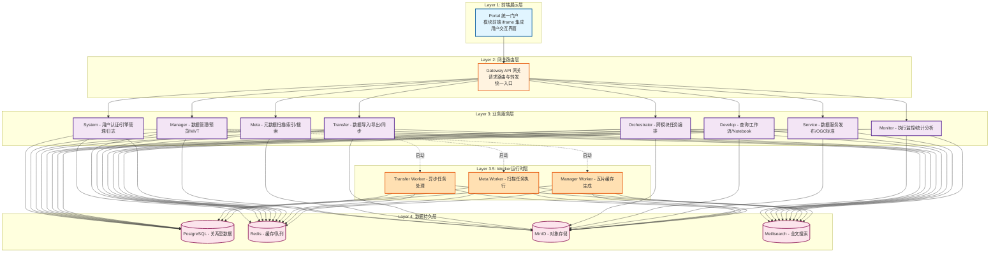
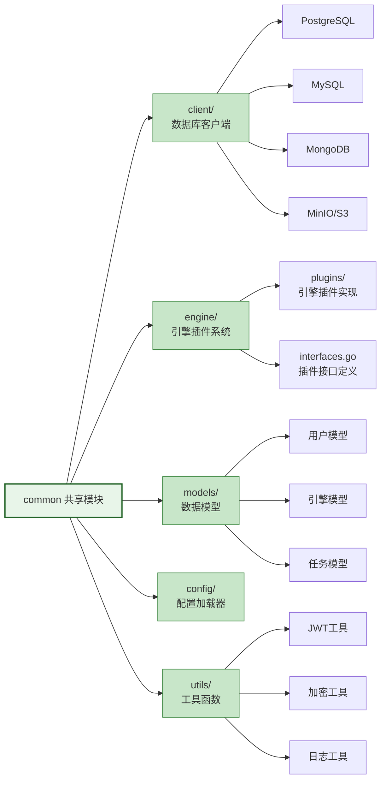
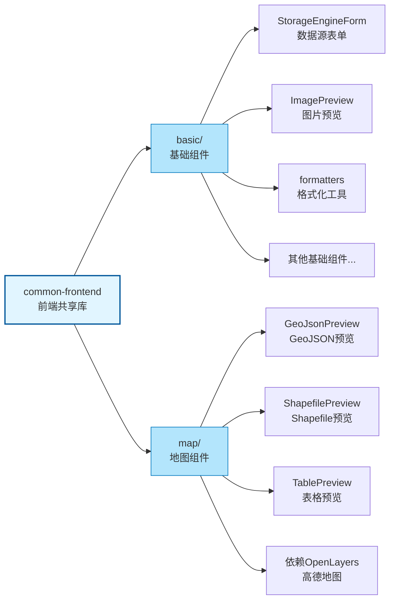
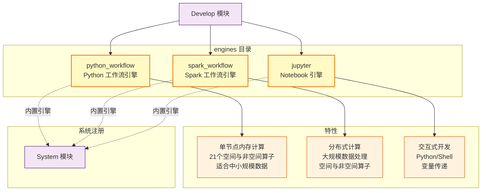
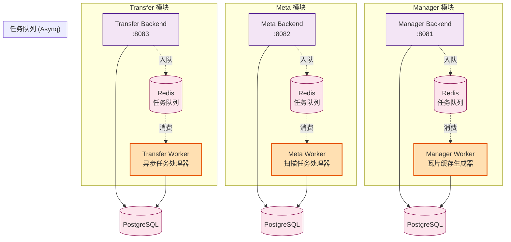
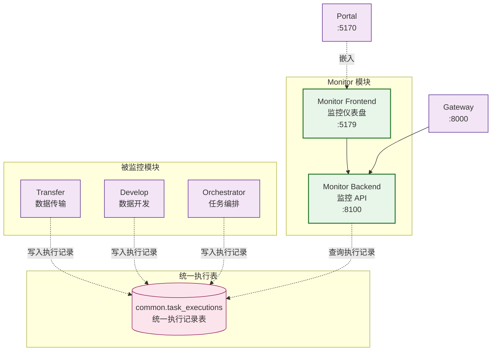
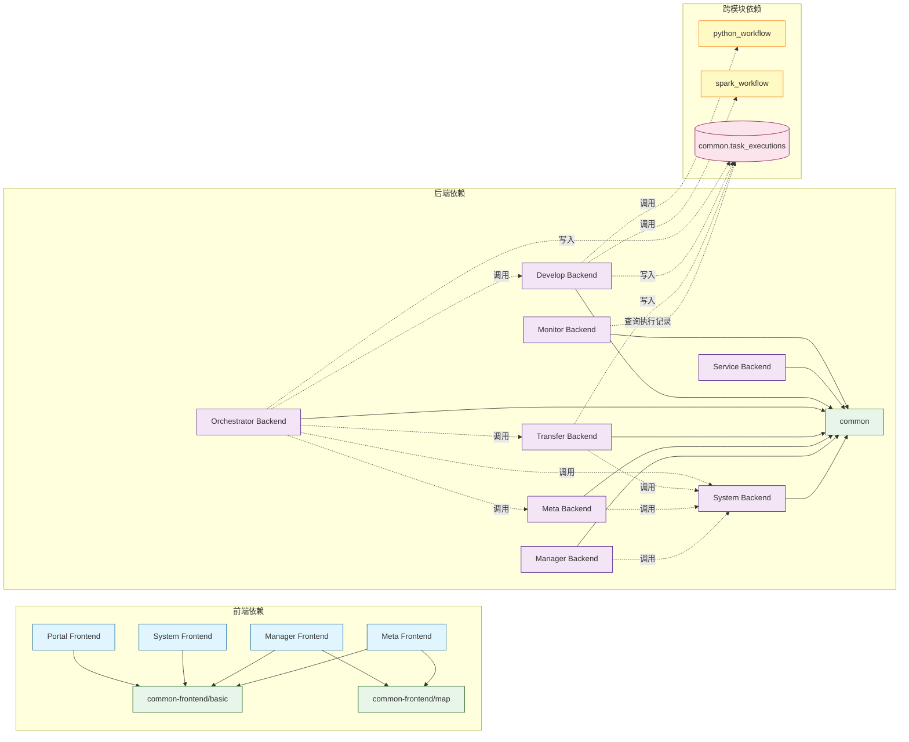

# ADDP 模块架构图

本文档使用可视化图表展示 ADDP 平台的模块组成、层次关系和依赖关系。

---

## 目录

1. [模块总览](#模块总览)
2. [模块分层架构](#模块分层架构)
3. [模块详细说明](#模块详细说明)
4. [共享模块](#共享模块)
5. [计算引擎](#计算引擎)

---

## 模块总览

ADDP 平台采用微服务架构,由以下模块组成:

```mermaid
graph TB
    subgraph "前端层"
        Portal[Portal<br/>统一门户<br/>:5170]
        SystemFE[System Frontend<br/>:5173]
        ManagerFE[Manager Frontend<br/>:5174]
        MetaFE[Meta Frontend<br/>:5175]
        TransferFE[Transfer Frontend<br/>:5176]
        OrchestratorFE[Orchestrator Frontend<br/>:5177]
        DevelopFE[Develop Frontend<br/>:5178]
        ServiceFE[Service Frontend<br/>:5179]
        MonitorFE[Monitor Frontend<br/>:5179]
    end

    subgraph "网关层"
        Gateway[Gateway<br/>API网关<br/>:8000]
    end

    subgraph "服务层"
        System[System Backend<br/>核心系统<br/>:8180]
        Manager[Manager Backend<br/>数据管理<br/>:8081]
        Meta[Meta Backend<br/>元数据服务<br/>:8082]
        Transfer[Transfer Backend<br/>数据传输<br/>:8083]
        Orchestrator[Orchestrator Backend<br/>任务编排<br/>:8084]
        Develop[Develop Backend<br/>数据开发<br/>:8085]
        Service[Service Backend<br/>数据服务<br/>:8086]
        Monitor[Monitor Backend<br/>执行监控<br/>:8100]
    end

    subgraph "Worker运行时"
        TransferWorker[Transfer Worker<br/>异步任务处理]
        MetaWorker[Meta Worker<br/>扫描任务处理]
        ManagerWorker[Manager Worker<br/>瓦片缓存生成]
    end

    subgraph "共享模块"
        Common[common<br/>后端共享库]
        CommonFE[common-frontend<br/>前端共享库]
    end

    subgraph "计算引擎"
        PyWorkflow[python_workflow<br/>Python工作流引擎]
        SparkWorkflow[spark_workflow<br/>Spark工作流引擎]
        Jupyter[jupyter<br/>Notebook引擎]
    end

    subgraph "基础设施层"
        PostgreSQL[(PostgreSQL<br/>系统数据库<br/>:15432)]
        Redis[(Redis<br/>缓存/队列<br/>:16379)]
        MinIO[(MinIO<br/>对象存储<br/>:19000)]
        Meilisearch[(Meilisearch<br/>全文搜索<br/>:17700)]
    end

    Portal --> Gateway
    SystemFE -.-> Portal
    ManagerFE -.-> Portal
    MetaFE -.-> Portal
    TransferFE -.-> Portal
    OrchestratorFE -.-> Portal
    DevelopFE -.-> Portal
    ServiceFE -.-> Portal
    MonitorFE -.-> Portal

    Gateway --> System
    Gateway --> Manager
    Gateway --> Meta
    Gateway --> Transfer
    Gateway --> Orchestrator
    Gateway --> Develop
    Gateway --> Service
    Gateway --> Monitor

    System --> Common
    Manager --> Common
    Meta --> Common
    Transfer --> Common
    Orchestrator --> Common
    Develop --> Common
    Service --> Common
    Monitor --> Common

    SystemFE --> CommonFE
    ManagerFE --> CommonFE
    MetaFE --> CommonFE
    TransferFE --> CommonFE
    OrchestratorFE --> CommonFE
    DevelopFE --> CommonFE
    ServiceFE --> CommonFE

    Common --> PostgreSQL
    Common --> Redis
    Common --> MinIO
    Common --> Meilisearch

    Transfer --> TransferWorker
    Meta --> MetaWorker
    Manager --> ManagerWorker
    TransferWorker --> Redis
    MetaWorker --> Redis
    ManagerWorker --> Redis

    Develop --> PyWorkflow
    Develop --> SparkWorkflow
    Develop --> Jupyter

    classDef frontend fill:#e1f5ff,stroke:#01579b
    classDef gateway fill:#fff3e0,stroke:#e65100
    classDef backend fill:#f3e5f5,stroke:#4a148c
    classDef worker fill:#ffe0b2,stroke:#e65100
    classDef shared fill:#e8f5e9,stroke:#1b5e20
    classDef engine fill:#fff9c4,stroke:#f57f17
    classDef infra fill:#fce4ec,stroke:#880e4f

    class Portal,SystemFE,ManagerFE,MetaFE,TransferFE,OrchestratorFE,DevelopFE,ServiceFE,MonitorFE frontend
    class Gateway gateway
    class System,Manager,Meta,Transfer,Orchestrator,Develop,Service,Monitor backend
    class TransferWorker,MetaWorker,ManagerWorker worker
    class Common,CommonFE shared
    class PyWorkflow,SparkWorkflow,Jupyter engine
    class PostgreSQL,Redis,MinIO,Meilisearch infra
```



**说明**:
- **前端层**: 各模块的独立前端应用,Portal 通过 iframe 集成所有模块前端
- **网关层**: Gateway 统一处理外部请求并路由到对应的后端服务
- **服务层**: 各业务模块的后端服务,提供 RESTful API
- **Worker运行时**: 独立的后台任务处理进程
  - **Transfer Worker**: 基于 Asynq 的异步任务队列,处理数据导入/导出/同步任务
  - **Meta Worker**: 基于 Asynq 的扫描任务处理,执行元数据扫描和索引
  - **Manager Worker**: 基于 Asynq 的瓦片缓存生成,批量生成空间数据 Quick View 缓存
- **共享模块**: common 和 common-frontend 提供可复用的代码和组件
- **计算引擎**: engines 目录下的内置计算引擎,由 Develop 模块调用
- **基础设施层**: 共享的数据库、缓存、对象存储和搜索引擎

---

## 模块分层架构

ADDP 采用经典的四层架构:



**架构特点**:
- **展示层**: 统一门户 + 模块化前端,灵活部署
- **路由层**: Gateway 统一入口,简化客户端配置
- **服务层**: 微服务架构,模块独立部署和扩展
- **Worker运行时层**: 独立的后台任务处理进程,支持异步任务队列
  - Transfer Worker: 处理数据导入/导出/同步任务 (基于 Asynq)
  - Meta Worker: 处理元数据扫描和索引任务 (基于 Asynq)
  - Manager Worker: 批量生成空间数据 Quick View 瓦片缓存 (基于 Asynq)
- **数据层**: 共享基础设施,资源高效利用

---

## 模块详细说明

| 模块 | 职责 | 端口 (开发/生产) | 主要技术栈 |
|------|------|-----------------|-----------|
| **Portal** | 统一门户入口,集成所有模块功能 | 5170 / 80 | Vue 3, Vue Router |
| **System** | 核心系统服务:用户认证、引擎管理、日志 | 8180 / 8180 | Go, Gin, GORM, JWT |
| **Gateway** | API 网关,请求路由和转发 | 8000 / 8000 | Go, Gin |
| **Manager** | 数据管理:数据源连接、目录展示、数据预览、MVT瓦片 | 8081 / 8081 | Go, Gin, OpenLayers |
| **Manager Worker** | Manager 瓦片缓存生成器 | - | Go, Asynq Worker |
| **Meta** | 元数据服务:扫描、索引、搜索 | 8082 / 8082 | Go, Gin, Meilisearch, Cron |
| **Meta Worker** | Meta 扫描任务处理器 | - | Go, Asynq Worker |
| **Transfer** | 数据传输:导入、导出、同步任务 | 8083 / 8083 | Go, Gin, Asynq |
| **Transfer Worker** | Transfer 后台任务处理器 | - | Go, Asynq Worker |
| **Orchestrator** | 任务编排:跨模块任务编排调度 | 8084 / 8084 | Go, Gin, Cron |
| **Develop** | 数据开发:查询执行、工作流、Notebook 开发 | 8085 / 8085 | Go, Gin, Monaco Editor |
| **Service** | 数据服务:服务发布(空间OGC标准与非空间)、外部服务注册 | 8086 / 8086 | Go, Gin, OGC 标准 |
| **Monitor** | 执行监控:统一监控所有模块的任务执行记录、统计分析 | 8100 / 8100 | Go, Gin, PostgreSQL |

---

## 共享模块

### common (后端共享库)

位于 `common/` 目录,所有后端服务依赖的共享代码:



**主要内容**:
- **client/**: 数据库客户端(PostgreSQL、MySQL、MongoDB、MinIO 等)
- **engine/**: 引擎插件系统(接口定义、插件实现、自动注册)
- **models/**: 通用数据模型(用户、引擎、任务等)
- **config/**: 配置加载器(环境变量、.env 文件)
- **utils/**: 工具函数(JWT、加密、日志等)

### common-frontend (前端共享库)

位于 `common-frontend/` 目录,前端模块复用的组件和工具:



**模块划分**:
- **basic/**: 基础 UI 组件,无地图依赖
  - `StorageEngineForm`: 数据源表单组件
  - `ImagePreview`: 图片预览组件
  - `formatters`: 数据格式化工具
  - 其他通用 UI 组件
- **map/**: 地图相关组件,依赖 OpenLayers 和高德地图
  - `GeoJsonPreview`: GeoJSON 数据预览组件
  - `ShapefilePreview`: Shapefile 数据预览组件
  - `TablePreview`: 表格数据预览组件(带空间可视化)

**使用原则**:
- 各模块通过 `npm install` 引入 common-frontend
- common-frontend 自身不能有 `node_modules`(避免依赖冲突)
- 各模块需在 `package.json` 中添加 `overrides` 强制统一 Vue 版本

---

## 计算引擎

位于 `engines/` 目录,ADDP 平台内置的计算引擎:



**引擎说明**:

| 引擎 | 类型 | 适用场景 | 主要能力 |
|------|------|---------|---------|
| **python_workflow** | 内存计算 | 数据量 < 100 万行 | 21 个空间与非空间算子,快速执行 |
| **spark_workflow** | 分布式计算 | 数据量 > 100 万行 | 大规模数据处理,可扩展 |
| **jupyter** | 交互式开发 | Notebook 开发 | Python/Shell,变量传递 |

**注册机制**:
- 系统启动时自动注册为**内置引擎** (`is_builtin = true`)
- 全局可见,不属于任何租户 (`tenant_id = null`)
- 通过 `unique_identifier` 全局唯一标识(如 `python_workflow`)

---

## Worker 运行时

ADDP 平台的部分模块拥有独立的 Worker 运行时进程,用于处理异步任务和后台作业:



**Worker 运行时说明**:

| Worker | 所属模块 | 职责 | 技术栈 |
|--------|---------|------|-------|
| **Transfer Worker** | Transfer | 异步处理数据导入/导出/同步任务,支持重试和并发控制 | Go, Asynq, Redis |
| **Meta Worker** | Meta | 异步处理元数据扫描和索引任务,支持定时调度 | Go, Asynq, Redis |
| **Manager Worker** | Manager | 异步处理 Quick View 瓦片缓存批量生成,支持大规模空间数据预缓存 | Go, Asynq, Redis |

**Asynq 任务队列架构**:
- **队列优先级**: 每个 Worker 支持多优先级队列 (critical/default/low)
- **重试机制**: 任务失败自动重试,支持指数退避
- **并发控制**: 可配置 Worker 并发数,避免资源耗尽
- **进度追踪**: 任务执行状态实时更新到 PostgreSQL

**Worker 启动方式**:
```bash
# 启动 Transfer Worker
bash scripts/dev/start.sh -transfer  # Backend 和 Worker 同时启动

# 启动 Meta Worker
bash scripts/dev/start.sh -meta  # Backend 和 Worker 同时启动

# 启动 Manager Worker
bash scripts/dev/start.sh -manager  # Backend 和 Worker 同时启动

# 单独重启 Worker
bash scripts/dev/restart.sh -transfer
bash scripts/dev/restart.sh -meta
bash scripts/dev/restart.sh -manager
```

---

## Monitor 模块

Monitor 模块是 ADDP 平台的**统一执行监控中心**,负责监控所有模块的任务执行记录:



**Monitor 模块功能**:

| 功能 | 说明 |
|------|------|
| **执行记录查询** | 分页查询所有模块的任务执行记录,支持模块/状态/类型过滤 |
| **统计分析** | 计算成功率、平均执行时间、失败原因分布等统计指标 |
| **趋势分析** | 按天聚合执行数据,生成趋势图表 |
| **模块健康检查** | 检查各模块的任务执行状态,识别异常模块 |

**统一执行表 (common.task_executions)**:
- **跨模块统一**: Transfer、Develop、Orchestrator 三个模块的执行记录统一存储
- **灵活字段**: 使用 JSONB 字段存储模块特有数据 (execution_config, result, error_details)
- **性能优化**: 多层索引 (租户+状态、模块+类型、时间降序、JSONB GIN)
- **数据血缘**: 通过 module + source_task_id 关联原始任务定义

**API 端点**:
- `GET /api/v1/executions` - 分页查询执行记录
- `GET /api/v1/executions/:id` - 获取单条执行详情
- `GET /api/v1/executions/stats` - 获取统计数据
- `GET /api/v1/executions/trend` - 获取趋势数据 (按天聚合)
- `GET /api/v1/modules/health/all` - 检查所有模块健康

**前端组件**:
- `Dashboard.vue` - 监控仪表盘 (统计卡片、趋势图表)
- `ExecutionList.vue` - 执行记录列表
- `StatisticsCard.vue` - 统计卡片组件
- `ExecutionTable.vue` - 执行表格组件

---

## 模块依赖关系



**依赖说明**:
- **前端依赖**: 各模块前端依赖 `common-frontend` 的基础组件和地图组件
- **后端依赖**: 所有后端服务依赖 `common` 共享库
- **跨模块依赖**: 通过 HTTP API 调用(虚线表示),Gateway 不直接依赖具体模块
- **引擎依赖**: Develop 模块调用 engines 目录下的计算引擎
- **执行记录依赖**: Transfer、Develop、Orchestrator 将执行记录写入统一表,Monitor 读取汇总数据

---

## 相关文档

- [ADDP 核心概念说明(详版)](addp核心概念说明（详版）.md)
- [ADDP 核心概念关系图](addp核心概念关系图.md)
- [ADDP 开发原则](spec/addp开发原则.md)
- [ADDP 共享模块介绍](concepts/addp共享模块介绍.md)
- [ADDP 新模块开发指南](spec/addp新模块开发指南.md)
- [Monitor 模块实施报告](../monitor/docs/Monitor模块实施报告.md)

---

**文档版本**: v1.1
**创建日期**: 2026-02-16
**更新日期**: 2026-02-16
**作者**: ADDP 开发团队
