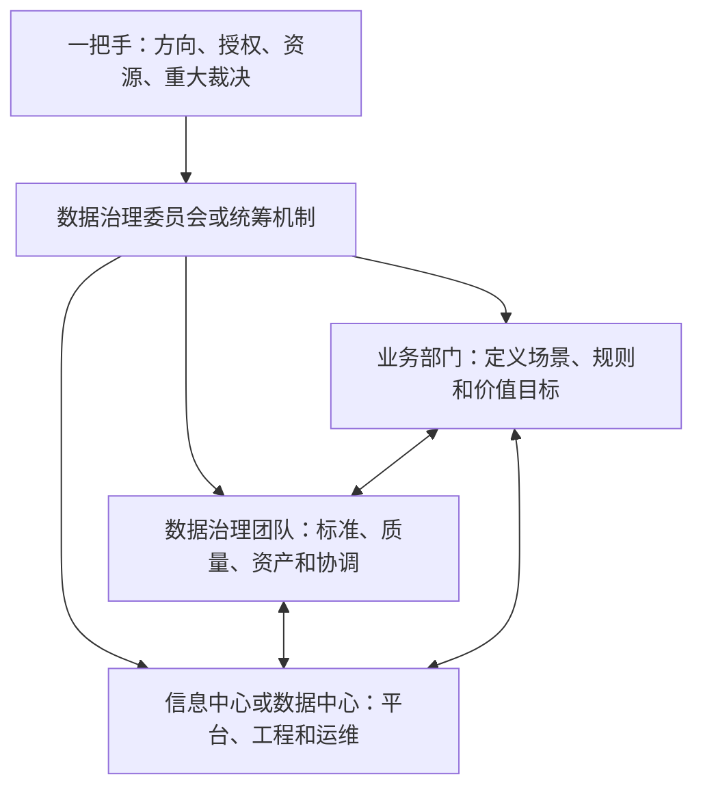

# 002 为什么说“数据治理是一把手工程”？

## 一句话回答

> 数据治理之所以是一把手工程，不是因为技术复杂，而是因为它需要围绕业务价值重新协调跨部门的数据、权力、资源和利益，普通职能部门通常没有足够的授权独立完成这些工作。

一把手不需要亲自管理字段、制定质量规则或操作治理平台，但必须明确治理方向，提供跨部门授权，配置必要资源，裁决重大争议，并推动治理成果进入真实业务流程。

## 一、数据治理首先是管理问题

如果数据治理只是安装一套软件、建设一个数据库，或者完成若干数据接口，技术部门就可以在其职责范围内推进。但数据治理的目标是让数据为业务增值，它必然会进入业务定义、管理流程、部门协作和利益分配。

例如，要计算一个经营指标，首先需要确定指标服务于什么管理目标、统计哪些对象、采用什么时间范围、发生口径冲突时以哪个部门的定义为准。这些问题不能仅靠编写程序解决。

技术人员可以实现已经明确的规则，却不能代替业务部门制定管理规则；数据团队可以发现问题，却不能天然拥有要求其他部门整改的权力；信息中心可以建设共享平台，却不能独自决定哪些数据必须共享、由谁负责质量，以及共享以后产生的风险如何承担。

因此，数据治理不是从技术部门向外推广一套工具，而是组织围绕数据价值重新形成共同目标和协作机制。

## 二、部门墙为什么难以依靠基层协作打破

数据通常产生于具体业务部门，并长期跟随业务系统分散管理。每个部门都有自己的职责、流程、口径和考核目标，这种分工保证了日常工作的专业性，却也容易形成“部门墙”。

部门墙不只是系统没有打通，还包括三类更深层的问题。

### 1. 认知边界

不同部门从各自的职责理解同一个业务对象。同样是“道路路段”，测绘部门关注空间连续性，导航业务关注路口和通行规则，交通管理部门则关注拥堵、事故和管控状态。不同定义可能都合理，但不能在没有说明的情况下混用。

### 2. 利益边界

提供数据需要投入人力，还可能暴露数据质量问题。数据被其他部门使用并产生价值时，原始数据生产部门未必能直接获得收益。缺少共同目标和激励机制时，“为什么要把数据给你”会成为真实而合理的疑问。

### 3. 责任边界

数据共享以后，谁对误用、泄露、错误结果和后续维护负责，往往并不清晰。对提供方来说，不共享可能最省事，共享却意味着新增工作和潜在风险。

这些问题不是多开几次协调会就能解决的。参与协调的部门通常处于平级关系，谁都没有权力单方面要求另一个部门改变业务规则、增加工作投入或承担新的责任。

## 三、数据文化尚未形成时，更需要高层推动

在国内不少政企组织中，数据文化仍处于形成过程中。常见现象包括：

- 数据被视为某个部门或某套系统的内部财产，而不是组织共同的资源；
- 业务人员认为数据治理是信息化部门的技术工作；
- 数据提供、质量整改和口径维护被视为额外负担；
- 管理工作更依赖经验和汇报，数据尚未成为日常决策的共同依据；
- 数据出了问题首先追究个人责任，导致部门更倾向于少提供、少共享；
- 项目建设重视系统上线，却很少持续衡量数据是否真正产生业务价值。

在这种环境下，即使设立了专门的信息中心、数据中心或大数据管理部门，也很难只凭专业能力推动全局治理。它们往往能够连接系统、汇聚数据、建设平台和提供技术服务，却没有足够权力要求业务部门重新定义对象、统一指标口径、整改源头数据、调整工作流程或接受新的考核方式。

一把手推动的意义，首先是把数据治理从某个技术部门的任务，转变为整个组织共同承担的管理工作；其次是明确数据服务于组织整体目标，而不是强化某个部门对数据的占有。

## 四、信息中心和数据中心能做什么，不能独自做什么

| 能够主导或承担的工作 | 通常难以独立决定的工作 |
| --- | --- |
| 建设和运维数据平台 | 确定组织级业务目标和治理优先级 |
| 实现数据汇聚、加工和服务 | 决定跨部门数据必须如何共享 |
| 建设元数据、质量和血缘能力 | 定义具有争议的业务对象和指标口径 |
| 发现技术和数据质量问题 | 要求业务部门持续整改源头问题 |
| 提供安全、权限和审计工具 | 调整部门职责、流程和绩效考核 |
| 为业务场景提供技术支持 | 裁决部门之间的权责和利益冲突 |

这并不意味着信息中心或数据中心不重要。恰恰相反，它们通常是数据治理的专业支撑和执行枢纽。问题在于，不能让一个缺少业务管理授权的技术部门，独自承担本应由整个组织共同完成的治理责任。

## 五、一把手应该发挥什么作用

“一把手工程”不是让所有问题都提交给最高领导审批，而是由高层建立一套能够持续运行的授权和治理机制。

一把手至少需要承担以下职责：

1. 明确数据治理要服务的业务目标，而不是只提出“建设数据平台”；
2. 确定跨部门治理的统筹机构及其授权边界；
3. 要求业务部门对数据定义、质量和应用结果承担责任；
4. 为重点场景配置人员、预算和业务协作时间；
5. 对重大口径、权责和利益冲突建立最终裁决机制；
6. 将数据治理和数据使用纳入经营管理、绩效评价或工作考核；
7. 持续关注治理是否产生业务价值，而不是只在项目启动时表态。

一把手负责的是方向和组织保障。具体的标准制定、数据建模、质量整改、工程实施和日常运营，仍然需要业务、数据和技术团队各司其职。

## 六、案例：低效用地识别

经济发达地区土地资源紧张，需要识别并盘活低效用地。但“低效用地”并不是数据库中天然存在的一个字段，它可能包括批而未供、供而未建、建成后利用率低、产出强度不足等多种情形。

完成识别通常需要综合供地、规划、建设、用地现状、企业经营、税收和社会经济等数据。不同部门掌握不同环节的数据，对“低效”的理解和管理责任也不完全相同。

如果仅由信息中心推动，项目很容易停留在反复发函要数据、临时制作接口和汇总报表的阶段：

- 部门提供什么数据、多久更新一次缺少明确要求；
- 指标口径发生争议时，技术团队无法裁决；
- 数据质量问题被发现后，源头部门没有整改动力；
- 计算结果没有进入土地盘活、项目监管和政策评估流程；
- 项目结束以后，数据和模型不能持续更新。

高层推动并不是简单要求“各部门必须提供数据”，而是首先确认低效用地治理这一业务目标，再建立跨部门工作机制，明确识别规则、数据责任、更新周期、问题处理和成果应用方式。只有这样，数据汇聚和技术计算才能真正进入管理流程，形成土地资源盘活的业务价值。

## 七、一把手推动不等于行政命令

在数据文化尚未成熟的组织中，高层权威可以帮助项目启动，但仅靠行政命令无法形成长期能力。

如果只强调“必须共享”，却不明确用途、责任和安全边界，业务部门可能被动提供一次数据，之后仍然无法持续更新；如果只成立领导小组，却没有固定的议事、裁决和运营机制，组织仍会回到原来的部门分割状态；如果只要求技术部门限期完成平台建设，最终交付的很可能只是系统功能，而不是业务成果。

真正有效的一把手推动，需要把一次性权威转化为稳定机制：

- 重大问题有明确的决策和升级路径；
- 每类关键数据都有业务责任主体；
- 数据共享有清晰的用途和安全边界；
- 数据问题能够回到源头形成整改闭环；
- 治理结果能够进入业务流程并被持续衡量；
- 部门和个人能够从数据协作中获得正向反馈。

## 八、常见误区

### 误区一：成立领导小组就是一把手工程

组织名称并不等于治理机制。没有业务目标、授权边界、责任分工和持续议事机制，领导小组很容易只在项目启动和验收时出现。

### 误区二：一把手工程就是一把手亲自实施

最高领导不应陷入具体技术和数据问题。高层需要做的是明确方向、提供授权和资源，并确保专业团队能够正常履责。

### 误区三：把全部责任交给信息中心或数据中心

技术部门可以承担平台和工程责任，但不能替业务部门定义业务，也不能替整个组织判断治理价值。

### 误区四：领导发文以后，部门墙自然会消失

部门墙背后存在认知、利益和责任边界。发文可以提供启动权威，长期仍要依靠流程、制度、考核、服务和文化建设。

## 九、实践检查清单

判断一个数据治理项目是否获得了有效的高层支持，可以检查：

1. 是否明确了要改善的业务问题和业务指标？
2. 是否有具备实际授权的跨部门统筹机制？
3. 业务部门是否承担数据定义、质量和应用责任？
4. 信息中心或数据中心的技术职责是否清晰？
5. 部门争议是否有明确的升级和裁决路径？
6. 数据提供、整改和应用是否进入日常工作或绩效机制？
7. 高层关注的是平台进度，还是数据产生的业务成果？

## 结语

数据治理需要一把手推动，根本原因不是数据天然属于高层管理，而是数据价值往往产生在部门边界之外。只有组织最高层能够从整体业务目标出发，协调局部利益、赋予治理授权并推动文化转变。

一把手负责把墙打开、把方向定清、把机制建立起来；业务、数据和技术团队则负责让数据真正进入业务、持续产生价值。两者缺一不可。

## 延伸阅读

- 第001问：数据治理的第一性原理是什么？
- 第005问：数据治理应该从哪里开始，如何选择首期业务场景？
- 第006问：如何制定并分阶段推进一份可落地的数据治理路线图？
- 第007问：数据治理的成效和投资回报应该如何衡量？
- 第086问：数据治理的“铁三角”是什么？
- 第089问：业务部门、数据部门和技术部门应如何分工？
- 第090问：数据治理委员会如何建立有效的决策和争议处理机制？
