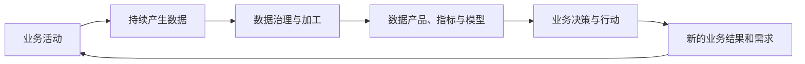

# 003 为什么说“数据治理只有起点，没有终点”？

## 一句话回答

> 数据治理只有起点、没有终点，是因为业务场景、数据来源、管理规则和技术环境始终在变化，治理必须作为一项持续运营的组织能力不断调整；但每个治理阶段都必须有明确范围、交付成果和验收标准。

“没有终点”不是说数据治理项目可以无限延期，也不是说组织必须无休止地建设平台。具体项目、数据域和应用场景都应按阶段完成，持续的是治理能力和运营机制。

## 一、数据治理为什么不能一次完成

传统信息化项目通常围绕一组相对明确的需求展开：设计系统、开发功能、上线验收，然后进入运维阶段。数据治理与此不同，它处理的不是一套静态功能，而是业务活动不断产生和使用的数据。

业务每天都在运行，新的数据会持续产生，旧数据也会失去鲜活度。产品、客户、渠道、组织、政策和管理方式发生变化以后，原有的数据定义、加工链路和指标口径也要随之调整。

因此，数据治理不可能通过一次数据汇聚、一次质量清洗或一次平台建设永久完成。即使首批数据已经治理合格，新的业务变化仍然会产生新的治理需求。

## 二、业务和数据构成持续反馈循环

数据治理所处的基本关系是“业务产生数据，数据反哺业务”。

业务系统在日常运行中产生数据。数据经过汇聚、标准化、建模和分析以后，形成业务实体、指标、模型和数据服务，进而支持业务决策。新的决策和行动又会改变业务流程，产生新的数据和新的需求。

这个循环意味着，数据治理的成果不是终点，而是下一轮业务创新的基础。

一个组织最初可能只治理销售和库存数据，用于计算经营指标；当这些数据可用以后，业务人员会进一步希望结合会员、物流、天气、区域和竞争环境数据进行预测。数据维度越丰富，可探索的应用场景越多，新的场景又会提出新的标准、质量、时效和计算要求。

所以，数据治理不是沿着一条直线走向结束，而是在业务价值的牵引下不断迭代。

## 三、哪些变化会持续产生治理需求

### 1. 业务场景会变化

组织会推出新产品、进入新区域、调整经营模式，也会面临新的管理问题。原来用于月度统计的数据，可能需要支持实时运营；原来服务内部管理的数据，可能需要形成面向客户的数据产品。

应用场景变化以后，所需数据、粒度、鲜活度和质量要求都会发生变化。

### 2. 业务对象和管理口径会变化

客户分类、组织结构、产品体系、行政区划和管理规则都可能调整。一个指标的名称没有变化，其业务含义和计算规则也可能已经改变。

如果只更新报表而不更新数据模型、元数据、血缘和历史版本，同一指标在不同时间得到的结果就无法正确比较。

### 3. 数据来源会变化

新的业务系统、传感器、外部数据、采购数据和公共数据会不断加入，旧系统也可能被替换。数据源发生变化以后，字段结构、编码方式、更新周期和质量特征都会随之变化。

### 4. 数据本身会不断刷新

数据治理的结果要服务业务，就必须保持鲜活。定时汇聚、实时汇聚、增量同步和任务调度都需要持续运行。链路中任何一个系统、网络或数据结构发生变化，都可能影响数据成果。

### 5. 标准、质量和安全要求会变化

新的业务场景可能要求更高的数据准确性和时效性；数据共享范围扩大以后，分级分类、权限、脱敏和审计策略也需要调整。外部法规、行业规范和组织内部制度同样会持续演进。

### 6. 技术环境会变化

存储引擎、计算引擎、数据格式、算法和AI能力都在发展。技术变化可能降低治理成本，也可能引入新的数据类型、处理链路和治理对象。

持续治理不是追逐所有新技术，而是在业务需要发生变化时，能够稳妥地调整现有能力。

## 四、没有终点不等于没有阶段成果

数据治理必须长期开展，但不能因此失去项目边界。以下工作都可以并且应该按阶段完成：

- 完成一个重点业务场景的数据治理；
- 完成一个数据域的盘点、建模和责任划分；
- 建立首批数据标准和质量规则；
- 打通一组关键数据汇聚与加工链路；
- 发布一个可以被业务使用的数据产品；
- 建立治理组织、制度和问题处理流程；
- 建成满足当前阶段要求的数据治理底座。

阶段性成果需要有明确的验收条件。例如，不能只验收“接入了多少张表”，还要验证目标场景是否能够稳定获得所需数据，指标口径是否统一，数据更新是否按时，质量问题是否能够闭环，以及业务指标是否得到改善。

“项目有终点，治理无终点”更准确地表达了两者的区别：项目用于集中建设某一阶段的能力，治理则负责让这些能力持续运行、适应变化并产生新的价值。

## 五、案例：经营指标体系为什么需要持续治理

某企业完成了销售主题的数据仓库建设，统一了地区、产品、渠道和时间等维度，并建立销售额、销售增长率、渠道占比等指标。首期项目上线以后，各部门终于能够使用统一口径分析经营情况。

如果把项目验收当作治理终点，问题很快就会重新出现：

- 企业推出新的产品系列，原有产品分类无法准确表达；
- 新增直播、电商平台等销售渠道，渠道维度需要调整；
- 退货、换货和优惠券的处理规则发生变化，销售额口径需要更新；
- 组织架构调整，区域业绩的历史归属需要重新处理；
- 管理层开始关注库存周转、客户复购和渠道利润，需要引入更多数据；
- 原有日更新不能满足促销期间的实时经营分析。

这些变化并不意味着首期项目失败，而是说明业务已经在使用数据，并产生了更高层次的需求。

持续治理需要对产品、渠道、组织和指标进行版本管理，更新相关数据链路和血缘关系，评估口径变化对历史数据的影响，并让业务人员能够理解新旧口径之间的差别。

治理的价值正是在这样的持续调整中体现：业务发生变化时，组织不必每次从头寻找数据、重新核对口径和临时编写程序，而是能够在已有成果上快速演进。

## 六、如何建立持续治理机制

长期治理不能依赖项目团队一直驻场，也不能依赖少数人员凭经验维护。组织需要把项目成果转化为日常机制。

### 1. 建立治理需求清单

将新的业务场景、数据问题、口径变更和平台能力需求统一纳入清单，根据业务价值、风险和成本确定优先级，避免所有需求同时推进。

### 2. 明确持续责任

每个关键数据域、业务对象、指标和数据产品都要有明确责任主体。项目团队退出以后，仍然有人负责定义、质量、变更和使用反馈。

### 3. 管理变更和版本

数据模型、标准、指标、规则和加工链路发生变化时，需要记录版本、影响范围和生效时间。重大变更应经过评审，并通知相关使用者。

### 4. 监控数据链路和质量

平台功能正常不代表数据成果正常。还需要持续监控任务运行、数据鲜活度、质量规则和数据产品的服务状态，及时发现上游变化造成的影响。

### 5. 定期复盘业务价值

数据产品和治理规则不是越多越好。应定期检查哪些成果仍在被使用、产生了什么价值，哪些已经失效或重复，并及时调整或退出。

### 6. 形成反馈闭环

业务人员在使用数据过程中发现的问题和提出的新需求，应能够反馈给数据生产、治理和技术团队。问题解决以后，还要验证是否真正改善了业务结果。

## 七、如何防止持续治理变成无限建设

“只有起点、没有终点”容易被误用为不断扩大建设范围、追加预算和延长项目周期的理由。要避免这种情况，需要坚持几个约束：

- 每一阶段都由明确的业务场景牵引；
- 每项治理任务都有责任人、时间和验收标准；
- 优先治理价值高、问题明确的数据，而不是追求一次覆盖全部数据；
- 平台建设服从治理需要，不因功能存在就要求业务使用；
- 对长期无人使用的数据产品、指标和链路建立退出机制；
- 定期衡量治理投入与业务产出，不以工作量代替价值。

持续治理的重点是持续产生价值，而不是持续建设。

## 八、常见误区

### 误区一：数据治理永远做不完，所以无法验收

治理能力需要持续运营，但每个阶段的建设范围和成果都可以验收。不能用长期性掩盖项目目标不清和交付失控。

### 误区二：平台上线以后，治理进入普通软件运维

普通软件运维主要保证系统功能可用，数据治理运维还要保证数据链路持续产出合格、鲜活的数据成果。

### 误区三：完成一次数据清洗，数据就会一直正确

源系统仍在产生新数据，业务规则和系统结构也会变化。没有源头整改和持续质量监控，问题会不断重新出现。

### 误区四：治理范围应该不断扩大

长期治理不等于无限扩张。治理范围应根据业务价值动态选择，有新增，也应该有合并、调整和退出。

## 九、实践检查清单

判断组织是否建立了持续治理能力，可以检查：

1. 项目验收以后，是否有明确的日常责任主体？
2. 数据模型、标准和指标发生变化时，是否有版本和评审机制？
3. 是否持续监控数据链路、鲜活度和质量，而不只是服务器状态？
4. 业务人员是否能够反馈数据问题和新的场景需求？
5. 是否定期评估数据产品和治理成果的使用情况及业务价值？
6. 是否有明确的阶段目标、优先级和退出机制？
7. 新业务出现时，能否复用已有数据资产和治理能力快速响应？

## 结语

数据治理没有一个永久不变的完成状态，因为业务和数据从来不是静止的。但这并不妨碍组织在每个阶段形成清晰、可验收的成果。

真正成熟的数据治理，不是永远处于建设中的庞大项目，而是一套能够随业务变化持续发现问题、调整规则、复用成果并创造新价值的运营机制。

治理从一个有价值的业务场景开始，在持续反馈和复用中不断发展。它只有起点，没有最终停止演进的终点。

## 延伸阅读

- 第001问：数据治理的第一性原理是什么？
- 第004问：数据治理的成熟度如何评估？
- 第006问：如何制定并分阶段推进一份可落地的数据治理路线图？
- 第007问：数据治理的成效和投资回报应该如何衡量？
- 第032问：为什么要保持数据的鲜活度？
- 第038问：数据的生命周期管理是什么意思？
- 第083问：数据治理平台的运维与一般应用系统的运维有什么异同？
- 第087问：项目验收以后，如何避免数据治理变成一次性运动？
