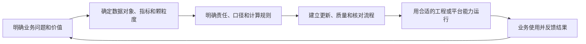

# 005 数据治理应该从哪里开始，如何选择首期业务场景？

## 一句话回答

> 数据治理应从一个值得解决的业务问题开始，再根据场景需要组合组织、制度、流程、标准和平台能力；首期优先选择价值明确、问题真实、范围可控、条件具备且成果可复用的场景。

数据治理不是在“先建组织、先定标准、先做流程、先上平台”之间选择一条固定顺序。真正要确定的是：业务想改善什么，当前受哪些数据问题制约，谁愿意对结果负责，以及第一阶段做到什么程度。

## 一、为什么不能从建设清单开始

很多治理规划一开始就列出数据标准、质量、目录、主数据、数据中台和安全平台。内容看起来完整，却不一定能落地，因为它回答的是“通常应该建设什么”，没有回答“当前业务为什么需要它”。

如果业务目标不清楚，先制定制度容易形成没人执行的文件；先统一全部标准容易陷入漫长的字段盘点；先建设平台则可能得到一组没有稳定使用者的功能。

更可靠的起点是一个真实的业务问题，例如：

- 经营指标在不同部门出现不同结果；
- 管理会议长期依赖人工收集和核对数据；
- 项目回款或利润风险不能及时发现；
- 数据共享效率太低，影响跨部门协同；
- 某个产品、服务或 AI 应用因为数据条件不足无法开展。

先说清楚要改善的业务决策、流程或结果，再反推所需数据和治理能力，才能避免把数据治理做成与业务脱节的工程。

## 二、如何选择第一个业务场景

首期场景不一定是价值最大的场景，而应在价值、可行性和示范作用之间取得平衡。可以从五个方面判断：

| 选择条件 | 判断问题 |
| --- | --- |
| 价值明确 | 是否直接影响收入、成本、效率、体验、风险或管理决策？ |
| 问题真实 | 是否存在持续发生、业务人员愿意解决的问题？ |
| 条件可行 | 是否有基本数据、业务负责人和可执行的技术条件？ |
| 范围可控 | 能否明确数据范围、责任边界和阶段验收标准？ |
| 成果可复用 | 沉淀的对象、规则、模型和流程能否服务其他场景？ |

一个价值很大但数据完全缺失、部门也没有形成共识的场景，可能更适合作为中长期目标；一个价值清晰、数据基础尚可、能够形成闭环的场景，更适合作为第一个试点。

## 三、案例：统一集团多渠道销售指标

某集团同时通过直营网点、电商平台、经销商和区域公司销售产品。各渠道分别建设了业务系统，也形成了自己的销售报表。管理层希望按照产品、渠道、区域和时间查看销售额、销量、退货额和毛利等指标，却经常发现不同部门提供的数字不一致。

这个问题适合作为首期场景，不是因为它只是一个报表需求，而是因为它连接了经营管理、业务口径、跨渠道数据、持续更新和日常决策。

### 1. 业务价值清晰

及时、可信的销售指标可以支持渠道评价、区域比较、产品调整、库存调配和促销复盘。数据长期滞后或口径不一致，管理者就难以判断销售变化究竟来自市场、渠道、退货还是统计方式。

### 2. 数据链路跨系统且口径复杂

订单、发货、签收、退款、渠道、产品和成本数据通常分布在电商、门店、经销商、ERP 和财务系统中。不同渠道可能按下单、发货、签收或收入确认统计销售额，对优惠、税费、退货和跨区销售的处理也不相同。

### 3. 场景边界可以控制

首期可以选择若干代表性产品、区域和渠道，锁定少量核心指标及必要数据源，验证口径、维度映射、更新链路和核对方式，再逐步扩大范围。

## 四、围绕场景建立最小治理闭环

选定场景以后，不需要一次建设完整体系，但必须形成一个能够运行的最小闭环：

在多渠道销售场景中，最小闭环至少要解决：

1. 产品、渠道、区域和时间的分析颗粒度；
2. 销售额、销量、退货额和毛利的业务定义；
3. 下单、发货、签收和收入确认等事件的统计边界；
4. 优惠、税费、退货、跨区销售和成本调整的处理方式；
5. 数据源、更新周期、责任人和日常核对机制。

“每天出数”也要按指标实际状态定义。订单和发货可以每日更新，退货可能在后续发生，毛利还会受到成本调整和财务结算影响。治理的目标是让每个数字都有明确含义和状态，而不是把不同成熟度的数据混在一起。

## 五、组织、制度、流程、标准和平台各自解决什么问题

场景确定以后，再判断需要补齐哪类能力：

| 治理要素 | 主要解决的问题 | 在经营指标场景中的例子 |
| --- | --- | --- |
| 组织 | 谁负责、谁协调、谁裁决 | 经营、销售、产品、财务和数据团队共同确认口径 |
| 制度 | 长期按什么原则执行 | 指标发布、变更、质量整改和争议处理原则 |
| 流程 | 具体如何协作和运行 | 数据更新、对账、异常分派、补数和复核流程 |
| 标准 | 如何一致理解 | 产品、渠道、区域、销售事件和指标定义 |
| 平台 | 如何规模化、可追踪地运行 | 汇聚、建模、调度、质量、血缘、权限和监控 |

如果部门之间长期互相推诿，优先解决授权和责任；如果同一指标反复争论，优先解决定义和裁决机制；如果数据量小、变化少，可以先用简单工具验证；当数据源多、每天更新且需要持续监控时，再建设平台化能力。

## 六、首期试点不要追求全面统一

首期范围应覆盖一个完整但可控制的闭环。可以选择业务特征不同的渠道和区域作为代表性样本，但不必同时纳入全部产品、所有渠道、全部历史数据和所有经营指标。

试点需要证明的是：

- 指标定义能够由相关部门共同确认；
- 维度映射和指标计算能够解释和复算；
- 数据能够按约定周期更新；
- 异常能够定位到源数据、规则或责任人；
- 业务人员愿意在经营管理中使用；
- 沉淀的模型、标准和流程可以复制。

## 七、常见误区

### 误区一：先选最容易取得的数据

数据容易取得不代表业务价值高。没有业务使用者的简单数据，很难证明治理成果。

### 误区二：先统一全部标准

全量标准建设周期长且难以一次正确。应先治理首期场景真正依赖的关键对象、编码和指标。

### 误区三：平台建成以后再找场景

平台只能承载能力，不能替组织决定业务目标。没有场景牵引，平台很容易堆积无人使用的功能。

### 误区四：从场景开始就不需要顶层设计

试点仍需遵守基本的概念、架构、安全和数据边界，否则多个试点可能形成新的孤岛。

## 八、实践检查清单

1. 是否能用一句话说明要改善的业务决策或结果？
2. 是否有明确的业务负责人和争议裁决人？
3. 是否列出了场景所需的数据对象、指标、来源和颗粒度？
4. 是否识别了主要口径、分配、质量和鲜活度问题？
5. 首期范围是否覆盖一个完整但可控制的闭环？
6. 是否有业务台账或其他结果作为核对依据？
7. 是否定义了数据更新、异常处理和责任整改方式？
8. 试点成果是否可以复用到其他区域、渠道、产品或场景？

## 小结

数据治理的起点不是组织、制度、流程、标准和平台中的某一个，而是一个值得解决的业务问题。好的首期场景能够让组织在解决问题的同时，建立责任、口径、流程和技术能力，并为后续治理提供可复用的样板。

集团多渠道销售指标之所以适合作为试点，是因为它普遍存在、价值明确、范围容易控制，并且能够把口径统一、数据汇聚、指标计算、数据鲜活度和经营行动连接在一起。

## 延伸阅读

- [第001问：数据治理的第一性原理是什么？](001-数据治理的第一性原理.md)
- [第002问：为什么说“数据治理是一把手工程”？](002-数据治理为什么是一把手工程.md)
- [第004问：数据治理的成熟度如何评估？](004-数据治理的成熟度如何评估.md)
- [第006问：如何制定并分阶段推进数据治理路线图？](006-如何制定可落地的数据治理路线图.md)
- [第007问：数据治理的成效和投资回报应该如何衡量？](007-数据治理的成效和投资回报如何衡量.md)
