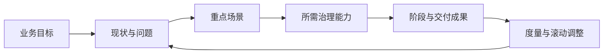

# 006 如何制定并分阶段推进一份可落地的数据治理路线图？

## 一句话回答

> 数据治理路线图不是平台功能清单或项目进度表，而是从业务目标和组织现状出发，选择重点场景，按能力依赖分阶段推进，并为每个阶段设定业务成果、治理成果和验收证据的行动路径。

路线图的价值不在于预测一个不会变化的未来，而在于帮助组织持续回答：为什么现在做、先做什么、谁负责、做到什么程度，以及下一步是否值得继续投入。

## 一、路线图首先要确定起点和边界

制定路线图前，需要了解：

- 当前最重要的业务目标和管理问题；
- 已经具备的数据、系统、制度和技术能力；
- 哪些指标、模型和数据产品正在使用；
- 数据治理主要依赖制度、项目还是个人经验；
- 部门之间是否具备协作、授权和争议裁决机制；
- 首期能够投入多少人员、预算和业务时间。

路线图还要明确当前阶段不做什么。数据治理需求很容易不断扩大，如果没有范围边界，首期经营指标项目可能逐渐变成全量历史数据、所有财务报表和全部数据资产的平台工程。

## 二、路线图的六个组成部分

一份可落地的路线图至少要连接六件事：

### 1. 业务目标

目标应尽量转化为可观察的业务结果，例如按时获得可信的多渠道销售指标、缩短报表准备时间或支撑新的数据产品，而不是只写“提升数据能力”。

### 2. 现状与问题

说明目标为什么无法实现。问题可能来自数据缺失、口径冲突、更新不及时、质量不可靠、部门协作困难、加工链路脆弱或安全边界不清。

### 3. 重点场景

从候选需求中选择价值、紧迫性、可行性、业务意愿和能力复用性较好的场景。首期场景要能形成闭环，而不是只交付一项孤立功能。

### 4. 所需治理能力

围绕场景识别需要哪些数据、模型、标准、质量、组织、流程和平台能力，并区分当前必须补齐的短板与可以后置的能力。

### 5. 阶段与交付成果

把任务按价值、依赖关系和资源约束分成几个阶段。每个阶段都要有业务人员可以使用的成果，不能把价值全部推到项目末期。

### 6. 度量与滚动调整

为每个阶段设置验收指标，定期检查原有假设是否仍然成立。业务目标、数据条件或技术环境变化时，应调整顺序和范围。

## 三、五个阶段及其交付内容

| 阶段 | 主要回答的问题 | 业务成果 | 治理成果 |
| --- | --- | --- | --- |
| 诊断与设计 | 为什么治理、先治理什么、谁负责？ | 明确首期业务目标和场景 | 现状诊断、范围、责任、路线图和验收标准 |
| 场景试点 | 能否解决一个真实问题？ | 可使用的数据产品或分析结果 | 统一口径、数据链路、质量和核对机制 |
| 能力建设 | 如何避免每个场景重复建设？ | 试点成果稳定运行 | 可复用的标准、模型、流程、调度、血缘和权限能力 |
| 规模推广 | 如何服务更多区域、部门和场景？ | 更多业务数据产品和服务 | 接入模板、差异管理、协作和培训机制 |
| 持续运营 | 如何让成果长期可靠并持续增值？ | 持续可用、持续改进的业务结果 | 监控、版本、问题闭环、价值度量和优化机制 |

这五个阶段不一定完全串行。试点实施时可以同步建立必要的组织和平台基础，运营中发现的新问题也可能重新进入试点。阶段划分是为了控制重点，不是为了制造僵化的流程。

## 四、案例：集团多渠道销售指标如何安排路线

### 第一阶段：诊断与设计

梳理产品、渠道、区域、订单、发货、退货和成本数据的来源及责任，确认销售额、销量、退货额和毛利的定义，明确不同销售事件的统计边界，并选定具有代表性的产品、渠道和区域作为试点范围。

阶段验收不是“完成需求调研”，而是各方已经书面确认指标口径、分析颗粒度、数据范围、责任边界和验收方式。

### 第二阶段：场景试点

先在有限的产品、渠道和区域范围内打通订单、发货、退货及必要的财务数据，形成按约定周期更新、可追溯、可核对的销售结果。毛利可以先提供明确标识的滚动结果，待成本调整和财务结算后形成最终版本。

阶段验收要看经营人员是否使用结果，指标是否能够按统一口径复算，差异是否能够定位，而不只是看任务和报表是否上线。

### 第三阶段：能力建设

将试点中的共性内容抽取为可复用能力，例如产品、渠道和区域模型、指标定义版本、维度映射、质量检查、调度监控、血缘追踪、权限和审计。

各渠道的销售事件和数据结构可能存在差异，但版本管理、映射规则、异常告警和运行日志通常应成为公共能力。

### 第四阶段：规模推广

将经过验证的方法扩展到更多产品、区域、渠道和指标，再延伸到库存调配、促销评价和客户分析等相关场景。推广时要显式记录渠道差异，不能把差异偷偷写进脚本。

阶段验收可以比较新增场景的接入周期、重复开发量、数据更新成功率、指标差异率和业务使用情况。

### 第五阶段：持续运营

持续关注数据源、模型、指标和规则的变化，维护质量问题、权限、版本和业务使用。对于长期无人使用或维护成本过高的数据产品，应考虑调整或下线。

阶段验收应从稳定性、质量、使用和价值四个维度观察，而不是以项目合同到期或平台部署完成作为唯一标准。

## 五、为阶段设置进入条件和退出条件

| 阶段 | 进入条件 | 退出条件 |
| --- | --- | --- |
| 诊断与设计 | 管理层明确目标和授权 | 场景、范围、口径、责任和验收标准已确认 |
| 场景试点 | 业务负责人、数据源和资源到位 | 业务闭环运行，关键差异可解释 |
| 能力建设 | 试点出现明确的共性复用需求 | 公共能力在相近场景中可复用 |
| 规模推广 | 推广对象和接入模板已确定 | 接入效率提高且治理质量稳定 |
| 持续运营 | 数据产品进入日常使用 | 形成稳定的监控、变更、问题和价值机制 |

不能只用“平台上线”“项目付款”或“合同到期”作为阶段完成的依据。

## 六、每个阶段都要维护三张清单

| 清单 | 要回答的问题 | 示例 |
| --- | --- | --- |
| 业务成果清单 | 业务人员最终能用什么？ | 多渠道销售指标、异常波动清单、经营分析报表 |
| 治理能力清单 | 哪些能力可以复用和持续运行？ | 指标定义、维度映射、质量检查、调度监控 |
| 验收证据清单 | 用什么事实证明达到目标？ | 更新记录、对账结果、使用记录、问题关闭记录 |

只有治理能力清单而没有业务成果，项目容易变成平台建设；只有业务报表而没有验收证据，则很难判断结果是否稳定可靠。

## 七、常见误区

### 误区一：把路线图写成产品功能列表

功能只能说明平台能做什么，不能说明组织为什么做、先做什么和如何产生价值。

### 误区二：先建设全部公共平台，再寻找业务场景

没有真实场景，平台能力很难确定优先级，也很难验证是否真正解决了问题。

### 误区三：把试点中的人工操作永久化

试点可以有人工核对和临时补录，但必须记录哪些操作未来应自动化、哪些规则应制度化。

### 误区四：路线图制定后不能调整

业务和数据条件持续变化。路线图应按固定周期复盘，及时提前、推迟、合并或取消任务。

### 误区五：项目结束后才安排运营

数据产品上线后仍需要人员、流程和技术资源。运营责任和资源应在路线图中提前明确。

## 八、实践检查清单

1. 是否说明路线图服务的业务目标？
2. 是否基于真实现状和能力评估？
3. 是否明确首批场景及选择理由？
4. 是否识别场景所需的数据和治理能力？
5. 是否按照能力依赖安排实施顺序？
6. 每个阶段是否都有业务可使用的成果？
7. 是否明确责任人、资源、范围和验收标准？
8. 是否设置了进入条件、退出条件和复盘机制？
9. 是否为项目结束后的持续运营安排了责任和资源？

## 结语

可落地的路线图不是一次性把所有治理能力规划完，而是让组织从真实场景出发，按依赖关系逐步打通业务成果和治理能力。

在集团多渠道销售指标场景中，先把问题、口径和责任说清楚，再让有限范围的数据按约定周期被使用，然后抽取公共能力、推广到更多产品、区域和渠道，最后通过运营保持指标鲜活和结果可信。

## 延伸阅读

- 第003问：为什么说“数据治理只有起点，没有终点”？
- 第004问：数据治理的成熟度如何评估？
- 第005问：数据治理应该从哪里开始，如何选择首期业务场景？
- 第007问：数据治理的成效和投资回报应该如何衡量？
