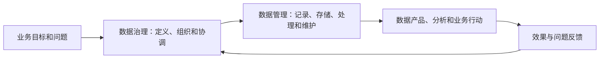

# 008 数据治理与数据管理是什么关系？

## 一句话回答

> 从本书采用的业务价值视角看，数据管理主要负责把数据正确地记录、整理、存储和维护；数据治理则以业务价值为目标，持续决定数据应该如何定义、汇聚、建模、改进和使用，并推动这些要求落实到数据管理活动中。

数据治理与数据管理不是非此即彼，也不能简单理解为谁完全包含谁。本书更关注两者在业务价值链中的分工：数据管理让数据处于可管理、可使用的状态，数据治理让这些数据真正进入业务场景，并随着业务变化持续改进。

## 一、为什么两者容易混淆

在 DAMA-DMBOK 的知识体系中，“数据管理”是一个总称，数据治理是其中一个知识领域，数据架构、数据建模、数据质量、数据集成、元数据等则是其他知识领域。按照这种分类，说“数据治理是数据管理的一部分”没有问题。

但知识领域的分类不等于只有一种理解数据治理的方式。如果把数据治理只理解为制定制度、划分责任和开展监督，就很难解释标准、质量、建模、汇聚等活动如何共同服务业务，也容易让治理停留在文件和检查层面。

本书采用的是业务价值视角：

- 数据管理关注“数据如何被正确管理”；
- 数据治理关注“如何组织各种数据活动，让数据持续为业务增值”。

这不是否定 DAMA-DMBOK，而是选择了不同的观察角度。前者适合组织知识体系，后者更适合解释数据治理为什么开展、如何落地以及怎样衡量成效。

## 二、数据管理是基础，数据治理是价值牵引

可以从以下几个方面理解两者的重心：

| 维度 | 数据管理 | 本书所说的数据治理 |
| --- | --- | --- |
| 核心对象 | 数据及其生命周期 | 数据、业务与组织之间的价值关系 |
| 主要问题 | 数据如何记录、存储、整理、维护和使用？ | 数据服务什么业务目标，如何持续改进？ |
| 工作重心 | 数据对象和具体作业 | 业务场景、跨部门协同和价值闭环 |
| 典型成果 | 数据正确、可找、可用、可维护 | 数据能够支持决策、行动和创新 |
| 变化处理 | 保持数据和系统稳定运行 | 根据业务反馈调整标准、模型、质量和汇聚方式 |

数据管理提供可靠基础。没有正确记录的数据，治理无法产生可信结果；但数据正确地保存在系统中，也不等于已经转化为业务价值。

数据治理的作用，是从业务目标出发，把分散的数据管理活动组织起来，让数据能够被一致理解、关联计算、持续更新并进入业务过程。

## 三、“静态”与“动态”应该如何理解

把数据管理理解为相对静态、把数据治理理解为动态，有助于初步区分两者，但不能把它绝对化。

数据管理也包括数据同步、备份、权限、生命周期和系统运维，本身不是静止的。更准确的说法是：

> 数据管理偏重数据在当前状态下是否正确、有序、可用和可维护；数据治理偏重这些数据是否适应业务目标，并能够根据业务变化持续调整。

业务对象、组织结构、经营规则和分析需求都会改变。治理需要根据这些变化不断修订数据标准、质量要求、模型、汇聚链路和数据产品，因此它天然是一个反馈循环，而不是一次性整理。

## 四、标准、质量、建模和汇聚属于哪一边

这些工作既可以被归入数据管理的专业领域，也可以成为数据治理的重要手段。区别不在于工具或名称，而在于它们是否被组织进业务价值闭环。

| 活动 | 作为数据管理活动 | 作为数据治理手段 |
| --- | --- | --- |
| 数据标准 | 统一字段、编码和格式 | 围绕业务场景统一对象和指标含义，并管理版本 |
| 数据质量 | 检查空值、重复和格式错误 | 根据业务用途确定质量要求，推动源头整改并验证结果 |
| 数据建模 | 设计和维护数据结构 | 统一业务对象及关系，让数据支持分析和复用 |
| 数据汇聚 | 把多个来源的数据搬到一起 | 根据业务目标选择数据，解决关联、鲜活度和责任问题 |

例如，编写一条质量检查规则，是一项数据管理或技术活动；根据经营分析要求确定什么错误必须拦截、由谁整改、整改后是否改善决策，则形成了数据治理闭环。

## 五、案例：项目数据正确，为什么仍然需要治理

某科技服务企业由全国不同大区承接项目。项目金额需要在不同产品线和定制开发之间分配，大区和产品线都需要查看总合同、纯合同、回款和利润等经营指标。

### 1. 项目数据正确记录，是数据管理

销售、项目和财务系统可能已经正确记录了每个项目的基本信息、合同、回款、成本和状态。数据库能够稳定存储，权限、备份和日常维护也没有明显问题。

从单个系统和单笔业务看，数据是正确的。这说明数据管理已经完成了重要工作：业务事实被可靠记录下来。

但这些数据可能仍然无法直接回答：

- 某个大区今天完成了多少合同额和回款？
- 某条产品线在全国范围内的经营表现如何？
- 一个同时涉及多个产品线和定制开发的项目应该怎样分配金额？
- 日常利润估算与财务结算值分别代表什么？

数据“没有记错”，并不意味着能够直接用于跨部门经营分析。

### 2. 让项目数据用于经营分析，是数据治理

要回答这些问题，需要围绕经营目标进一步开展工作：

1. 统一项目、大区、产品线、合同、回款和利润的业务含义；
2. 确定大区、产品线、项目和时间等分析维度与颗粒度；
3. 建立项目金额在产品线和定制开发之间的分配规则；
4. 汇聚销售、项目、财务和产品等不同来源的数据；
5. 设置完整性、一致性、及时性和金额平衡等质量要求；
6. 形成每日更新、可追溯、可复算的指标链路；
7. 让结果进入经营会议、资源配置、回款管理和风险识别。

这些工作不仅在“整理数据”，而是在组织业务、数据和技术团队共同决定数据应该怎样产生价值。

### 3. 经营规则变化以后还要继续治理

新的产品线会出现，大区可能调整，项目和合同会变更，回款可能跨期，成本和利润也会随着结算更新。原来正确的模型和规则，几个月后可能不再适用。

因此，还需要记录规则版本和生效时间，监控数据更新及质量，处理业务反馈，并持续修订模型和指标。这个不断反馈和调整的过程，正是数据治理的动态特征。

## 六、两者如何协同

数据治理不能替代数据管理，数据管理也不会自动产生治理价值。两者之间更合理的关系是：

数据治理确定方向、优先级、责任和业务要求，数据管理把这些要求落实为持续运行的具体活动；数据使用产生的效果和问题，再反馈给治理机制调整下一轮工作。

这也是为什么数据治理不能只由一个数据部门完成。业务部门要定义目标和含义，数据与技术团队要落实模型和链路，管理者要解决跨部门争议，使用者则要持续反馈结果是否真正有用。

## 七、常见误区

### 误区一：数据治理只是数据管理中的制度模块

制度和监督只是治理的一部分。没有标准、质量、模型、汇聚、数据产品和持续运营，制度很难转化为业务价值。

### 误区二：数据管理就是一次性的数据整理

数据管理贯穿数据生命周期，也包含持续的运行维护。它与治理的区别是工作重心，而不是一个绝对静态、一个绝对动态。

### 误区三：数据记录正确就不需要治理

单个系统中的数据正确，只说明业务事实被记录。跨系统关联、统一指标、责任协同和业务使用仍然需要治理。

### 误区四：只要做了标准、质量或建模就是数据治理

孤立的技术活动不一定形成治理。只有这些活动共同服务明确业务目标，并形成使用、反馈和改进闭环，才真正体现治理价值。

## 八、实践检查清单

判断一项工作主要属于数据管理还是已经形成数据治理，可以询问：

1. 它只关注数据是否正确保存，还是还说明了服务哪个业务目标？
2. 是否需要多个业务和技术部门共同作出决定？
3. 标准、质量、模型和汇聚要求是否来自具体使用场景？
4. 数据结果是否进入了业务决策、流程或产品？
5. 是否能够根据使用效果发现问题并调整规则？
6. 是否明确了责任、版本、生效时间和持续运营方式？

## 小结

数据管理把业务事实可靠地记录下来，数据治理则让这些事实能够被跨部门理解、关联、计算和使用，并根据业务变化持续改进。

对于“大区—产品线”经营分析，项目数据正确记录下来是必要的数据管理；让这些数据形成统一、及时、可信的经营指标，并真正用于资源配置和管理行动，才体现了数据治理“让数据为业务增值”的本质。

## 延伸阅读

- [第001问：数据治理的第一性原理是什么？](../01-总则与战略篇/001-数据治理的第一性原理.md)
- [第003问：为什么说“数据治理只有起点，没有终点”？](../01-总则与战略篇/003-数据治理为什么只有起点没有终点.md)
- [第005问：数据治理应该从哪里开始，如何选择首期业务场景？](../01-总则与战略篇/005-数据治理应该从哪里开始.md)
- [第006问：如何制定并分阶段推进数据治理路线图？](../01-总则与战略篇/006-如何制定可落地的数据治理路线图.md)
- [第007问：数据治理的成效和投资回报应该如何衡量？](../01-总则与战略篇/007-数据治理的成效和投资回报如何衡量.md)
- [第009问：数据治理与数据处理是什么关系？](009-数据治理与数据处理.md)
