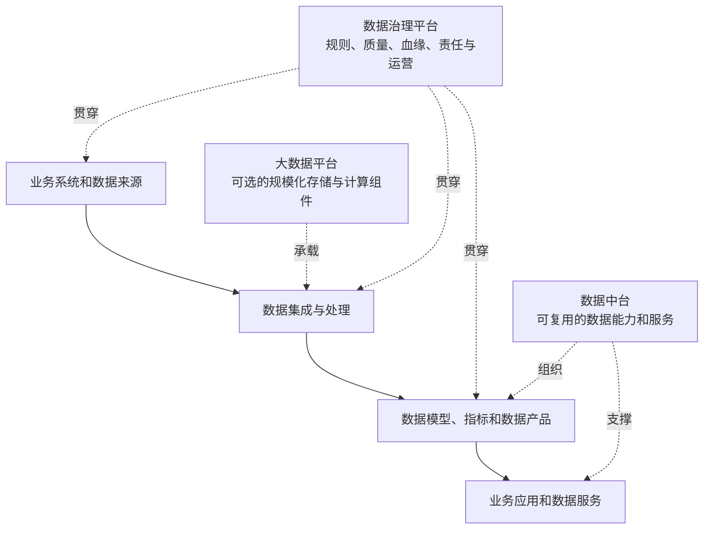

# 012 大数据平台、数据中台和数据治理平台有什么区别？

## 一句话回答

> 大数据平台主要解决海量、多类型或高频数据的规模化存储与计算，是数据中台和数据治理平台可以选用的技术组件；数据中台偏重沉淀和复用数据能力，数据治理平台偏重标准、质量、血缘、责任和规则运营，但在以业务增值为目标的实践中，两者会有明显重叠。

这三个概念经常被当成同一个平台的不同叫法。实际上，它们首先关注的问题不同：大数据平台关注技术规模，数据中台关注能力复用，数据治理平台关注数据规则和持续运营。一个组织可以同时使用三者，也可以根据数据规模和业务需要只建设其中一部分能力。

## 一、大数据平台解决“能不能规模化处理”

大数据平台通常提供分布式存储、批量计算、流式计算、数据采集、任务调度、资源管理和多类型数据处理能力，用来应对传统单机数据库难以承受的数据规模、数据类型或处理频率。

它适合处理：

- 海量交易、日志、传感器或遥感数据；
- 结构化、半结构化、空间、影像、BIM和文档等多种数据；
- 大批量历史计算和高频实时计算并存的场景；
- 多个团队共享存储、计算和调度资源的场景。

但“大数据”不是所有组织的必选项。如果数据量有限、更新周期较长、业务场景较少，关系数据库、数据仓库和常规调度工具可能已经足够。为了体现技术先进而建设大数据平台，往往会增加运维复杂度，却不一定增加业务价值。

因此，大数据平台是数据中台与数据治理平台的可选技术组件之一，核心价值是解决“规模化存储和计算”，而不是自动完成数据治理或数据能力复用。

## 二、数据中台偏重“数据能力复用”

数据中台通常希望把多个业务系统中的数据和模型沉淀为可复用能力，减少每个部门重复取数、重复建模和重复开发。它可能提供：

- 统一的业务对象和数据模型；
- 可复用的指标、标签和算法；
- 面向不同应用的数据服务和接口；
- 数据产品、主题数据集和分析能力；
- 支持多个业务场景的开发和运营机制。

数据中台的关键不只是把数据集中起来，而是让数据能够被多个业务场景方便、稳定地复用。如果同一个客户、地块或项目，每个部门仍然各自定义、各自加工和各自发布，就没有真正形成中台能力。

## 三、数据治理平台偏重“规则、质量与责任运营”

数据治理平台通常承载以下能力：

- 数据标准、业务术语和指标口径管理；
- 元数据、数据目录和数据血缘管理；
- 数据质量规则、问题发现和整改闭环；
- 数据责任、权限、分级分类和审计；
- 数据变更、版本、影响分析和运行监控；
- 对数据资产、数据产品和治理成效的持续评价。

它的重点不是简单生产一个报表，而是让组织知道数据从哪里来、含义是什么、质量如何、谁负责、发生变化后影响什么，以及问题如何得到处理。

## 四、三者不是固定的上下级关系

可以用下面的方式理解它们的关系：

大数据平台更像是可被多个数据能力使用的技术基础；数据中台更像是把数据、模型和服务组织成可复用能力；数据治理平台则贯穿数据来源、加工、产品和使用过程，确保规则、质量、责任和变化能够被管理。

## 五、为什么本书中的数据治理平台会接近数据中台

在一些传统项目中，数据治理平台主要负责目录、标准、质量和血缘，数据中台负责模型、指标、标签和服务，两者边界相对清楚。

但本书强调“让数据为业务增值”。如果治理平台只记录规则和问题，却不帮助组织完成数据汇聚、实体建模、维度建模、指标计算和数据产品发布，治理成果很难真正进入业务。

因此，本书中的数据治理平台会包含一部分通常被称为数据中台的能力，例如：

- 把治理标准落实为可运行的数据模型；
- 把质量规则落实到持续的数据链路；
- 把业务口径落实为可复用的指标和语义层；
- 把治理后的数据组织成面向场景的数据产品和服务；
- 根据业务使用反馈调整规则、模型和数据产品。

这并不意味着两者完全等同，而是说明边界会随组织目标和产品设计发生重叠。更可靠的区分方式不是看产品名称，而是看它主要对什么结果负责：

| 主要责任 | 更偏向的概念 |
| --- | --- |
| 让海量数据能够稳定存储和计算 | 大数据平台 |
| 让数据模型、指标、标签和服务被多个场景复用 | 数据中台 |
| 让定义、质量、责任、血缘、权限和变更可持续运营 | 数据治理平台 |
| 让治理后的数据真正形成业务成果 | 价值导向的数据治理与数据中台共同承担 |

## 六、案例：自然资源全生命周期数据平台

省级或部委级自然资源项目需要整合土地调查、确权、规划、供地、审批、建设和利用评价数据，支撑低效用地识别、项目监管和规划决策。

### 1. 什么时候需要大数据平台

在省级或部委级项目中，矢量数据规模可能达到千万级甚至更高。开展地块叠加、空间关联、拓扑分析和多源比对时，数据量大、计算密度高，单机数据库或单机程序往往难以在可接受时间内完成，必须引入 Spark 等分布式计算框架，将数据和计算任务分布到多个节点并行执行。

这并不意味着所有自然资源项目都必须建设完整的大数据平台。数据规模、空间计算复杂度、任务时限和并发要求较低时，关系数据库和数据仓库仍然可以满足需求；是否引入分布式存储和计算，应由实际工作负载决定。

### 2. 数据中台沉淀什么

可以沉淀统一地块、项目、权属、规划和审批等业务对象，形成低效用地指标、项目进度指标、空间分析服务和可供多个部门调用的数据产品。

### 3. 数据治理平台保证什么

需要持续管理地块标识、权属和利用类型的权威来源，记录空间质量、时间版本、指标口径、数据血缘和责任主体，并在权属或利用类型变化后重新计算受影响的识别结果。

三类能力可以部署在同一套系统中，也可以由不同系统提供。关键是职责清楚、链路可追溯、业务结果可验证，而不是一定要分别购买三个名为“大数据平台”“数据中台”和“治理平台”的产品。

## 七、常见误区

### 误区一：数据量大就必须建设大数据平台

平台选型应由数据规模、类型、处理频率、并发和运维能力共同决定。小规模、低频率场景不必为了概念先进而引入复杂架构。

### 误区二：上了大数据平台就完成了数据治理

大数据平台解决存储和计算问题，不会自动统一业务口径、分配责任或推动质量整改。

### 误区三：数据中台就是把数据集中到一个库

集中存储只是基础。没有可复用的模型、指标、服务和运营机制，数据仍然会被各部门重复加工。

### 误区四：治理平台只能做目录和规则

如果治理不参与标准落地、质量运行、模型建设、指标计算和数据产品服务，就很难实现“让数据为业务增值”。

### 误区五：三个平台必须由三个独立产品组成

平台边界可以按组织和技术条件组合。应先明确业务目标和责任，再决定哪些能力需要独立建设、哪些可以共享或集成。

## 八、实践检查清单

1. 当前真正需要解决的是规模化存储计算、能力复用，还是规则和质量运营？
2. 数据规模、类型、更新频率和并发是否足以支撑大数据平台建设？
3. 是否沉淀了可复用的对象、模型、指标、标签或数据服务？
4. 是否有统一标准、质量规则、血缘、责任和变更机制？
5. 数据平台能力是否进入了真实业务场景？
6. 大数据平台是否只是技术底座，而没有被误认为治理能力？
7. 数据中台和治理平台之间的职责、数据边界和运营责任是否清楚？
8. 是否根据业务价值而不是产品名称决定平台组合？

## 结语

大数据平台解决规模化存储和计算，是可选的技术组件；数据中台沉淀可复用的数据能力；数据治理平台运营标准、质量、责任、血缘和规则。

在以业务增值为目标的数据治理实践中，治理平台往往会向数据中台延伸，因为标准、质量和模型只有落实为数据产品、指标和服务，才能真正被业务使用。三者可以有边界，也可以有重叠，但不能互相替代，更不能用平台名称代替业务责任和治理成效。

## 延伸阅读

- 第006问：如何制定并分阶段推进一份可落地的数据治理路线图？
- 第010问：数据治理与数据资产管理是什么关系？
- 第011问：数据治理与数据库、数据仓库是什么关系？
- 第013问：业务建模、行业数据模型与数据治理是什么关系？
- 第077问：什么是计算引擎，为什么数据平台可能需要多种计算引擎？
- 第078问：数据湖和数据仓库是什么关系？
- 第079问：什么是湖仓一体化，它解决了哪些问题？
