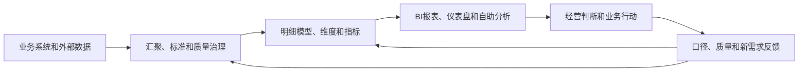

# 014 数据治理和 BI（商业智能）是什么关系？

## 一句话回答

> BI负责把数据分析和呈现给业务人员，是数据治理成果最典型、最容易被感知的应用之一；数据治理则负责让BI背后的数据具有统一口径、可靠质量、清晰血缘和持续更新能力，并根据BI使用反馈继续改进数据。

BI和数据治理不是两个互相替代的系统。BI解决“如何看数据、分析数据和发现问题”，数据治理解决“这些数据从哪里来、含义是否一致、是否可信、谁负责，以及能否长期稳定使用”。

## 一、什么是 BI

BI是Business Intelligence的缩写，通常译为商业智能。它通过查询、报表、仪表盘、联机分析和可视化等方式，帮助业务人员理解经营状况、比较变化、发现异常并支持决策。

常见BI应用包括：

- 销售、收入、回款和利润分析；
- 产品、渠道、区域和客户比较；
- 预算执行和成本分析；
- 库存、供应链和生产运行监控；
- 自然资源、城市运行和公共服务分析；
- 管理驾驶舱和自助式分析。

BI的价值不只是画图。它应当帮助使用者回答业务问题，并进一步采取行动。

## 二、BI是数据治理的典型应用

数据治理形成的标准、模型、质量、汇聚、指标和数据产品，需要进入业务场景才能产生价值。BI报表和分析是最常见的落地方式之一。

一条典型链路是：

在这条链路中，BI是治理成果面向业务的展示和使用窗口。业务人员通过BI使用数据，才会发现某些口径是否难以理解、数据是否过时、指标是否缺失，以及模型能否支持新的分析角度。

因此，BI既消费治理成果，也为治理提供反馈。

## 三、为什么很多BI问题不在BI工具

企业经常遇到以下现象：

- 不同报表中的同名指标数值不一致；
- 财务、销售和业务部门各自维护一套数字；
- 报表更新缓慢，需要人工导出和拼表；
- 数字异常时无法追溯到源系统和明细；
- 更换BI工具后，原来的口径和质量问题仍然存在。

这些问题通常不是图表组件或可视化软件造成的，而是上游治理基础不足：

| BI表现 | 可能的治理根因 |
| --- | --- |
| 同名指标结果不同 | 指标定义、统计范围或时间口径不一致 |
| 部门数字互相矛盾 | 权威来源、编码映射和责任边界不清 |
| 报表长期滞后 | 数据汇聚、调度和鲜活度要求不明确 |
| 无法解释异常 | 明细、血缘、版本和质量记录缺失 |
| 新需求反复开发 | 模型、维度和指标缺少复用能力 |

BI可以呈现问题，但不能独自解决数据定义、源头质量和跨部门责任问题。

## 四、数据治理为BI提供什么

### 1. 统一业务口径

数据治理明确指标名称、含义、计算公式、统计范围、时间口径、维度和适用场景，避免同名不同义和同义不同名。

### 2. 可复用的数据模型

通过实体建模和维度建模，把客户、产品、渠道、区域、项目、时间等对象统一组织，使多张报表可以复用同一明细和维度，而不是各自加工。

### 3. 可验证的数据质量

治理将业务用途转换为完整性、准确性、一致性和及时性要求，监控异常并推动责任部门整改。

### 4. 清晰的数据血缘

使用者可以从图表和指标追溯到汇总规则、明细数据和源系统，知道数字为何变化以及受哪个上游影响。

### 5. 稳定的更新链路

通过持续汇聚、调度、运行监控和失败恢复，让BI数据按约定周期更新，而不是每次开会前临时制作。

### 6. 权限和使用边界

不同用户可以查看哪些明细、汇总和敏感数据，需要由治理规则和权限体系确定，不能只靠报表页面隐藏字段。

## 五、BI如何反过来推动数据治理

BI是业务人员高频接触数据的入口，因此也是发现治理问题的重要渠道。

用户可能在分析中发现：

- 某个指标定义与实际经营方式不一致；
- 某类订单或项目无法正确归入渠道和区域；
- 日报数据过时，无法支持当天调度；
- 汇总数字正确，但缺少可解释的明细；
- 现有模型不能支持新产品或新组织结构。

这些问题应进入治理闭环：记录需求和问题，由业务负责人确认口径，调整数据标准、模型、质量规则或汇聚链路，重新计算结果，再通过BI验证是否解决。

如果用户只能在报表中临时写公式、上传Excel或手工修正数据，问题就会被留在BI末端，组织仍然无法形成统一的数据能力。

## 六、案例：集团多渠道销售分析

某集团通过直营网点、电商、经销商和区域公司销售产品。各渠道系统都能生成自己的销售报表，但管理层希望按照产品、渠道、区域和时间统一查看销售额、销量、退货额和毛利。

### 1. 仅建设BI会发生什么

技术团队可以把各系统数据导入BI工具，快速制作仪表盘。但如果各渠道分别按下单、发货、签收或收入确认统计销售额，对退货、优惠、税费和跨区销售的处理也不同，仪表盘只能把矛盾的数字展示得更直观。

### 2. 治理成果如何进入BI

数据治理需要先统一产品、渠道、区域和时间维度，确认销售事件和指标口径，建立跨系统映射、质量检查、每日更新和异常核对机制，再把统一的明细模型和指标提供给BI。

此时，BI可以：

- 展示集团整体和各渠道的销售趋势；
- 从汇总指标下钻到产品、区域和订单明细；
- 识别销量、退货和毛利异常；
- 支持渠道评价、库存调配和促销复盘。

BI报表就是数据治理成果的一种典型业务应用。治理的价值通过报表被看见，但价值最终体现在管理者是否据此采取了更及时、更准确的行动。

## 七、BI、指标平台和数据治理平台如何分工

| 能力 | 主要职责 |
| --- | --- |
| BI工具 | 查询、分析、可视化、交互、下钻和报表发布 |
| 指标或语义层 | 统一指标定义、维度、计算逻辑和查询接口 |
| 数据仓库或分析平台 | 保存明细和汇总数据，执行关联、聚合和计算 |
| 数据治理平台 | 管理标准、质量、血缘、责任、权限、版本和问题闭环 |

这些能力可能由不同产品提供，也可能集成在同一平台中。区分它们的目的不是划定不能跨越的产品边界，而是确保每项责任有人承担，避免把所有上游问题都推给BI开发人员。

## 八、常见误区

### 误区一：做了BI报表就完成了数据治理

报表能够展示数据，但不能自动统一口径、修复源头质量、建立责任和持续运营机制。

### 误区二：报表数字不对就是BI开发错误

错误可能来自源数据、编码映射、指标口径、模型关系、更新链路或报表逻辑，需要通过血缘定位，而不是只修改前端公式。

### 误区三：治理完成以后BI不再变化

业务、组织和指标持续变化，BI需求和治理模型也需要版本管理和迭代。

### 误区四：BI只是数据治理的展示界面

BI不仅展示成果，也是业务使用和反馈入口。没有真实使用，治理团队很难判断数据是否真正有价值。

## 九、实践检查清单

1. BI中的核心指标是否有统一定义和业务负责人？
2. 多张报表是否复用相同的明细、维度和指标？
3. 指标能否追溯到加工规则、明细和权威源系统？
4. 数据更新周期是否满足实际决策需要？
5. 质量问题是否有监控、责任人和整改闭环？
6. 用户是否能从汇总结果下钻并解释异常？
7. BI用户的权限是否与数据分级和使用边界一致？
8. BI使用反馈是否能够推动标准、模型和质量改进？
9. 是否衡量报表使用率和对业务行动的实际支持？

## 结语

BI负责让业务人员看见、分析和使用数据，是数据治理成果最典型的应用之一。数据治理则负责让BI背后的数据统一、可信、及时、可追溯并持续运行。

好的BI不仅展示治理成果，也把业务使用中的问题和需求反馈给治理体系。两者形成闭环后，报表才不会停留在“展示数字”，而能真正支持业务判断和行动。

## 延伸阅读

- 第005问：数据治理应该从哪里开始，如何选择首期业务场景？
- 第007问：数据治理的成效和投资回报应该如何衡量？
- 第011问：数据治理与数据库、数据仓库是什么关系？
- 第015问：数据治理与数据大屏是什么关系？
- 第023问：维度建模在数据治理中发挥什么作用？
- 第046问：语义层和指标平台如何解决“同名不同义、同义不同名”？
