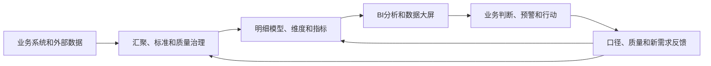

# 014 数据治理与 BI（商业智能）、数据大屏是什么关系？

## 一句话回答

> BI和数据大屏都是数据治理成果面向业务的典型应用：BI偏重查询、分析、比较和下钻，数据大屏偏重态势总览、监测预警和管理调度；数据治理则负责让它们背后的数据口径统一、质量可靠、更新及时、来源可追溯，并推动分析和预警转化为业务行动。

BI、数据大屏和数据治理不是互相替代的系统。BI和大屏解决“如何看数据、分析数据和发现问题”，数据治理解决“这些数据从哪里来、含义是否一致、是否可信、谁负责，以及能否长期稳定使用”。

报表和大屏可以让治理成果被看见，但只有使用者据此作出判断、采取行动，并把实际结果反馈到治理体系中，数据才真正为业务增值。

## 一、什么是 BI

BI是Business Intelligence的缩写，通常译为商业智能。它通过查询、报表、仪表盘、联机分析和可视化等方式，帮助业务人员理解经营状况、比较变化、发现异常并支持决策。

常见BI应用包括：

- 销售、收入、回款和利润分析；
- 产品、渠道、区域和客户比较；
- 预算执行和成本分析；
- 库存、供应链和生产运行分析；
- 自然资源、城市运行和公共服务分析；
- 管理驾驶舱和自助式分析。

BI的价值不只是制作报表和图表。它应当帮助使用者回答业务问题，例如“哪个区域的销售额下降了”“哪些项目出现了异常”“变化是由什么原因造成的”，并为后续行动提供依据。

## 二、数据大屏是 BI 的一种特殊应用形态

从广义上看，数据大屏可以视为BI的一种展示和应用形态。它通常面向会议室、指挥中心、监控中心或管理驾驶舱，把一个主题下的核心指标、空间分布、变化趋势、异常预警和任务进展集中在有限的屏幕空间中。

与一般BI分析相比，数据大屏更强调让管理者在较短时间内看懂全局：现在发生了什么、哪里出现异常、哪些事项需要重点关注。

| 对比维度 | 一般BI分析 | 数据大屏 |
| --- | --- | --- |
| 主要使用者 | 业务人员、分析人员、管理者 | 管理者、值班人员、指挥调度人员 |
| 主要用途 | 查询、比较、下钻、归因和自助分析 | 总览态势、监测异常、预警和调度 |
| 信息组织 | 围绕多个分析问题灵活展开 | 围绕固定管理主题集中呈现 |
| 交互特点 | 交互较丰富，强调探索和分析 | 相对固定，强调快速识别和联动 |
| 使用环境 | 个人电脑和移动终端为主 | 大屏幕、会议室、指挥中心，也可适配普通终端 |

这种区分不是绝对的。现代大屏也可以筛选和下钻，BI也可以建设管理驾驶舱。区分二者的目的，是明确应用重点，而不是划定产品边界。

大屏尤其不能简单理解为“把很多图表放到一个页面上”。它应当围绕一个明确的管理主题组织信息，帮助使用者从态势判断进一步进入业务行动。

## 三、BI和数据大屏是数据治理的典型应用

数据治理形成的标准、模型、质量、汇聚、指标和数据产品，需要进入业务场景才能产生价值。BI报表、分析和数据大屏，正是治理成果最常见、最容易被感知的应用方式。

一条典型链路是：

在这条链路中，BI和数据大屏是治理成果面向业务的使用窗口。业务人员在实际使用中，会发现某些口径是否难以理解、数据是否过时、指标是否缺失，以及现有模型能否支持新的分析和管理要求。

因此，它们既消费治理成果，也检验治理成果，并为持续治理提供反馈。

## 四、为什么“报表和大屏做出来了”不等于治理成功

BI和大屏处在数据链路的末端。它们可以把上游数据集中呈现出来，也会把上游问题集中暴露出来，但不能自动解决这些问题。

实践中经常出现以下情况：

- 同一个指标在不同报表、大屏和汇报材料中数值不同；
- 财务、销售和业务部门各自维护一套数字；
- 报表更新缓慢，需要人工导出、拼表和核对；
- 页面显示“实时更新”，实际源系统几天没有同步；
- 指标突然变化，却无法追溯到明细、规则和来源；
- 大屏展示大量红黄绿预警，却没有明确的触发规则和处置流程；
- 大屏只在参观或汇报时使用，日常管理仍然依靠Excel和人工沟通。

这些问题通常不是图表组件或可视化软件造成的，而是上游治理基础不足：指标定义不一致、权威来源不清、对象编码无法关联、汇聚链路不稳定、质量问题无人负责，或者展示结果没有接入业务流程。

更换BI工具、重新设计页面，通常不能从根本上解决这些问题。评价BI和大屏是否有价值，也不应只看图表数量、视觉效果和刷新频率，而应看数据是否可信、异常能否解释，以及它们是否推动了更及时、更准确的业务行动。

## 五、数据治理为 BI 和数据大屏提供什么

### 1. 统一的指标和业务口径

治理需要明确指标名称、业务含义、计算公式、统计范围、时间口径、空间范围、维度、版本和责任人，避免同名不同义和同义不同名。

### 2. 可复用的数据模型

通过业务对象建模和维度建模，把客户、产品、渠道、区域、项目、地块和时间等对象统一组织，使不同报表和大屏能够复用相同的明细、维度和指标，而不是各自加工一套数据。

### 3. 可验证的数据质量

治理将业务用途转换为完整性、准确性、一致性和及时性要求，持续监控异常并推动责任部门整改。必要时，应用还应向使用者说明数据更新时间、覆盖范围和可信状态。

### 4. 清晰的数据血缘

使用者应能从图表、指标或地图状态追溯到汇总规则、明细数据和权威源系统，知道数字为什么变化、受到哪个上游影响以及应由谁核实。

### 5. 稳定而适度的更新链路

通过持续汇聚、调度、运行监控和失败恢复，让数据按约定周期更新，而不是每次开会前临时制作。

更新频率应由业务行动决定。应急调度可能需要分钟级更新，月度经营分析或年度资源评价则未必需要实时。盲目追求“所有数据实时”，会显著增加成本，却不一定增加业务价值。

### 6. 权限和使用边界

不同用户可以查看哪些明细、汇总和敏感数据，需要由数据分级分类和权限规则确定。数据大屏出现在会议室、展厅等多人环境时，更要考虑观看者范围、汇总展示和脱敏要求。

### 7. 持续运行和问题闭环

BI和大屏依赖源系统、汇聚任务、数据模型、指标计算和展示应用。治理需要监控整条链路，明确故障和数据问题的责任，并把使用者反馈纳入持续改进。

## 六、案例一：集团多渠道销售分析

某集团通过直营网点、电商、经销商和区域公司销售产品。各渠道系统都能生成自己的销售报表，但管理层希望按照产品、渠道、区域和时间统一查看销售额、销量、退货额和毛利。

### 1. 仅建设BI会发生什么

技术团队可以把各系统数据导入BI工具，快速制作仪表盘。但如果各渠道分别按下单、发货、签收或收入确认统计销售额，对退货、优惠、税费和跨区销售的处理也不同，仪表盘只能把矛盾的数字展示得更加直观。

### 2. 治理成果如何进入BI

数据治理需要先统一产品、渠道、区域和时间维度，确认销售事件和指标口径，建立跨系统映射、质量检查、每日更新和异常核对机制，再把统一的明细模型和指标提供给BI。

此时，BI可以：

- 展示集团整体和各渠道的销售趋势；
- 从汇总指标下钻到产品、区域和订单明细；
- 识别销量、退货和毛利异常；
- 支持渠道评价、库存调配和促销复盘。

治理的价值通过BI被看见，但最终仍要体现在管理者能否据此采取更及时、更准确的行动。

## 七、案例二：低效用地识别与盘活大屏

某地希望通过大屏展示低效用地的总体规模、空间分布、变化趋势、处置方式和盘活进度，为调查核实、规划调整和项目开发提供依据。

这个场景需要关联土地调查、规划用途、不动产权属、供地合同、建设项目和现场核查等多类数据。若某个地块发生权属、边界或利用类型变更，不同系统的更新时间和状态定义又不一致，简单把数据叠加到地图上，就可能继续把已经盘活或边界已经变化的土地列为待处置对象。

数据治理需要统一地块、项目和权利主体的标识与关联关系，区分规划用途、现状用途和实际利用状态，保留权属、边界和用途的变化过程，统一空间参考和叠加规则，并明确识别指标、更新频率、权威来源和责任部门。

在此基础上，大屏才能可靠地展示全域态势、重点地块和异常清单，并把疑似低效地块推送给业务人员核查。核查、认定和处置结果还要返回治理体系，用于更新地块状态和改进识别规则。

这个案例说明，大屏的价值不在于“把地图画出来”，而在于更快发现需要核查的对象，避免依据过时状态作出判断，并推动盘活任务落实。

## 八、BI和数据大屏如何反过来推动治理

把多个系统、部门和业务环节的数据放到同一分析视图中，往往更容易发现治理问题，例如：

- 汇总指标与明细或地图统计不一致；
- 某个地区或业务系统长期没有数据更新；
- 同一对象同时处于互相矛盾的状态；
- 某类数据无法正确归入统一的产品、区域或项目维度；
- 某项预警反复出现，却一直依靠人工解释；
- 现有模型不能支持新的产品、组织结构或管理要求。

这些问题不应通过在报表和大屏中临时改公式、改数字或隐藏异常来解决。它们应进入治理闭环：记录问题，追溯数据来源、标准、模型和指标规则，由业务负责人确认口径和责任，调整治理链路，重新计算结果，再通过应用验证是否真正解决。

应用的实际使用情况也能检验治理价值。如果某张报表长期无人查看、某类预警从不触发处置，或者管理者仍需另行索要Excel，说明当前数据产品没有真正满足业务需要。治理团队应据此精简无效内容，补充必要数据，并调整口径和更新频率。

## 九、BI、数据大屏与相关平台如何分工

| 能力 | 主要职责 |
| --- | --- |
| BI工具 | 查询、比较、下钻、归因、自助分析和报表发布 |
| 数据大屏 | 集中展示态势、变化、异常、预警和重点任务 |
| 指标或语义层 | 统一指标定义、维度、计算逻辑和查询语义 |
| 数据仓库或分析平台 | 保存明细、历史和汇总数据，承载关联与计算 |
| 数据治理平台 | 管理标准、质量、血缘、责任、权限、版本和问题闭环 |
| 业务系统 | 记录业务事实，承接核查、审批、处置和反馈等业务动作 |

这些能力可以由不同产品提供，也可以集成在同一平台中。区分它们的目的不是划定不能跨越的产品边界，而是确保每项责任都有人承担，避免把所有上游问题推给BI或大屏开发人员。

大屏适合提示异常和聚合态势，却不一定适合承载复杂的业务办理。发现问题以后，通常还需要进入BI查看明细，或者回到业务系统完成核查、审批和处置。不能为了追求“一个屏幕解决所有问题”，把所有功能都堆进大屏。

## 十、常见误区

### 误区一：做了报表或大屏就完成了数据治理

它们能够展示数据，但不能自动统一口径、修复源头质量、建立责任和持续运营机制。

### 误区二：数字不对就是BI或大屏开发错误

问题可能来自源数据、对象映射、指标口径、模型关系、更新链路或展示逻辑，需要通过血缘定位，不能只修改末端公式。

### 误区三：大屏越炫，数据治理水平越高

视觉设计会影响信息传达效率，但不能代替数据质量、及时更新、异常解释和业务闭环。

### 误区四：所有数据都必须实时

实时性应与业务响应要求匹配。没有相应的决策和处置机制时，提高刷新频率只会增加系统成本。

### 误区五：红黄绿颜色就是预警机制

颜色只是展示方式。真正的预警还需要触发规则、数据可信度、责任人、处理时限、处置流程和结果反馈。

### 误区六：BI和大屏上线以后就不再变化

业务、组织、指标和管理重点会持续变化。应用需要根据使用反馈不断调整，其背后的标准、模型、质量和数据链路也需要持续运营。

## 十一、实践检查清单

1. BI和大屏是否围绕明确的业务问题和使用者建设？
2. 核心指标是否有统一口径、权威来源和业务负责人？
3. 多个应用是否复用相同的明细、维度和指标？
4. 数据更新时间、统计截止时间和适用范围是否明确？
5. 更新频率是否与实际判断和处置时限匹配？
6. 指标和对象状态能否追溯到规则、明细和源系统？
7. 使用者能否从汇总结果下钻并解释异常？
8. 预警是否有责任人、处理流程、时限和结果反馈？
9. 质量问题和链路故障是否能被及时发现，而不是静默展示旧数据？
10. 用户权限和大屏展示是否符合数据分级、脱敏和使用边界？
11. 使用反馈是否能够推动标准、模型、指标和质量改进？
12. 是否衡量实际使用率及其对业务行动的支持效果？

## 结语

BI和数据大屏都是数据治理成果面向业务的重要窗口。BI更适合深入分析和解释问题，数据大屏更适合总览态势、监测异常和支持调度。它们能够让治理成果被看见，也会暴露数据口径、质量、鲜活度和责任机制中的不足。

数据治理则要保证这些应用背后的数据统一、可信、及时、可追溯，并推动分析和预警进入业务流程。只有形成“数据—判断—行动—反馈—改进”的闭环，报表和大屏才不会停留在展示层，而能真正帮助数据为业务增值。

## 延伸阅读

- 第004问：数据治理的成熟度如何评估？
- 第005问：数据治理应该从哪里开始，如何选择首期业务场景？
- 第007问：数据治理的成效和投资回报应该如何衡量？
- 第011问：数据治理与数据库、数据仓库是什么关系？
- 第015问：什么是数据编织（Data Fabric）？
- 第017问：基于数据的应用场景与传统应用系统是什么关系？
- 第023问：维度建模在数据治理中发挥什么作用？
- 第046问：语义层和指标平台如何解决“同名不同义、同义不同名”？
