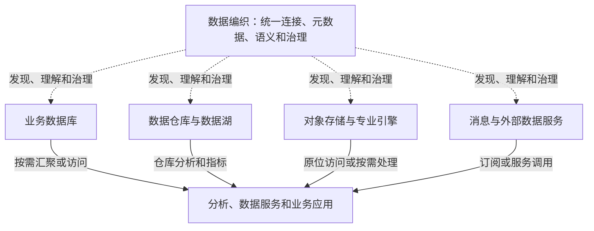

# 015 什么是数据编织（Data Fabric）？

## 一句话回答

> 数据编织是一种面向分布式、异构数据环境的架构理念和能力体系。它不再要求所有数据必须先集中到数据仓库才能治理和使用，而是通过统一连接、元数据、语义、治理规则和自动化能力，把分散在不同系统中的数据组织成一个逻辑统一的数据网络；数据是否物理汇聚、逻辑汇聚或两者结合，则根据具体业务场景决定。

数据编织不是用另一种平台取代数据仓库，也不是主张所有数据都留在原处。它真正改变的是治理和使用数据的前提：从“先把数据搬到一个中心，再统一治理和分析”，转向“先让分布式数据能够被统一发现、理解、访问和治理，再按业务需要选择最合适的处理方式”。

数据仓库仍然适合承载需要稳定口径、历史数据和高性能计算的分析任务，也可以成为数据编织中的重要节点。

数据治理让业务增值的一个重要方面，是让原本分散在不同业务系统中的数据发生关联。例如，把客户、合同、项目、回款和售后记录关联起来，才能形成客户全生命周期视图。要建立这种关联，首先必须能够访问对应的数据，并且理解它们分别代表什么、如何匹配以及是否足够可靠。

访问和关联数据有两种基本方式：

- **物理汇聚**：把源系统中的数据复制、同步或加工后，实际存储到数据仓库、数据湖或其他集中存储中，再在那里完成关联和计算；
- **逻辑汇聚**：数据仍保留在各自的数据库、文件系统或专业引擎中，通过统一连接、元数据、语义映射、联邦查询、数据服务等方式，在访问或计算时形成跨源的关联视图。

逻辑汇聚不是简单建立一个目录链接，也不是完全不做计算。跨源关联、标准转换和指标计算仍然需要发生，只是计算结果可以在查询层、服务层或专门的计算引擎中生成，不必把所有原始数据先复制到同一个仓库。实际项目通常会将两种方式结合起来：高频、稳定和需要历史快照的数据物理汇聚，低频、实时或不宜复制的数据逻辑汇聚。

## 一、为什么会出现数据编织

传统企业的数据环境通常从少数业务数据库逐步发展而来。为了开展跨系统分析，组织把客户、订单、合同、财务等数据抽取到数据仓库，在仓库中进行清洗、标准化、建模和指标计算，再提供给报表和分析应用。

这种模式解决了业务数据库不适合复杂分析的问题，至今仍然非常重要。但随着业务发展，数据可能分散在：

- 不同部门建设的业务系统和数据库；
- 企业数据中心、私有云和多个公有云；
- 数据仓库、数据湖、对象存储和大数据平台；
- 文件系统、消息队列、物联网平台和外部数据服务；
- GIS、BIM、图数据库、文档库等专业数据引擎；
- 合作伙伴或行业平台提供的外部数据空间。

与此同时，业务需求的变化速度也在加快。一个新的客户分析、风险识别或智能应用，可能临时需要组合多个内部系统和外部服务中的数据。如果每次都要先把所有数据复制到中心仓库、完成一套新的模型和加工链路，数据交付周期就会越来越长。

更重要的是，以数据仓库为中心的治理容易形成一个边界：进入仓库的数据有目录、标准、质量和血缘，没有进入仓库的数据仍然难以发现和理解。数据仓库可能治理得很好，组织的全部数据却仍然处于分散状态。

数据编织正是为了应对这种分布式、异构并持续变化的数据环境。

## 二、数据编织到底是什么

数据编织可以理解为覆盖不同数据位置、数据类型和技术引擎的一层统一数据能力。它并不消除底层差异，而是通过一致的方法描述和连接这些差异，让使用者可以：

- 知道组织有哪些数据、位于哪里；
- 理解数据的业务含义、结构、质量和鲜活度；
- 找到数据之间的关系和加工链路；
- 根据权限以合适的方式访问和组合数据；
- 将治理规则落实到数据产生、加工和使用的全过程；
- 根据运行状态和使用反馈持续改进数据链路。

这里“编织”的不只是数据连接，还包括：

- 数据与业务术语、指标和业务对象之间的语义关系；
- 数据源、加工任务、数据产品和应用之间的血缘关系；
- 数据与质量规则、责任人、权限和使用政策之间的治理关系；
- 不同存储、计算和服务能力之间的协作关系。

如果一个平台只是连接了很多数据库，却不能说明数据含义、判断质量、执行权限和支持业务使用，就只是连接工具，还不能称为完整的数据编织。

## 三、传统数据仓库中心模式：以物理汇聚为主

需要先说明，数据仓库并不天然意味着“数据集中以后才开始治理”。成熟的数据仓库建设同样会在源头明确标准、责任和质量。本问所比较的，是实践中常见的一种实施模式：把数据仓库作为统一治理和分析的中心，大部分跨系统数据需要先进入仓库，才能被集中建模和使用。

其典型路径是先把多个业务系统的数据采集到中心位置，再进行统一建模和分析。这是一种以物理汇聚为主的模式：数据不仅在逻辑上被关联，而且已经复制并存储在数据仓库中。

在这条链路中，物理汇聚使数据获得了统一的存储位置，便于集中关联、历史保存和性能优化。但它也意味着数据复制、同步、分层、质量校验和存储成本都需要被持续管理。

这种模式的优势非常明确：

- 分析负载与业务系统分离，不影响日常交易；
- 数据经过统一加工，更容易形成稳定口径；
- 可以保存历史状态和变化过程；
- 集中存储有利于关联、聚合和查询性能优化；
- 权限、质量和运行管理相对集中。

对于数据源相对稳定、分析主题明确、历史分析和指标计算较多的组织，这种模式通常简单、可靠而且经济。

但当数据高度分散、类型多样、变化频繁时，它也可能遇到限制：

- 每增加一个数据源，都要新建采集、转换和落库链路；
- 数据只有进入仓库以后才容易被发现和治理，治理起点偏晚；
- 为一个临时或低频需求复制全部数据，成本可能高于收益；
- 实时数据和外部服务经过多次搬运后，时效性可能下降；
- GIS、影像、文档、图数据等可能不适合全部装入同一种仓库；
- 中心团队逐一承接数据接入和建模需求，容易成为交付瓶颈；
- 数据仓库自身也可能成为新的数据孤岛。

这些问题不是数据仓库设计错误，而是仅依靠一个物理中心难以覆盖整个分布式数据环境。

## 四、数据编织：物理汇聚与逻辑汇聚并存

数据编织把统一治理的边界从数据仓库内部扩展到数据所在的整个环境。数据即使仍保留在业务数据库、对象存储、数据湖或专业引擎中，也可以被统一编目、描述、关联、评价质量、管理权限和追踪使用情况。

### 1. 物理汇聚：把数据搬到适合治理和分析的位置

物理汇聚包括数据复制、同步、抽取、转换、装载和物化等方式。它可以把多个来源的数据保存到仓库或数据湖中，形成统一的明细、历史和汇总层。物理汇聚适合需要高频复用、复杂计算、统一快照和稳定性能的场景，但要承担数据副本、更新延迟、存储成本和链路维护责任。

### 2. 逻辑汇聚：在访问和计算时形成统一视图

逻辑汇聚不要求所有数据先复制到中心存储，而是通过统一的资源发现、语义映射、权限校验和查询或服务编排，在使用时把多个来源组织成一个业务可理解的整体。例如，客户基本信息可以来自CRM，合同金额来自数据仓库，实时信用状态来自外部服务，应用通过统一客户标识和访问规则形成客户风险视图。

逻辑汇聚的前提不是“数据放在哪里都无所谓”，而是数据的位置、含义、质量、鲜活度和访问边界都已经被治理和描述。否则，查询虽然可以跨源执行，结果仍可能因为编码不一致、更新时间不同或责任不清而无法用于业务判断。

根据业务场景，数据可以采用不同的使用方式：

| 使用方式 | 适合场景 | 需要注意的问题 |
| --- | --- | --- |
| 汇聚到数据仓库或数据湖 | 稳定指标、历史分析、大规模关联和高频复用 | 数据复制、更新时延和加工链路维护 |
| 联邦查询或数据虚拟化 | 临时分析、跨源探索、不宜复制的数据 | 源系统性能、跨源查询效率和结果一致性 |
| 数据服务或API调用 | 已有稳定业务能力、外部数据和实时查询 | 服务可用性、接口版本和调用权限 |
| 流式订阅 | 高频事件、监测预警和实时联动 | 事件顺序、重复处理、时钟和状态一致性 |
| 缓存或局部复制 | 高频读取、低延迟访问和源系统保护 | 缓存失效、版本和鲜活度管理 |

因此，数据编织并不是“不搬数据”，而是取消“所有数据必须先搬到同一个地方”这一前提。是否物理汇聚、逻辑汇聚，还是先逻辑关联再将结果物化，应该由业务用途、查询性能、历史要求、源系统承载能力、数据安全和建设成本共同决定。

两种模式的区别可以概括为：

| 对比维度 | 以数据仓库为中心的常见模式 | 数据编织模式 |
| --- | --- | --- |
| 基本路径 | 数据先物理集中，再统一加工和使用 | 先建立逻辑统一，再按场景选择物理汇聚或原位访问 |
| 统一基础 | 统一存储和仓库模型 | 统一连接、元数据、语义和治理规则 |
| 治理范围 | 容易聚焦已经进入仓库的数据 | 覆盖源系统、仓库、数据湖和外部服务 |
| 数据移动 | 通常需要复制和落库 | 不强制复制，必要时仍然汇聚、缓存或物化 |
| 技术环境 | 更适合相对稳定、集中分析的环境 | 更适合分布式、异构和持续变化的环境 |
| 主要风险 | 中心仓库成为交付瓶颈或新的孤岛 | 连接范围扩大，但语义、责任和治理深度不足 |

最核心的变化是：**物理集中不再是逻辑统一的必要条件，数据治理也不再等到数据进入仓库以后才开始；但只要业务需要，逻辑汇聚的结果仍然可以被物化并进入数据仓库。**

## 五、数据编织需要哪些核心能力

### 1. 统一连接和访问抽象

不同数据库、文件系统、对象存储、消息平台和专业数据引擎需要通过统一方式连接和发现，同时保留各自的原生特点。统一抽象不是假装所有数据都一样，而是让上层能够使用一致的方法找到资源、判断能力并选择合适的访问方式。

### 2. 全域元数据和数据目录

元数据不能只覆盖数据仓库，还要描述源系统、数据湖、文件、服务和外部数据。使用者需要知道数据在哪里、由谁维护、结构和类型是什么、何时更新、能否访问以及适合什么用途。

### 3. 语义关联

数据编织需要把分散的数据映射到客户、产品、合同、项目、地块等共同业务对象，并关联业务术语、指标和规则。语义层或知识图谱可以帮助表达这些关系，但知识图谱只是可选的重要技术，不能代表数据编织的全部。

### 4. 主动元数据

传统元数据主要记录“有什么数据”。主动元数据还会持续采集数据变化、任务运行、质量检测、查询使用、访问热度和血缘影响等信息，并将这些信息用于推荐数据、发现异常、提示影响或自动调整处理过程。

“主动”不是简单增加更多元数据字段，而是让元数据进入运行和治理决策。

### 5. 多种数据集成与计算方式

平台需要根据场景支持批量汇聚、增量同步、流处理、联邦查询、数据虚拟化、工作流和数据服务，而不是强迫所有需求走同一条技术路径。

### 6. 贯穿全程的治理规则

数据标准、质量、血缘、权限、分级分类、责任和使用政策，需要作用于源头数据、处理任务、仓库模型、数据产品和业务应用。治理不能只停留在中心目录中，更不能只覆盖已经搬进仓库的数据。

### 7. 自动化和可观测性

数据源和业务需求持续变化，完全依靠人工维护大量映射、任务和规则很难扩展。数据编织通常利用元数据和运行信息辅助数据发现、关系推荐、质量监测、影响分析和任务编排。不过，自动化结果仍需符合业务规则，不能把算法推荐当作最终事实。

## 六、数据仓库仍然是数据编织的重要节点

数据编织并不否定集中处理的价值。下列场景通常仍然适合把数据汇聚到数据仓库或数据湖仓：

- 需要统一历史、稳定快照和版本追踪；
- 需要跨大量数据进行频繁关联和聚合；
- 核心经营指标要求一致、可复算和高性能查询；
- 不能让分析任务直接影响生产业务系统；
- 源数据服务不稳定或无法满足查询并发；
- 需要对数据进行复杂标准化、明细建模和汇总计算；
- 法规、审计或业务规则要求保存特定时期的数据副本。

在数据编织中，数据仓库不再是所有数据必须经过的唯一中心，而是根据需要承担历史保存、分析建模和高性能计算的数据节点。

可以把两者的关系理解为：

这不是“集中式”和“分布式”的简单二选一，而是从单一中心转向统一治理下的多种数据组织方式。

## 七、案例：集团客户全生命周期与风险识别

某集团希望形成客户全生命周期视图，识别履约、回款和经营风险。相关数据分散在：

- CRM中的客户档案和联系记录；
- 合同系统中的合同、条款和签约主体；
- 项目系统中的交付进度和验收结果；
- 财务系统中的开票、回款和应收账款；
- 售后系统中的服务请求和投诉；
- 外部服务提供的工商变更、司法风险和信用信息。

### 1. 以数据仓库为中心的实现方式

传统路径是把各系统数据定期抽取到数据仓库，统一客户编码，建立客户、合同、项目、应收和服务主题模型，再计算客户价值、逾期金额和风险等级。这是典型的物理汇聚：先把数据复制到共同的存储和计算环境，再建立跨业务关联。

对于核心客户指标和历史趋势，这种方式很合适：结果稳定、查询性能高，也便于保留不同时期的客户状态。

但如果要临时增加一种外部风险服务，或者售后系统新增了非结构化投诉文档，通常需要重新开发采集、落库和建模链路。尚未进入仓库的数据，也很难在统一目录中被发现和评价。

### 2. 数据编织的实现方式

数据编织首先把各数据源纳入统一的连接、元数据和治理体系，明确：

- 哪些记录表示同一个客户，客户主标识如何形成；
- 客户名称、信用状态和风险等级分别以哪个来源为准；
- 每项数据的更新时间、质量状态、访问权限和责任人；
- 客户、合同、项目、发票、回款、投诉和外部风险事件之间如何关联；
- 哪些数据需要进入仓库，哪些可以通过服务或联邦查询按需访问。

稳定、复用频率高的客户主题和核心指标仍然通过物理汇聚进入数据仓库。实时工商风险可以通过外部服务进行逻辑汇聚，原始投诉文档可以保留在文档库中，通过统一客户标识与其他业务数据建立逻辑关联，仅把必要的标签和分析结果写入仓库；临时探索则可以在权限允许的情况下进行联邦查询。

最终，客户全景和风险预警应用看到的是逻辑汇聚后的统一业务视图，而底层数据并不一定都存放在同一个系统中。当某项外部服务不可用、客户映射发生变化或质量下降时，主动元数据和运行监控还应提示受影响的指标和应用。

这个案例表明，数据编织不是少建一个数据仓库，而是让组织不必为了统一使用数据而强制采用一种存储方式，同时保持语义、质量、权限和责任的一致性。

## 八、如何选择物理汇聚还是逻辑汇聚

面对一个具体数据集，可以依次考虑：

1. 是否需要保存历史状态和统一快照？
2. 是否会被多个场景高频复用？
3. 是否需要大规模关联、聚合或复杂计算？
4. 直接查询是否会影响业务系统运行？
5. 对实时性和结果一致性的要求是什么？
6. 数据是否允许复制，跨区域或跨组织移动是否合规？
7. 源系统或外部服务是否稳定，能否满足并发要求？
8. 数据量、网络成本和维护成本是否可接受？

如果需要稳定历史、高频复用和复杂计算，通常更适合物理汇聚；如果数据使用频率低、变化快、不宜复制或已有稳定服务，可以考虑逻辑汇聚。很多真实场景会采用混合方式：先通过逻辑汇聚快速建立跨业务关联，验证价值以后，再把高频使用的结果物化到数据仓库；也可以让仓库中的稳定数据与外部实时服务继续保持逻辑关联。

## 九、与数据中台、治理平台和 Data Mesh 的关系

| 概念 | 主要关注点 |
| --- | --- |
| 数据仓库 | 跨系统数据的集中整合、历史保存和分析计算 |
| 数据中台 | 沉淀可复用的数据模型、指标、标签、服务和数据产品 |
| 数据治理平台 | 运营标准、质量、血缘、责任、权限和问题闭环 |
| 数据编织 | 在分布式异构环境中统一连接、元数据、语义、治理和自动化 |
| 数据网格（Data Mesh） | 通过领域自治、数据产品和联邦治理重新划分组织责任 |

这些概念可能由同一套平台承载，也可能由多个系统共同实现。数据编织偏重跨环境的架构和技术能力；数据网格则更多从组织和责任分配的角度解决中心团队成为瓶颈的问题，下一问将专门讨论两者的区别。

## 十、哪些组织真正需要数据编织

如果组织只有少量稳定的数据源，主要需求是固定报表和历史分析，一套设计良好的数据仓库加上必要的治理能力，往往已经足够。为了追逐新概念而引入联邦查询、知识图谱和复杂自动化，反而会提高建设与运维成本。

当出现以下情况时，数据编织的价值会更加明显：

- 数据长期分散在多个部门、云环境和技术引擎中；
- 不同类型数据难以全部进入一个数据仓库；
- 新数据源和新业务场景接入频繁；
- 跨源数据发现、理解和组合的成本很高；
- 有些数据不适合复制，却又需要被统一访问和治理；
- 中心数据团队成为所有接入和交付需求的瓶颈；
- 组织已经具备一定元数据、标准、权限和自动化基础。

数据编织不是治理基础薄弱时的捷径。如果数据责任不清、标准缺失、源头质量无人处理，仅仅增加更多连接器，只会让有问题的数据传播得更快。

## 十一、常见误区

### 误区一：数据编织就是一款可以直接购买的软件

它首先是一种架构理念和能力体系。产品可以提供其中的连接、目录、语义、治理和自动化能力，但采购产品不等于完成数据编织。

### 误区二：采用数据编织以后不再需要数据仓库

数据仓库仍然适合稳定指标、历史分析和高性能计算。变化的是它不再成为所有数据治理和使用的唯一入口。

### 误区三：数据编织意味着数据不再移动

逻辑汇聚并不排斥物理汇聚。数据可以原位访问，也可以复制、缓存和物化。选择标准是业务价值、性能、一致性、安全和成本，而不是“不搬数据”的口号。

### 误区四：连接所有数据源就形成了数据编织

没有统一元数据、业务语义、质量、权限、责任和使用闭环，连接越多，理解和管理数据反而越困难。

### 误区五：建设一个知识图谱就是数据编织

知识图谱可以表达数据和业务对象之间的复杂关系，但数据编织还需要连接、访问、集成、治理、运行和自动化能力。

### 误区六：联邦查询可以取代所有数据汇聚

联邦查询只是逻辑汇聚的一种技术方式。跨源查询会受到网络、源系统负载、权限和一致性的影响。高频、复杂和需要历史快照的分析，通常仍应通过物理汇聚在数据仓库或分析平台中完成。

### 误区七：架构足够先进就会自然产生业务价值

数据编织最终仍要服务客户分析、风险识别、生产优化、资源监管等具体场景。没有真实使用和业务反馈，统一连接和元数据只能形成技术成果。

## 十二、实践检查清单

1. 是否确实存在跨部门、跨云或跨多种引擎的数据使用需求？
2. 现有数据仓库模式的主要瓶颈是接入速度、数据类型，还是组织协作？
3. 数据目录和治理范围是否覆盖仓库之外的数据源？
4. 是否能够统一描述数据位置、类型、语义、质量、鲜活度和责任？
5. 是否先解决数据可访问和可理解问题，再建立客户、产品、项目、地块等跨业务关联？
6. 是否根据场景选择物理汇聚、逻辑汇聚或两者结合？
7. 原位访问是否评估了源系统负载、网络、权限和可用性？
8. 核心指标和历史分析是否仍由稳定的仓库模型承载？
9. 元数据是否真正用于质量监测、影响分析、推荐和自动化？
10. 数据问题能否追溯到权威来源和责任人并形成整改闭环？
11. 数据访问是否遵守统一的分级分类、授权和审计规则？
12. 数据编织能力是否缩短了数据发现和交付时间，并产生可衡量的业务价值？

## 结语

数据编织要解决的，不是“数据集中还是分散”这道单选题，而是在数据天然分布于不同系统和环境的情况下，如何先访问和理解这些数据，再让不同业务的数据发生关联，形成能够服务业务的统一视图。

物理汇聚把数据搬到数据仓库等共同环境中进行关联，逻辑汇聚则在数据不必全部移动的情况下，通过统一连接、语义、规则和访问能力形成关联。数据编织把数据治理的边界从数据仓库内部扩展到整个分布式数据环境，让两种汇聚方式可以按照业务需要组合。数据仓库仍然负责它擅长的历史保存、集中建模和高性能分析，其他数据则可以通过联邦查询、数据服务、流式订阅或专业引擎参与业务场景。

真正的数据编织，不是连接了多少种数据源，而是能否让分散的数据更快地被发现、理解、组合和可信使用，并最终帮助数据为业务增值。

## 延伸阅读

- 第011问：数据治理与数据库、数据仓库是什么关系？
- 第012问：大数据平台、数据中台和数据治理平台有什么区别？
- 第016问：什么是数据网格（Data Mesh）？
- 第030问：数据汇聚在数据治理中的作用是什么？
- 第042问：元数据在数据治理中起到什么作用？
- 第069问：数据湖和数据仓库是什么关系？
