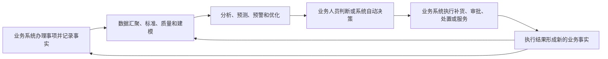

# 017 基于数据的应用场景与传统应用系统是什么关系？

## 一句话回答

> 传统应用系统主要承载业务办理并记录业务事实，基于数据的应用场景则汇聚和关联一个或多个系统的数据，形成分析、判断、预测或优化建议，再推动业务人员采取行动。两者不是互相替代的系统：业务系统是数据的重要来源和行动入口，数据应用则让分散的业务事实产生新的业务价值，并把行动结果反馈为新的数据。

例如，订单系统能够准确记录客户下了什么订单，库存系统能够记录各仓库还有多少货，采购系统能够记录哪些商品正在采购。这些系统完成了各自的业务职责，但“某个地区下周可能缺货，应该从哪个仓库调拨多少商品”通常需要跨系统关联和计算，属于基于数据的应用场景。

数据应用不是在业务系统之外再建一个只供展示的平台。它最终应当帮助业务人员作出决定，并尽可能把预警、建议和结果嵌入补货、调拨、审批、服务或监管等现有业务流程。

## 一、什么是传统应用系统

本问所说的“传统应用系统”，不是指技术落后或年代久远的系统，而是指主要围绕业务流程和日常作业建设的系统，例如：

- 客户关系管理系统（CRM）；
- 企业资源计划系统（ERP）；
- 订单、合同和项目管理系统；
- 采购、仓储和物流系统；
- 财务、人力资源和办公审批系统；
- 自然资源调查、规划、登记、审批和监管系统。

这类系统通常负责：

- 接收业务人员的录入或外部请求；
- 执行校验、审批、流转和状态变更；
- 保存订单、合同、项目、凭证、地块等业务事实；
- 根据岗位和权限控制业务操作；
- 输出单据、台账和本系统范围内的统计结果。

传统应用系统的核心问题是：**一项业务如何正确、合规并高效地办理。**

例如，采购系统确保采购申请经过审批并形成订单，仓储系统确保入库和出库数量正确，财务系统确保付款和凭证符合财务规则。它们首先服务各自的业务流程，不一定为跨系统分析而设计。

## 二、什么是基于数据的应用场景

基于数据的应用场景，是围绕一个业务问题，把已有数据转化为判断、建议、预警、预测或自动化决策，并推动业务行动的过程。

常见形式包括：

- 经营分析和管理驾驶舱；
- 客户画像、流失预警和精准营销；
- 库存预测、补货建议和供应链优化；
- 设备故障预测和预防性维护；
- 风险识别、反欺诈和异常监测；
- 低效用地识别、城市运行监测和资源配置；
- 数据服务、标签、评分和算法模型嵌入业务系统。

它的核心问题是：**如何利用已经产生的数据，更好地理解现状、预测变化和改善业务结果。**

基于数据的应用不一定需要独立页面。它可以是一张BI报表、一条预警消息、一个风险评分、一项推荐结果，也可以是业务系统中的一个字段、按钮或自动判断规则。判断它是不是数据应用，关键不在界面形式，而在于它是否基于数据形成了新的业务能力。

## 三、两者关注的业务环节不同

| 对比维度 | 传统应用系统 | 基于数据的应用场景 |
| --- | --- | --- |
| 主要目标 | 完成交易、审批、作业和记录 | 分析、预测、预警、优化和辅助决策 |
| 典型问题 | 业务事项是否正确办理？ | 已有数据说明了什么，接下来应该做什么？ |
| 数据范围 | 以本业务流程和当前状态为主 | 经常跨系统、跨时间和跨业务领域 |
| 处理方式 | 单笔事务、规则校验和状态流转 | 关联、聚合、比较、建模和算法计算 |
| 输出结果 | 单据、记录、业务状态和操作结果 | 指标、画像、评分、预测、异常和建议 |
| 主要使用者 | 一线作业人员和业务办理人员 | 管理者、分析人员和需要采取行动的业务人员 |
| 成功标准 | 流程正确、交易可靠、操作高效 | 判断有用、行动发生、业务结果改善 |

这种区分不是绝对的。现代业务系统也会内置统计、推荐和智能判断，数据应用也可能直接触发流程和自动执行。两者的边界正在融合，但基本职责仍然需要分清：业务系统记录和执行，数据应用理解和优化。

## 四、为什么传统应用系统不能自动形成数据价值

业务系统保存了大量数据，但拥有数据不等于已经从数据中获得价值。

### 1. 每个系统只看到业务的一部分

客户系统了解联系活动，合同系统了解签约情况，项目系统了解交付进度，财务系统了解开票和回款。任何单一系统都难以形成客户或项目的完整视图。

### 2. 系统结构服务于操作，不一定适合分析

业务数据库通常围绕事务一致性和操作效率设计。复杂的历史趋势、跨系统关联和大规模汇总如果直接在生产系统上执行，既难以开发，也可能影响业务运行。

### 3. 同一个对象在不同系统中并不统一

同一客户、产品、设备或地块可能使用不同编码、名称和颗粒度。如果没有标准、主数据和映射规则，数据放到一起也无法可靠关联。

### 4. 业务系统记录“发生了什么”，不一定回答“为什么”和“怎么办”

订单状态、库存数量和付款记录都是业务事实。要识别销量下降原因、预测缺货风险或选择处置方案，还需要结合时间、区域、产品、外部因素和历史规律进行分析。

### 5. 跨部门问题缺少共同责任

单个系统由明确部门维护，但一个跨系统指标或预警可能同时涉及多个部门。如果没有数据治理机制，口径争议、质量问题和更新责任很容易被推给数据或技术团队。

因此，基于数据的应用场景通常需要数据汇聚、标准、质量、建模、指标、算法和责任协同，才能把分散的业务记录转化为可以采取行动的信息。

## 五、两者如何形成业务闭环

传统应用系统和数据应用更合理的关系，不是前者向后者单向提供数据，而是形成循环：

这条闭环包含三个关键连接点。

### 1. 数据从业务系统进入分析体系

业务系统是权威业务事实的重要来源。数据可以物理汇聚到数据仓库，也可以通过数据服务、事件流或联邦查询进行逻辑汇聚。无论采用哪种方式，都要明确语义、质量、鲜活度、权限和血缘。

### 2. 分析结果进入业务流程

分析结果不能只停留在报表和大屏中。缺货预警要进入补货流程，客户风险要进入授信或服务流程，低效用地识别结果要进入核查和处置流程。

### 3. 行动结果反馈给数据治理

业务人员接受、拒绝或调整了一项建议，实际结果是否达到预期，这些信息都应被记录。治理团队据此判断指标、规则和模型是否有效，并持续改进数据产品。

如果缺少最后一步，数据应用就只能不断输出建议，却无法知道建议是否正确，也很难形成真正的业务学习能力。

## 六、数据应用应该独立建设还是嵌入业务系统

这不是固定选择，应根据使用场景决定。

| 形态 | 适合场景 | 主要优点 | 主要风险 |
| --- | --- | --- | --- |
| 独立BI、分析平台或驾驶舱 | 跨部门分析、探索研究、管理总览 | 分析能力集中，适合比较和下钻 | 与日常业务操作脱节 |
| 嵌入业务系统 | 一线人员在办理过程中需要评分、提示或建议 | 使用路径短，容易形成行动闭环 | 业务系统与数据能力耦合过深 |
| 数据服务或模型API | 多个系统复用同一指标、标签或模型 | 能力复用，接口边界清楚 | 版本、可用性和权限要求高 |
| 消息和任务推送 | 异常、预警和待办需要及时处理 | 能直接触达责任人 | 容易产生过多无效告警 |
| 自动决策或流程触发 | 规则稳定、风险可控、可回滚的高频场景 | 响应快、减少人工操作 | 错误可能被快速放大 |

通常可以让探索分析先在独立平台中验证，规则稳定以后再通过数据服务或嵌入方式进入业务系统。对于风险高、影响大的决策，应保留人工确认、解释、审计和回退机制。

不宜为了“数据应用独立”而重新建设业务系统已有的审批和处置功能，也不宜把复杂跨系统计算全部塞进业务系统。更好的分工是：数据平台生产可信、可复用的数据能力，业务系统承接具体操作和流程。

## 七、案例：库存预测与供应链协同

某集团拥有多个销售渠道、区域仓库和供应商。ERP记录采购订单和财务结算，WMS记录入库、出库和实时库存，销售系统记录订单与促销活动，物流系统记录在途商品。

### 1. 业务系统分别做对了什么

- 销售系统正确记录每笔订单、退货和促销；
- WMS正确记录每个仓库的库存和出入库；
- ERP正确记录采购申请、采购订单和供应商交付；
- 物流系统正确记录调拨和运输状态。

这些系统能够保证单笔业务正确办理，但仍然难以直接回答：

- 哪些商品在未来一周可能缺货？
- 哪些仓库库存积压，可以调拨到其他区域？
- 某项促销会使采购和物流能力出现多大缺口？
- 应该向哪个供应商采购多少，何时到货才能降低风险？

### 2. 数据应用如何形成建议

库存优化场景需要关联销量历史、当前库存、在途数量、未交付订单、促销计划、供应商交期和仓库容量，统一商品、仓库、供应商和时间等维度，再计算安全库存、需求预测和补货建议。

数据治理需要保证：

- 同一商品在销售、仓储和采购系统中能够正确匹配；
- 库存、可售库存、在途库存和安全库存口径清楚；
- 数据更新频率能够满足每日或小时级调度；
- 预测使用的数据和模型版本可以追溯；
- 异常建议能够下钻到订单、库存和供应商明细；
- 供应链、销售和财务对关键规则及责任达成一致。

### 3. 建议如何回到业务系统

补货模型输出的不应只是一张图表。经过业务人员确认的建议，可以在ERP中生成采购申请，在WMS中生成调拨任务，在销售系统中调整促销或交付承诺。

最终采购量、实际到货时间、调拨结果、缺货情况和预测偏差重新进入分析体系，用于调整安全库存和预测模型。

这时，数据应用没有取代ERP或WMS，而是利用多个系统记录的事实，提升了它们共同服务供应链的能力。

## 八、数据治理在两者之间发挥什么作用

数据治理不是在业务系统与数据应用之间简单增加一个平台，而是保证整个闭环长期可信运行。

### 1. 确定业务目标和使用场景

先明确要降低缺货、减少库存、缩短审批还是改善服务，再决定治理哪些数据，避免无目标地汇聚全部系统。

### 2. 统一跨系统业务对象和口径

通过标准、主数据、业务建模和指标定义，使客户、产品、项目、地块等对象能够跨系统关联。

### 3. 保证数据质量和鲜活度

质量要求应来自业务用途。用于每日补货的数据不能一周才更新，影响审批的风险评分必须能够解释和复核。

### 4. 建立责任、权限和血缘

明确谁解释源数据、谁维护数据产品、谁处理质量问题、谁可以使用分析结果，并保证从结果追溯到规则和业务事实。

### 5. 推动结果进入行动并持续评价

衡量数据应用是否被使用、是否缩短决策时间、是否改善业务指标，并根据反馈调整模型、规则和数据范围。

没有这些治理机制，数据应用很容易停留在一次性分析、展示大屏或少数人员维护的Excel中。

## 九、常见误区

### 误区一：传统应用系统已经有报表，就不需要数据应用

单系统报表适合查看本流程状态，跨系统关联、预测和优化通常仍需要独立的数据能力。

### 误区二：建设数据应用就是再开发一套业务系统

数据应用应复用现有业务系统的事实记录、权限和流程，重点补充跨系统分析和判断能力，避免重复建设。

### 误区三：数据应用只要把结果展示出来就算完成

没有责任人处理预警、没有流程承接建议、没有反馈评价结果，展示本身不会产生业务价值。

### 误区四：有了算法就可以自动替业务作决定

算法依赖数据、假设和适用条件。高风险决策需要解释、人工确认、审计和回退，不能把模型结果当作绝对事实。

### 误区五：源系统数据正确，跨系统结果就一定正确

不同系统的对象标识、时间、颗粒度和业务口径可能不一致。单个系统正确，不代表关联和指标计算正确。

### 误区六：数据应用应该完全独立于业务系统

独立分析适合探索和管理总览，但稳定的数据能力最终应尽可能进入业务流程，否则业务人员需要在多个系统之间手工搬运结果。

### 误区七：数据平台可以直接修改业务系统数据

业务事实通常应由具有业务规则、权限和审计能力的业务系统修改。数据应用可以提出建议或发起受控流程，不应绕过业务系统直接改写权威数据。

## 十、实践检查清单

1. 是否明确传统应用系统和数据应用分别解决什么业务问题？
2. 数据应用是否需要关联多个系统、多个时期或外部数据？
3. 跨系统业务对象、指标和时间口径是否已经统一？
4. 数据质量和更新频率是否满足实际行动需要？
5. 分析、预警或模型结果是否有明确使用者和责任人？
6. 结果是否能够下钻、解释并追溯到业务事实？
7. 数据应用是否复用了现有业务系统的流程，而不是重复建设？
8. 建议是否通过受控方式进入审批、处置或执行环节？
9. 业务系统是否记录了采纳、拒绝、调整和实际执行结果？
10. 是否根据实际效果持续改进数据、规则和模型？
11. 自动决策是否设置了权限、审计、异常处理和回退机制？
12. 是否用业务结果而不是页面数量衡量数据应用价值？

## 结语

传统应用系统负责把业务办起来，并把发生过的事实可靠记录下来；基于数据的应用场景则跨越系统和时间，利用这些事实认识现状、发现规律、预测变化并提出行动建议。

二者结合以后，业务系统不再只是数据来源，还是行动和反馈的入口；数据应用也不再只是报表和展示，而成为持续改善业务流程的能力。数据治理要做的，就是让“记录事实—关联分析—业务行动—结果反馈”这条链路长期可靠运行。

只有分析结果进入业务流程，业务结果又能够反过来修正数据和模型，数据才真正从业务活动的副产品，转化为推动业务增值的生产要素。

## 延伸阅读

- 第014问：数据治理与 BI（商业智能）、数据大屏是什么关系？
- 第018问：数据和业务的关系是什么？
- 第019问：数据如何为业务增值？
- 第020问：数据治理和应用场景，哪个先、哪个后？
- 第025问：标签画像在哪些业务场景中能够发挥价值？
- 第026问：什么是数据产品？
