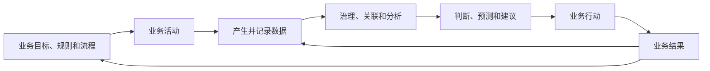

# 018 数据和业务的关系是什么？

## 一句话回答

> 业务活动产生数据并赋予数据含义，数据则对业务进行记录、描述和度量，并通过跨环节关联、分析和反馈帮助业务持续改进。数据不是业务本身，而是业务事实在特定规则、时间和颗粒度下的表达；只有回到业务语境并进入业务行动，数据才可能产生价值。

没有业务活动，数据往往失去来源和含义；没有可靠数据，业务也很难看清整体状况、总结规律和验证改进效果。两者不是“业务在前、数据在后”的单向关系，而是一个持续循环：业务产生数据，数据反映业务，数据应用推动行动，新的业务结果又形成新的数据。

数据治理的作用，就是让这条循环中的含义、关联、质量、责任和反馈长期保持可靠。

## 一、什么是业务

业务是组织为了实现目标而持续开展的活动及其规则。例如：

- 企业进行研发、采购、生产、销售、交付和售后服务；
- 政府部门开展调查、登记、审批、监管和公共服务；
- 医院进行挂号、诊疗、检验、用药和随访；
- 学校开展招生、教学、考试、科研和学生服务。

业务不仅是操作流程，还包括：

- 要管理的对象，如客户、产品、合同、项目、设备和地块；
- 对象之间的关系，如客户签订合同、项目使用设备、地块关联权利主体；
- 发生的事件，如下单、付款、审批、变更、维修和投诉；
- 决定业务如何运行的规则，如价格、资格、状态、权限和考核口径；
- 组织希望实现的结果，如增长、效率、服务质量和风险控制。

理解数据以前，需要先理解这些业务对象、事件、规则和目标。脱离业务语境，仅从表名、字段名和数据类型出发，很难准确判断数据代表什么。

## 二、数据是业务事实的表达

业务活动发生以后，可以通过文字、数字、时间、位置、图片、声音、状态和关系等形式被记录下来，这些记录形成数据。

例如，一次商品销售可能形成：

- 客户和商品标识；
- 下单、支付、发货和签收时间；
- 数量、价格、优惠和税费；
- 门店、仓库和收货位置；
- 订单、支付、物流和退货状态；
- 客户评价、图片和售后记录。

这些数据从不同角度表达同一项业务活动。任何一个字段都不是业务活动的全部，多个系统中的记录也可能分别表达不同阶段的事实。

因此，常说“数据是业务的数字化映射”是有道理的，但还需要补充三个限定：

1. 数据只记录业务中被选择和能够被记录的部分；
2. 数据总是采用某种定义、颗粒度和编码方式；
3. 数据反映的是某个时间点或时间范围内的业务状态。

数据可以反映业务，却不是对现实世界完整、永久和无偏差的复制。

## 三、业务赋予数据含义

同一个数值，脱离业务规则可能没有明确意义。例如系统中出现数字“100”，它可能是订单数量、合同金额、库存件数、面积、评分或百分比。即使字段名写着“金额”，仍然需要知道：

- 是含税还是不含税；
- 是合同额、确认收入还是实际回款；
- 使用哪种币种和汇率；
- 对应哪个组织、产品和期间；
- 是实时估算值还是财务结算值；
- 发生变更后保留最新值还是历史版本。

数据含义来自业务对象、事件和规则，而不是来自数据库字段本身。技术人员可以识别字段类型和统计分布，却不能仅凭这些信息决定“什么是有效合同”“何时算作完成交付”或“哪块土地属于低效用地”。

这也是为什么业务人员必须参与数据治理。数据标准、指标口径、质量要求和模型关系，最终都需要业务事实和业务规则作为依据。

## 四、业务过程决定数据质量的上限

很多数据问题表面上出现在报表或数据仓库中，根源却在业务过程。

例如：

- 业务人员为了尽快提交，将必填字段随意填写；
- 同一客户可以在多个系统中重复创建；
- 状态发生变化，却没有明确由谁、在何时更新；
- 线下沟通和实际处置没有回填系统；
- 业务规则已经变化，系统字段和校验仍然沿用旧规则；
- 系统只保存当前状态，没有记录关键变化过程。

后续可以通过清洗、映射和算法修补一部分问题，但无法凭空恢复从未记录的业务事实，也很难长期替代源头流程整改。

因此，数据质量不只是数据团队的工作。要提高数据质量，往往需要同步改善业务流程、系统交互、岗位责任和操作习惯。数据治理发现问题以后，应推动问题回到正确的业务源头解决。

## 五、数据如何反过来影响业务

数据虽然来自业务，却不只是业务结束后的记录。经过治理和使用以后，它可以从多个层面反作用于业务。

### 1. 描述业务

通过指标、报表和地图了解业务规模、结构、进度和当前状态，回答“发生了什么”。

### 2. 解释业务

把时间、区域、产品、客户和事件等数据关联起来，识别差异和原因，回答“为什么会这样”。

### 3. 预测业务

利用历史和实时数据判断需求、故障、风险和变化趋势，回答“接下来可能发生什么”。

### 4. 优化业务

通过比较方案、资源配置、规则调整和模型建议，帮助组织判断“应该采取什么行动”。

### 5. 验证业务

行动实施以后，用新的数据检验结果是否符合预期，并据此修订业务规则、数据模型和分析方法。

这五个层面并非所有场景都必须依次经历。有些管理场景只需要可靠描述和及时预警，就已经能够产生明显价值；有些复杂场景则需要预测和优化。关键是数据必须进入实际判断和行动，而不是停留在采集、汇聚或展示阶段。

## 六、数据与业务是一个循环，而不是两条平行线

数据部门和业务部门经常被理解为两条独立工作线：业务部门负责做业务，数据部门负责处理数据。这样的分工容易造成数据脱离业务。

更准确的关系是：

在这条循环中：

- 业务人员负责说明目标、含义、规则和结果是否有用；
- 数据人员负责组织数据、模型、指标和分析能力；
- 技术人员负责系统、采集、计算、服务和稳定运行；
- 管理者负责跨部门方向、授权、资源和争议裁决。

任何一方都不能独立完成整个循环。业务人员不参与，数据可能算得正确却没有业务意义；数据和技术能力不足，业务经验难以规模化复用；管理机制缺失，跨部门数据无法形成稳定关联。

## 七、为什么跨业务关联尤其重要

一项业务价值通常跨越多个环节。单个系统记录的局部事实往往不足以解释最终结果。

例如，客户投诉增加，可能与销售承诺、产品批次、物流时效、安装质量或售后响应有关；项目利润下降，可能与合同范围、采购成本、交付延期、人员投入和回款周期有关；低效用地形成，也可能与权属、规划、供地、建设和实际利用状态相关。

只有把不同业务环节的数据关联起来，才能看到因果链、时间过程和整体结果。这种关联不是简单把多张表连接在一起，还需要：

- 统一业务对象的身份和颗粒度；
- 明确不同事件发生的时间和先后关系；
- 区分权威来源、业务状态和适用范围；
- 处理组织、分类和规则的历史变化；
- 保证质量、权限和使用目的符合要求。

第015问介绍的物理汇聚与逻辑汇聚，解决的是数据如何被访问和组合；本问强调的是，汇聚的最终目的不是把数据放在一起，而是让原本分散的业务事实形成有意义的关联。

## 八、案例：产品质量追溯与售后改进

某制造企业发现某型号产品的客户投诉近期明显增加。不同业务系统分别记录了：

- 生产系统中的工单、产品序列号、批次、产线和工艺参数；
- 质量系统中的检验项目、抽检结果和不合格记录；
- 仓储物流系统中的入库、出库、运输和签收记录；
- 销售系统中的订单、客户、渠道和销售区域；
- 售后系统中的投诉时间、故障现象、维修过程和处理结果。

### 1. 单项数据只能说明局部事实

生产系统能够说明产品如何生产，质量系统能够说明抽检是否合格，售后系统能够说明客户遇到了什么问题。这些记录可能都正确，但任何一个系统都难以独立判断投诉增加的真正原因。

### 2. 跨业务关联才能形成完整认识

数据治理需要统一产品、序列号、生产批次、订单和客户等对象，关联生产、质检、物流、销售和售后事件，并明确各系统的时间、状态和质量规则。

关联以后可能发现：投诉主要集中在某个生产批次，并且与特定供应商零部件和一项工艺参数变化高度相关；也可能发现产品本身没有异常，问题主要来自某个区域的运输或安装环节。

数据分析提供的是判断依据，而不是自动确认业务责任。最终原因仍需要生产、质量、供应链和售后人员结合现场情况共同核实。

### 3. 数据结果必须推动业务改变

确认原因以后，企业可能调整生产工艺、加强来料检验、召回特定批次、改进运输要求或更新安装规范。这些行动及其执行结果还要继续被记录。

后续投诉是否下降、返修成本是否减少、新规则是否造成其他影响，需要通过新数据持续验证。如果只完成一次分析报告，却没有改变业务流程和跟踪结果，数据与业务仍然没有形成闭环。

## 九、数据治理如何连接数据与业务

数据治理不是把数据工作强行附加到业务之上，而是建立二者之间可以持续运行的连接机制。

### 1. 从业务问题确定数据范围

先明确需要改善什么结果、支持谁作出什么决定，再确定需要哪些数据，避免从“有什么数据”反向拼凑用途。

### 2. 把业务语言转化为数据定义

将客户、产品、项目、地块、合同等业务对象，以及有效、完成、异常、低效等业务概念，转化为可执行的数据标准、模型和指标规则。

### 3. 把数据问题反馈到业务源头

质量检测发现问题以后，明确责任和整改路径，由正确的业务过程修正权威事实，而不是长期在下游维护另一套修正数据。

### 4. 把数据成果嵌入业务行动

通过报表、预警、数据服务、评分或模型，把数据结果交付给真正能够采取行动的人和系统。

### 5. 用业务结果检验治理成效

不仅评价接入了多少数据、制定了多少规则，还要观察数据是否被使用、行动是否发生、业务结果是否改善，并根据反馈继续调整。

## 十、常见误区

### 误区一：数据天然客观，不需要业务解释

数据可能准确记录了某个字段，却仍然受到定义、颗粒度、时间和采集方式影响。没有业务语境，数字很容易被错误解释。

### 误区二：业务人员只需要提出需求，数据团队负责全部实现

业务人员不能把语义、规则、质量确认和结果评价全部外包。数据团队也不能代替业务负责人作出管理判断。

### 误区三：业务经验比数据可靠，所以不必治理数据

经验能够理解特殊情况，但难以稳定覆盖大量对象和长期变化。数据的作用不是否定经验，而是让判断可以被验证、复用和持续改进。

### 误区四：有了数据就能还原完整业务

未记录的事实无法凭空恢复，错误的采集方式也会造成偏差。重要业务活动需要在流程和系统中形成必要、准确、可追溯的数据。

### 误区五：把数据汇聚到一起就理解了业务

物理或逻辑汇聚解决了访问问题，业务对象、语义、时间、规则和责任仍需治理。能连接数据，不代表已经正确理解数据。

### 误区六：分析结果正确，业务就会自动改善

业务价值还取决于结果是否及时送达、是否有人负责、是否进入流程，以及组织是否具备采取行动的资源和权限。

### 误区七：业务规则确定以后不会再变化

市场、组织、政策和流程持续变化，数据标准、模型、指标和质量要求也需要相应更新。

## 十一、实践检查清单

1. 是否明确数据由哪项业务活动和哪个系统产生？
2. 是否知道数据表达的业务对象、事件、规则和时间状态？
3. 数据定义和质量要求是否由实际业务用途决定？
4. 重要业务事实是否在源头被完整、准确和及时记录？
5. 同一业务对象能否跨系统、跨环节正确关联？
6. 是否区分数据记录、业务事实和对事实的分析判断？
7. 数据结果是否能够解释、追溯并由业务人员核实？
8. 分析、预警或建议是否进入了明确的业务流程？
9. 业务行动及其结果是否被继续记录并反馈到分析体系？
10. 数据、业务和技术人员是否共同承担定义、实现和运营责任？
11. 业务规则变化时，相关标准、模型和指标是否同步更新？
12. 是否使用业务结果检验数据和治理工作是否有效？

## 小结

业务是数据的来源和语境，数据是业务事实在特定规则、时间和颗粒度下的表达。业务决定什么值得记录、如何解释和怎样行动；数据则帮助业务超越局部经验，看清整体状态、发现关联并验证改进结果。

二者只有形成循环才有价值：业务活动产生数据，治理使数据可以被理解和关联，数据应用推动业务行动，新的业务结果再修正原有认识。数据治理既不能脱离业务整理数据，也不能只依赖业务经验而忽略数据能力。

真正成熟的数据治理，不是让数据部门离业务越来越远，而是让数据成为业务运行和持续改进的一部分。

## 延伸阅读

- [第001问：数据治理的第一性原理是什么？](../01-总则与战略篇/001-数据治理的第一性原理.md)
- [第013问：业务建模、行业数据模型与数据治理是什么关系？](../02-概念辨析篇/013-业务建模行业数据模型与数据治理.md)
- [第017问：基于数据的应用场景与传统应用系统是什么关系？](017-数据应用场景与传统应用系统.md)
- [第019问：数据如何为业务增值？](019-数据如何为业务增值.md)
- [第020问：数据治理和应用场景，哪个先、哪个后？](020-数据治理和应用场景哪个先哪个后.md)
- [第028问：数据从何而来？](../04-数据基础与生命周期篇/028-数据从何而来.md)
