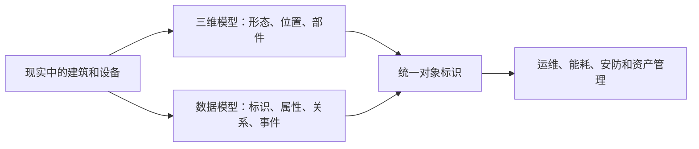

# 021 数据治理中的数据建模和三维建模是一回事吗？

## 一句话回答

> 不是一回事。数据建模和三维建模都属于“建模”，共同点是为了特定目的对现实世界进行抽象、选择、组织和表达；但数据建模主要组织业务对象、属性、关系、事件和规则，三维建模主要表达对象的空间形态、结构、部件和外观。两类模型可以相互关联，却不能因为名称中都有“建模”就混为一谈。

“建模”是一个跨领域的通用词。数学建模、业务建模、数据建模、流程建模、三维建模和算法建模都使用这个词，但它们所建的模型、解决的问题和形成的成果可能完全不同。

因此，理解一种建模方法，首先要问的不是“使用了什么建模软件”，而是：对什么对象建模，为了什么目的，舍弃了哪些细节，保留了哪些结构，最终要支持什么活动。

## 一、怎样理解“建模”这个词

把建模理解为“有条理地组织”是基本正确的，但还不够完整。更准确地说：

> 建模是为了认识、描述、设计、计算或使用某个对象，对现实世界中的对象、过程或现象进行抽象、选择、组织和表达，形成一个能够服务特定目的的模型。

这个定义包含几个关键点。

### 1. 建模一定有目的

模型不是现实世界的完整复制。建筑设计模型、能耗管理模型和消防疏散模型都可以描述同一座建筑，但各自保留的信息不同，因为它们服务的目的不同。

### 2. 建模一定包含抽象和取舍

现实对象包含无限多的细节，模型只能选择当前问题需要的部分。导航地图不必表达道路每一处材料和裂缝，资产管理模型也不必保存每个构件精细到螺栓级的几何形态。

### 3. 建模需要有条理地组织和表达

模型不仅要列出对象，还要表达对象的组成、属性、关系、规则或变化。不同领域采用的表达方式不同，可能是实体关系、表和字段，也可能是公式、流程、几何网格、参数化构件或图结构。

### 4. 模型是否合适，要看能否支持预定用途

模型并非越精细越好。与用途无关的精细程度会增加采集、计算、存储和维护成本。模型是否合理，最终要看它能否以适当成本支持业务管理、分析计算、设计、仿真或展示。

## 二、什么是数据建模

本书所说的数据建模，是根据业务目标和业务模型，对需要管理的数据对象及其结构进行设计。它主要回答：

- 需要记录哪些业务对象和业务事件；
- 每个对象有哪些属性和唯一标识；
- 对象之间存在什么关系；
- 数据以什么颗粒度记录；
- 对象状态如何变化，历史如何保留；
- 哪些规则、编码和约束需要落实到数据中；
- 数据最终如何存储、关联、查询和计算。

例如，园区资产管理可能需要表达园区、建筑、楼层、房间、设备、产权单位、使用单位、维修工单和能耗记录。数据模型不只记录这些对象的名称，还要说明建筑与楼层、房间与设备、设备与工单之间如何关联，设备状态怎样变化，能耗数据按什么时间颗粒度记录。

数据模型通常可以分为三个逐步落地的层次：

1. **概念数据模型**：识别核心业务对象及其主要关系；
2. **逻辑数据模型**：进一步明确属性、标识、关系、颗粒度、状态和业务约束；
3. **物理数据模型**：结合数据库、数据仓库或其他存储技术，落实为表、字段、索引、分区和具体存储结构。

因此，数据建模不等于数据库表设计。表和字段只是物理实现的一种形式，前面还应有对业务对象、关系、事件和管理目的的理解。脱离业务模型，只根据现有系统的表结构拼接数据，很容易把系统实现误当成业务本身。

## 三、什么是三维建模

三维建模主要在三维空间中表达对象或场景的形态、尺寸、位置、结构、部件和外观。它通常回答：

- 对象在三维空间中是什么形状；
- 对象位于哪里、尺度多大、方向如何；
- 对象由哪些空间部件组成；
- 部件之间如何连接、包含或装配；
- 表面采用什么材质、纹理和视觉效果；
- 模型需要支持展示、设计、量测、仿真还是空间分析。

三维模型也不是只有一种形式：

- 通用三维图形常使用顶点、边和面组成的 **Mesh（网格）** 表达物体表面；
- BIM 通常使用参数化、构件化和带有专业语义的对象表达墙、梁、门窗、管线和设备；
- 地形可以使用规则格网、不规则三角网或高程数据表达；
- 实景采集可能形成点云、倾斜摄影模型或三维场景瓦片；
- 某些专业分析还会使用体素、实体模型或其他空间表达。

这些模型都与三维空间有关，但内部表达、精细程度和适用场景并不相同。因此，把三维建模简单等同于“制作一个 Mesh”同样不够准确。

## 四、两类建模的差别在哪里

| 维度 | 数据建模 | 三维建模 |
| --- | --- | --- |
| 建模对象 | 业务对象、业务事件、属性、关系和规则 | 物体、建筑、地形、部件和三维场景 |
| 主要问题 | 如何用数据表达和组织业务 | 如何表达对象的空间形态、结构和外观 |
| 典型成果 | 概念数据模型、逻辑数据模型、物理数据模型 | Mesh、BIM 构件模型、点云、地形或三维场景模型 |
| 重点内容 | 标识、属性、关系、颗粒度、状态、历史和约束 | 几何、拓扑、坐标、层级、部件、材质和纹理 |
| 常见用途 | 数据存储、关联、治理、查询、统计和分析 | 设计、展示、量测、仿真、装配和空间分析 |
| 主要评价 | 是否准确表达业务并支持持续管理和计算 | 是否以适当精度表达空间对象并满足专业用途 |

最根本的区别，是两类模型对同一个现实对象保留了不同的信息。

例如，同一台空调设备：

- 在三维模型中，可能重点表达设备的外形、尺寸、安装位置、接口和与管线的连接；
- 在数据模型中，可能重点表达设备编号、型号、采购日期、所属建筑、责任部门、运行状态、能耗记录和维修工单。

两者描述的是同一现实对象，却服务于不同问题。一个几何形态非常精细的空调模型，不会自然具备完整的维修历史；一张包含维修记录的设备表，也不能代替三维模型完成空间碰撞检查。

## 五、为什么同一个词在不同领域差别会很大

专业领域经常借用相同的通用词汇。例如“实体”“对象”“模型”“服务”和“资产”，在业务管理、数据库、软件开发、测绘、BIM 和人工智能中的具体含义都可能不同。

只依据词面相同来判断概念相同，容易导致三个问题：

1. **把工具能力当成业务能力**：认为购买了三维建模软件，就具备了业务数据建模能力；
2. **把一种成果代替另一种成果**：认为已有 BIM 或实景三维模型，就不再需要设计建筑、设备、人员和工单的数据关系；
3. **模糊专业责任**：让三维技术人员承担业务口径和数据模型设计，或者要求数据架构师独立决定三维表达精度和专业构件规则。

所以，在跨专业协作中，不能只说“我们要做建模”，而应进一步说明建模对象、业务目的、模型内容、交付成果和使用方式。

## 六、数据模型和三维模型如何发生关联

两类模型不能等同，不代表它们彼此无关。相反，在城市、园区、建筑、制造和自然资源等场景中，将业务数据与三维对象关联起来，往往能够产生新的业务价值。

关联的关键通常不是名称，而是稳定、唯一、可维护的对象标识。例如：

- 数据模型中的建筑记录具有统一的建筑编码；
- 三维场景中的建筑对象保存同一个建筑编码；
- BIM 构件、设备台账和维修工单通过设备或构件编码关联；
- 传感器读数通过设备编码和空间位置关联到相应对象。

这样，三维模型可以提供直观的空间入口，数据模型则提供持续变化的业务状态。使用者点击三维场景中的一台设备，可以查看运行参数、能耗、故障和工单；系统也可以把异常设备、空置房间或高能耗区域在三维场景中定位出来。

这里产生价值的不是把两类模型强行合并成一个模型，而是保持各自专业表达，并建立可靠的身份映射、语义关系和更新机制。

## 七、案例：园区设备运维中的两类模型

某园区已经完成建筑和机电设施的 BIM 建模，并进行了轻量化处理，可以在浏览器中查看楼层、房间、管线和设备。项目团队因此认为“模型已经建好了”，后续只需把业务系统接入即可。

但在设备运维中，很快出现了一系列问题：

- BIM 中的设备编号与资产台账编号不一致；
- 同一设备在采购、安装、巡检和维修系统中的名称不同；
- 设备更换以后，三维对象仍指向旧设备记录；
- 工单记录了故障，却无法准确定位对应楼层和设备；
- 三维模型展示了设备，却无法判断谁负责、是否在保修期、最近是否反复故障。

这些问题不能只靠继续提高三维模型精度解决。园区还需要进行数据建模和数据治理：

1. 明确建筑、空间、系统、设备、传感器和工单等业务对象；
2. 确定对象之间的包含、安装、监测和维修关系；
3. 统一设备标识，建立 BIM 构件与资产台账的映射；
4. 记录设备安装、更换、停用和维修等业务事件；
5. 明确资产、运行和维修数据的权威来源及更新责任；
6. 将能耗异常、故障预警和工单状态持续关联到三维对象。

完成这些工作后，三维模型不再只是可视化成果，而成为进入设备运维数据的空间界面；数据模型也不再只是后台表结构，而是让设备状态、事件和责任能够被持续管理的业务基础。

## 八、数据治理分别关注什么

对于数据模型，数据治理主要关注：

- 模型是否来自明确的业务目标和业务模型；
- 对象、属性、关系、颗粒度和历史是否定义清楚；
- 标识、编码、口径和约束是否统一；
- 模型能否映射到可靠的数据来源；
- 模型变更是否有版本、影响分析和责任机制；
- 数据是否持续支持指标、应用和数据产品。

对于三维模型及其相关数据，治理主要关注：

- 模型的来源、坐标基准、格式、精度和适用范围；
- 建筑、构件或空间对象能否与业务对象稳定关联；
- 版本更新、轻量化和格式转换过程是否可追溯；
- 三维成果与现实对象、业务台账是否保持一致；
- 模型的权限、安全、服务状态和鲜活度是否受控；
- 三维模型是否真正进入设计、运维、监管或分析场景。

BIM 轻量化、模型格式转换和三维瓦片生成属于三维数据处理。它们可以改善访问和使用效率，但并不自动等于数据治理。只有当三维模型被纳入统一标识、标准、质量、版本、责任和业务应用的持续体系时，相关处理才成为治理链路的一部分。

## 九、常见误区

### 误区一：凡是叫建模，方法和成果都差不多

“建模”只说明都在构造某种模型，不能说明建模对象和专业方法相同。数学模型、流程模型、数据模型和三维模型之间存在本质差异。

### 误区二：数据建模就是设计数据库表

表结构属于物理数据模型。完整的数据建模还要从业务模型出发，识别对象、事件、关系、颗粒度、状态和历史。

### 误区三：三维建模就是制作 Mesh

Mesh 是常见表达之一。BIM、点云、地形、体素和三维场景瓦片各有不同的结构与用途，不能用单一形式概括所有三维建模。

### 误区四：有了 BIM 或实景三维，就已经完成数据治理

三维模型可以表达空间对象，但不一定解决业务标识、权威来源、指标口径、质量责任和持续更新问题。

### 误区五：把业务属性全部塞进三维模型，就能统一两类模型

两类模型的生命周期、更新频率、使用工具和责任主体通常不同。更合理的做法是明确各自权威边界，通过统一标识和服务接口关联，而不是让一个模型承担所有职责。

### 误区六：模型越精细，业务价值越高

超出用途的几何精度和业务属性都会增加维护成本。应根据设计、展示、运维、分析等实际用途确定合适的模型内容和精度。

## 十、实践检查清单

1. 当前所说的“建模”究竟面向什么对象和问题？
2. 模型服务设计、展示、业务管理、统计分析还是专业计算？
3. 哪些现实信息需要保留，哪些细节可以舍弃？
4. 数据模型是否由业务目标和业务模型推导，而非只复制现有表结构？
5. 三维模型采用何种表达形式、精度和语义，是否适合预定用途？
6. 同一现实对象在两类模型中是否具有稳定的统一标识？
7. 三维对象、业务台账和实时状态之间的映射由谁维护？
8. 两类模型各自的权威边界、版本和更新周期是否明确？
9. 三维处理过程是否可追溯，业务数据变化是否能正确影响应用？
10. 两类模型的关联是否真正支持了运维、管理、分析或决策？

## 小结

数据建模和三维建模都体现了建模的共同思想：为了特定目的，对现实世界进行抽象、取舍、有条理的组织和表达。但两者选择的信息、使用的表达方式和解决的问题明显不同。

数据建模面向业务数据，组织业务对象、属性、关系、事件、规则和历史；三维建模面向空间对象，表达几何形态、位置、结构、部件和外观。名称相同，只代表它们都在构造模型，不能据此认为它们是同一种专业工作。

在数据治理中，更重要的不是争论哪一种才算“真正的建模”，而是明确各自的目的和边界，再通过统一对象标识、标准、质量和更新机制把两类模型关联起来，让空间表达与持续变化的业务数据共同服务管理和决策。

## 延伸阅读

- [第008问：数据治理与数据管理是什么关系？](../02-概念辨析篇/008-数据治理与数据管理.md)
- [第009问：数据治理与数据处理是什么关系？](../02-概念辨析篇/009-数据治理与数据处理.md)
- [第013问：业务建模、行业数据模型与数据治理是什么关系？](../02-概念辨析篇/013-业务建模行业数据模型与数据治理.md)
- [第019问：数据如何为业务增值？](019-数据如何为业务增值.md)
- [第022问：实体建模在数据治理中发挥什么作用？](022-实体建模在数据治理中的作用.md)
- [第023问：维度建模在数据治理中发挥什么作用？](023-维度建模在数据治理中的作用.md)
