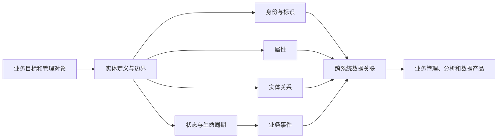

# 022 实体建模在数据治理中发挥什么作用？

## 一句话回答

> 实体建模首先回答“业务究竟在管理什么”：围绕客户、产品、设备、地块、项目等业务对象，明确其身份、属性、关系、状态、事件和生命周期。它把分散在不同系统中的数据组织成可持续管理的业务对象，是统一数据、关联业务和让数据为管理服务的重要基础。

很多组织并不缺少数据表，却仍然说不清“同一个客户是谁”“一台设备经历过什么”“一个项目与哪些合同、人员和资源有关”。原因往往不是字段不够多，而是数据一直按照系统和表来组织，没有按照业务真正关心的对象来组织。

实体建模的价值，就是把视角从“系统里有哪些表”转向“业务需要管理哪些对象，以及这些对象如何存在、变化和发生关系”。

## 一、什么是业务实体

实体是可以被独立识别、持续描述和管理的对象。它既可以是现实中的人、物和地点，也可以是组织为了管理需要定义出来的业务对象。

常见的业务实体包括：

- 客户、供应商、员工和组织；
- 产品、物料、设备和车辆；
- 地块、建筑、房屋和门店；
- 合同、订单、项目和账户；
- 园区、管理单元和服务对象。

一个对象是否应当作为实体，不能只看它是不是名词，更要看业务是否需要：

1. 稳定地识别它；
2. 持续记录它的属性和状态；
3. 管理它与其他对象的关系；
4. 追踪它经历的业务事件；
5. 围绕它采取管理行动。

例如，“设备”通常需要独立编号，需要记录型号、位置、责任部门和运行状态，还要关联巡检、维修和更换记录，因此适合作为业务实体。“某设备在某时刻的温度读数”则更适合作为一次观测事实，而不是独立的核心实体。

实体并不一定都是客观世界中天然存在、边界固定的东西。第019问提到的“防疫小区”，就是为了防疫管理而定义的业务实体。它的边界取决于围合、出入口和人员管控要求，不一定等同于房产意义上的住宅小区。

所以，业务实体不是从数据表中自动发现的名词集合，而是组织基于管理目标对业务对象形成的结构化认识。

## 二、实体建模要建什么

实体建模不是只画几个方框和连线。一个可用于数据治理的实体模型，通常需要说明以下内容。

### 1. 实体的业务定义和边界

首先明确这个实体代表什么、不代表什么，以及在什么管理场景下使用。

例如，“客户”可能指签订合同的法人主体、实际使用产品的单位、付款方，也可能包括个人消费者。如果不先确定边界，各系统中的“客户数量”就无法直接比较。

### 2. 实体的身份与标识

需要说明怎样判断两条记录是不是同一个对象，以及怎样区分两个名称相同的对象。标识可能来自统一编码、法定证件、设备序列号、空间单元编码，也可能由多个属性组合形成。

统一身份不等于强行修改所有源系统的主键。更常见的做法是：保留各源系统的原始标识，同时建立源标识与统一业务标识之间可追溯的映射。

### 3. 实体的属性

属性描述实体相对稳定或可以随时间变化的特征，例如设备型号、安装位置、责任部门、投产日期和当前状态。

属性不能简单堆积。需要明确含义、数据类型、取值范围、计量单位、是否必填、权威来源以及生效时间。

### 4. 实体之间的关系

业务价值往往产生于关系。设备安装在哪个车间，由哪个部门负责，采用哪种物料，服务于哪条生产线，这些关系会把原本分散的数据连接起来。

关系也有方向、类型、有效期和约束。例如，一台设备在同一时间可能只属于一个安装位置，却可能由多个团队共同维护；设备搬迁以后，新旧位置关系都需要保留生效时间。

### 5. 实体的状态和生命周期

实体不是静止的。设备会经历采购、到货、安装、投产、运行、停机、维修、调拨和报废；项目会经历立项、审批、执行、验收和关闭。

实体模型需要说明有哪些合法状态、什么事件会触发状态变化、状态从何时生效，以及历史如何保存。只保留“当前状态”，会使组织无法回溯当时情况，也无法分析变化原因。

### 6. 与实体相关的业务事件

实体回答“是谁、是什么”，事件回答“发生了什么”。设备维修、客户下单、地块权属变更、项目验收都是事件。

事件通常需要记录发生时间、参与实体、前后状态、业务依据和处理结果。实体与事件必须关联，但不应混为一谈：一台设备可以长期存在，却会经历多次维修事件；一次维修也可能同时涉及设备、人员、备件和工单等多个实体。

可以用下面的结构理解实体模型：

## 三、为什么实体建模能让数据为业务增值

### 1. 从“找到数据”变成“找到业务对象”

没有实体模型时，使用者需要知道客户数据在哪张表、设备状态在哪个系统、维修记录如何关联。建立实体模型以后，可以围绕“客户”“设备”或“项目”查找相关属性、关系、事件和数据产品。

这不仅改善数据检索，更重要的是让数据以业务人员熟悉的方式被理解和使用。

### 2. 让不同业务系统的数据发生关联

业务系统通常围绕各自流程建设。同一台设备可能出现在采购、资产、生产、物联网和维修系统中，每个系统有自己的编号和字段。

实体建模通过统一业务身份和标识映射，确认哪些记录指向同一个对象。只有先解决“是不是同一个”，才能进一步分析采购成本、运行效率、故障频率和维修费用。

### 3. 形成面向管理的完整视图

业务系统分别记录局部事实，实体模型可以将对象在不同环节的信息组织起来，形成客户视图、设备视图、项目视图或地块全生命周期视图。

所谓“360度视图”不应理解为把所有字段堆到一个页面，而是围绕管理目的，展示对象的关键信息、关系、状态和事件，并保留来源和时效。

### 4. 支撑质量检查和责任落实

只有实体和关系明确以后，许多质量规则才有业务意义。例如：

- 在用设备必须对应有效的安装位置和责任部门；
- 已报废设备不应继续产生正常运行数据；
- 维修工单必须关联可以识别的设备；
- 设备更换以后，传感器和生产线关系需要同步调整。

实体模型还能明确各项属性和关系由哪个系统产生、哪个部门确认、发生冲突时以谁为准。

### 5. 为指标和算法提供稳定对象

计算客户复购率、设备故障率、项目完成率或地块开发强度，都要先确定统计对象。如果实体重复、身份不明或生命周期混乱，指标和算法即使计算正确，也可能回答错误的问题。

实体建模先稳定“管理什么”，下一问的维度建模再进一步组织“按什么视角分析”和“怎样计算指标”。

## 四、实体建模与其他建模是什么关系

### 1. 与业务建模的关系

业务建模描述组织如何运转，包括目标、能力、流程、角色、规则、业务对象和业务事件。实体建模从中选择需要持续识别和管理的业务对象，进一步明确其身份、属性、关系、状态和生命周期。

因此，实体建模是连接业务模型与数据模型的重要桥梁，但不能替代完整的业务建模。不了解业务流程和管理规则，就很难正确划定实体边界。

### 2. 与数据建模的关系

实体建模属于数据建模的重要组成部分，但数据建模的范围更广，还包括事件、交易、指标、历史、约束以及物理存储设计。

实体模型可以先在概念和逻辑层表达，不必立即决定使用关系数据库、图数据库还是其他存储技术。到了物理数据模型阶段，实体才会根据实际需要落实为表、字段、主键、外键、索引或图结构。

### 3. 与ER模型的关系

实体关系模型（Entity-Relationship Model，ER模型）是表达实体、属性和关系的经典方法，常用于概念和逻辑数据建模。但本书所说的实体建模，不只是画一张ER图或把每个实体变成一张表。

数据治理还要处理跨系统身份映射、权威来源、状态变化、历史版本、质量责任和持续运营。ER图可以表达模型结构，却不会自动解决这些治理问题。

### 4. 与主数据管理的关系

主数据管理重点治理客户、产品、供应商、组织等需要跨系统共享、相对稳定的核心实体，并可能形成经过匹配、合并和确认的可信记录。

实体建模的范围更广。项目、合同、设备、地块甚至业务管理单元都可以进行实体建模，但不一定都需要建设成组织级主数据。是否纳入主数据管理，要看跨系统共享范围、权威性和治理成本。

### 5. 与维度建模的关系

实体建模以业务对象的持续管理为中心，维度建模以业务过程的分析和指标计算为中心。

| 对比维度 | 实体建模 | 维度建模 |
| --- | --- | --- |
| 核心问题 | 管理什么对象，对象如何变化和关联 | 发生了什么，按哪些视角统计和比较 |
| 主要对象 | 实体、属性、关系、状态和事件 | 事实、度量、维度和层次 |
| 典型用途 | 对象管理、跨系统关联、全生命周期视图 | 经营分析、统计报表、指标计算和 BI |
| 典型结构 | 实体关系模型、对象模型或图结构 | 星型模型、雪花模型和事实星座 |
| 关注时间 | 对象和关系何时有效、如何演变 | 事实在什么时间发生、按什么周期汇总 |

二者不是谁取代谁。实体模型帮助组织形成稳定的业务对象，维度模型会根据具体分析过程重新组织相关实体、事件和度量。一个业务实体可能成为维度，也可能参与多个事实；不能把实体模型机械地转换成星型模型。

## 五、实体建模为什么必须是动态的

如果只整理实体当前有哪些字段，实体模型很容易退化成一份静态数据字典。真实业务中的实体会持续变化：

- 客户会合并、拆分、更名或改变等级；
- 组织和人员的隶属关系会调整；
- 设备会搬迁、改造、更换、停用或报废；
- 地块的权属、用途和利用状态会变化；
- 项目会变更范围、负责人、预算和阶段。

治理体系需要同时保存当前状态和必要历史，明确变化由哪个业务事件触发，并把影响传递给下游指标、算法和应用。

例如，一块土地从农用地转为建设用地，并完成供地和开发后：

- 地块的利用类型、规划用途和权属关系会发生变化；
- 原有调查、确权和规划记录仍应保留其当时的有效状态；
- 供地合同、审批事项、建设项目和登记结果需要关联到同一地块；
- 低效用地识别、开发强度和利用评价等结果需要按变更重新计算；
- 变更依据、生效时间、责任部门和影响范围都应当能够追溯。

这说明实体建模不是一次性的结构设计，而需要配合版本、生效时间、变更事件和影响分析持续演进。

## 六、案例：自然资源领域土地实体的全生命周期

在自然资源领域，土地不是只存在于一张现状图或一张登记表中的静态对象。围绕土地的调查、确权、规划、供应、审批、建设、登记和利用评价，会持续产生数据，并不断改变我们对这块土地的业务认识。

管理者需要围绕同一块土地回答：

- 这块地的空间边界、权属主体和当前利用状态是什么？
- 它经历过哪些规划、供地、审批、建设和登记事件？
- 当前利用是否符合规划和供地条件，是否存在闲置或低效利用？
- 土地变化会影响哪些项目、审批事项、监管任务和后续开发？
- 不同业务系统中的地块记录，是否确实指向同一块土地？

### 1. 先从管理目的确定土地实体

土地实体的边界不能只由某一张 GIS 图层决定。对于规划管理，可能重点关注宗地、规划用途和控制指标；对于不动产登记，重点是权利范围、权利人和登记状态；对于低效用地识别，还要关联开发强度、投入产出、闲置时间和项目进度。

因此，需要先明确本期要服务的管理目标，再决定土地实体需要包含哪些属性、关系和历史。例如，首期围绕低效用地识别，可以将地块、权属、规划用途、供地合同、建设项目、审批事项和利用评价作为核心对象，并明确各自的管理边界。

### 2. 建立统一地块身份，但保留来源标识

同一块土地可能在调查、规划、登记、供地、审批和项目系统中使用不同的图斑号、宗地号、项目编号或内部编码。实体建模需要建立统一的地块业务标识，并保存各系统的源标识、空间版本和映射依据。

统一身份不等于把所有源系统强行改成同一个字段。对于因测绘精度、分割合并或业务阶段不同而暂时无法一一对应的记录，应保留关系类型、匹配状态和人工确认结果，不能简单按名称或空间相交自动合并。

### 3. 组织土地的关系、状态和事件

土地实体模型至少需要表达：

- 地块与行政区、权属主体、规划用途和现状利用类型的关系；
- 地块与供地合同、审批事项、建设项目和登记结果的关系；
- 地块分割、合并、权属变更、用途变更和项目建设等业务事件；
- 调查、确权、规划、供应、审批、建设、登记和利用评价等阶段状态；
- 每个状态和关系的生效时间、失效时间、依据和责任部门。

地块边界发生调整时，不能只覆盖原来的空间几何。治理体系还需要记录调整前后的版本、变更原因和关联对象，确保历史审批、合同和评价结果仍能解释当时的业务事实。

### 4. 让土地实体进入业务场景

当统一地块实体把空间、权属、规划、项目和利用数据关联起来以后，组织才能持续形成土地全生命周期视图：

- 对规划用途与实际利用不一致的地块进行识别；
- 分析供地后建设进度和闲置时间；
- 评估开发强度、投入产出和土地利用效率；
- 将权属或利用类型变更传递到后续审批、监管和开发分析；
- 为低效用地盘活、再开发和政策评估提供依据。

实体模型本身不是最终价值。只有它被用于规划管理、审批协同、项目监管、低效用地识别和利用评价，并随着土地状态变化持续更新，才真正成为数据治理成果。

## 七、实体建模如何落地到数据治理

### 1. 从一个明确场景选择实体

先围绕设备运维、客户服务、项目监管等场景识别核心对象，不要一开始就试图建立覆盖全组织的“万能实体模型”。

### 2. 由业务和数据人员共同定义

业务人员确认管理含义、边界、状态和规则，数据人员分析来源、标识、关系和实现方式。实体模型不能由技术团队根据表名独立推断。

### 3. 建立实体说明和责任清单

每个核心实体至少应明确：

- 业务定义和适用范围；
- 唯一性判断与统一标识；
- 关键属性、关系和生命周期；
- 权威来源和源标识映射；
- 数据责任人、维护者和质量责任；
- 更新方式、时效要求和历史策略；
- 当前服务的业务场景和数据产品。

### 4. 通过数据探查验证模型

模型定义要回到真实数据中检验：标识是否真的唯一，关键属性是否完整，不同系统能否匹配，关系是否存在冲突，历史是否足以还原状态。

发现问题后，既可能需要修正数据，也可能说明实体边界或业务规则本身需要调整。

### 5. 将规则落实为持续运行能力

实体匹配、关系校验、状态转换和问题反馈不能只在项目交付前执行一次。需要通过汇聚、标准映射、质量检测、版本和血缘机制持续运行，并把业务反馈带回模型和规则。

### 6. 用业务结果检验价值

评价实体建模不能只统计建立了多少实体、属性和关系，还应观察：

- 跨系统对象匹配率和待确认问题是否改善；
- 查询一个对象完整信息所需时间是否缩短；
- 人工核对和重复录入是否减少；
- 质量问题是否能够定位到责任来源；
- 基于实体的指标、预警和应用是否得到使用；
- 新场景能否复用已有实体和关系。

## 八、常见误区

### 误区一：数据库中的每张表都是一个业务实体

一张表可能保存实体、关系、事件、配置或临时结果；一个实体也可能分散在多张表和多个系统中。不能以表为单位机械识别实体。

### 误区二：业务中的每个名词都要建成实体

是否建模取决于管理目的。没有独立身份、不需要持续管理的概念，可能只是属性、分类、值对象或一次事实。

### 误区三：统一实体就是给所有系统换成同一个主键

治理通常需要保留源系统标识和证据，通过映射形成统一业务身份。直接改写业务系统主键风险高，也会破坏历史和责任边界。

### 误区四：实体合并以后只保留一条最新记录

不同来源可能分别对不同属性权威，历史状态也可能影响审计和分析。可信实体视图需要保留来源、版本、生效时间和合并规则。

### 误区五：画完ER图就完成了实体治理

ER图只是模型表达。没有身份映射、责任、质量、更新和业务应用，图上的实体不会自动变成可信、鲜活的数据能力。

### 误区六：实体建模就是主数据管理

主数据是实体治理的一类重要对象，但实体建模还可以服务设备、项目、合同和行业管理单元等更广泛场景。

### 误区七：实体模型建成以后保持不变

业务、组织、政策和系统都会变化。实体边界、属性、关系和状态规则需要版本管理和持续修订。

### 误区八：实体越多、关系越复杂，模型越先进

模型应以业务需要为限。过度建模会增加理解、匹配和维护成本，反而妨碍场景落地。

## 九、实践检查清单

1. 是否从明确的管理问题出发识别核心实体？
2. 每个实体的业务定义、边界和适用场景是否清楚？
3. 是否能判断不同系统中的记录是不是同一个对象？
4. 是否保留源标识，并建立可追溯的统一身份映射？
5. 关键属性、关系和状态分别由哪个来源负责？
6. 是否区分实体、关系、业务事件、属性和分类？
7. 是否定义实体的状态、生命周期和历史保留方式？
8. 实体或关系变化后，是否能传播到下游指标和应用？
9. 模型是否经过真实数据探查和业务人员确认？
10. 匹配冲突和质量问题是否有责任人及处理流程？
11. 实体模型是否被数据产品、分析或业务系统实际使用？
12. 是否根据使用反馈持续修订模型，而不是一次性完成？

## 小结

实体建模首先解决的不是“怎样设计一张表”，而是“业务究竟在管理什么”。它通过明确业务实体的身份、属性、关系、状态、事件和生命周期，把分散在系统和表中的记录重新组织成可以持续理解和管理的业务对象。

这种组织方式让不同业务数据能够围绕同一对象发生关联，使质量规则、责任机制、全生命周期视图、指标分析和数据产品拥有稳定基础。实体模型只有进入实际管理场景，并随着业务变化持续更新，才能真正让数据为业务增值。

实体建模回答“管理什么对象”，接下来的维度建模则回答“围绕业务过程记录什么事实，以及按哪些视角进行分析和计算”。先把对象认识清楚，再讨论指标和分析，逻辑会更加自然。

## 延伸阅读

- [第013问：业务建模、行业数据模型与数据治理是什么关系？](../02-概念辨析篇/013-业务建模行业数据模型与数据治理.md)
- [第019问：数据如何为业务增值？](019-数据如何为业务增值.md)
- [第021问：数据治理中的数据建模和三维建模是一回事吗？](021-数据建模和三维建模.md)
- [第023问：维度建模在数据治理中发挥什么作用？](023-维度建模在数据治理中的作用.md)
- [第024问：范式建模主要解决什么问题，它与实体建模、维度建模是什么关系？](024-范式建模与实体建模维度建模.md)
- [第032问：数据标准在数据治理中起到什么作用？](../04-数据基础与生命周期篇/032-数据标准在数据治理中的作用.md)
- [第036问：主数据、参考数据和交易数据有什么区别，主数据的“黄金记录”如何形成？](../04-数据基础与生命周期篇/036-主数据参考数据交易数据与黄金记录.md)
