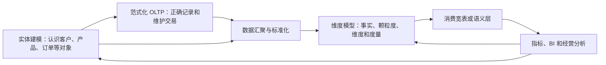

# 024 范式建模主要解决什么问题，它与实体建模、维度建模是什么关系？

## 一句话回答

> 范式建模更准确地说是关系模型的规范化设计，主要用于减少数据冗余，避免插入、更新和删除异常，特别适合需要频繁写入并保证事务一致性的 OLTP 业务系统。实体建模位于更上游，负责认识业务对象及其关系；维度建模则面向 OLAP 分析和指标计算，允许受控冗余。宽表可以进一步简化特定数据消费，但不能代替清晰的事实颗粒度、公共维度和指标口径。

实体建模、范式建模和维度建模经常同时出现，但它们并不处于完全相同的层次，也不是三种只能择一使用的数据库结构。

理解它们的关键，是先区分三个问题：

```text
实体建模：业务管理谁、管理什么？
范式建模：关系数据库怎样正确、低冗余地记录和维护数据？
维度建模：业务发生了什么，怎样按不同视角分析和计算指标？
```

## 一、什么是范式建模

业界所说的“范式建模”，通常是指按照关系数据库范式进行规范化设计。更严格的说法是“关系模型规范化”或“规范化建模”。

它根据属性之间的依赖关系，把数据合理拆分到不同关系表中，使一项业务事实尽量只在一个合适的位置维护，并通过主键、外键和约束建立联系。

例如，如果每条订单明细都重复保存客户资料中的当前名称、当前联系地址、产品当前名称和当前类别，就会带来很多问题：

- 客户资料中的当前联系地址变化时，需要修改大量重复记录；
- 部分记录修改成功、部分没有修改，出现同一客户多个地址；
- 没有订单时，难以单独登记一个新客户；
- 删除某客户最后一张订单时，可能连客户信息也一起丢失；
- 产品改名或调整类别后，大量交易记录需要同步更新。

规范化设计会将客户、产品、订单和订单明细等信息分别保存，再通过标识和关系关联起来。这样可以降低重复维护，提高写入一致性。

因此，范式建模主要优化的是：

> 数据怎样被正确地记录、修改和维护。

## 二、为什么范式建模特别适合 OLTP

OLTP（联机事务处理）系统用于承载下单、支付、登记、审批、入库和记账等日常业务操作。它通常具有以下特点：

- 持续发生新增、修改和删除；
- 每次事务涉及的数据量较小；
- 要求快速、准确地完成单笔业务；
- 强调事务一致性和业务约束；
- 需要避免多个位置重复维护同一事实。

例如，订单系统在创建订单时，需要分别维护客户、订单头、订单明细、产品和付款状态。如果客户资料中的当前联系地址只在客户表中维护，订单通过客户标识引用，就能减少不必要的重复修改。订单实际使用的收货地址如果具有履约和审计意义，则应作为交易发生时的快照单独保留。

当然，真实业务系统也不会为了追求理论上的最高范式无限拆表。系统还要考虑性能、业务边界、历史快照、审计要求和开发复杂度。规范化是一种设计原则，不是表拆得越多越好。

## 三、第一、第二、第三范式在解决什么

本书不展开数据库理论，只从实际问题理解常见范式。

### 1. 第一范式：一个位置保存一个明确的值

字段中的值应当具有清晰、可操作的结构。例如，不要在“购买产品”字段中保存“手机A、手机B、配件C”这样难以查询和约束的列表，而应通过订单明细逐项记录。

第一范式的重点不是机械地禁止所有数组或复杂类型，而是在关系模型中避免把需要独立查询、关联和约束的多个业务值混进一个不可管理的字段。

### 2. 第二范式：属性应依赖完整的键

在由多个字段共同标识一条记录时，非键属性应依赖完整的组合键，而不是只依赖其中一部分。

例如，订单明细由“订单编号＋产品编号”标识，产品名称只依赖产品编号，不依赖完整组合键，因此更适合放在产品表中，而不是在每条订单明细中重复保存。

### 3. 第三范式：非键属性不应继续依赖另一个非键属性

例如，订单表同时保存客户编号、客户当前名称和客户当前联系地址，而这些资料实际由客户编号决定，就会造成客户信息重复。将当前客户资料放入客户表，可以减少更新异常；交易发生时的客户名称或收货地址快照则属于另一项业务事实，可以按审计和履约需要保留。

这些范式都在帮助设计者识别：某项数据事实究竟属于哪个对象，应在哪里维护，以及怎样避免同一事实散落在多个位置。

更高范式和 BCNF 等方法适用于处理更复杂的依赖问题，但对于本书的科普目的，理解“减少冗余和更新异常”已经足以把握范式建模的主要价值。

## 四、实体建模与范式建模是什么关系

实体建模和范式建模关系密切，但不能等同。

### 1. 实体建模先认识业务世界

实体建模主要回答：

- 业务需要持续管理哪些对象；
- 怎样识别同一个对象；
- 对象有哪些属性、状态和生命周期；
- 对象之间有什么业务关系；
- 哪些事件会改变对象及其关系。

这些问题属于业务语义和概念模型层。实体模型可以用实体关系图、对象模型或其他方式表达，不一定立即决定采用哪一种数据库。

### 2. 范式建模把部分实体模型落实为关系结构

当系统决定采用关系数据库保存业务数据时，需要进一步决定哪些属性放在哪张表中，如何设计主键、外键和关联表，以及怎样处理函数依赖和数据冗余。

典型过程可以表示为：


例如，实体建模识别出客户、订单、产品，以及客户下单、订单包含产品等关系。范式建模进一步决定：

- 客户资料由客户表统一维护；
- 订单头保存订单级属性；
- 订单明细保存订单中的产品、数量和成交价格；
- 产品名称、类别等资料由产品表维护；
- 订单与产品的多对多关系通过订单明细表达。

### 3. 范式分析也可能反向修正实体认识

在分析属性依赖时，设计人员可能发现原来被当成普通字段的内容其实具有独立身份、关系和生命周期，应当识别为新的实体。

但是，不能仅凭“可以拆成一张表”就认定它是业务实体。数据库中的码表、关联表、配置表和技术表，并不必然对应业务人员需要管理的独立对象。

因此，更准确的关系是：

> 实体建模提供业务语义基础，范式建模将适合关系化表达的内容组织成便于一致维护的关系结构，两者在真实设计中会相互验证和修正。

## 五、为什么 OLAP 通常不追求高度范式化

OLAP（联机分析处理）主要服务查询、统计、汇总、比较和指标计算，与 OLTP 的要求不同：

- 经常扫描和聚合大量数据；
- 查询可能跨越多个业务系统和较长历史；
- 读取远多于修改；
- 业务人员需要易于理解和使用；
- 要支持按时间、产品、区域等视角汇总和下钻；
- 更关注查询效率、分析语义和历史可解释性。

如果分析人员每次计算销售指标，都要关联客户、产品、产品类别、品牌、渠道、组织和区域等大量规范化表，SQL 会非常复杂，查询成本和误用风险也会增加。

因此，维度模型通常会采用受控的反规范化设计。例如产品维度可以同时保存单品、品类、产品线和品牌等属性，减少分析时的关联，使业务层级更加直观。

可以把两者的目标概括为：

| 场景 | 更关注的问题 | 常见设计倾向 |
| --- | --- | --- |
| OLTP 业务系统 | 如何准确写入、修改和维护业务数据 | 规范化、事务一致性、减少重复维护 |
| OLAP 分析系统 | 如何方便、稳定、高效地分析历史数据 | 事实与维度、受控冗余、汇总和下钻 |

这也是为什么在以数据仓库、指标和分析为主的数据治理实践中，范式建模通常不是最需要强调的中心方法，维度建模和适度反规范化反而更直接地服务业务增值。

## 六、OLAP 是否完全不需要范式模型

不是。把“OLTP 重视范式、OLAP 重视反范式”作为总体方向是合理的，但不能理解成绝对规则。

一些企业级数据仓库方法会在数据整合层采用第三范式等相对规范化的结构，用来统一跨系统的客户、产品、合同和交易数据，再为不同分析主题建设维度模型或数据集市。

也有一些数据平台直接以维度模型组织明细和分析数据，不单独建设高度规范化的企业数据仓库层。两种路线各有适用条件：

- 规范化整合层有利于表达复杂业务关系和减少整合数据重复，但模型复杂、交付周期可能更长；
- 直接建设维度模型更贴近分析需求、交付较快，但需要做好一致性维度和跨主题复用；
- 数据规模较小、场景简单时，还可以缩短分层，避免同一数据被多次复制和加工。

因此，本书不把“规范化整合层”规定为数据治理必须建设的固定层次。应根据业务复杂度、数据来源、复用范围和团队能力选择一条清晰路线，不能为了形式完整而机械增加层级。

## 七、范式建模与维度建模有什么区别

| 对比维度 | 范式建模 | 维度建模 |
| --- | --- | --- |
| 主要目标 | 减少冗余和更新异常，保证一致维护 | 支持分析、指标计算、汇总和下钻 |
| 组织中心 | 实体、关系和属性依赖 | 业务过程、事实颗粒度、度量和维度 |
| 典型场景 | OLTP 业务数据库、部分数据整合层 | 数据仓库、数据集市、BI 和指标平台 |
| 数据操作 | 频繁新增、修改和删除 | 以批量或持续写入、大量查询为主 |
| 结构倾向 | 拆分关系，减少重复 | 星型结构，允许受控冗余 |
| 历史处理 | 服务业务事务和审计需要 | 强调按事实发生时点分析历史 |
| 使用者 | 业务应用和交易程序 | 分析人员、BI、指标和数据产品 |

两者的差别不只是“表多还是表少”。它们选择了不同的建模中心：

- 范式模型围绕对象及其依赖关系，优化业务事实的维护；
- 维度模型围绕业务过程和分析视角，优化事实的理解、汇总与使用。

所以，维度模型不是把范式模型中的表随意合并起来。它需要重新识别销售、付款、发货和退货等业务过程，声明事实颗粒度，选择分析维度，并确定度量的汇总方式。

## 八、反规范化是什么

反规范化（Denormalization）是在明确业务语义和数据来源的基础上，为了查询效率、使用便利或特定处理需要，有意识地保存部分冗余数据、预先关联结果或预先计算结果。

常见做法包括：

- 在产品维度中同时保存品类、产品线和品牌；
- 在事实中保留某些发生时的业务属性或退化维度；
- 预先计算日、月或区域汇总；
- 将事实和常用维度属性组织成消费宽表；
- 为特定服务保存适合读取的数据投影。

反规范化不是“不遵守设计原则”，也不是把所有数据随意堆在一起。合理的反规范化应当回答：

- 冗余内容的权威来源是什么；
- 在什么时点生成，适用于什么业务范围；
- 来源变化后如何更新或重算；
- 如何追溯到基础事实和维度；
- 是否确实改善了性能或使用效率；
- 多份冗余结果之间如何避免口径分裂。

如果这些问题没有答案，反规范化就可能从性能优化变成新的数据不一致。

## 九、宽表与维度建模是什么关系

宽表通常把一个主题需要的事实、常用维度属性和部分派生结果提前关联在一起，让报表、算法或数据服务可以少做关联、直接使用。

例如，销售消费宽表可能包含：

```text
销售日期、区域、渠道、门店、客户、产品、品类、品牌、
销售数量、成交金额、折扣金额、成本、退货标记……
```

宽表具有明显优势：

- 字段直观，使用门槛较低；
- 减少运行时关联；
- 适合固定报表、专题分析、算法特征和数据服务；
- 可以针对具体查询方式进行性能优化。

但宽表也有边界：

- 相同维度属性在大量事实行中重复；
- 维度变化时可能需要批量更新或重新生成；
- 混入不同颗粒度的数据容易造成重复计算；
- 不同团队各建一张宽表，可能形成新的口径冲突；
- 字段不断增加后，表会变得难以理解和维护。

因此，宽表不能直接等同于维度建模：

```text
维度建模：定义可复用的事实、颗粒度、维度和度量
宽表：基于清晰模型，为特定消费场景生成的数据形态
反规范化：维度模型和宽表都可能采用的设计手段
```

标准星型模型本身仍然包含事实表和多个维度表，并不必然是一张宽表。更稳妥的做法，是先保证基础事实颗粒度和公共维度清晰，再根据消费场景生成必要的宽表，而不是让每个报表直接拼出一套不可复用的数据。

## 十、案例：集团多渠道销售数据的三种组织方式

某集团通过线上平台、直营网点和经销商销售多个产品。业务系统需要处理客户下单、商品定价、付款、发货和退货；管理者则需要分析销售额、产品占比、渠道增长率和毛利率。

### 1. 实体建模：先认识业务对象

实体建模识别客户、产品、产品类别、订单、渠道、门店和组织等对象，明确它们的身份、属性、关系、状态和生命周期。

例如，需要明确不同渠道中的客户能否识别为同一个客户，产品调整类别以后如何保留历史，以及订单与付款、发货和退货之间是什么关系。

### 2. 范式建模：支撑业务系统正确记录交易

OLTP 系统可以将客户、产品、产品类别、订单头、订单明细、付款记录、发货记录和退货记录分别组织，通过主外键和业务约束建立关联。

客户地址不必在每条订单明细中反复维护，产品名称和当前类别也不必重复写入所有交易记录。订单明细只保存当前交易所需的数量、成交价格等事实，以及对订单和产品的引用。

需要注意，交易发生时具有法律、履约或审计意义的内容，可能仍要保存快照。例如，订单中的收货地址、成交价格和商品名称快照不能因为客户或产品资料后来变化而被直接改写。这不是无原则地重复数据，而是记录当时业务事实。

### 3. 维度建模：重新面向分析组织数据

进入数据仓库后，不能把 OLTP 表原样提供给所有报表。分析模型需要区分销售、付款、发货和退货事实，明确每张事实表的颗粒度，并建立时间、产品、客户、渠道、区域和组织等一致性维度。

产品维度可以受控地保存单品、品类、产品线和品牌，使销售事实能够按不同层级汇总；组织维度则需要保存门店和区域归属的历史，以解释组织调整前后的指标。

### 4. 宽表：面向特定消费进一步简化

为了支持每日销售分析，可以在事实和维度模型基础上生成销售主题宽表，将常用产品、渠道、区域属性和基础度量放在一起，供 BI 或专题分析直接使用。

这张宽表应有明确的颗粒度、来源、更新频率和适用范围，并能够追溯到销售事实和公共维度。退货率、增长率和销售占比等指标仍应根据查询范围正确计算，不能把预先计算的比率随意相加。

三种模型和宽表分别解决不同问题：



## 十一、数据治理应当关注什么

数据治理不负责规定所有系统必须使用同一种模型，而是要让不同模型之间的语义和数据链路保持一致、可信和可追溯。

### 1. 业务语义是否一致

客户、产品、订单、销售和退货等概念，在实体模型、OLTP 表、维度模型和宽表中是否具有清晰映射，不能因为结构变化而改变含义。

### 2. 权威来源是否明确

客户资料、产品分类、订单状态和财务金额分别由哪个系统负责，反规范化副本如何更新，都需要明确。

### 3. 颗粒度和历史是否保留

从规范化交易表生成事实和宽表时，不能混合订单、订单明细、付款和退货等不同颗粒度，也不能无依据地覆盖历史业务事实。

### 4. 冗余是否受控

每一份冗余数据都应有明确用途、生成规则、更新机制和退出条件。不能用“查询方便”作为无限复制数据的理由。

### 5. 血缘和质量是否可追溯

指标和宽表字段应能追溯到维度、事实、转换规则和 OLTP 源数据。源数据变化、映射失败或加工延迟时，应能够发现并确定影响范围。

### 6. 模型是否真正服务业务

范式化程度、星型模型数量和宽表字段数都不是治理成果。最终要观察交易是否正确、指标是否一致、分析是否高效，以及数据是否进入业务行动。

## 十二、常见误区

### 误区一：实体建模就是把实体设计成一张表

实体建模先表达业务语义，不必立即绑定关系数据库。一个实体可能由多张表实现，一张表也可能保存关系、事件或技术数据。

### 误区二：满足第三范式，数据模型就一定合理

范式只能帮助处理属性依赖和更新异常，不能替代业务定义、对象身份、生命周期和管理目标。形式正确的表结构也可能表达错误的业务认识。

### 误区三：数据仓库和数据治理完全不需要范式化

某些整合层会使用规范化模型，数据治理也需要理解源业务系统的结构。只是面向分析和指标时，维度建模及受控反规范化通常更加直接。

### 误区四：反规范化就是不规范

反规范化是有明确目的、有来源、有更新规则的受控冗余。随意复制字段和拼接数据不属于合理的反规范化设计。

### 误区五：维度建模就是把范式表全部连接成宽表

维度建模需要重新识别业务过程、事实颗粒度、维度和度量，不能机械复制或合并 OLTP 结构。

### 误区六：宽表就是维度模型

宽表通常是消费形态，星型模型才是典型维度结构。宽表应建立在清晰模型之上，不应成为唯一事实来源。

### 误区七：表拆得越细，系统越专业

过度规范化会增加关联和开发复杂度。模型应满足一致性、性能和业务维护要求，而不是追求理论形式。

### 误区八：表越宽，分析越方便

宽表一旦混合颗粒度、复制不同口径或缺少更新责任，就会让使用者更难判断数据含义和可信程度。

### 误区九：OLTP 模型可以直接用于所有分析

OLTP 模型优化单笔事务，不一定适合大规模聚合和跨系统分析。复杂指标通常仍需要专门的分析模型和历史处理。

## 十三、实践检查清单

1. 当前建模是在认识业务对象、设计交易系统，还是服务分析指标？
2. 实体的定义、身份、关系和生命周期是否已经基本清楚？
3. OLTP 表中是否存在不必要的重复维护和更新异常？
4. 规范化拆分是否服务实际一致性，而不是为了追求更高范式？
5. 交易发生时必须保留的业务快照是否被正确识别？
6. 数据仓库是否根据分析需求重新设计事实、颗粒度和维度？
7. 是否确实需要规范化整合层，还是可以采用更短的单一路线？
8. 维度中的冗余属性是否有明确来源、历史和更新机制？
9. 宽表是否基于清晰的事实和公共维度生成？
10. 宽表是否混入了不同颗粒度的数据？
11. 多张宽表是否重复维护同一指标或业务分类？
12. 指标和宽表字段能否追溯到事实、转换规则和源系统？
13. 模型变化后，是否能够识别对下游指标和应用的影响？
14. 当前模型是否以适当复杂度解决了真实业务问题？

## 结语

实体建模、范式建模和维度建模分别回答不同层次的问题。实体建模帮助组织认识业务对象和关系；范式建模将适合关系化表达的数据组织成便于一致写入和维护的结构；维度建模围绕业务过程组织事实和分析维度，为指标计算提供基础。

范式建模主要适合 OLTP，维度建模和受控反规范化更贴近 OLAP。但这不是绝对的技术分界：部分数据仓库整合层也会使用规范化结构，部分简单场景则可以缩短链路。关键不是机械选择某一种模型，而是根据数据在哪个环节、解决什么问题，选择相应的组织方式。

宽表是面向特定消费的便利形态，不是维度建模的同义词。只有当实体身份、业务语义、事实颗粒度和公共维度已经清晰，反规范化和宽表才能提升效率，而不会制造新的数据不一致。

数据治理需要做的，是让这些不同模型之间保持语义一致、来源清楚、历史可解释、转换可追溯，并最终共同服务业务处理、指标分析和管理行动。

## 延伸阅读

- 第011问：数据治理与数据库、数据仓库是什么关系？
- 第013问：业务建模、行业数据模型与数据治理是什么关系？
- 第021问：数据治理中的数据建模和三维建模是一回事吗？
- 第022问：实体建模在数据治理中发挥什么作用？
- 第023问：维度建模在数据治理中发挥什么作用？
- 第046问：语义层和指标平台如何解决“同名不同义、同义不同名”？
