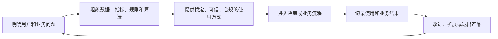

# 026 什么是数据产品？

## 一句话回答

> 数据产品不是某一种技术成果，而是围绕明确的用户和业务用途，把数据、指标、标签、规则、算法结果或数据服务组织成可持续交付的数据能力。它应当有清楚的业务语义、稳定的使用方式、明确的负责人、质量和鲜活度承诺、权限边界、版本及反馈机制，并通过实际使用持续改进。

一张数据表、一个接口、一张报表或一次数据导出都可能是数据产品的组成部分，但不会因为被制作出来就自动成为数据产品。

“产品”二字意味着建设者不能只关心数据是否加工完成，还要持续回答：谁在使用、解决什么问题、是否好用可信、发生变化时如何处理，以及使用以后有没有产生业务价值。

## 一、为什么需要把治理成果做成产品

许多数据治理项目交付了大量成果：数据标准已经发布，数据仓库已经建成，指标已经计算，标签已经生成，接口也可以调用。然而业务人员仍然可能不知道：

- 哪些成果适合自己的业务问题；
- 数据描述的对象和统计口径是什么；
- 数据更新到什么时间，质量是否满足当前用途；
- 应该通过报表、文件、接口还是业务系统使用；
- 数据出错或业务规则变化时应该找谁；
- 接口或字段升级后，原有应用是否还能正常运行；
- 使用数据以后，业务结果究竟有没有改善。

这说明“把数据加工出来”和“让用户持续获得价值”之间还有一段距离。

数据产品的作用，就是把分散的治理和技术成果组织成面向用户的完整交付。它把数据治理的工作重心从“我已经建设了什么”，进一步转向“用户能否持续、可靠地用它解决问题”。

## 二、数据产品中的“产品化”是什么意思

产品化并不是给数据成果起一个名称、制作一个介绍页面，也不等于把数据放到资产目录中。它至少包含以下转变。

### 1. 从面向数据转向面向用户和问题

数据表通常按照来源系统或技术主题组织，数据产品则要说明它服务谁、解决什么业务问题。

例如，“设备传感器明细表”描述的是一份数据；“设备健康与预测维护数据产品”则面向设备经理、维修人员和生产管理者，帮助他们识别故障风险、安排检修并减少非计划停机。

### 2. 从一次交付转向持续服务

一次导出的文件可能解决当时的问题，但通常没有持续更新、问题响应和版本管理。数据产品则需要在约定时间内持续提供数据，监测运行状态，并在数据源、业务规则或使用方式变化时维护产品。

### 3. 从技术可用转向业务可用

接口能够返回数据，只代表技术链路可以运行。业务可用还要求用户理解数据含义，确认质量和更新时间符合用途，并能以适合工作流程的方式使用结果。

### 4. 从交付数量转向使用和结果

建设了多少张表、多少个指标和多少个接口，只能说明产出规模。数据产品还要观察有多少用户和场景真正使用，是否减少重复取数、缩短业务周期、降低成本或风险。

因此，产品化不是一种新的数据加工技术，而是一种围绕用户价值组织数据能力并持续运营的方式。

## 三、什么可以成为数据产品

数据产品没有唯一的技术形态。根据用户和使用方式不同，它可以表现为：

| 形态 | 主要用途 | 示例 |
| --- | --- | --- |
| 主题数据集 | 为分析和开发提供可复用的数据基础 | 统一客户数据集、设备运行主题数据集 |
| 统一指标 | 按稳定口径提供可比较的度量 | 有效销售额、库存周转率、设备故障率 |
| 标签与画像能力 | 帮助业务人员理解和圈选实体 | 高流失风险客户、重点巡检设备 |
| 数据 API | 供业务系统或外部应用稳定调用 | 客户信息查询、地块规划条件查询 |
| 事件流或订阅 | 在业务事件发生时及时通知使用方 | 库存不足事件、设备异常事件 |
| 算法结果 | 提供评分、预测、识别或优化建议 | 信用评分、需求预测、故障风险预测 |
| BI 与分析应用 | 支持观察、分析、决策和追踪 | 经营分析报表、供应链分析应用 |

同一个数据产品也可以同时提供多种交付方式。例如，设备健康产品可以向设备经理提供看板，向维修系统提供告警事件，向分析人员提供主题数据集，向其他应用提供 API。

关键不在于载体是什么，而在于这些能力是否围绕同一类用户和业务用途形成了一项完整、持续的服务。

## 四、数据产品至少要具备哪些要素

并非所有数据产品都要达到同样的技术复杂度，但一个可以持续使用的数据产品通常要回答以下问题。

### 1. 用户和业务问题

谁是主要用户？用户在什么业务流程中遇到什么问题？产品帮助用户作出什么判断或采取什么行动？

如果只能说明产品中有哪些表和字段，却说不清谁会在什么场景中使用，那么它更像一项技术交付物。

### 2. 业务语义和适用边界

产品描述哪些实体、事件和指标？采用什么口径、时间范围和空间范围？哪些情况适用，哪些情况不能使用？

例如，设备“故障风险高”是未来24小时还是未来30日的判断，是针对停机故障还是所有异常，必须明确说明。

### 3. 数据来源、质量和鲜活度

产品应说明数据来自哪里、经过怎样的加工、更新频率如何、质量达到什么水平，以及发生延迟或异常时怎样提示用户。

质量要求应当与用途匹配。用于月度设备分析的数据延迟一天可能影响不大，用于实时停机预警的数据延迟十分钟就可能失去价值。

### 4. 负责人和服务承诺

需要明确谁负责业务定义、谁负责数据和技术运行、谁处理用户反馈。对重要产品，还应约定更新及时性、接口可用性、问题响应和恢复时间等服务水平。

### 5. 稳定的使用方式

产品需要有稳定标识和清楚的访问方式，可以是数据集、指标服务、API、事件订阅、报表或嵌入业务系统的功能。用户不应依赖某个人临时导出文件或记住某张底层表的位置。

### 6. 权限、安全和审计

产品应明确谁可以发现、申请、查看、调用和导出，敏感字段如何脱敏，使用目的是否受限，以及访问行为如何记录。方便使用不能成为绕过安全规则的理由。

### 7. 版本和变更机制

业务口径、字段结构、算法模型和数据来源都会变化。数据产品需要记录版本，评估变更影响，通知使用者，并为重要结果保留可追溯依据。

### 8. 使用反馈和退出机制

产品要记录谁在使用、用于什么场景、出现了哪些问题以及产生了什么结果。长期无人使用、与其他产品重复或维护成本明显高于价值的产品，应当调整、合并、归档或退出。

这些要素可以概括为：

## 五、数据资源、技术交付物、数据服务和数据产品有什么区别

这些概念相互关联，但关注层次不同。

| 概念 | 主要含义 | 判断重点 |
| --- | --- | --- |
| 数据资源 | 组织已经拥有或能够获取的数据 | 数据是否存在、能否被识别和访问 |
| 技术交付物 | 数据加工过程中形成的表、文件、脚本、模型或接口 | 是否按技术要求完成 |
| 数据服务 | 通过 API、查询、订阅等方式提供数据访问能力 | 调用契约是否稳定，服务是否可用 |
| 数据产品 | 围绕明确用户和用途组织起来、能够持续交付和改进的数据能力 | 是否真正解决问题并持续产生价值 |
| 可运营数据资产 | 被发现、申请、授权、复用、计量、评价和持续维护的数据资源、数据产品或数据服务 | 是否进入组织化运营并具有可验证价值 |

它们不是互相排斥的分类，而是观察同一成果时的不同维度：数据资源和技术交付物更关注“有什么”，数据服务和数据产品更关注“怎样提供、为谁解决问题”，可运营数据资产则关注“是否已经纳入组织化运营”。

例如，一张设备传感器表是数据资源，也可能是数据工程的交付物；将它通过稳定 API 开放，就形成了一项数据服务；如果进一步围绕预测维护场景，结合设备主数据、维修记录、质量承诺、风险模型、告警和反馈机制持续运营，才形成较完整的数据产品；当该产品进入目录、授权、计量、评价和退出管理后，又具备可运营数据资产的特征。

因此：

> 数据服务强调“怎样稳定地提供数据”，数据产品强调“为谁提供、解决什么问题并如何持续产生价值”。数据服务可以是数据产品的交付方式，但两者不能简单画等号。

### 资产目录中已经上架的数据，一定是数据产品吗

不一定。

在数据资产管理中，数据被编目、审核、上架，主要说明它已经具备了可发现、可申请或可授权的管理入口。这是资产运营状态的变化，不是数据形态自动发生了变化。上架条目可能代表：

- 一个原始业务数据集或主题数据集；
- 一份空间图层、影像、文档或模型文件；
- 一个指标、标签、报表或分析结果；
- 一个 API、查询服务或事件订阅；
- 一项仍然面向内部技术使用的数据资源。

这些条目都可以被管理为数据资产，但并不都已经完成产品化。判断是否属于数据产品，仍然要看它是否围绕明确用户和业务问题组织，是否有稳定的使用方式、业务语义、质量与鲜活度承诺、负责人、版本和反馈机制。

可以用下面的关系理解：

| 状态 | 是否纳入资产管理 | 是否属于数据产品 | 说明 |
| --- | --- | --- | --- |
| 已编目但未上架 | 可能是 | 通常不能判断 | 只有基本描述，尚未形成稳定运营入口 |
| 已上架的原始数据集 | 是 | 不一定 | 可以被发现和申请，但可能仍需用户自行理解和加工 |
| 已上架的稳定数据服务 | 是 | 可能是 | 如果有明确用户、用途、契约、质量和持续运营，通常同时属于数据产品 |
| 已上架的指标、标签或专题应用 | 是 | 可能是 | 如果围绕明确用户和业务用途组织，并具备责任、鲜活度和反馈闭环，可以成为数据产品 |
| 已产品化并持续运营的数据能力 | 是 | 是 | 产品形态和资产运营状态同时成立 |

所以，本书使用“可运营数据资产”时，强调的是管理和运营维度；使用“数据产品”时，强调的是面向用户和业务价值的交付维度。两者可以重合，但不能互相替代。

例如，“全量客户明细表”上架后，业务人员仍需要自行关联订单、回款和售后数据，它可以是可运营数据资产，但未必是完整的数据产品；如果将这些数据组织成面向客户经理的“客户经营与风险数据产品”，提供统一口径、标签、API、权限、更新承诺和使用反馈，那么它既是数据产品，也可以作为可运营数据资产被管理。

## 六、案例：设备健康与预测维护数据产品

某制造企业拥有设备台账、传感器、生产、点检、维修和备件等多个系统。各系统都能正确记录自己的数据，但设备经理仍然难以回答：哪些设备近期最可能发生故障，应优先检查什么部位，何时安排检修对生产影响最小？

### 1. 只有数据汇聚，还不是完整产品

数据团队可以把以下数据汇聚到数据仓库：

- 设备编码、型号、产线和投产时间；
- 温度、振动、电流和压力等传感器数据；
- 开机、停机、负荷和产量记录；
- 点检结果、故障代码和维修工单；
- 更换的零部件、备件库存和维修成本。

这些工作解决了数据可访问和可关联的问题，具有重要价值，但使用者仍需要自己理解字段、编写查询、判断异常并联系维修人员。此时形成的是产品基础，还没有完成面向用户的产品化。

### 2. 围绕用户和行动组织能力

设备健康与预测维护数据产品可以面向三类用户：

- 设备经理查看整体健康状态，安排检修优先级；
- 维修人员接收异常原因、相关数据和检查建议；
- 生产管理者评估停机风险，协调生产与检修窗口。

产品围绕这些用户提供：

- 统一的设备身份及设备、产线、部件之间的关系；
- 故障率、平均故障间隔时间、停机时长等统一指标；
- 设备健康等级、重点巡检设备等标签；
- 未来一段时间的故障概率和主要影响因素；
- 设备健康看板、明细查询 API 和异常事件订阅；
- 与维修系统连接，将高风险结果转化为巡检或维修工单；
- 数据截止时间、模型版本、适用设备范围和风险提示。

此时，数据、指标、标签、算法、服务和界面不是彼此孤立的成果，而是共同帮助用户发现风险并采取行动。

### 3. 用反馈持续改进

产品还需要记录：预警是否被查看，是否生成工单，维修人员发现了什么，零部件是否确实异常，最终是否避免停机。

如果某类设备经常误报，就要检查传感器质量、设备分类、算法阈值和训练样本；如果风险判断准确却无人处理，则要检查告警是否进入了正确流程、责任是否清楚、检修资源是否具备。

这说明数据产品的运行终点不是“生成风险分数”，而是业务行动和结果反馈。产品也正是在这个循环中不断改进。

## 七、数据产品与数据治理是什么关系

数据产品不是数据治理之外另起炉灶的应用，也不是治理工作的自然终点。两者相互促进。

数据治理为数据产品提供：

- 统一的实体身份和业务语义；
- 可复用的数据模型、指标和标签；
- 可验证的质量、鲜活度和血缘；
- 权限、安全、责任和变更规则；
- 稳定的数据汇聚、计算和服务能力。

数据产品则把这些治理能力带入具体使用场景，通过用户使用检验它们是否真正有效：

- 用户看不懂，说明业务语义或产品表达仍需改进；
- 指标不能支持决策，说明口径或颗粒度可能不合适；
- 数据更新太慢，说明鲜活度不能满足场景；
- 多个产品重复建设，说明公共实体、指标或服务需要沉淀；
- 产品长期无人使用，说明需求判断或价值假设可能有误。

因此，数据产品是数据治理实现业务价值的重要载体，也是检验和推动治理持续改进的反馈入口。

## 八、数据产品与Data Mesh是什么关系

Data Mesh把“数据作为产品”列为重要原则，强调领域团队不能只是把数据交给中心团队，而要对本领域数据产品的业务含义、质量、鲜活度、可发现性和持续可用承担端到端责任。

不过，数据产品并不只存在于Data Mesh架构中。采用集中式数据仓库、数据中台或数据编织的组织，同样可以建设和运营数据产品。

两者的关系可以简单理解为：

- 数据产品是一种面向用户和价值组织数据能力的方法；
- Data Mesh进一步规定了在大型组织中由谁负责这些产品，以及领域自治、自助平台和联邦治理如何配合。

不能因为使用了“数据产品”这个名称，就认为组织已经实施了Data Mesh；也不能因为没有采用Data Mesh，就忽视数据的产品化运营。

## 九、AI 生成的数据结果是不是数据产品

通常不是。

AI 根据一次自然语言提问生成 SQL、图表、分析结论或预测结果，可以高效完成探索，但这些结果往往只服务当时的问题，未必具备稳定口径、质量验证、持续更新、权限控制、版本和负责人。

一次性、低风险且由专业人员复核的分析，不必为了“产品化”而增加不必要的管理成本。但当某项 AI 查询或分析出现以下情况时，就应考虑沉淀为数据产品：

- 被多个用户或场景反复使用；
- 需要持续更新，而不是只回答一次；
- 进入经营、审批、营销、监管或生产等正式流程；
- 结果错误会带来明显成本或风险；
- 需要稳定接口、服务水平和权限审计；
- 需要追踪规则、提示词、模型和数据版本。

AI 可以帮助发现产品机会、生成查询和说明草稿、辅助质量检查、解释指标并改善交互，但不能替代数据产品的业务责任和持续运营。

更可靠的方式，是让 AI 调用已经治理的数据产品，而不是让每个用户都从底层数据重新生成一套临时答案。

## 十、如何衡量数据产品的价值

数据产品不能只用表数量、字段数量、接口数量或数据规模评价。可以从四个层次建立证据：

| 层次 | 关注问题 | 指标示例 |
| --- | --- | --- |
| 可用性 | 产品能否稳定、及时地使用 | 更新及时率、接口可用率、查询响应时间、质量通过率 |
| 采用度 | 是否有真实用户持续使用 | 活跃用户、调用次数、订阅数量、使用部门和场景数 |
| 复用度 | 是否减少重复建设和临时取数 | 复用应用数、公共指标复用率、重复接口减少量、取数周期 |
| 业务结果 | 使用后是否带来实际改善 | 停机时间、维修成本、决策周期、收入、库存、风险损失 |

业务结果最重要，但也最难单独归因。设备停机减少可能同时来自设备更新、维护制度变化和数据产品。实践中可以保留上线前基线、产品使用记录、预警采纳情况和处理结果，形成较可信的证据链。

还要衡量维护成本。一个产品即使有人使用，如果存在大量人工补数、频繁故障和重复计算，也需要通过重构、合并或调整服务水平改善投入产出。

## 十一、谁应该对数据产品负责

数据产品通常需要业务和技术共同负责，不能简单交给某一个数据工程师。

业务负责人主要确认用户、业务问题、语义、使用规则和价值目标；数据产品负责人协调需求、版本、优先级、服务承诺和反馈；数据架构师、数据工程师、分析师及算法人员负责模型、计算、质量和技术实现；平台与运维人员提供稳定运行、安全和监控能力。

不同组织可以采用不同岗位名称，也不一定要为每个小产品设立专职“数据产品经理”。但以下责任必须有人承担：

- 谁决定产品解决什么问题；
- 谁确认口径和适用边界；
- 谁保证数据和服务持续运行；
- 谁批准重要变更；
- 谁接受用户反馈并决定改进或退出。

如果所有人都能提出需求，却没有人对产品全生命周期负责，最终仍会回到一次性交付。

## 十二、如何从一个数据产品开始

数据产品不宜从“把所有数据都产品化”开始。更可行的做法是选择一个用户明确、使用频繁、价值可以验证的业务问题：

1. 识别主要用户、业务流程和要改善的结果；
2. 了解用户当前如何取数、判断和行动，痛点在哪里；
3. 定义最小可用的数据范围、指标、标签或算法结果；
4. 明确语义、质量、鲜活度、权限和责任；
5. 选择适合用户的交付方式，而不是预先限定必须做报表或 API；
6. 让结果进入真实业务流程，记录使用、反馈和业务行动；
7. 根据实际效果改进产品，并沉淀可复用的公共能力；
8. 对无人使用、价值不足或重复的能力及时调整或退出。

第一个版本不必功能齐全，但必须能够完成一条从数据到使用、从使用到反馈的最小闭环。

## 十三、常见误区

### 误区一：一张宽表就是一个数据产品

宽表可以降低某类查询的使用成本，但如果没有明确用户、语义、质量、责任和持续运营，它仍然只是一项数据交付物。

### 误区二：发布一个 API 就完成了产品化

API 解决访问方式，数据产品还要解决用户、用途、口径、质量、版本、支持和业务结果。API 可以是产品的一部分或一种交付渠道。

### 误区三：数据产品一定要有独立界面

面向应用开发者的数据集、API 和事件流可以没有用户界面；嵌入业务系统的评分和建议也可以成为数据产品。是否有界面不是判断标准。

### 误区四：数据产品一定要对外销售

数据产品可以面向内部员工、业务系统、合作伙伴或社会公众。减少内部重复取数、提高决策效率和降低风险，同样是产品价值。

### 误区五：把所有数据都包装成产品

产品化需要持续投入。没有明确用户、使用价值很低或仅用于技术中间过程的数据，不必单独包装和运营成产品。

### 误区六：产品上线就算完成

数据源、业务规则、用户需求和算法都会变化。缺少监控、反馈、版本和退出机制，产品很快会失去可信度。

### 误区七：使用次数越多，产品价值越高

高调用量可能来自系统轮询或低效设计，低调用量的监管和风险产品也可能十分重要。应结合用户、场景、业务结果、风险和成本综合评价。

### 误区八：数据产品负责人可以独自决定业务口径

产品负责人负责协调和运营，但业务定义需要有权业务人员确认，技术实现需要专业数据人员保障，重要规则还要符合组织治理要求。

### 误区九：AI 生成结果后，不再需要建设数据产品

AI 擅长降低查询和分析门槛，但重复使用、进入正式流程的结果仍需要稳定语义、质量、鲜活度、权限、版本和责任。AI 更适合作为数据产品的使用入口和建设助手。

## 十四、实践检查清单

1. 是否明确产品的主要用户和要解决的业务问题？
2. 产品是否帮助用户作出决策或采取行动，而不只是展示数据？
3. 实体、指标、标签和算法结果的业务含义是否清楚？
4. 是否说明适用范围、不适用情形和数据截止时间？
5. 数据来源、加工过程和质量状态是否可追溯？
6. 更新频率和服务水平是否与业务用途匹配？
7. 是否有稳定标识、访问方式和必要的使用说明？
8. 谁负责业务定义、技术运行、用户支持和变更决策？
9. 权限、用途、脱敏、导出和审计边界是否落实？
10. 口径、字段、算法或来源变化时，是否进行版本管理和影响通知？
11. 是否记录真实用户、复用场景和业务行动？
12. 是否建立从使用结果回到数据、规则和产品改进的反馈闭环？
13. 是否同时衡量产品的业务价值和维护成本？
14. 长期无人使用、重复或价值不足时，是否能够合并、归档或退出？
15. AI 生成的重复性查询和分析，是否在必要时沉淀为受治理的数据产品？

## 小结

数据产品不是数据表、接口、报表或算法的另一种名称，而是围绕明确用户和业务问题，把这些能力组织起来并持续交付价值的方法。

数据治理解决实体、标准、模型、指标、质量、鲜活度、权限和责任等基础问题；产品化则进一步把治理成果放入真实使用场景，提供稳定的使用方式，观察用户是否采用、业务是否行动，并根据结果持续改进。

因此，一个数据产品是否成立，不能只看“做出了什么”，还要看“谁在持续使用、解决了什么问题、出了问题谁负责、业务变化后怎样调整”。当这条从数据到使用、从使用到反馈的链路真正运行起来，数据治理才更接近“让数据为业务增值”的目标。

## 延伸阅读

- [第007问：数据治理的成效和投资回报应该如何衡量？](../01-总则与战略篇/007-数据治理的成效和投资回报如何衡量.md)
- [第010问：数据治理与数据资产管理是什么关系？](../02-概念辨析篇/010-数据治理与数据资产管理.md)
- [第016问：什么是数据网格（Data Mesh）？](../02-概念辨析篇/016-什么是数据网格Data-Mesh.md)
- [第019问：数据如何为业务增值？](019-数据如何为业务增值.md)
- [第025问：标签画像能够在哪些业务场景中发挥价值？](025-标签画像的业务价值.md)
- [第038问：数据资源、数据资产和数据要素应如何区分？](../05-元数据、资产与语义篇/038-数据资源数据资产和数据要素的区别.md)
- [第042问：数据资源如何从盘点、治理、编目到发布，形成可运营的数据资产？](../05-元数据、资产与语义篇/042-数据资源如何形成可运营的数据资产.md)
