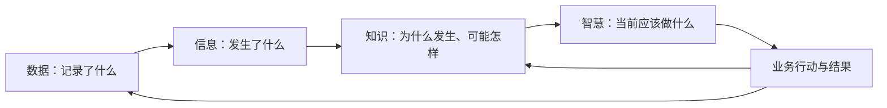

# 027 什么是数据的 DIKW 模型？

## 一句话回答

> DIKW 是用“数据（Data）—信息（Information）—知识（Knowledge）—智慧（Wisdom）”来理解认知与决策过程的一种常见框架：数据记录事实，信息把事实放入语境并回答“发生了什么”，知识通过规律、规则和经验解释“为什么、可能怎样”，智慧则结合目标、约束、价值和责任判断“应该做什么”。它有助于说明数据如何为业务增值，但不是数据自动逐级升级的技术流水线。

DIKW 常被画成一座金字塔，容易给人一种印象：只要收集足够多的数据，经过加工就会自然得到信息、知识和智慧。现实并非如此。

数据能否被正确解释，取决于业务语境和质量；规律能否成为可靠知识，取决于证据、验证和适用边界；最终采取什么行动，还需要结合目标、资源、风险、伦理和责任。数据治理可以让这条链路更可靠，却不能代替业务判断和组织决策。

## 一、DIKW 的四个层次分别是什么

DIKW 是 Data、Information、Knowledge 和 Wisdom 四个英文单词的首字母缩写，中文通常译为数据、信息、知识和智慧。

不同领域对四者的定义并不完全相同。它更适合作为理解数据价值的思考框架，而不是一套边界绝对清晰、所有组织都必须遵守的分类标准。

### 1. 数据：对事实的记录或表达

数据是对现实对象、事件和状态的记录，例如：

- 某监测站在10时的降雨量为每小时38毫米；
- 某积水点水深为18厘米；
- 某泵站当前运行两台水泵；
- 某客户在3月8日完成一笔订单；
- 某设备的轴承温度为82摄氏度。

数值、文字、时间、位置、图片、声音和关系都可以成为数据。数据并不一定是零散、无意义的符号，但一项记录脱离了对象、单位、时间、地点和采集方式，往往无法被正确使用。

### 2. 信息：放入语境以后能够说明什么

当数据与业务对象、时间、位置、单位、标准或参照值结合，就可以形成可理解的信息。

例如，“38”本身无法说明问题；明确它是“过去一小时某监测站降雨38毫米”，并与历史同期、预警阈值和周边监测站比较后，就能够说明该区域当前降雨较强。

信息通常帮助回答：

- 发生了什么；
- 何时、何地发生；
- 涉及哪些对象；
- 当前处于什么状态；
- 与正常值、目标值或历史情况相比有何差异。

把数据转化为信息，需要正确的语义、上下文和组织方式，不只是改变文件格式或制作可视化图表。

### 3. 知识：经过验证、可以解释和复用的认识

知识是在数据和信息基础上，通过业务规则、经验总结、统计分析、科学模型或机器学习等方式形成的、能够用于解释和推断的认识。

例如，长期观测和水文分析可能表明：当某区域短时强降雨叠加上游来水、地面不透水率较高且排水能力不足时，若干低洼路段容易在随后一小时出现积水。

知识通常帮助回答：

- 为什么会发生；
- 哪些因素存在关系；
- 在什么条件下可能再次发生；
- 可以采用什么规则、模型或方法处理。

知识不是看到一次相关现象就得出的结论。它需要有证据、验证方法、适用范围和失效条件，也可能随着新数据和业务变化被修订。

### 4. 智慧：在具体情境中作出合适判断和行动

DIKW 中的“智慧”最容易被说得玄妙。放到组织管理中，可以把它理解为：面对具体目标和情境，综合数据、知识、经验、资源、风险、伦理和责任，选择适当行动，并愿意对结果负责。

例如，系统预测某路段将在40分钟后形成严重积水，但城市管理者不能只按风险分数机械处置，还需要考虑：

- 该路段当前交通流量和人员安全；
- 附近医院、学校和应急通道是否会受影响；
- 泵站、抢险人员和交通疏导力量是否充足；
- 提前封路造成的影响与延迟处置的风险；
- 预测的不确定性及误报、漏报后果。

综合这些条件，决定启动哪一级响应、先处置哪里、是否封路并如何通知公众，才接近 DIKW 所说的“智慧”。

它不是单纯比知识多了一层数据，而是把“我们知道什么”转化为“此时应该怎样做”。

## 二、四个层次之间是什么关系

可以用一条简化链路理解 DIKW：

这张图表达的是认知和行动之间的关系，不意味着四层只能单向、依次产生。

### 1. 上层需要下层提供依据

没有可靠数据，信息可能错误；没有足够的事实和语境，知识容易变成未经验证的经验；没有知识和证据，决策容易依赖直觉。

### 2. 上层也决定下层需要什么

组织并不是先无目的地收集所有数据，再等待智慧出现。业务目标和决策问题会反过来决定需要记录什么数据、采用什么颗粒度、以什么频率更新，以及达到什么质量。

### 3. 行动结果会形成新的数据

采取行动以后，是否达到目标、出现了什么副作用、原有判断是否正确，都要继续记录。新的结果可以验证和修订已有知识，也会改变下一次决策。

因此，更真实的 DIKW 不是一座静止的金字塔，而是一个不断观察、理解、判断、行动和学习的循环。

## 三、从数据到信息，需要增加什么

数据成为信息，关键不是“加工得更多”，而是获得可以解释它的上下文。

### 1. 明确数据描述的对象和事件

数值属于哪一个客户、设备、地块、订单或监测站？记录的是下单、支付、发货还是退货？对象和事件不清，数据就无法正确关联。

### 2. 明确时间、位置、单位和颗粒度

同一个降雨量可能是瞬时值、小时累计值或日累计值；同一个销售额可能属于订单明细、订单、门店或区域。缺少时间和颗粒度，比较和汇总很容易出错。

### 3. 建立参照和业务语境

温度82摄氏度是否异常，要看设备类型、测点位置、运行负荷、正常区间和环境条件。信息往往来自数据与标准、目标、历史或其他对象之间的比较。

### 4. 验证数据质量和来源

传感器故障、单位错误、重复记录和数据延迟，都可能让解释失真。信息的可信度不能超过其数据基础。

数据标准、实体建模、元数据、质量治理和数据汇聚，正是在为这种“可解释的上下文”提供基础。

## 四、从信息到知识，需要增加什么

看到现象不等于掌握规律。信息成为可复用的知识，通常还需要以下过程。

### 1. 关联多个因素和业务环节

积水不能只看降雨量，还可能与地形、排水管网、河道水位、潮位、泵站状态和地表覆盖有关。跨来源关联能够帮助发现更完整的关系。

### 2. 形成规则、模型或解释

知识可以表现为业务规则、统计规律、因果认识、机理模型、算法模型、操作方法或专家经验。例如，水动力模型依据物理机制推演水流，机器学习模型则可能从历史样本中识别风险模式。

### 3. 经过验证而不是只看相关性

两个指标同时变化，不一定存在因果关系。规则和模型需要通过历史回测、现场核查、对照分析、专家评审或持续运行验证。

### 4. 说明适用范围和不确定性

一项规律可能只适用于特定区域、季节、设备类型或客户群体。知识应记录数据范围、假设条件、模型版本、准确性和已知限制，不能把局部经验当作普遍真理。

知识治理不只是把文档放进知识库。真正可用的知识需要能够追溯依据、理解条件、接受验证，并在环境变化后及时修订。

## 五、从知识到智慧，为什么不能完全自动化

知识可以说明可能发生什么、有哪些可选方法，却未必能独立决定当前应该采取什么行动。

### 1. 决策目标可能相互冲突

企业可能同时追求收入、利润、现金流和客户满意度；城市治理可能同时考虑安全、交通、成本和公共服务。不同目标的优先级需要管理判断。

### 2. 资源和时间存在约束

知道所有高风险点位，不代表有足够人员和设备同时处置。决策需要确定优先级，并考虑执行能力。

### 3. 风险偏好和价值判断不同

对于人身安全、医疗和重大公共风险，组织往往宁愿承担一定误报成本；对于普通营销推荐，则可以接受更高的不确定性。

### 4. 模型无法覆盖所有现实情况

历史数据中没有出现过的事件、临时道路施工、设备故障和政策变化，都可能让既有知识失效。人需要识别例外并承担决策责任。

### 5. 行动涉及权利、伦理和责任

贷款、用工、医疗、执法等决策会影响个人和组织权益。即使模型表现良好，也需要明确合法依据、申诉纠正和人工复核机制。

自动化系统可以执行规则、推荐方案，甚至在边界明确的场景中自动采取行动，但“自动执行”不等于“自动拥有智慧”。谁设定目标、批准规则、处理例外并对结果负责，仍然是治理问题。

## 六、案例：城市内涝防控中的 DIKW

假设某城市希望提高强降雨期间的内涝防控能力。

### 1. 数据层：记录客观观测和业务事件

相关数据可能包括：

- 气象雷达、天气预报和雨量站数据；
- 河道、水库、管网和道路积水监测数据；
- 地形高程、地表覆盖和排水设施数据；
- 泵站、闸门和抢险设备运行状态；
- 历史积水、交通中断、报警和处置记录。

这些数据来自不同系统，更新频率、空间尺度、坐标系和质量各不相同。

### 2. 信息层：形成当前态势

经过时间和空间匹配、单位统一、质量检查及指标计算，可以形成：

- 哪些区域正在经历强降雨；
- 河道和管网水位是否接近警戒值；
- 哪些泵站不可用或能力不足；
- 哪些道路已经积水，深度和变化趋势如何；
- 当前信息更新到什么时间，哪些测点可能异常。

这一步让管理人员从分散观测中看清“当前发生了什么”。

### 3. 知识层：预测风险并解释原因

结合历史案例、排水规则、水文水动力模型和算法，可以判断：

- 哪些区域可能在未来30分钟至2小时发生积水；
- 风险主要来自短时降雨、上游来水、地势低洼还是排水能力不足；
- 不同降雨情景下可能的积水范围、深度和持续时间；
- 启动泵站、打开闸门或提前疏导可能带来什么影响。

这些结论需要标明模型版本、数据时间、预测范围和不确定性，并通过实际事件持续验证。

### 4. 智慧层：选择行动并承担责任

管理者结合风险、人口、医院学校、交通流量、应急资源和处置预案，决定：

- 是否启动应急响应以及启动哪一级；
- 哪些点位优先布置抢险力量；
- 是否提前封闭道路、停运线路或疏散人员；
- 如何协调水务、交通、应急和属地部门；
- 何时向公众发布预警及如何避免引发新的风险。

### 5. 反馈层：用结果修订认识

降雨结束以后，还要记录实际积水、预警命中、处置时间、资源投入和业务影响，比较预测与实际，修订监测布点、数据质量规则、模型参数和应急预案。

这才形成从数据到行动、再从行动结果回到数据和知识的完整闭环。

## 七、DIKW 与数据治理是什么关系

DIKW 不是一套数据治理实施方法，也不能直接替代标准、质量、建模、安全和组织机制。它的价值在于提醒治理者：数据治理的目标不是停留在数据层，而是支持业务理解、知识形成和正确行动。

数据治理可以在各层之间发挥以下作用：

| 转化过程 | 数据治理需要解决的问题 |
| --- | --- |
| 现实业务到数据 | 记录哪些对象和事件，来源和责任是否清楚 |
| 数据到信息 | 语义、标准、单位、时间、空间、质量和关联是否可靠 |
| 信息到知识 | 规则和模型依据什么，是否可追溯、可验证、有适用边界 |
| 知识到行动 | 结果由谁使用，权限、风险、解释和责任如何落实 |
| 行动到反馈 | 是否记录采纳、执行和结果，并推动规则和模型持续改进 |

从这个角度看，数据标准、质量和汇聚并不是低层次、没有业务价值的工作。它们使事实能够被正确理解和关联，是形成可靠知识与判断的必要基础。

但只完成这些基础工作也不等于实现了价值。治理还要让指标、规则、模型和数据产品进入业务场景，支持行动并接受结果检验。

## 八、DIKW 与数据库、知识库和知识图谱是什么关系

DIKW 的四层是认知框架，不是四种软件系统的一一对应关系。

- 数据不只存放在数据库中，也可能存在文件、影像、传感器流和业务系统里；
- 数据仓库经过建模和汇总，可以提供信息和分析基础，但不会自动产生知识；
- 知识库可以保存文档、规则和经验，但其中的内容不一定都经过验证；
- 知识图谱可以结构化表达实体、关系和部分规则，但“存入图谱”不等于已经形成可靠知识；
- BI 可以帮助呈现信息和洞察，但仪表盘本身不能替代业务判断；
- AI 可以从数据和文档中提取模式、生成解释和建议，但输出仍需验证和治理。

因此，不能按“数据库存数据、BI存信息、知识库存知识、AI产生智慧”的方式机械对应。一个系统可以跨越多个层次，而任何技术都需要业务语境、质量、验证和责任机制。

## 九、AI 大模型会改变 DIKW 吗

AI 大模型显著增强了组织从数据和信息中提取、表达和应用知识的能力。例如，它可以：

- 帮助理解文档和非结构化数据；
- 关联术语、实体和上下文；
- 总结历史案例和操作经验；
- 辅助生成查询、分析和方案；
- 用自然语言解释指标、规则和模型结果；
- 根据情境提出行动建议。

但大模型生成内容的流畅程度不等于知识可靠性。模型可能使用错误数据、混淆时间和对象、忽略适用边界，也可能生成没有事实依据的解释。

AI 能够缩短“数据—信息—知识—建议”的处理链路，却不会消除以下问题：

- 数据是否准确、鲜活并获得合法授权；
- 业务概念、指标和实体是否统一；
- 结论能否追溯到可靠来源；
- 模型和规则是否适用于当前情境；
- 建议是否符合组织目标、伦理和风险边界；
- 谁批准行动并对结果负责。

所以，AI 可以成为认知和决策的有力助手，但不能仅凭生成能力就被等同于 DIKW 顶层的“智慧”。

## 十、DIKW 对数据治理实践有什么启发

### 1. 不要把采集数据当成价值终点

接入更多系统、存储更多数据，只完成了价值链的基础部分。还要回答这些数据能形成什么信息、支撑什么认识和行动。

### 2. 从决策和行动反推数据需求

先明确谁要作出什么决策、需要什么时效和可信度，再确定应采集哪些数据、构建哪些指标和模型。

### 3. 同时保留事实、解释和判断依据

不能只保存最终分数或标签。重要结论应能够追溯到源数据、计算规则、模型版本和当时的上下文，避免把判断伪装成原始事实。

### 4. 为知识设置适用边界和更新机制

规则、经验和模型都会过时。需要记录适用对象、时间、环境、版本和验证结果，并在业务变化后重新评估。

### 5. 把行动和结果纳入治理闭环

如果只记录系统给出的建议，却不记录是否采纳、如何执行和最终效果，就无法判断知识是否有效，也不能持续学习。

### 6. 明确自动化边界和决策责任

低风险、规则稳定的场景可以自动执行；高风险、权益影响大或不确定性高的场景，应保留人工确认、解释、申诉和纠正机制。

## 十一、常见误区

### 误区一：DIKW 是公认且边界严格的科学定律

DIKW 是一种广泛使用的概念框架，不同学者和领域对信息、知识与智慧的定义存在差异。使用它帮助思考即可，不必把四层变成僵硬的分类制度。

### 误区二：数据越多，就越接近智慧

低质量、缺少语境或与问题无关的数据会增加理解成本，甚至导致错误判断。数量不能替代语义、质量和业务目的。

### 误区三：经过清洗的数据就是信息，经过分析的信息就是知识

清洗改善数据质量，分析发现关系，但信息还需要业务语境，知识还需要验证、解释和适用边界。技术处理步骤不能与 DIKW 层次机械对应。

### 误区四：知识等于存放在知识库里的内容

文档、规则和经验被收集起来，只说明它们可被访问。内容是否正确、适用和经过验证，仍需治理。

### 误区五：有了知识图谱就拥有了知识

知识图谱能够组织实体、关系和规则，但图中的事实和关系仍可能过时或错误。技术名称中的“知识”不自动保证认知可靠。

### 误区六：算法预测就是智慧

预测提供决策依据，最终行动还要考虑目标、资源、风险、伦理和责任。算法可以辅助判断，不能自动承担责任。

### 误区七：DIKW 必须从下到上依次建设

业务问题和决策目标会反向决定需要哪些数据。实践中应上下往返、迭代验证，而不是先收集完所有数据再考虑用途。

### 误区八：智慧只能由人产生，所以不需要自动化

规则明确、风险可控的决策可以由系统自动执行。关键不是坚持人工或自动，而是明确边界、验证效果、处理例外并落实责任。

## 十二、实践检查清单

1. 当前成果处于事实记录、状态说明、规律认识还是行动建议的哪一层？
2. 数据是否包含对象、事件、时间、位置、单位和颗粒度等必要语境？
3. 信息是否建立在可靠来源、统一标准和可接受质量之上？
4. 规则、模型和经验是否有证据、验证方法及适用范围？
5. 是否区分观测事实、计算结果、预测判断和业务决策？
6. 重要结论能否追溯到源数据、规则和模型版本？
7. 决策是否结合业务目标、资源约束、风险和权益影响？
8. 自动化行动是否有明确边界、责任人和例外处理机制？
9. 建议是否真正进入业务流程并形成行动？
10. 是否记录采纳、执行和结果，用于验证原有认识？
11. 业务和环境变化时，知识、规则及模型是否及时更新？
12. 是否从实际决策需要反推数据范围、时效和质量要求？
13. AI生成的解释和建议是否经过来源、事实和适用性验证？

## 结语

DIKW 帮助我们看到，数据价值不在于记录本身，而在于数据能否被放入业务语境，形成可验证的认识，并帮助组织采取合适行动。

不过，从数据到信息，需要语义、关联和质量；从信息到知识，需要规律、验证和适用边界；从知识到智慧，需要目标、约束、价值判断和责任。任何一层都不会仅靠技术自动产生。

对数据治理而言，DIKW 最重要的启发不是把数据成果分成四个等级，而是打通“记录事实—理解状态—形成认识—支持行动—验证结果”的循环。数据治理既要夯实数据基础，也要让数据进入真实决策和业务流程，才能最终实现让数据为业务增值。

## 延伸阅读

- 第018问：数据和业务的关系是什么？
- 第019问：数据如何为业务增值？
- 第026问：什么是数据产品？
- 第028问：数据从何而来？
- 第033问：数据治理为什么必须关注数据质量？
- 第040问：元数据在数据治理中起到什么作用，业务元数据、技术元数据和运行元数据有什么区别？
- 第096问：AI 大模型与数据治理是什么关系？
