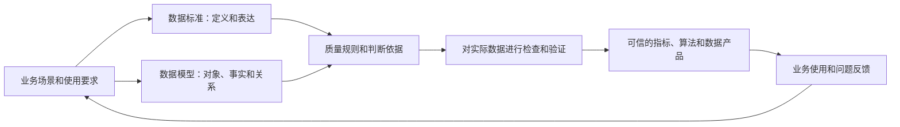

# 033 数据治理为什么必须关注数据质量？

## 一句话回答

> 数据质量是数据满足特定业务用途要求的程度。数据只有足够准确、完整、一致、及时，并且能够正确关联和解释，才可能成为业务判断、经营分析和算法计算的可靠依据。数据治理如果不能保证关键数据在关键场景中可信，汇聚的数据越多、计算的指标越多，反而越可能放大错误，无法真正为业务增值。

数据质量并不意味着追求“所有数据绝对正确”，也不等于把数据清洗得整齐美观。同一份数据用于年度趋势分析可能已经足够，用于分钟级风险预警却可能因为更新不及时而不合格；某个异常值可能是录入错误，也可能是真实发生的重要业务事件。

所以，判断数据质量不能脱离业务用途。需要先明确数据要支持什么行动、错误可能造成什么后果，再决定哪些数据必须达到什么要求。

## 一、为什么数据质量是业务价值的前提

### 1. 错误数据会导致错误行动

数据质量问题最终影响的不是数据库，而是业务判断和行动。例如：

- 把已经停产的设备显示为正常运行，可能延误维修和生产安排；
- 把已经完成回款的合同列入催收名单，会损害客户关系；
- 把正常利用的土地误判为低效用地，可能影响规划和处置决策；
- 把同一客户重复识别为多人，会夸大客户数量并影响营销投入；
- 遗漏风险事件，会使预警模型给出错误结论。

一个数字在报表中只是一个单元格，进入调度、审批、评价和资源配置以后，就会形成真实业务后果。

### 2. 不可信的数据不会被持续使用

业务人员一旦多次发现数据不准，通常会保留自己的表格，再通过电话、会议和人工核对确认结果。平台可能仍然在运行，报表也能够打开，但数据不再成为业务工作的依据。

这会形成恶性循环：使用者不信任数据，使用和反馈减少；问题更难被发现；治理团队又误以为“没有人反馈就是没有问题”。

### 3. 数据汇聚会放大质量影响

一条源数据错误只影响一个系统时，范围可能有限；同一数据被汇聚到数据仓库，再被多个指标、标签、模型、接口和数据产品复用后，错误会沿着数据链路扩散。

数据汇聚和复用提高了数据价值，也提高了质量问题的影响范围。因此，治理不能只关注“接入了多少数据”，还要知道哪些来源可信、经过什么转换、存在什么限制，以及问题会影响哪些下游业务。

### 4. AI 和算法不会自动纠正错误事实

算法可以发现异常模式，却不能保证输入事实正确。训练数据存在偏差，模型会学习偏差；客户身份重复，推荐和风险结果也会重复；事件时间错误，预测模型就会学习错误的先后关系。

AI 能力越强、自动化程度越高，错误结果进入业务流程的速度也可能越快。高质量数据不是所有 AI 项目成功的充分条件，却是结果可信的重要基础。

## 二、什么是数据质量

业界经常用“适合用途”（Fitness for Use）解释数据质量：数据质量不是脱离场景的固定分数，而是数据满足预期使用要求的程度。

这个定义包含三层含义。

### 1. 质量必须联系具体用途

一批每月更新的道路数据，用于年度规划研究可能足够及时，用于实时导航则显然不合格。精确到街道的客户地址可以支持区域销售分析，却不能满足上门配送需要。

脱离用途，很难判断“多久更新一次才算及时”、“允许多少缺失”、“位置误差多大可以接受”。

### 2. 质量要求应与业务风险相匹配

用于内部探索的数据可以容忍一定缺失和延迟，但必须说明限制；用于财务结算、公共安全、监管报送和自动审批的数据，通常需要更严格的准确性、完整性和可追溯性。

质量要求过低会带来业务风险，要求过高则可能付出远超收益的采集、核查和维护成本。

### 3. 质量是持续状态，不是一次验收结果

一批数据在项目验收时合格，不代表以后一直合格。业务规则、系统结构、编码、组织和数据分布都会变化，原来有效的规则也可能失效。

因此，更完整的表述是：

> 数据质量是在明确的业务场景、数据范围和时间条件下，数据持续满足使用要求的程度。

## 三、通常从哪些方面判断数据质量

数据质量有多种分类方法。本书不追求建立唯一维度体系，下面选择实践中最常用、也最便于理解的方面。

### 1. 完整性

完整性关注应该存在的数据是否存在，包括：

- 关键记录是否遗漏；
- 必填字段是否缺失；
- 应覆盖的区域、对象和时间段是否完整；
- 业务对象之间的必要关系是否缺失；
- 汇聚批次和文件是否到齐。

只计算字段空值率并不能代表完整性。一张表的字段全部非空，仍可能漏掉某个区县的整批数据；一条项目记录属性完整，却可能没有关联对应地块。

### 2. 准确性

准确性关注数据是否正确反映现实业务事实。例如，合同金额是否与已生效合同一致，地块边界是否位于真实位置，车辆状态是否与实际运行情况相符。

准确性往往最重要，也最难仅靠技术自动判断。格式合法、取值在范围内，并不能证明事实正确。验证准确性通常需要与权威来源、现场事实、其他独立来源或业务过程进行核对。

### 3. 一致性

一致性关注相关数据之间是否相互矛盾，例如：

- 同一客户在两个系统中的名称和状态不同；
- 合同主表金额与明细合计不一致；
- 地块属性中的面积与空间计算面积差异过大；
- 同一指标在两张报表中使用不同统计范围；
- 已经签收的运单仍显示“运输中”。

一致并不自动等于准确。两个系统可能共同复制了同一个错误值。因此，一致性解决的是相互矛盾问题，准确性解决的是是否符合事实问题。

### 4. 及时性与鲜活度

及时性关注数据是否在业务要求的时间窗口内产生、到达、处理和发布；鲜活度进一步关注当前数据是否仍能代表已经变化的业务状态。

某张表今天完成了同步，但同步的来源本身停留在上个月，它在技术上“刚刚更新”，在业务上仍然不鲜活。第029问已经详细讨论鲜活度，本问只强调：数据过期同样是一种质量问题。

### 5. 有效性

有效性关注数据是否符合已经确认的结构和取值约定，例如：

- 类型、长度和格式是否正确；
- 编码是否属于允许的码值集；
- 数值是否在合理范围内；
- 单位、时间和坐标参考是否符合标准；
- 状态转换是否满足业务规则。

有效性通常容易通过规则自动检查，但“符合格式”不能代替“符合事实”。一个格式正确的身份证号码，仍可能不属于对应客户。

### 6. 唯一性

唯一性关注同一业务事实或对象是否被不恰当地重复记录，以及应该唯一的标识是否重复。

技术记录重复与业务对象重复并不完全相同。两条订单明细可能内容相同却代表两次真实购买；同一客户也可能在多个系统中拥有不同编号。判断唯一性必须先明确对象身份和事实颗粒度。

### 7. 关联完整性

数据为业务增值往往依赖跨对象、跨系统关联。订单找不到客户、项目找不到合同、地块找不到权属记录，即使每张表内部都很整齐，也无法形成完整业务认识。

关联质量需要检查标识、关系、时间有效范围和颗粒度，不能只看两个字段能否通过 SQL 连接。

### 8. 空间质量

空间数据还需要关注：

- 坐标参考和坐标范围是否正确；
- 几何是否为空或无效；
- 点、线、面的位置和形态是否合理；
- 相邻区域是否存在不合理的缝隙和重叠；
- 管线、道路、地块等对象的拓扑关系是否满足业务要求；
- 采集精度和空间尺度是否适合目标用途。

空间上相交不一定代表业务上关联，几何有效也不代表位置准确。空间质量同样要联系具体业务语义。

## 四、数据质量问题从哪里产生

数据质量问题可能出现在数据生命周期的任何环节，不能把责任全部归给源系统，也不能全部留给数据仓库清洗。

| 环节 | 常见问题 | 示例 |
| --- | --- | --- |
| 业务定义 | 概念、边界和口径不清 | 不同部门对“有效客户”理解不同 |
| 人工录入 | 错填、漏填、随意使用默认值 | 未知金额统一填为`0` |
| 设备采集 | 故障、漂移、断流和重复上报 | 传感器长时间返回同一读数 |
| 源系统设计 | 缺少约束、对象身份不稳定 | 同一客户可以重复建档 |
| 系统集成 | 接口字段和状态映射错误 | “已取消”被映射为“已完成” |
| 数据汇聚 | 漏批、重复、迟到和增量失效 | 某次断点恢复后重复加载 |
| 标准化处理 | 单位、编码、时间或坐标转换错误 | 吨被当作千克直接使用 |
| 数据建模 | 颗粒度和关系设计错误 | 订单与多次支付直接关联导致金额重复 |
| 指标计算 | 过滤范围、公式和历史口径不一致 | 退款只在部分报表中扣除 |
| 业务变化 | 标准、规则和模型未同步调整 | 新增状态没有进入映射规则 |
| 数据使用 | 忽略适用范围和版本 | 用历史快照判断当前状态 |

同一个异常也可能有不同根因。例如“地块用途为空”可能是业务尚未确定、源系统漏录、字段映射遗漏、增量任务失败，或者该类地块本来就不适用这一属性。未经定位就自动补值，会掩盖真实问题。

## 五、数据标准、数据模型与数据质量是什么关系

三者相互支撑，但解决的问题不同：

- **数据标准**回答数据应该如何定义和表达；
- **数据模型**回答业务对象、事实和关系应该如何组织；
- **数据质量**回答实际数据是否满足这些定义、关系和业务用途。

例如，标准可以定义“计划到达时间”的业务含义、数据类型和时区；模型确定它属于哪一个运输过程和事实颗粒度；质量规则再检查它是否缺失、是否晚于发车时间，以及相关数据是否按时到达。

没有标准，质量判断容易各说各话；没有模型，规则难以理解对象、颗粒度和关系；没有质量检查，标准和模型又可能只停留在文档中。

但不是所有质量规则都能直接从数据标准中推导。类型、长度、值域和码值等规则可以依托数据元定义，跨字段、跨表、空间关系和复杂业务状态则需要结合模型与业务规则另行确认。

## 六、为什么不能只看数据质量分数

把多项检查汇总成质量分数，便于观察趋势和快速发现变化，但一个总分无法完整表达数据是否可用。

### 1. 平均分会掩盖关键问题

一百项规则中九十九项通过，一项关键主键规则失败，简单平均仍可能得到99分。但如果客户身份无法唯一识别，相关客户数、标签和服务都可能不可信。

### 2. 总体结果会掩盖局部问题

全市数据完整率达到98%，可能仍有一个区县完全没有上报；全年平均更新及时率很高，也可能在某个重要业务周期连续中断。

### 3. 不同规则的重要程度不同

备注字段少量缺失与合同金额错误，业务影响显然不同。规则严重程度、数据范围和业务风险应当进入解释，不能只做等权平均。

### 4. 分数必须能够追溯

使用者需要知道：

- 分数对应哪项数据、哪个版本和时间范围；
- 使用了哪些规则和阈值；
- 哪些记录没有通过；
- 对哪些指标、服务和业务场景产生影响；
- 与上次相比为什么发生变化。

因此，质量分数适合做摘要和趋势信号，不能代替具体规则、失败明细、业务影响和整改状态。

## 七、案例：低效用地识别中的数据质量

某地希望汇聚土地权属、规划用途、供地合同、建设项目、实际利用、企业经营和空间位置等数据，识别需要盘活、调整或再开发的低效用地。

### 1. “低效”不是某个字段的直接取值

低效用地识别通常需要综合判断：

- 土地当前由谁使用，权利状态是否有效；
- 规划用途与实际用途是否一致；
- 项目是否按期开工、竣工和投产；
- 开发强度、投入产出和单位面积效益如何；
- 是否长期闲置，闲置原因是什么；
- 是否存在政策、历史遗留或公共利益等特殊情形。

这意味着识别结果依赖多个部门、多个时间阶段和空间对象之间的正确关联。某一张表内部通过检查，并不代表最终判断可靠。

### 2. 不同质量问题会怎样影响判断

| 质量问题 | 可能造成的业务影响 |
| --- | --- |
| 同一地块在不同系统中编码不一致 | 权属、规划、项目和经营数据无法关联 |
| 权属变更未及时同步 | 把整改任务分派给错误责任主体 |
| 规划用途采用不同版本码值 | 把合理利用误判为用途不符 |
| 地块边界重叠、缝隙或整体偏移 | 面积重复计算，项目与地块错误匹配 |
| 已竣工项目仍显示“在建” | 错误判断项目长期未完成 |
| 投资或产出指标缺失 | 无法可靠评价土地利用效益 |
| 金额单位和统计周期不一致 | 单位面积效益相差数倍 |
| 历史权属和边界没有生效时间 | 无法判断某一时点的真实状态 |
| 一个项目涉及多个地块但关系不完整 | 项目投入被错误分摊或遗漏 |

这些错误可能导致两种相反结果：把正常利用的地块列入低效名单，或者漏掉真正需要盘活的地块。前者会增加核查成本并影响企业，后者会错失管理和发展机会。

### 3. 质量要求必须从识别用途反推

如果识别结果只用于内部摸底，可以允许部分经济指标暂缺，并把结果标记为“待核查”；如果结果将直接进入处置、招商或政策支持流程，就必须提高权属、边界、状态、指标和历史时点的可信要求，并设置人工复核。

因此，质量规则不应只是“地块编码非空”“面积大于零”。还需要包括：

- 地块身份能否跨来源稳定匹配；
- 权属、规划、供地和项目关系是否完整；
- 当前状态是否采用相应时点有效的记录；
- 属性面积与空间面积差异是否在允许范围内；
- 项目状态和时间顺序是否符合业务过程；
- 经济指标是否采用相同单位、周期和统计范围；
- 识别结果是否能够追溯到来源数据、规则和版本。

### 4. 不能为了通过检查而修改事实

发现产出数据缺失时，不能简单填零。零表示没有产出，缺失则表示尚未获得信息，两者会得出完全不同的低效判断。

发现地块边界重叠，也不能由技术人员直接裁切并覆盖权威数据。重叠可能来自坐标问题、历史权属争议、不同业务边界或真实的立体权利关系，需要由相应责任方确认。

质量治理的目标是让问题显现、影响可知、责任明确并推动正确处理，而不是让所有检查结果在表面上变绿。

## 八、是否所有数据都要达到同样的质量

不需要，也不现实。组织应把有限治理资源优先用于高价值、高风险和高复用的数据。

可以根据以下因素确定质量要求：

- **业务用途**：数据支持观察、分析、审批还是自动执行；
- **错误后果**：错误会造成轻微返工，还是财务、安全和合规风险；
- **使用范围**：只供一个团队探索，还是被全组织和外部机构复用；
- **使用频率**：偶尔使用还是持续进入核心流程；
- **时效窗口**：月度、每日、分钟级还是实时；
- **可替代性**：是否存在其他来源可以交叉核验；
- **整改成本**：重新采集、现场核查和源系统改造的成本；
- **监管要求**：是否存在必须满足的法定或行业要求。

不同场景的重点也不同：

| 场景 | 通常更关注的质量方面 |
| --- | --- |
| 财务结算 | 准确性、完整性、一致性和可追溯性 |
| 实时交通预警 | 及时性、位置准确性、连续性和事件关系 |
| 客户营销 | 身份唯一性、联系方式有效性和标签鲜活度 |
| 历史档案 | 来源、版本、完整性和长期可解释性 |
| 探索性分析 | 覆盖范围、已知偏差和使用限制 |
| 自动审批或控制 | 关键字段准确性、规则一致性和失败保护 |

质量目标不是越高越好，而是与业务价值、风险和成本相匹配。对不满足要求但仍有参考价值的数据，可以明确标注质量状况和使用边界，而不是一律禁止使用或假装没有问题。

## 九、数据质量由谁负责

“数据质量人人有责”表达了共同参与的重要性，但如果没有具体分工，往往会变成无人负责。

### 1. 业务责任人

确认数据含义、业务规则、重要程度和可接受范围，判断异常究竟是错误、例外还是真实业务事实。

### 2. 源系统和数据生产责任人

保证业务生成和录入环节的约束、说明及稳定供数，处理应在源头修正的问题。

### 3. 数据工程人员

保证采集、汇聚、转换、建模和计算链路正确，避免漏数、重复、错误映射和处理逻辑引入新的问题。

### 4. 数据治理和质量运营人员

组织规则管理、检测、问题分派、影响分析和跨部门协调，推动问题得到持续处理。

### 5. 数据使用者

按数据说明和适用范围使用数据，并反馈实际业务中发现的错误、变化和新要求。

质量平台可以自动发现一部分问题，却不能代替责任主体。第034问将继续讨论如何把检测结果转化为问题认领、整改、复核、关闭和持续监控的完整闭环。

## 十、AI 可以怎样辅助数据质量工作

AI 可以提高问题发现和分析效率，例如：

- 根据数据定义和样本推荐质量规则候选；
- 识别异常值、重复模式、未知码值和分布变化；
- 发现不同字段和来源之间可能存在的矛盾；
- 生成检查 SQL 和问题说明；
- 归纳大量失败记录的共同特征；
- 结合血缘分析问题可能影响的指标和数据产品；
- 根据历史问题推荐可能的责任环节和排查方向。

但 AI 不能仅凭统计异常判断业务事实错误。罕见值可能对应重大事件，高相关字段不一定具有业务约束，历史处理经验也可能不适用于新场景。

更合理的分工是：AI 发现候选和辅助定位，规则引擎提供可重复验证的证据，业务责任人确认语义与影响，治理流程推动整改。AI 生成的 SQL 还必须经过权限、成本和逻辑检查，敏感数据也不能未经授权进入外部模型。

## 十一、常见误区

### 误区一：数据质量就是检查空值

空值检查只是完整性的一小部分。数据还可能错误、重复、过时、自相矛盾或无法正确关联。

### 误区二：通过格式检查，数据就是正确的

格式、类型和值域只能验证数据是否符合约定，不能证明它真实反映业务事实。

### 误区三：质量问题都应该在数据仓库中修复

汇聚层可以进行可追溯的标准化和必要转换，但源头事实错误应尽量回到责任系统整改。长期在下游静默修补，会留下多套事实。

### 误区四：数据质量越高，业务价值一定越高

高质量的无用数据仍然不能产生价值。质量目标必须围绕业务场景，治理成本也要与收益和风险匹配。

### 误区五：质量分数高，就可以放心使用

综合分数可能掩盖关键字段、局部区域和重要批次的问题。必须能够查看规则、范围、失败明细和业务影响。

### 误区六：质量检查在项目上线前做一次即可

数据、系统和业务规则持续变化，质量也会变化。重要数据需要持续检测和反馈。

### 误区七：质量规则由技术人员制定就够了

技术人员可以实现规则，但准确性、阈值、适用范围和例外情况必须由业务人员参与确认。

### 误区八：发现异常就应自动删除或修正

异常可能是真实事件，缺失也不等于零。未经确认自动处理可能破坏事实和可追溯性。

### 误区九：发现的质量问题越少，治理效果越好

问题少可能因为质量提高，也可能因为规则覆盖不足、检测没有运行或使用者不再反馈。应结合覆盖率、问题影响和整改效果判断。

### 误区十：AI 可以自动判断数据是否正确

AI 擅长发现模式和异常候选，但业务事实、责任和可接受范围仍需结合来源证据与业务规则确认。

## 十二、实践检查清单

1. 是否明确数据服务于什么业务场景、行动和时间窗口？
2. 是否识别了对结果影响最大的对象、字段、指标和关系？
3. 是否根据用途选择完整性、准确性、一致性、及时性、有效性、唯一性、关联和空间质量等重点维度？
4. 质量规则是否来自已经确认的数据标准、模型和业务要求，并说明适用范围与例外？
5. 是否同时检查字段内容、记录覆盖、业务关系、时间状态和必要的空间关系？
6. 是否能够区分源头、汇聚、转换、建模、计算和使用环节产生的问题？
7. 质量结果是否记录数据范围、版本、检测时间、规则版本和失败明细，能够追溯原始事实？
8. 是否按照业务风险和治理成本设定质量目标，而不是要求所有数据达到同一水平？
9. 综合质量分是否能够下钻到关键规则、局部范围、业务影响和责任主体？
10. 质量发现是否真正推动问题处理、业务反馈和治理改进，而不是只生成报告？

## 小结

数据质量不是数据表是否整齐，也不是一个脱离场景的固定分数，而是数据能否在特定业务用途下被可信地理解、关联和使用。

数据标准给出定义，数据模型组织对象和关系，质量工作则持续验证实际数据是否满足这些约定和业务要求。质量问题可能产生于业务定义、源头录入、设备采集、系统集成、数据汇聚、建模计算和数据使用的任何环节，不能只依靠下游清洗解决。

关注数据质量的最终目的，不是得到更漂亮的检测报告，而是避免错误数据进入分析、决策和业务行动，让业务人员敢于使用治理成果。第034问将进一步讨论，如何让质量问题从发现走向责任认领、整改、复核和持续运营，形成真正的数据质量闭环。

## 延伸阅读

- [第019问：数据如何为业务增值？](../03-业务价值与场景篇/019-数据如何为业务增值.md)
- [第029问：数据鲜活度为什么重要，应该怎样保持？](029-数据鲜活度为什么重要应该怎样保持.md)
- [第032问：数据标准在数据治理中起到什么作用？](032-数据标准在数据治理中的作用.md)
- [第034问：数据治理应如何形成数据质量闭环？](034-数据治理应如何形成数据质量闭环.md)
- [第037问：什么是数据可观测性（Data Observability），它和数据质量有什么区别？](037-什么是数据可观测性及其与数据质量的区别.md)
- [第041问：数据血缘是什么意思，它与任务依赖关系有什么区别？](../05-元数据、资产与语义篇/041-数据血缘与任务依赖关系.md)
