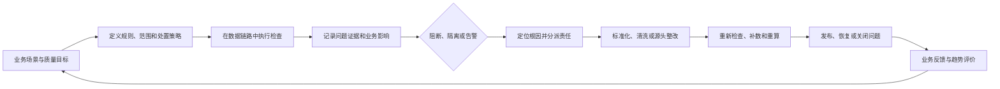

# 034 数据治理应如何形成数据质量闭环？

## 一句话回答

> 数据质量闭环是围绕明确的业务用途建立质量要求，在数据产生、接入、加工、发布和使用的各个阶段持续检查；发现问题后，根据业务影响采取阻断、隔离或告警措施，定位根因并明确责任，通过标准化、数据清洗或源头整改完成修复，再重新检查、重算和发布，最终用业务反馈验证问题是否真正解决的持续过程。

一条质量规则运行成功，只能说明完成了一次检查；发现一批异常，只能说明获得了问题线索；修改了几条数据，也不代表根因已经消除。只有问题能够进入责任明确的处理过程，修复结果经过验证，受影响的下游得到更新，同类问题不再反复发生，才形成真正的闭环。

数据质量闭环的重点不是把所有检查结果都变成工单，而是让关键质量问题能够被发现、判断、处理和预防，并使数据继续可靠地服务业务。

## 一、为什么“发现问题”不等于形成质量闭环

不少项目已经建设了质量规则、检测任务和质量大屏，却仍然反复出现同样的问题。常见原因包括：

- 规则失败以后只有统计数字，没有具体问题范围；
- 问题被统一分给数据团队，真正能够修复的人并未参与；
- 下游修改了结果，源系统仍在不断产生同类错误；
- 问题数据修复后，没有重新计算指标和更新数据产品；
- 规则阈值不合理，告警过多，最终没有人再关注；
- 问题被人工标记为完成，却没有再次检查；
- 质量任务自身执行失败，被误认为“没有发现问题”；
- 业务人员在使用中发现错误，却没有正式反馈入口。

这些情况下，组织完成了“检测”，却没有完成“治理”。

闭环至少要回答：

1. 什么数据在什么业务场景下必须达到什么要求？
2. 在数据链路的哪个阶段进行检查？
3. 规则失败后，应该阻断、隔离还是继续运行？
4. 问题影响哪些指标、服务和业务行动？
5. 谁能够判断问题，谁能够修复根因？
6. 应该做标准化转换、清洗结果，还是整改源系统？
7. 修复后如何重新检查、补数、重算和发布？
8. 如何确认同类问题不会继续发生？

缺少其中任何关键环节，质量工作都可能停留在报告和临时修补层面。

## 二、数据质量闭环包括哪些环节

一条完整的质量治理链路可以概括为：

### 1. 明确质量目标

先从业务用途反推关键数据、可接受范围和错误后果。没有业务目标，就无法合理设定阈值，也无法判断一项问题是否需要阻断。

### 2. 定义可执行规则

将业务要求转化为能够检查的对象、条件、范围和频率，并同时确定严重程度和失败处置策略。

### 3. 执行检查并保留证据

记录检查的数据范围、版本、规则版本、执行时间、失败数量和必要样本。检查结果必须能够重复验证，而不能只保留一个综合分数。

### 4. 判断影响并采取控制措施

根据问题对业务结果的影响，决定是否阻断发布、隔离局部数据、继续运行并告警，或者进入受控人工放行。

### 5. 定位根因和责任

判断问题产生在业务定义、源头录入、采集、汇聚、映射、建模、计算还是使用环节，把问题交给能够修复根因的责任主体。

### 6. 修复并重新验证

完成标准化、清洗、补录、程序修复或源系统整改后，重新执行同一规则，并检查是否引入其他问题。

### 7. 更新下游和形成反馈

必要时重新汇聚、重算指标、刷新标签和重新发布数据产品，再根据业务使用结果修订规则、阈值和责任安排。

闭环不是一条只运行一次的直线，而是随着数据和业务变化持续循环。

## 三、数据质量规则从哪里来

质量规则不能只由技术人员凭经验编写，也不能简单把所有字段都设置为非空。常见来源包括：

### 1. 数据标准和数据元

数据类型、长度、格式、单位、值域、码值和允许为空条件，可以形成基础符合性规则。例如，运输状态必须属于已发布码值集，货物重量必须以千克表示且不得为负数。

### 2. 业务规则

业务过程决定大量跨字段和跨对象规则。例如，签收时间不得早于发货时间，退款金额不得超过对应支付金额，已注销客户不能产生新的有效合同。

### 3. 数据模型

实体身份、事实颗粒度和对象关系提供唯一性、关联完整性和汇总检查依据。例如，每条销售事实必须关联一个有效产品，同一订单行不能因多次支付关联而重复计算。

### 4. 指标口径和勾稽关系

指标的分子、分母、时间范围和汇总关系可以形成对账规则。例如，渠道销售额汇总应与集团总销售额在同一口径下相符，期初余额加本期发生额应与期末余额形成合理关系。

### 5. 法规、行业和交换要求

监管报送、法定计量、行业交换和安全要求可能规定必须满足的字段、编码、完整性和时效标准。

### 6. 数据探查和历史问题

数据探查可以发现未知码值、异常分布、重复模式和时间断档，历史问题与业务反馈也能暴露原有规则没有覆盖的风险。

需要注意：探查发现的异常只是规则候选。只有确认了业务含义、适用范围和合理阈值以后，才能成为正式质量规则。

### 7. 数据产品的服务承诺

数据产品承诺每日几点更新、覆盖哪些范围、关键字段达到什么要求，也应转化为发布前质量门槛和运行监控条件。

一条正式规则不应只有检查表达式，还应说明：

- 适用的数据对象和范围；
- 对应的业务要求和责任人；
- 规则版本和生效时间；
- 检查频率和执行位置；
- 严重程度和允许阈值；
- 失败后采取什么措施；
- 是否存在经过批准的例外情况。

## 四、质量检查应该在哪些阶段开展

质量检查不应集中在数据仓库的最后一步。数据在每个阶段都可能产生不同问题，因此需要“质量左移”和全链路检查相结合。

### 1. 业务录入和源头产生阶段

在业务事实产生时进行必要约束，通常成本最低，也最容易由当事人确认。例如：

- 必填字段和基础格式校验；
- 业务对象身份和重复建档检查；
- 金额、数量和日期范围检查；
- 状态转换和审批条件检查；
- 设备采集范围、频率和基本有效性检查。

但源头系统不应为了满足所有下游分析而承载大量复杂规则。它首先保证自身业务交易正确，跨系统规则还需要在治理链路中执行。

### 2. 数据接入和原始落地阶段

数据进入治理平台时，优先检查接收是否完整、结构是否可识别：

- 计划文件、分区和业务批次是否到齐；
- 表结构、字段类型和接口契约是否变化；
- 记录数、文件大小和时间范围是否异常；
- 增量是否重复、断档或出现异常回退；
- 来源、批次、截止时间和版本是否完整记录。

这一阶段应尽量保留来源原貌。原始数据可以落入受控区域供排查，但不代表已经有资格进入正式数据产品。

### 3. 标准化和转换之后

字段映射、码值转换、单位换算、时间处理和坐标转换都可能引入新问题，需要检查：

- 是否出现无法映射的字段和码值；
- 转换前后数量和关键数值是否合理；
- 单位、精度和时间基准是否一致；
- 关联成功率和无法关联记录是否异常；
- 原始值、标准值和转换规则是否可追溯。

### 4. 建模和指标计算之后

这一阶段重点检查业务颗粒度、关系和汇总结果：

- 事实是否因一对多关联被重复放大；
- 维度和业务对象是否存在无效引用；
- 明细、汇总和指标之间能否对账；
- 不可累加度量是否被错误相加；
- 历史版本和生效时间是否被正确使用；
- 补数和迟到数据是否进入相应统计周期。

### 5. 数据产品发布之前

发布前质量门禁要回答：这批数据是否达到对用户承诺的质量和鲜活度，是否可以替换上一可信版本。

关键检查未通过时，可以完成原始落地和问题分析，但不应把不合格结果发布为正式可信数据。

### 6. 发布和业务使用之后

有些问题只有在真实使用中才能被发现，例如业务人员发现名单中对象已经变更、指标趋势违背业务常识，或者一个新业务状态没有进入规则。

发布后要接收业务反馈，观察质量趋势、未知取值和数据漂移。第037问将进一步讨论数据可观测性如何发现运行中的未知异常，本问重点关注这些发现如何进入质量治理闭环。

可以概括为：

> 源头检查用于预防，接入检查用于守住边界，加工检查用于验证转换，发布检查用于控制风险，使用反馈用于发现规则之外的问题。

## 五、发现问题后是否应该中断数据流水线

不应采用“只要失败就全部停止”或“全部记录但继续运行”的单一策略。正确做法是根据业务风险、问题范围和数据用途，预先确定阻断、隔离和告警策略。

### 1. 阻断

阻断适用于问题会使下游结果明显错误，或者可能造成重大业务、财务、监管和安全风险的情况，例如：

- 来源结构变化导致字段错位；
- 核心业务批次完全缺失；
- 关键主键大量重复；
- 财务金额无法对账；
- 关键对象无法关联；
- 规则失败会导致错误审批、监管报送或自动控制。

需要明确：

> 阻断正式发布，不一定要拒绝原始数据落地。

原始数据可以进入保留区，供问题定位和重新处理；但不能覆盖上一份可信数据，也不能继续进入正式指标、标签和对外服务。

如果上一可信版本仍可临时使用，应明确显示其数据截止时间和滞后状态，不能把旧数据伪装成最新结果。

### 2. 隔离

当问题能够限定在部分记录、文件、分区、来源或业务批次时，可以把受影响范围隔离，让其他合格数据继续处理。

例如，某个渠道出现少量未知商品编码，可以隔离相应记录并继续处理其他渠道。但必须说明被隔离的记录数、金额、覆盖范围和指标影响，不能静默丢弃以后仍宣称结果完整。

隔离应尽量作用于最小合理范围：

- 单条记录；
- 一个文件或分区；
- 一个来源系统；
- 一个业务批次；
- 一个指标或数据产品版本。

如果局部问题已经影响总体结果的可信度，就应提升为发布阻断，而不是为了保持任务“成功”强行继续。

### 3. 告警并继续

对于不影响核心结果、业务允许降级使用的问题，可以记录问题并继续，例如：

- 非关键备注字段少量缺失；
- 个别低风险异常值等待后续核实；
- 探索性分析存在已知覆盖限制；
- 一项辅助标签暂时无法生成，但核心指标不受影响。

继续运行不等于忽略问题。结果仍应携带质量状态、影响范围、责任人和处理期限，必要时向使用者展示风险说明。

### 4. 受控人工放行

少数情况下，业务责任人可能基于现实需要接受已知风险并临时放行。放行至少要记录：

- 放行原因和业务必要性；
- 问题范围和预计影响；
- 批准人和批准时间；
- 适用的数据版本和使用场景；
- 到期时间或后续整改要求；
- 是否需要通知使用者。

人工放行不能成为绕过质量规则的日常手段，也不能永久有效。

### 5. 质量检查自身失败不能视为通过

还要区分“数据没有通过规则”和“质量检查任务没有成功执行”。后者没有形成完整质量事实，不能被解释为零问题或质量通过。

对关键数据产品，检查任务失败时通常应停止正式发布或保持上一可信版本；低风险场景可以告警并安排重试，但必须明确本次质量状态未知。

质量门禁策略应在规则发布时确定，而不是问题发生后临时争论。它至少要包括严重程度、失败阈值、控制范围、是否允许人工放行以及修复后的恢复条件。

## 六、数据标准化、数据清洗和数据整改有什么区别

“数据清洗”在实践中常被宽泛地用来描述各种转换和纠错工作。为了避免把不同逻辑混在一起，本书作如下区分。

| 动作 | 主要解决的问题 | 典型示例 |
| --- | --- | --- |
| 数据标准化 | 不同但合理的来源表达如何对齐到共同标准 | 吨转换为千克，来源状态映射为统一码值 |
| 数据清洗 | 已经确认的数据缺陷如何在受治理的数据结果中处理 | 删除确定的传输重复、规范可确定的错误日期 |
| 数据整改 | 数据错误的业务事实或产生机制如何从根因修复 | 在源系统补录权属信息、修复重复建档流程 |

### 1. 标准化不一定是在修正错误

来源系统以吨记录重量，集团分析以千克为统一单位，只要来源单位定义清楚，源数据并没有错。通过确定规则换算为千克，属于标准化。

同样，外部平台使用`SIGNED`表示已签收，企业标准使用代码`40`，建立映射也是标准化，而不是纠正来源错误。

### 2. 数据清洗只适合处理能够确定的问题

可以自动处理的情况通常具有明确证据和稳定规则，例如：

- 传输重试造成、可以通过稳定业务键识别的重复记录；
- 含义明确但表现形式不统一的日期和文本；
- 已经确认的错误编码及其确定映射；
- 不影响业务含义的控制字符和多余空格。

异常值、缺失值和冲突事实如果无法自动确认，就应隔离或交由责任人判断，不能根据统计特征猜测修改。

### 3. 数据整改应尽量消除根因

如果同一客户不断被重复建档，下游匹配只能暂时缓解问题。真正的整改还应包括修正客户身份规则、合并或标记重复客户、改善录入流程，并重新检查受影响的订单和标签。

### 4. 原始事实和处理过程必须可追溯

无论标准化还是清洗，通常都不应静默覆盖权威源数据。应保留必要的原始值、处理规则、版本、执行时间和输出结果，使处理可以复核和重新计算。

确需修改源系统业务事实时，应由有权限和责任的源系统流程完成，而不是让下游治理任务直接改写源库。

## 七、如何形成一个可处理的数据质量问题

一次检查失败是质量观察结果；质量问题则是需要被持续跟踪、判断和处理的当前状态。二者不能简单等同。

一个可处理的质量问题至少应包含：

- 对应的数据项、表、字段、对象或指标；
- 数据来源、业务范围、批次和版本；
- 失败规则、规则版本和执行时间；
- 失败数量、比例和必要样本；
- 严重程度和是否触发质量门禁；
- 影响的模型、指标、服务、产品和业务流程；
- 问题的业务责任人和技术责任人；
- 当前处理状态、时限和处理记录；
- 修复方式、复核证据和关闭依据。

### 1. 不要为同一问题反复创建工单

同一规则、同一对象范围连续多次失败，通常应更新同一个当前问题的最近发现时间、失败规模和状态，而不是每天创建一张同义工单。每次执行结果仍需保留，作为问题变化的历史证据。

### 2. 检查失败不一定都是数据错误

还要判断：

- 规则是否仍适用于当前业务；
- 阈值是否设置合理；
- 数据范围和版本是否选择正确；
- 检查程序是否完整执行；
- 异常是否属于经过批准的业务例外。

确认规则本身错误时，应修订规则，不能要求数据迁就错误规则。

### 3. 忽略问题也必须有依据

问题可以因为业务例外、风险接受或数据退出使用而不再整改，但必须记录原因、批准人、适用范围和时间。以后数据或规则再次变化时，需要重新判断，而不是永久隐藏。

## 八、如何定位根因并明确责任

质量问题表现在数据上，根因却可能位于完全不同的环节。

| 根因类型 | 典型问题 | 主要责任方向 |
| --- | --- | --- |
| 业务定义 | “有效订单”口径不一致 | 业务责任人与治理决策机制 |
| 源头录入 | 必填信息漏录、对象重复建档 | 业务操作和源系统责任人 |
| 设备采集 | 断流、漂移和故障值 | 设备及采集系统责任人 |
| 数据接入 | 批次遗漏、重复同步和结构变化未处理 | 数据汇聚责任人 |
| 标准映射 | 新码值未映射、单位配置错误 | 标准与映射维护责任人 |
| 数据建模 | 颗粒度错误、关系重复 | 数据模型责任人 |
| 指标计算 | 公式、过滤和历史口径错误 | 指标业务与开发责任人 |
| 数据使用 | 使用了过期版本或超出适用范围 | 数据产品和使用责任人 |

定位根因时可以结合数据血缘、执行日志、源目标对账、规则历史和业务事件，逐步确定问题最早出现在哪个节点、影响从哪里开始扩散。

分派责任的原则不是“谁发现谁负责”，也不是把所有问题交给数据部门，而是：

> 判断权交给能够确认业务事实的人，修复任务交给能够改变问题产生机制的人，协调和跟踪交给治理运营角色。

跨部门问题还需要明确裁决人和时限，否则问题容易在不同责任方之间往返。

## 九、整改以后为什么必须重新检查和重算

人工回复“已经处理”不能作为质量问题关闭的充分依据。完成整改后，至少要验证以下内容。

### 1. 原问题是否真正消失

使用同一规则、相同或明确扩大的数据范围重新检查，确认失败记录已经修复或被合理解释。

### 2. 是否引入新的问题

去重可能误删真实交易，补值可能改变指标，码值修订可能影响历史分类。需要执行相关规则和对账，不能只检查原来失败的一项。

### 3. 根因是否得到控制

如果只修改历史失败记录，却没有修复源头流程，下一批数据仍会继续出错。应观察后续批次，确认同类问题不再重复发生。

### 4. 下游是否需要补数和重算

问题修复可能影响：

- 标准化明细和实体关系；
- 事实表、维度和汇总层；
- 指标、标签、名单和算法结果；
- 数据服务、报表和已经导出的文件；
- 已经依据错误结果开展的业务行动。

应根据血缘和影响范围决定从哪个节点重新执行，不能只修正质量问题表中的状态。

### 5. 数据产品是否需要重新发布

修复后的结果应生成可识别的新版本或更新时间，并通知受影响使用者。上一错误版本是否撤回、保留并标记，取决于业务风险和审计要求。

### 6. 什么情况下才算关闭

问题关闭通常需要同时满足：

- 整改动作和责任记录完整；
- 重新检查已经通过或形成经批准的例外；
- 必要的补数、重算和发布已经完成；
- 受影响使用者已得到说明；
- 后续监控能够识别问题是否复发。

如果下一次检查再次失败，应重新打开或更新原问题，而不是把历史关闭状态当作永久结论。

## 十、案例：集团多渠道销售日报的质量闭环

某集团每天汇聚直营网店、第三方电商、线下门店和经销商的订单、支付、退款、商品和渠道数据，形成按产品、渠道、区域和日期分析的销售额、销量、退款率和毛利等指标。

集团希望每天上午的经营会议使用统一日报，因此质量要求不仅包括金额正确，还包括各渠道是否按时到数、商品是否能够映射、订单与支付退款是否可以对账，以及最终指标是否完整覆盖。

### 1. 事先定义规则和处置策略

团队围绕日报建立以下规则：

| 规则 | 失败处置示例 |
| --- | --- |
| 每个纳入统计的渠道必须在截止时间前完成数据到达 | 整批缺失时阻断正式日报发布 |
| 订单号在渠道范围内应满足既定唯一规则 | 大量重复时隔离渠道批次并阻断相关指标 |
| 商品必须能够映射到统一产品和产品线 | 记录未映射金额，超过阈值时阻断，否则受控降级 |
| 支付、退款与订单状态必须符合业务关系 | 关键金额无法对账时阻断相应指标 |
| 订单、支付和退款时间不得违反业务顺序 | 隔离异常记录并交由来源责任人确认 |
| 非关键营销标签允许少量缺失 | 告警并继续，不影响核心销售指标 |
| 日报必须在约定时间前完成计算和质量检查 | 超时后保留上一可信版本并标记滞后 |

这些策略在规则发布时已经由销售运营、财务、渠道和数据团队确认，而不是每天出现问题后临时决定。

### 2. 质量检查分布在流水线各阶段

原始数据到达不代表日报可以发布。每个阶段都需要对自己的输入和输出负责。

### 3. 某日同时出现三类问题

当天检查发现：

- 一个电商渠道整批数据没有到达；
- 另一个渠道有少量新商品无法映射到统一产品；
- 部分订单缺少非关键营销活动标签。

处理方式分别是：

1. 对整批缺失的渠道，记录接入问题并阻断当日正式日报发布；上一日可信结果继续保留，但明确标记数据截止时间，不能冒充当日结果。
2. 对未映射商品，隔离相关记录，统计涉及订单数和金额。如果影响超过预先批准的阈值，则继续阻断；如果在允许范围内，可由业务责任人临时放行，并在日报中披露覆盖率和影响金额。
3. 对非关键标签缺失，形成告警并继续计算核心销售指标，同时交由渠道团队补充。

### 4. 问题被分配给不同责任方

- 渠道批次未到由数据接入人员和渠道接口责任人共同排查；
- 新商品未映射由产品标准责任人和相应渠道确认商品身份；
- 营销标签缺失由营销系统责任人处理；
- 日报是否允许降级发布由经营分析业务责任人决定。

数据团队负责提供失败证据、影响范围和链路信息，但不会代替业务人员判断商品含义和放行风险。

### 5. 修复以后重新执行完整链路

渠道完成补传，新商品映射经过确认后，流水线从受影响节点重新执行：

- 核对批次和源目标数量；
- 重新执行标准化和商品关联；
- 重新生成销售事实；
- 重算销售额、销量、退款率和毛利；
- 再次执行金额对账和发布门禁；
- 发布新的当日指标版本，并通知经营分析人员。

如果团队只把问题状态改为“已处理”，却没有重新计算日报，错误结果仍然会留在业务端，闭环就没有完成。

### 6. 从一次问题转向持续改进

事后团队进一步分析：渠道整批迟到是否经常发生，新商品为何总在发布后才建立映射，营销标签缺失是否与某个版本上线有关。

对于反复出现的问题，需要改进接口重试、商品上架流程、标准映射维护和上线检查，而不是每天重复补数。这才是质量闭环从“修数据”走向“改机制”的价值。

## 十一、如何评价数据质量闭环是否有效

质量规则数量、问题数量和综合分数可以提供参考，但更重要的是问题是否得到及时、正确和持续的处理。

| 方面 | 指标示例 |
| --- | --- |
| 发现能力 | 关键数据规则覆盖率、业务发现早于系统发现的问题比例 |
| 响应效率 | 问题确认时长、责任认领时长、平均整改时长 |
| 根因治理 | 源头整改比例、重复问题发生率、问题重新打开比例 |
| 流水线控制 | 误阻断率、漏阻断率、隔离范围和人工放行次数 |
| 恢复能力 | 补数、重算和重新发布时间，受影响版本恢复时长 |
| 业务影响 | 错误进入报表和业务流程的次数、人工核对与返工减少量 |
| 使用信任 | 业务反馈处理率、可信数据产品使用率和满意度 |

评价时要防止反向激励：

- 问题数量下降，可能是质量改善，也可能是规则停止运行；
- 阻断次数减少，可能是数据更好，也可能是门槛被降低；
- 关闭速度很快，可能是处理高效，也可能是未经复核直接关闭；
- 综合分数提高，可能仍然掩盖关键业务问题。

最终要看错误数据是否更少进入业务，问题是否更快恢复，重复问题是否减少，以及业务人员是否更愿意使用治理后的数据。

## 十二、常见误区

### 误区一：建设质量检测平台，就形成了闭环

工具可以执行规则和展示结果，但业务判断、责任分派、根因整改、重新发布和效果验证仍需要组织机制和工程链路。

### 误区二：质量检查全部放在数据仓库完成即可

源头、接入、转换、建模和发布阶段产生的问题不同。只在最后检查，定位和修复成本更高，也可能无法恢复丢失的事实。

### 误区三：所有质量问题都必须中断整个流水线

应根据业务风险和影响范围选择阻断、隔离或告警，并把控制范围缩小到合理的数据批次或产品边界。

### 误区四：为了保证任务完成率，所有问题都记录但不中断

关键批次缺失、金额无法对账等问题继续流入正式产品，会让技术上的“任务成功”变成业务上的错误结果。

### 误区五：所有问题都可以通过数据清洗解决

合理表达差异应进行标准化，确定性缺陷可以清洗，事实错误和产生机制则需要源头整改。下游无法凭空恢复未记录的事实。

### 误区六：修改失败记录以后就可以关闭问题

还要重新检查、补数、重算、发布并确认根因受到控制。否则只是修复了一次结果。

### 误区七：质量问题全部由数据部门负责

数据部门可以发现和协调问题，但业务含义、源头事实和风险接受必须由相应责任主体判断。

### 误区八：人工放行以后问题就不需要再处理

人工放行只是对特定版本和时限的风险接受，必须可审计、会到期，并保留后续整改要求。

### 误区九：质量任务没有发现问题，就说明数据合格

需要先确认任务是否成功运行、规则是否适用、范围是否完整。检查失败或没有规则都不能解释为质量通过。

### 误区十：综合质量分提高就代表闭环有效

闭环效果还要看关键问题、业务影响、重复发生率、恢复效率和真实使用信任。

## 十三、实践检查清单

1. 是否明确质量规则服务的业务场景、数据产品和风险后果？
2. 每条关键规则是否说明对象、范围、版本、频率、阈值、责任人和失败处置？
3. 是否在源头、接入、转换、建模、发布和使用阶段安排了适合的检查，而不是只在末端检查？
4. 是否预先区分阻断、隔离、告警和人工放行，并明确最小控制范围与恢复条件？
5. 质量检查任务自身失败时，是否不会被误判为数据质量通过？
6. 问题是否记录数据版本、失败证据、业务影响、责任人和处理状态，并避免重复创建同义问题？
7. 是否区分标准化、数据清洗和源头整改，不对不确定异常进行猜测性修改？
8. 原始值、处理规则、输出结果和数据血缘是否足以支持追溯与重新计算？
9. 整改后是否重新检查，并完成必要的补数、重算、发布和使用者通知？
10. 问题关闭是否有复核证据，后续检查能否重新发现和打开复发问题？
11. 是否用重复问题、整改效率、误阻断、业务返工和使用信任评价闭环效果？
12. 业务反馈和历史问题是否能够推动规则、流程和源系统持续改进？

## 小结

数据质量闭环不是“制定规则、运行任务、生成报告”三步完成的技术功能，而是一条从业务要求出发，贯穿数据产生、汇聚、加工、发布和使用的治理链路。

质量检查应尽量靠近问题产生的位置，但也要在标准化、建模、指标和产品发布等关键边界持续验证。发现问题以后，不应机械地全部阻断或全部放行，而要按照业务风险和影响范围选择阻断、隔离、告警或受控人工放行。

标准化用于统一合理差异，数据清洗用于处理能够确认的缺陷，源头整改则要消除错误事实和产生机制。无论采用哪种方式，都需要保留原始事实和处理过程，修复后重新检查、补数、重算和发布。

只有当问题能够找到责任主体、修复结果得到验证、受影响业务获得正确数据，并且同类问题不再反复发生，数据质量才真正形成闭环，数据治理也才能持续为业务增值。

## 延伸阅读

- [第009问：数据治理与数据处理是什么关系？](../02-概念辨析篇/009-数据治理与数据处理.md)
- [第029问：数据鲜活度为什么重要，应该怎样保持？](029-数据鲜活度为什么重要应该怎样保持.md)
- [第030问：数据汇聚在数据治理中的作用是什么？](030-数据汇聚在数据治理中的作用.md)
- [第032问：数据标准在数据治理中起到什么作用？](032-数据标准在数据治理中的作用.md)
- [第033问：数据治理为什么必须关注数据质量？](033-数据治理为什么必须关注数据质量.md)
- [第037问：什么是数据可观测性（Data Observability），它和数据质量有什么区别？](037-什么是数据可观测性及其与数据质量的区别.md)
- [第041问：数据血缘是什么意思，它与任务依赖关系有什么区别？](../05-元数据、资产与语义篇/041-数据血缘与任务依赖关系.md)
