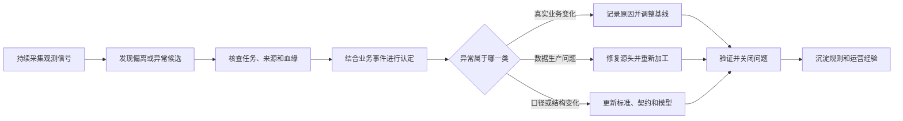

# 037 什么是数据可观测性（Data Observability），它和数据质量有什么区别？

## 一句话回答

> 数据质量关注数据是否符合业务用途和质量要求；数据可观测性通过持续采集数据、任务、元数据和血缘等运行信号，帮助组织发现数据正在发生什么变化、异常从哪里产生、影响了哪些下游。

数据可观测性能够发现问题，但不能仅凭“偏离历史”就认定数据错误。数据波动可能是真实业务变化，也可能由数据缺失、重复、延迟、口径调整或处理故障造成。因此，更准确的关系是：

> 数据可观测性负责发现异常候选和提供诊断线索，数据质量治理负责结合业务要求认定问题、确定责任并推动处置闭环。

## 一、为什么有了数据质量检查，还需要数据可观测性

传统数据质量检查通常从已经明确的要求出发，例如：

- 身份证号码是否符合格式；
- 订单金额是否为空或小于零；
- 行政区划代码是否属于标准码值集；
- 订单是否能够关联到客户；
- 每日汇聚任务是否在约定时间前完成。

这些规则很重要，但它们只能检查组织已经想到并表达出来的问题。

实际运行中还会出现另一类异常：

- 每一条记录都符合格式，但当天数据量只有平时的20%；
- 任务显示执行成功，但只处理了部分分区；
- 字段没有变为空，取值分布却突然完全不同；
- 上游增加了新业务状态，下游仍按照旧逻辑统计；
- 数据最终到达了，但比业务决策所需时间晚了数小时；
- 某个源表变化以后，多个报表同时出现异常；
- 单个数据集看起来正常，与相关数据组合后却违背业务常识。

如果事先没有针对这些情况编写规则，固定质量检查可能全部通过。

数据可观测性要解决的，正是持续生产环境中的发现和诊断问题：当数据规模、结构、内容、时间特征或上下游关系发生异常变化时，尽快让组织知道，并提供足够线索判断发生了什么。

## 二、什么是数据可观测性

“可观测性”一词最初用于描述能否根据系统外部表现推断其内部状态，后来广泛应用于软件和分布式系统运行管理。

数据可观测性将这一思路用于数据生产和使用过程：通过持续采集和分析数据本身、处理任务、元数据、血缘和消费情况等信号，了解数据是否按预期产生、流动、加工和交付。

它通常需要回答五类问题：

1. **发生了什么**：数据量、结构、分布或更新时间出现了什么变化？
2. **从什么时候开始**：异常首次出现在哪个批次、分区或时间窗口？
3. **发生在哪里**：问题位于哪个来源、数据集、字段、任务或处理节点？
4. **为什么发生**：可能由接口、任务、代码、配置、业务变化还是上游数据引起？
5. **影响了谁**：哪些指标、报表、模型、数据服务和业务流程受到影响？

因此，数据可观测性不只是展示几张监控图，也不只是判断任务成功或失败。它应当把“数据发生变化”与“上下游影响和可能原因”联系起来。

## 三、数据质量和数据可观测性有什么区别

两者密切相关，但观察角度不同。

| 对比维度 | 数据质量 | 数据可观测性 |
| --- | --- | --- |
| 核心问题 | 数据是否适合具体业务用途 | 数据正在发生什么，异常在哪里、为什么发生、影响了谁 |
| 主要依据 | 业务定义、数据标准、质量规则和风险要求 | 运行信号、历史基线、变化趋势、任务状态、元数据和血缘 |
| 擅长发现 | 已经定义的完整性、准确性、一致性、有效性等问题 | 延迟、数据量突变、分布漂移、结构变化和未知异常 |
| 判断方式 | 与明确要求或规则比较 | 与预期状态、历史模式和相关数据比较 |
| 主要结果 | 合格与否、问题记录、质量等级和整改要求 | 异常候选、告警、影响范围和根因线索 |
| 责任重点 | 业务认定、源头整改和质量运营 | 持续监测、异常发现、诊断和影响分析 |
| 是否能够单独判定业务事实 | 需要业务规则和责任人参与 | 通常不能，仅凭统计偏离不能认定事实错误 |

可以用一句话概括：

```text
数据质量回答“是否符合要求”，数据可观测性回答“现在发生了什么”。
```

数据质量是一项面向业务可信使用的治理目标和管理活动。数据可观测性更偏向持续运行中的技术和运营能力，它既能服务数据质量，也能服务数据管道可靠性、数据服务等级管理和故障定位。

二者不应被建设成彼此隔离的两套体系。可观测性发现的异常需要进入质量闭环；质量治理中反复发生的问题，也应沉淀为新的观测指标、质量规则或数据契约。

## 四、数据可观测性通常观察哪些信号

业界经常将数据可观测信号归纳为鲜活度、数据量、结构、分布和血缘等方面。这是一种便于理解的总结，不是所有项目都必须机械采用的固定标准。

### 1. 鲜活度

观察数据是否按照约定时间更新，延迟是否超过业务能够接受的范围。

例如，经营日报要求每天8时前完成，如果数据在11时才到达，即使内容最终正确，也无法支持晨会决策。

### 2. 数据量

观察记录数、文件数、分区数、空间要素数或消息数量是否出现异常变化。

数据量下降可能意味着部分来源中断，数据量异常上涨可能意味着重复采集、重复消费或业务真实增长。

### 3. 数据结构

观察表、字段、类型、精度、约束和嵌套结构是否发生变化。

结构变化本身不一定错误，但如果没有同步通知下游，就可能导致任务失败、字段错位或指标含义改变。

### 4. 数据分布

观察空值率、唯一值数量、最大值、最小值、分位数、类别占比和空间覆盖等统计特征。

某字段没有违反格式规则，不代表其分布一定合理。例如，道路平均速度全部落在合法范围内，但原本分散的取值突然集中在同一个数值，就值得进一步检查。

### 5. 任务和管道状态

观察任务是否成功、耗时是否异常、处理了多少数据、是否发生重试、跳过或部分完成。

“任务成功”只能说明程序没有报错，不能证明处理的数据完整，也不能证明结果符合业务要求。

### 6. 数据血缘和影响范围

观察数据来自哪里，经过哪些任务和模型，最终被哪些指标、报表、算法和服务使用。

血缘让告警从“某张表有异常”进一步变为“哪些业务结果可能不可信”，也帮助从多个下游异常反向寻找共同上游。

### 7. 消费和服务情况

观察数据是否被查询、下载或调用，服务是否超时，关键消费者是否仍在使用旧版本。

同一个异常发生在无人使用的临时数据集和核心经营指标上，处置优先级显然不同。

## 五、数据加工流水线可视化等于数据可观测性吗

不等于。数据加工流水线可视化是数据可观测性的一个重要入口和展示载体，但仅仅画出流程、节点和运行状态，还不能说明数据是否健康。

### 1. 流水线可视化主要展示什么

数据加工流水线通常以有向图、任务编排图或节点列表展示：

- 数据从哪些来源进入；
- 经过哪些采集、转换、关联和计算步骤；
- 节点之间有哪些执行依赖；
- 任务是否成功、失败、重试或等待；
- 每个节点运行了多长时间；
- 当前批次运行到了哪个位置。

它主要回答：

> 数据加工流程是怎样组织和运行的？

这些信息是判断异常的重要线索。技术人员可以通过流水线视图快速找到失败节点、长时间运行任务和异常依赖关系。

### 2. 为什么节点全部成功，数据仍可能有问题

任务状态通常反映程序是否按照技术逻辑结束，并不等于数据已经完整、准确和适合业务使用。

例如，上游接口只返回了20%的数据，但接口正常响应，后续采集、转换和指标计算任务也都没有报错。流水线中的所有节点可能显示为绿色，最终结果却因为数据覆盖不足而失真。

因此，数据可观测性还要在任务状态之外观察：

- 实际处理的数据量是否合理；
- 数据是否按时到达；
- 字段结构和取值分布是否变化；
- 来源范围和空间覆盖是否完整；
- 产出的指标、报表和服务是否受到影响。

反过来，某个任务执行失败，也不一定意味着当前业务数据完全不可用。如果平台仍保留上一批经过验证的数据，业务可能只是面对鲜活度下降。是否暂停服务，要结合数据时效要求和使用风险判断，而不能只看节点是红色还是绿色。

### 3. 流水线依赖关系和数据血缘也不完全相同

流水线依赖关系主要描述任务按什么顺序执行，数据血缘则描述数据从哪些来源经过哪些转换形成，并被哪些指标、报表、模型和服务使用。

两者可能部分重合，但流水线视图通常不能完整表达：

- 字段之间的映射和转换；
- 指标由哪些字段和规则计算；
- 同一数据经过多条流水线后的汇合关系；
- 流水线之外的查询、服务和人工使用；
- 一个上游变化会影响哪些业务结果。

没有血缘和消费关系，流水线可视化可以帮助定位“哪个任务失败”，却未必能够说明“哪些业务结果可能不可信”。

### 4. 二者应如何结合

比较理想的做法，是把可观测信息叠加到流水线和血缘视图中。节点除了显示成功或失败，还可以展示：

- 输入和输出数据量；
- 数据到达时间和鲜活度；
- 质量规则执行结果；
- 分布变化和异常置信度；
- 受影响的下游数据产品；
- 责任人、告警和处置状态。

此时，流水线图不再只是一个任务编排界面，而成为查看信号、定位异常和追踪处置过程的操作入口。

可以用一句话概括两者的边界：

> 流水线可视化让加工过程“看得见”，数据可观测性还要让数据健康状态、异常原因和业务影响“说得清”。

## 六、数据出现波动，是否意味着发生了质量问题

不一定。数据波动只是一个需要解释的现象，不能直接等同于数据错误。

### 1. 真实业务波动

节假日、营销活动、极端天气、政策变化和突发事件，都可能使数据偏离历史规律。

这种情况下，数据忠实反映了业务变化，不属于质量问题。系统应保留数据，并记录相关业务事件，避免将真实变化误判为错误。

### 2. 数据生产异常

数据缺失、重复上报、接口中断、部分分区未处理、任务延迟和转换逻辑错误，也会造成数据波动。

这种波动通常属于质量或数据生产可靠性问题，需要定位源头、修复流程、重新加工并验证结果。

### 3. 业务定义或统计口径变化

上游增加业务状态、调整分类、改变采集范围或修改统计口径后，数据分布会发生变化。

数据本身可能正确，但如果标准、数据契约、模型和下游指标没有同步更新，仍会造成业务理解和使用问题。

三类波动的处理方式如下：

| 波动类型 | 是否属于质量问题 | 主要处理方式 |
| --- | --- | --- |
| 真实业务波动 | 通常不是 | 保留事实，补充业务事件说明，必要时调整后续基线 |
| 数据生产异常 | 通常是 | 定位源头、修复任务或数据、重新加工并验证 |
| 业务定义或口径变化 | 不一定 | 确认变更，更新标准、契约、模型、指标和观测基线 |

这里需要坚持两个判断：

> 异常不等于错误，偏离历史不等于违反业务规则。

另一方面，也不能因为某种波动“业务上可能发生”，就不再检查。可观测性应当提供证据和上下文，再由技术人员与业务责任人共同完成认定。

## 七、已知问题与未知问题应如何配合发现

数据质量规则擅长发现已知问题。

例如，组织已经明确规定：

- 设备编号不能为空；
- 道路速度应在合理范围内；
- 行政区划必须使用统一代码；
- 每条订单必须关联有效客户；
- 核心日报必须在每天8时前完成。

这些要求可以直接转化为规则或数据契约。

数据可观测性更擅长发现尚未被明确写成规则的变化，例如：

- 某区域设备覆盖率第一次大幅下降；
- 某一类别占比连续数日缓慢偏移；
- 一项任务耗时越来越长但尚未失败；
- 多个下游指标同时出现方向一致的异常；
- 新业务状态进入数据，但现有分类规则没有识别。

发现未知异常以后，需要进一步判断：

- 如果确认是错误，应修复并沉淀为质量规则；
- 如果是应当提前通知的变化，应形成数据契约或变更流程；
- 如果是真实业务变化，应记录背景并调整基线；
- 如果暂时无法确认，应保留异常标记并限制高风险使用。

可观测性和质量规则由此形成互补：规则让已知问题可重复检查，可观测性帮助组织不断认识新的问题。

## 八、发现异常以后应该如何处理

数据可观测性不能停留在发现和告警。异常需要进入一条能够落实责任的处理路径。



### 1. 确认异常是否真实存在

排除监测程序故障、统计窗口错误、重复告警和临时资源抖动，确认变化发生在哪个数据范围和时间段。

### 2. 检查技术链路

查看接口、任务、分区、日志、代码版本和资源使用情况，判断是否存在采集、传输、加工或发布故障。

### 3. 结合业务背景解释

核对节假日、活动、政策、组织调整和业务规则变化。技术指标只能描述变化，不能替代业务事实判断。

### 4. 分析影响范围

根据血缘和消费关系识别受影响的指标、报表、模型、服务和业务流程，并确定问题优先级。

### 5. 采取处置措施

根据影响程度选择继续运行、标记风险、隔离数据、暂停发布、回退版本或阻断流水线。

### 6. 修复并验证

优先修复源头或生产逻辑。需要重新加工时，应保留原始数据、修复依据、版本和审计记录，而不是为了让结果看起来正常而直接覆盖原始事实。

### 7. 沉淀经验

把确认过的问题转化为质量规则、观测指标、数据契约、变更流程或业务事件标注，减少同类问题再次发生。

## 九、发现波动后，是否应该中断数据流水线

不能一概而论。自动阻断需要比自动告警更高的确定性，因为阻断本身也可能影响业务连续性。

### 1. 可以考虑阻断或隔离的情况

- 违反强制数据标准或数据契约；
- 核心数据缺失、重复或关联失败达到明确阈值；
- 数据可能导致错误付款、监管报送或高风险业务行动；
- 下游无法识别新的结构或版本；
- 已经确认数据不可信，继续发布会扩大影响。

### 2. 通常先告警而不立即阻断的情况

- 数据量或分布偏离历史，但原因尚未确认；
- 业务本身可能出现大幅波动；
- 异常只影响低风险探索性分析；
- 数据虽然延迟，但继续运行仍比完全停止更有价值；
- 统计模型给出的只是低置信度异常候选。

### 3. 建立分级处置策略

可以将异常分为提示、警告、严重和阻断等等级，并综合考虑：

- 规则确定性；
- 数据和业务重要程度；
- 影响范围；
- 是否存在替代数据；
- 错误使用和中断服务各自的成本；
- 是否能够自动恢复或回退。

比较稳妥的原则是：

> 明确违反强约束的问题可以阻断，尚待解释的统计波动先告警；核心结果无法保证可信时暂停发布，而不是盲目停止所有上游生产。

## 十、案例：城市交通运行数据出现异常波动

某城市持续汇聚道路速度、车辆通行、路口流量和设备状态数据，并计算区域拥堵指数、道路平均速度和高峰持续时间。

某天早高峰，拥堵指数明显低于平时，系统显示道路运行异常顺畅。

### 1. 固定质量规则可能全部通过

数据中的设备编号、道路编号和时间格式都正确，速度也在允许范围内；汇聚任务状态显示成功。

如果只检查字段格式、空值和任务成败，系统可能认为数据合格。

### 2. 可观测性发现多个变化信号

持续监测发现：

- 当天道路速度记录数只有正常水平的25%；
- 某片区域设备覆盖率从92%下降到20%；
- 数据到达时间比平时晚了35分钟；
- 速度取值过度集中，缺少低速记录；
- 与路口流量数据相比，道路速度数据明显不匹配。

这些信号只能证明数据出现异常变化，还不能直接说明道路并未真正变得通畅。

### 3. 结合血缘和运行信息定位原因

血缘显示拥堵指数依赖道路速度明细。进一步检查发现，上游采集接口只返回了部分设备的数据，但任务没有报错，因此流水线成功生成了一个不完整的结果。

这不是正常业务波动，而是数据完整性和鲜活度问题。

### 4. 根据影响范围采取措施

平台识别出受影响的拥堵指数、交通运行大屏和早高峰分析报告，于是：

- 将相关指标标记为数据不完整；
- 暂停对外发布当天的正式拥堵指数；
- 保留已经接收的原始记录，不直接修改其内容；
- 修复上游接口并补采缺失数据；
- 重新计算指标并完成结果验证。

### 5. 将本次异常沉淀为长期能力

问题解决以后，可以增加：

- 分区域设备覆盖率基线；
- 道路速度与路口流量的交叉校验；
- 任务成功但数据量不足时的告警；
- 核心指标发布前的数据完整性门槛；
- 上游接口返回范围变化的数据契约。

这样，一次未知异常就转化为后续可重复执行的质量规则、观测指标和发布控制。

## 十一、建设数据可观测性需要哪些能力

数据可观测性不是必须单独采购的一套平台。组织可以在现有数据治理和数据开发体系上逐步建立能力。

通常需要整合：

- 数据汇聚和任务调度的运行记录；
- 数据质量规则及执行结果；
- 表、字段、指标和服务等元数据；
- 数据血缘和下游消费关系；
- 数据量、鲜活度和分布等历史基线；
- 异常检测和告警分级；
- 问题工单、责任人和处置状态；
- 数据服务等级和业务影响信息。

可以按照以下顺序逐步建设：

### 1. 先覆盖关键数据产品

不要一开始监测所有表和字段。先选择核心指标、报表、模型和数据服务，明确它们依赖的数据集和交付要求。

### 2. 先解决鲜活度和完整性

更新是否及时、数据是否到齐，往往是最容易产生直接业务影响的问题，也比较容易建立清晰的监测基线。

### 3. 再增加分布和关联监测

在数据稳定运行后，逐步监测取值分布、类别占比、空间覆盖和跨数据集一致性。

### 4. 补齐血缘和影响分析

如果只有告警而没有血缘，技术人员仍需人工寻找影响范围和根因，可观测性的价值会明显降低。

### 5. 与质量闭环统一运营

异常告警、质量问题、责任认定和整改验证应进入统一流程，避免分别维护两套问题清单。

## 十二、如何衡量数据可观测性的成效

不能只统计建立了多少监控指标或发送了多少告警。更有意义的指标包括：

- 异常平均发现时间；
- 问题平均定位和修复时间；
- 核心数据按时交付率；
- 重复发生问题的比例；
- 告警能够定位到责任人的比例；
- 能够完成影响分析的异常比例；
- 无效和重复告警比例；
- 因数据问题造成的报表撤回、错误决策或服务中断次数。

数据可观测性的业务价值不在于让监控页面更丰富，而在于更早发现问题、更快定位影响、减少错误数据进入业务决策。

## 十三、AI可以怎样辅助数据可观测性

AI和机器学习可以辅助：

- 根据历史数据建立动态基线；
- 发现缓慢漂移和多指标联合异常；
- 对重复告警进行聚合和降噪；
- 结合日志、血缘和变更记录推荐根因；
- 生成异常说明和处置建议；
- 将已经确认的问题推荐为质量规则；
- 使用自然语言解释受影响的数据产品和业务场景。

但AI不能独立回答：

- 一次销售增长是否符合真实经营情况；
- 某个统计口径调整是否已经获得业务批准；
- 多大的波动可以被组织接受；
- 某项异常是否值得阻断核心业务；
- 哪个来源应当被认定为业务权威。

AI可以提供异常候选和诊断线索，最终认定仍需要数据标准、业务语境、责任机制和人工确认。

## 十四、常见误区

### 误区一：数据可观测性就是数据质量换了一个名字

数据质量关注是否符合业务要求，可观测性强调持续发现变化、诊断原因和分析影响。二者重叠，但不能等同。

### 误区二：任务执行成功，数据就是健康的

任务可以在只处理部分数据、使用错误分区或收到异常来源数据的情况下成功结束。

### 误区三：数据偏离历史就是质量问题

真实业务变化也会造成大幅波动。历史基线只能帮助发现异常候选，不能替代业务判断。

### 误区四：告警越多，可观测性建设越成熟

大量重复和无效告警会使真正重要的问题被忽视。告警必须分级、去重并关联业务影响。

### 误区五：发现异常后都应该立即阻断

低置信度的统计异常直接阻断，可能造成比数据波动本身更严重的业务中断。

### 误区六：只监测数据表就足够了

如果缺少任务状态、血缘、消费关系和变更记录，就很难判断异常原因和业务影响。

### 误区七：调整基线就是让告警消失

只有确认变化真实、稳定且业务定义已经同步后，才能调整基线。不能为了减少告警掩盖尚未解决的问题。

### 误区八：AI可以自动判断数据是否正确

AI可以识别统计异常，却不天然掌握真实业务事实、责任边界和风险容忍度。

### 误区九：数据可观测性只属于技术运维

技术人员负责采集信号和定位链路，业务人员仍需解释变化、确定影响和确认处理结果。

### 误区十：可观测性可以代替质量闭环

发现问题不等于解决问题。没有责任分派、修复验证和规则沉淀，可观测性只会增加一批无人处理的告警。

## 十五、实践检查清单

1. 是否明确了首批需要保障的核心指标、报表、模型和数据服务？
2. 是否为关键数据定义了更新频率、到达时间和完整性要求？
3. 是否同时观察任务状态、数据量、结构、分布和鲜活度？
4. 是否能够区分固定质量规则与基于历史基线的异常检测？
5. 是否能够通过血缘识别异常的来源和下游影响？
6. 是否为告警设置了分级、去重和责任路由？
7. 是否明确哪些问题需要阻断、隔离、标记或仅告警？
8. 是否有业务人员参与判断数据波动是否真实？
9. 是否保留异常、认定、修复、重算和验证记录？
10. 是否将已确认的新问题沉淀为规则、契约或变更流程？
11. 是否定期清理无效告警并重新评估监测基线？
12. 是否用发现时间、修复时间和业务影响衡量实际成效？

## 结语

数据质量和数据可观测性不是两套相互竞争的概念。

数据质量定义什么样的数据可以被业务信任和使用；数据可观测性让组织能够持续看见数据生产过程中的变化，并在固定规则尚未覆盖时尽早发现异常。

面对数据波动，不能简单地把偏离历史判定为错误，也不能因为存在业务解释的可能性而忽略风险。合理的处理方式是先发现变化，再结合任务、数据、血缘和业务事件完成认定，最后根据影响程度选择记录、告警、隔离、阻断、修复或调整基线。

当异常能够被及时发现、影响能够被准确识别、原因能够被快速定位，并最终沉淀为规则和改进措施时，数据可观测性才真正成为数据质量闭环和业务可信用数的一部分。

## 延伸阅读

- 第029问：为什么要保持数据的鲜活度？
- 第033问：数据治理为什么必须关注数据质量？
- 第034问：数据治理应如何形成数据质量闭环？
- 第041问：数据血缘是什么意思，它与任务依赖关系有什么区别？
- 第048问：什么是数据契约（Data Contract），它如何降低上下游协作成本？
- 第054问：实时流数据和物联网数据给数据治理带来了哪些新问题？
