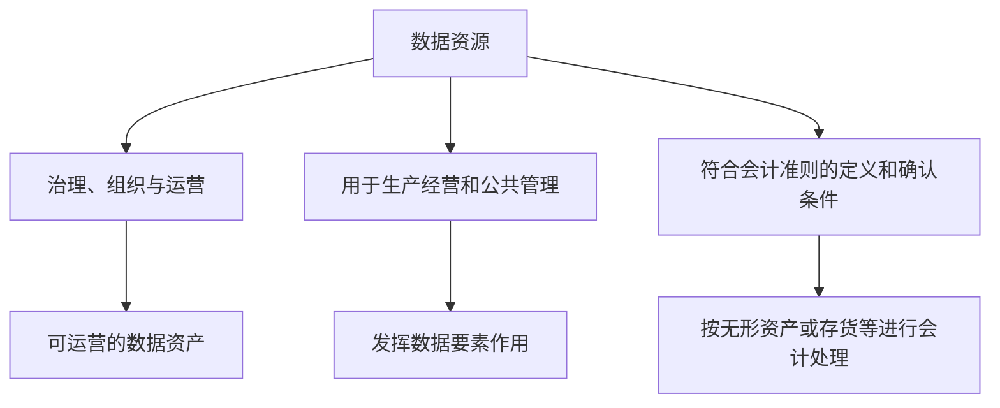

# 038 数据资源、数据资产和数据要素应如何区分？

## 一句话回答

> 数据资源强调组织拥有、产生、获取或经授权可以使用的数据；数据资产强调其中已经被识别、治理和持续运营，能够稳定支撑业务并产生可验证价值的数据；数据要素强调数据与土地、劳动力、资本、技术等结合，参与生产经营、公共管理和资源配置的经济作用。

三者描述的不是三种互相排斥的数据类型，而是观察同一份数据的不同视角：数据资源关注“有什么”，数据资产关注“如何管理和运营”，数据要素关注“如何参与价值创造”。

## 一、为什么这三个概念容易混淆

数据资源、数据资产和数据要素都与数据价值有关，项目中也都可能出现目录、平台、授权、汇聚、服务和评价等工作，因此很容易被混为一谈。

常见说法包括：

- “把数据放到资产门户里，就变成了数据资源”；
- “完成资产编目和上架，就完成了数据资产化”；
- “数据汇交到数据局，就已经成了数据要素”；
- “数据只有交易出去，才能体现数据要素价值”；
- “数据资产就是可以进入资产负债表的数据”；
- “数据要素就是数据元（Data Element）”；
- “凡是重要数据，都是数据资产”。

这些说法往往抓住了某一个环节，却把管理工具、运营状态、经济作用和会计处理混在一起。概念不清会直接带来项目目标错位：有的项目把建设门户当成资源治理，有的项目把汇交数量当成要素价值，有的项目把资产入表当成数据治理的唯一终点。

区分三者不是为了增加术语，而是为了在不同场景下说清楚：组织究竟拥有什么、正在运营什么、以及数据究竟怎样为业务创造价值。

## 二、先从同一份数据的三个视角理解

以物流企业的运输订单、车辆、轨迹、油耗和维修记录为例：

- 它们首先是企业产生、采集或经授权使用的**数据资源**；
- 当车辆身份、运输线路、订单状态和油耗口径被统一，数据具备质量说明、责任人、更新机制、授权规则和稳定使用方式后，可以作为企业运营的**数据资产**；
- 当这些数据用于路线优化、降低空驶率、控制油耗、预测到货时间和安排运力时，数据就在生产经营中发挥了**数据要素**作用。

同一份运输数据可以同时具有这三种属性。它并不是先天属于其中某一个盒子，也不一定必须严格经历“资源、资产、要素”的单向升级。

例如，企业内部的一份数据即使从未对外交易，只要帮助优化运输调度，就已经发挥了数据要素价值；反过来，一份完成编目但长期无人使用的数据，可能被纳入资产管理，却还没有产生明显的要素价值。

## 三、什么是数据资源

数据资源是组织拥有、产生、采集、购买、交换，或者经授权可以访问和使用的数据及其载体。

数据资源可以包括：

- 业务系统中的数据库表、日志和消息；
- 文件、报表、文档和表格；
- 空间矢量、影像、点云、BIM 模型和地图瓦片；
- 物联网设备观测、轨迹和实时流数据；
- 调查采集、监测、实验和人工录入数据；
- 外部采购、共享、开放或授权使用的数据；
- 数据服务能够访问的明细、汇总和结果数据。

数据资源强调的是“存在”和“可利用的可能性”。一份数据只要有合法来源或合法使用基础，就可以作为数据资源被盘点、描述和管理；它不需要已经完成清洗、建模、产品化或价值评估。

因此，数据资源可能存在以下情况：

- 来源尚未完全核实；
- 质量不能满足当前业务用途；
- 没有统一标准或跨系统关联；
- 只有少数人员知道如何访问；
- 没有明确的持续更新机制；
- 因权限、敏感性或成本原因暂时不能共享；
- 尚未找到合适的使用场景。

这些问题不妨碍它被识别为数据资源，但会影响它能否成为稳定运营的数据资产。

### 数据资源不是资产管理平台或门户本身

资产管理平台、数据目录和门户是管理、发现、申请、授权和使用数据的工具或入口，不是它们所管理的底层数据资源本身。

例如，资产门户上的“运输运营主题数据集”页面通常展示名称、口径、更新频率、责任人、质量状态、申请方式和服务地址。这些信息是对数据资源的描述和运营信息；真正的数据资源可能位于业务数据库、数据仓库、对象存储、消息队列或外部服务中。

当然，门户产生的目录元数据、访问日志和授权记录本身也可以成为数据资源，但那是另一层资源，不能因为“门户里有一张资产卡片”，就把资产门户等同于被管理的运输数据。

## 四、什么是数据资产

本书所说的数据资产，主要采用管理和运营意义上的理解：组织认为某些数据值得投入持续治理和运营成本，并使其具备可发现、可理解、可使用、可控制和可评价的条件。

一项可运营的数据资产通常需要具备：

- 明确的业务含义、适用范围和使用场景；
- 可识别的来源、版本和更新时间；
- 与用途相匹配的质量状态和鲜活度；
- 明确的数据所有者、维护责任和服务责任；
- 清楚的权限、安全和合规边界；
- 稳定的访问、申请、调用或交付方式；
- 使用、反馈、变更和退出机制。

数据资产不等于“最重要的数据”。一条正在发生的大额付款记录可能非常重要，但它是否需要作为组织级资产运营，要看是否存在跨部门复用价值、持续服务需求和相应治理成本。

同样，数据资产也不等于“数据产品”。数据产品强调围绕明确用户和业务问题持续交付能力；数据资产强调数据是否进入组织化的管理和运营。两者可以重合，但不能互相替代。第026问将进一步说明数据产品的边界，第039问将讨论资产管理应该覆盖哪些数据治理成果。

### 数据资产管理和数据资产不是一回事

数据资产管理是一组活动和机制，包括盘点、编目、分级、发布、授权、评价、运营和退出；数据资产是这些活动所管理和运营的对象。

可以作如下区分：

| 对象 | 本质 | 作用 |
| --- | --- | --- |
| 数据资源 | 数据及其载体 | 提供可利用的数据基础 |
| 数据资产 | 纳入持续治理和运营的数据成果 | 支撑复用、服务和价值评价 |
| 数据目录或资产卡片 | 对资源或资产的描述记录 | 帮助发现、理解、申请和管理 |
| 数据资产管理平台 | 管理工具和运营能力 | 支撑编目、授权、服务和评价 |
| 数据门户 | 面向使用者的访问入口 | 帮助用户发现和使用资产 |

因此，建设资产管理平台和门户很有价值，但它们只是资产运营的支撑能力。没有真实的数据资源、清楚的语义、质量状态和持续责任，平台再完整也会变成一套难以使用的资产台账。

## 五、什么是数据要素，“第五种生产要素”从何而来

数据要素是把数据放在生产经营和价值创造的语境中理解的概念，而不是一种新的数据格式、一个专门的数据目录，或者某个部门接收数据后的状态。

2019 年，党的十九届四中全会《决定》提出，要健全劳动、资本、土地、知识、技术、管理、数据等生产要素由市场评价贡献、按贡献决定报酬的机制。2020 年，《中共中央 国务院关于构建更加完善的要素市场化配置体制机制的意见》分别讨论土地、劳动力、资本、技术和数据，并专设“加快培育数据要素市场”一节。

因此，业界常将数据通俗地称为继土地、劳动力、资本、技术之后的“第五种生产要素”。这里的“第五种”是便于理解的说法，不是严格的学术排序或唯一的官方分类；特别是 2019 年文件还同时列出了知识和管理等生产要素。

把数据视为生产要素，强调的是：数据不只是业务活动留下的记录，还可以与其他要素结合，参与生产经营、公共管理、科研创新和资源配置，并对效率、成本、风险、收益和服务能力产生影响。

例如：

- 制造企业用设备运行数据优化检修计划；
- 零售企业用销售和库存数据调整补货；
- 城市管理部门用交通运行数据优化信号配时；
- 自然资源部门用多源数据识别低效用地；
- 物流企业用轨迹和订单数据优化运力调度。

这些应用不以数据交易为前提。只要数据进入实际业务活动，并帮助改善资源配置或产生业务结果，就已经发挥了数据要素作用。

### 数据要素不等于数据元

数据要素属于经济和政策语境；数据元（Data Element）是数据标准语境中可被定义、标识和复用的基本数据单元，例如“统一社会信用代码”“合同签订日期”或“行政区划代码”。

二者只有“数据”二字相同，不能混用。第032问讨论的数据元、码值和数据标准，不是在讨论数据作为生产要素。

### 汇交到数据局，不等于自动成为数据要素

数据局或类似机构可能负责政务数据统筹、公共数据管理、共享开放、授权运营或数据基础制度建设。将数据汇交、登记或纳入目录，解决的主要是汇聚、管理、权限和协同问题。

一份数据是否发挥数据要素作用，还要看它是否在合法、安全、可控的前提下进入具体场景，支持公共服务、社会治理或生产经营，并产生可以说明的实际效果。

因此：

- 不在数据局管理范围内的企业数据，也可以发挥数据要素作用；
- 汇交到数据局的数据，可能因质量、授权、敏感性、用途不清等原因暂时不能开发利用；
- 公共数据开放、授权运营、共享交换和交易，都只是数据要素价值实现的不同机制，不是唯一标准；
- 数据局不是把数据“变成数据要素”的工厂，而是可能提供制度、组织和基础设施支持的治理主体。

## 六、数据要素与会计“入表”是什么关系

数据被视为生产要素，为数据资源开发利用、权利安排、流通使用和价值评价提供了政策与经济背景，但不意味着所有数据都会自动进入资产负债表。

生产要素是经济视角，会计资产则是会计视角。财政部 2023 年发布的《企业数据资源相关会计处理暂行规定》自 2024 年 1 月 1 日起施行。该规定并没有创设一个可以容纳所有数据的统一会计科目，而是要求：

- 符合无形资产定义和确认条件的数据资源，可以确认为无形资产；
- 企业日常活动中持有、最终目的用于出售，且符合存货定义和确认条件的数据资源，可以确认为存货；
- 不满足企业会计准则相关资产确认条件的数据资源，不能仅因完成编目、估值、服务发布或交易尝试就确认为资产。

可以用下面的关系理解，但不能把它看成自动流水线：

数据要素价值可以首先表现为降本、增效、控险和创新，不以会计确认或对外交易为前提。会计“入表”是特定数据资源在特定业务模式下可能采用的会计处理，不应成为判断数据是否有业务价值或是否完成数据治理的唯一标准。

## 七、三者的关键区别和关系

| 对比维度 | 数据资源 | 数据资产 | 数据要素 |
| --- | --- | --- | --- |
| 观察视角 | 存在和可利用性 | 管理、运营和复用 | 生产、配置和价值创造 |
| 核心问题 | 有什么数据可以合法使用 | 哪些数据值得持续治理和运营 | 数据怎样参与业务并产生价值 |
| 典型工作 | 盘点、接入、描述、保留来源 | 编目、质量治理、责任界定、授权、服务和评价 | 场景开发、协同使用、收益实现和资源优化 |
| 是否要求已经产生价值 | 不要求 | 需要有明确价值预期和运营必要性 | 强调实际参与价值创造 |
| 是否必须对外流通 | 不需要 | 不需要 | 不需要，内部使用同样可以发挥作用 |
| 是否必须会计确认 | 不需要 | 不需要 | 不需要 |
| 主要风险 | 来源不明、不可访问、重复沉淀 | 目录空转、质量失控、责任缺失、无人使用 | 只谈流通或估值，忽视场景、安全和实际效果 |

三者之间最稳妥的关系是：

> 数据资源是可利用的数据基础；数据资产是组织选择并持续运营的数据成果；数据要素是数据在具体活动中创造价值的作用和过程。

## 八、案例：物流企业如何避免概念混用

某物流企业拥有运输订单、客户、车辆、司机、轨迹、油耗、维修和签收等数据，并计划建设资产门户、优化调度和探索对外服务。

### 1. 盘点阶段：先识别数据资源

企业首先需要弄清楚哪些系统产生了什么数据，来源是否合法，谁负责维护，更新频率如何，以及是否存在敏感信息。此时的对象是数据资源，重点是摸清家底，而不是急于宣布已经形成资产。

### 2. 运营阶段：选择值得持续管理的数据资产

企业发现车辆、线路、订单和轨迹数据被调度、客服、成本控制和安全管理反复使用，于是建立统一身份、标准口径、质量检查、责任人、权限边界和稳定服务方式，并将“运输运营主题数据集”和“运力调度指标服务”纳入资产目录。

这时，目录条目和门户页面是运营入口；实际数据资源仍保存在来源系统、数据仓库和服务接口中。不能把门户页面当作数据资源本身。

### 3. 业务使用阶段：体现数据要素价值

调度人员根据车辆位置、订单优先级、路况和油耗数据安排运输，减少空驶和延误；管理者根据线路成本和准点率调整运力配置。数据已经参与生产经营并带来可衡量的效率提升，因此体现了数据要素价值。

即使这些能力只在企业内部使用，没有挂牌交易或会计入表，也不影响这一判断。

### 4. 对外协作阶段：不能只看是否完成汇交

如果企业向地方公共数据平台、行业平台或数据局管理的系统汇交部分数据，仍需分别明确数据来源、授权范围、隐私保护、质量责任、使用目的和收益安排。汇交只是治理和协同的一步，不代表数据当然可以开放、交易或已经发挥数据要素价值。

## 九、项目中应如何正确使用这三个术语

在项目汇报和方案中，可以避免使用笼统的“数据资产建设完成”或“数据要素已经形成”，而改为描述具体成果：

| 需要表达的事实 | 更准确的说法 |
| --- | --- |
| 已摸清数据家底 | 已完成若干类数据资源盘点、来源登记和责任识别 |
| 已建设门户 | 已建立数据资产目录、申请授权和服务运营入口 |
| 已治理一批重点数据 | 已形成若干可运营数据资产，并明确质量、责任和更新机制 |
| 已支持业务 | 数据已在某一业务场景中用于优化决策、流程或资源配置，发挥数据要素作用 |
| 涉及会计处理 | 正在评估特定数据资源是否符合相关会计准则的确认条件 |

这种表达能够让管理者区分“完成了哪项建设”与“已经取得了什么业务结果”，也有助于防止用概念包装尚未落地的价值。

## 十、常见误区

### 误区一：有数据就是有数据资产

数据存在只是资源基础。是否成为数据资产，还要看是否值得持续治理、服务和运营。

### 误区二：资产门户就是数据资源

门户是发现和使用数据的入口，目录条目是描述和运营记录，二者都不等于底层数据资源。

### 误区三：编目上架就完成资产化

编目解决可发现性，上架提供管理入口；质量、责任、授权、更新、使用和反馈机制仍需持续运营。

### 误区四：到了数据局就是数据要素

汇交和登记不等于数据已经在场景中发挥价值。数据要素强调的是参与价值创造，而不是被某个机构接收。

### 误区五：数据要素必须交易

企业内部的经营分析、算法优化和流程改进，同样能够体现数据要素作用。

### 误区六：数据资产一定可以进入资产负债表

管理意义上的数据资产不等于会计资产。会计确认必须符合专门准则和确认条件。

### 误区七：数据资产意味着拥有绝对所有权

数据往往涉及来源、持有、处理、使用和收益等多种权利与责任，不能简单宣称“数据归某个单位所有”。

### 误区八：数据要素和数据元是一回事

数据要素讨论经济作用，数据元讨论标准化的数据定义，两者属于不同语境。

### 误区九：只要估值很高，数据就一定有价值

缺少真实使用、质量保障、合规边界和持续服务的估值，不能替代业务价值验证。

### 误区十：所有数据资源都应资产化和流通

有些资源只适合内部使用、归档或受限保存；是否运营和流通，应综合用途、成本、风险和合规要求决定。

## 十一、实践检查清单

1. 是否把数据资源、目录条目、资产管理平台和门户入口区分为不同对象？
2. 是否明确哪些资源值得投入持续治理和运营成本？
3. 是否为重点数据资产明确业务语义、质量、责任、更新和授权边界？
4. 是否能说明资产门户展示的资源实际存放在哪里、来源是什么？
5. 是否避免把汇交、登记或上架作为数据要素价值实现的唯一证据？
6. 是否能用具体业务指标说明数据参与了怎样的决策、流程或资源配置？
7. 是否避免将内部使用价值与对外交易价值混为一谈？
8. 是否将管理意义上的数据资产与会计确认的资产区分开来？
9. 是否核实数据来源、处理、使用和共享的合法授权边界？
10. 是否为长期无人使用、成本过高或不再适用的资产建立调整和退出机制？

## 结语

数据资源、数据资产和数据要素都服务于“让数据为业务增值”，但各自承担不同角色。

数据资源回答组织拥有什么和能够使用什么；数据资产回答组织选择把什么数据治理好、运营好；数据要素回答数据怎样进入业务活动并创造实际价值。

只有不把门户当作资源、不把编目当作资产化完成、不把汇交当作要素化完成、不把会计入表当作唯一价值证明，组织才能把概念辨析转化为清晰的建设目标和可验证的业务成果。

## 延伸阅读

- 第010问：数据治理与数据资产管理是什么关系？
- 第026问：什么是数据产品？
- 第039问：资产管理应该包括哪些内容？
- 第042问：数据资源如何从盘点、治理、编目到发布，形成可运营的数据资产？
- 第045问：数据资产如何评价和持续运营，为什么编目上架不是终点？
- 第079问：公共数据授权运营为什么离不开数据治理？
