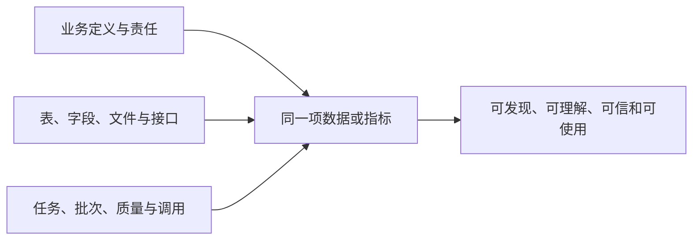

# 040 元数据在数据治理中起到什么作用，业务元数据、技术元数据和运行元数据有什么区别？

## 一句话回答

> 元数据是用于描述数据及其业务含义、技术结构、生产过程和使用情况的信息。业务元数据回答“这是什么、为什么使用、由谁负责”，技术元数据回答“数据在哪里、怎样组织和读取”，运行元数据回答“数据怎样产生、何时更新、当前是否正常”。三类元数据只有围绕同一项数据建立关联，才能真正支撑数据发现、理解、质量判断、血缘追溯、资产运营和自动化治理。

运行元数据的英文通常是 **Operational Metadata**，也常被译为“操作元数据”。为避免与用户在系统中的增删改查和审计操作混淆，本书统一使用“运行元数据”。

## 一、为什么有了数据，还需要元数据

元数据经常被简化为“关于数据的数据”。这个定义没有错，但对实践的帮助有限。

业务人员面对一张名为 `t_ord_hdr` 的表，即使能够看到其中的字段和值，也未必知道：

- 这张表描述的是销售订单、采购订单还是物流运单；
- `status=4` 代表已发货、已签收还是已经关闭；
- 金额是否含税，取消订单是否包含在内；
- 数据来自哪个系统，由哪个部门负责；
- 数据每天什么时候更新，最近一次是否更新成功；
- 哪些报表、指标和服务正在使用它；
- 数据是否存在质量问题，当前能否用于经营分析。

这些信息大多不在数据值本身之中，却直接决定数据能不能被正确使用。元数据就是用来提供这些上下文、规则和运行证据的。

因此，元数据不仅是数据的“说明书”，还是连接业务与技术、连接数据与生产过程的纽带。没有元数据，已经汇聚的数据仍可能只是一个难以理解、无法判断是否可信的“数据堆”。

## 二、元数据在数据治理中起到什么作用

元数据几乎支撑数据治理的所有环节。

### 1. 帮助发现数据

使用者可以按照业务主题、实体、指标、部门、数据类型和更新时间查找数据，而不必事先知道数据库名称和表名。

### 2. 帮助理解数据

业务术语、字段定义、码值含义、指标口径和适用范围，让使用者知道数据表达什么，以及不能怎样使用。

### 3. 帮助判断数据是否可信

来源、更新时间、质量状态、任务执行情况和责任人共同说明数据是否仍然鲜活、是否符合要求、出现问题应找谁处理。

### 4. 帮助正确访问和加工数据

数据位置、结构、格式、字段类型、空间参考和读取方式，让平台和数据工程师能够自动选择合适的连接、解析、转换和计算能力。

### 5. 帮助追溯来源和分析影响

数据与来源、任务、模型、指标、服务和报表之间的关系，可以进一步形成数据血缘。当上游结构或口径变化时，组织能够识别哪些下游成果可能受到影响。

### 6. 支撑资产编目和持续运营

资产目录中的名称、描述、责任、质量、版本、权限和使用方式，本质上都来自元数据及其关联信息。没有元数据，资产门户只能剩下一批名称和链接。

### 7. 支撑自动化治理

平台可以根据敏感等级配置授权流程，根据更新时间判断鲜活度，根据结构变化触发影响分析，根据任务异常发出告警。元数据由此不再只是供人查看的说明，而开始参与治理过程。

## 三、业务元数据是什么

业务元数据（Business Metadata）从业务视角解释数据的含义、用途和责任，主要回答：

> 这是什么数据，为什么需要它，应当怎样理解和使用，由谁负责？

典型的业务元数据包括：

- 业务名称、业务术语和定义；
- 所属业务域、主题和业务实体；
- 指标口径、统计范围和计算周期；
- 数据元、码值和业务规则；
- 适用场景、目标用户和使用限制；
- 数据所有者、业务责任人和维护责任；
- 数据分级分类、敏感性和合规要求；
- 质量要求、鲜活度要求和服务承诺。

例如，“订单及时交付率”不能只有一个名称，还需要说明：

- 分母是计划交付订单、实际发货订单还是全部有效订单；
- “及时”按照发货时间、送达时间还是客户签收时间判断；
- 取消、退货和拆单是否纳入计算；
- 按日、周还是月统计；
- 哪个部门负责确认和修改口径。

这些信息无法仅靠扫描数据库自动得到。系统可以根据表名、字段名和样例值生成候选解释，AI也可以辅助归纳，但最终仍需要熟悉业务的人确认。

业务元数据的价值，在于将技术对象转换成业务人员能够理解的语言。如果业务定义没有落实到具体数据和计算逻辑上，它又会变成一份脱离数据的术语文档。因此，业务元数据必须与技术元数据建立关系。

## 四、技术元数据是什么

技术元数据（Technical Metadata）描述数据在技术系统中的身份、位置、结构、格式和访问方式，主要回答：

> 数据在哪里，以什么形态保存，内部结构怎样，平台如何识别和处理？

典型的技术元数据包括：

- 数据源、数据库、模式、表、视图和字段；
- 对象存储桶、目录、文件路径和文件集合；
- 数据类型、字段类型、长度、精度和是否为空；
- 主键、外键、索引、分区和约束；
- 文件格式、编码、压缩方式和配套文件；
- 数据量、文件大小和基础统计特征；
- 空间字段、坐标参考、空间范围和几何类型；
- 接口地址、消息主题、事件结构和访问协议；
- 数据项与任务、模型、服务之间的技术关联。

关系数据库的表结构可以从系统目录中扫描；Shapefile需要识别主文件与配套文件并将其作为一个完整数据项；遥感影像需要识别格式、波段、空间分辨率、坐标参考和覆盖范围；实时流数据则需要记录消息主题、事件结构和序列化方式。

技术元数据通常比业务元数据更适合自动采集，但自动扫描也不是简单地把所有物理对象原样登记。平台还需要识别什么是完整数据项、哪些只是目录节点、哪些文件共同组成一份数据，以及哪些信息属于内容样本而不是元数据。

技术元数据使数据能够被机器定位和处理，却不能单独回答数据是否适合某个业务用途。一张表结构再完整，如果没有业务定义，使用者仍可能把“订单金额”理解成不同含义。

## 五、运行元数据是什么

运行元数据（Operational Metadata，也常译作“操作元数据”）记录数据在采集、传输、加工、计算、发布和使用过程中的运行事实，主要回答：

> 数据怎样产生，最近一次何时更新，生产过程是否正常，现在是否仍然可用？

典型的运行元数据包括：

- 数据由哪个任务、工作流或服务产生；
- 调度周期、计划执行时间和实际执行时间；
- 任务成功、失败、重试、跳过或部分完成状态；
- 输入和输出数据量、文件数、分区数或消息数；
- 处理耗时、资源消耗和运行环境；
- 数据最后更新时间、延迟和鲜活度状态；
- 本次使用的代码、规则、模型和配置版本；
- 数据服务调用次数、响应时间和失败率；
- 数据被查询、下载、订阅和使用的情况；
- 运行异常、告警和问题处置记录。

运行元数据让一张静态的数据目录获得时间维度。同一张表的结构和业务含义可能没有变化，但如果上游任务已经连续三天失败，它就不能继续被当作“每日更新”的数据使用。

### 运行日志不等于运行元数据

任务日志、系统日志和审计日志是运行元数据的重要来源，但日志本身不必然就是可用的运行元数据。

原始日志可能只是分散的文本，例如：

```text
2026-08-16 08:03:21 job finished, rows=128542
```

只有将任务标识、数据项标识、执行时间、处理量、状态和版本等信息结构化，并关联到相应任务和数据，才能用于查询、比较、告警、鲜活度判断和影响分析。

可以简单理解为：

```text
日志记录发生了什么；
运行元数据把这些事实结构化，并说明它们与哪项数据和哪次生产过程有关。
```

## 六、三类元数据有什么区别和联系

三类元数据观察的是同一项数据的不同侧面。

| 对比维度 | 业务元数据 | 技术元数据 | 运行元数据 |
| --- | --- | --- | --- |
| 核心问题 | 是什么、为什么用、由谁负责 | 在哪里、怎样组织和读取 | 怎样产生、何时更新、是否正常 |
| 主要使用者 | 业务人员、数据管理人员 | 数据工程师、平台和工具 | 运维人员、数据工程师、治理人员 |
| 典型内容 | 术语、口径、责任、规则、用途 | 表、字段、类型、格式、位置、结构 | 任务、批次、状态、耗时、数据量、调用 |
| 主要来源 | 业务梳理、标准和责任确认 | 数据源扫描、格式解析和模型定义 | 调度、执行、质量、服务和监控系统 |
| 变化特点 | 随业务规则和组织职责变化 | 随系统结构和数据形态变化 | 随每次执行和使用持续产生 |
| 主要价值 | 让人正确理解 | 让系统正确定位和处理 | 让人和系统判断当前状态 |

可以进一步概括为：

```text
业务元数据让人看懂；
技术元数据让系统找到和处理；
运行元数据证明数据仍在正常生产和使用。
```

这三类元数据不能停留在三个独立列表中。真正有价值的是建立关联：



如果只有技术元数据，用户可以找到表，却不知道怎样理解；如果只有业务元数据，术语和指标口径可能找不到实际数据；如果缺少运行元数据，即使定义和结构都正确，也无法知道当前数据是否已经过期。

## 七、治理元数据是不是第四类元数据

数据标准、质量规则、责任人、敏感等级、权限策略、保留期限和数据契约等信息，常被称为治理元数据（Governance Metadata）或管理元数据。

这种分类是合理的，但元数据分类并没有唯一标准。例如：

- 指标口径可以被归入业务元数据，也可以被视为治理元数据；
- 敏感等级和责任人既有业务含义，也承担治理控制作用；
- 质量检查结果既是运行事实，也是质量治理信息；
- 数据契约同时包含业务要求、技术结构和运行承诺。

因此，不必强迫每一项元数据只能进入一个互斥类别。本书以业务、技术和运行元数据作为便于理解的三种基本视角，将标准、质量、责任、安全和契约视为贯穿三者的治理信息。

关键不在于最终分成三类还是四类，而在于每项信息是否有权威来源、明确责任、更新机制，并能与具体数据和治理活动建立关系。

## 八、三类元数据应该怎样采集和维护

不同类型的元数据不能采用同一种采集方式。

### 1. 技术元数据以自动扫描为主

通过数据库系统目录、对象存储目录、文件格式解析、消息系统和数据服务描述，可以自动识别数据位置、结构、格式和部分统计特征。

自动扫描能够提高覆盖率，但仍需处理访问权限、扫描成本、数据项边界、格式识别和结构变化等问题。不能为了“元数据完整”而无限制读取所有数据内容。

### 2. 业务元数据需要业务和数据人员共同维护

业务部门负责确认含义、口径、用途和责任，数据人员负责把这些定义关联到数据模型、表、字段、指标和服务。

AI可以根据名称、结构、样例和文档生成候选描述，帮助发现同义词和疑似映射，但不能自行决定经营指标口径、责任归属和合规边界。

### 3. 运行元数据由生产系统持续产生

数据汇聚、数据开发、调度、质量检查、服务和监控模块应在执行过程中产生结构化运行记录，并使用稳定标识关联任务、数据项、模型和服务。

如果各工具只保留自己的日志，没有统一任务身份和数据身份，就很难将一次任务失败与受影响的数据、指标和应用联系起来。

### 4. 元数据也需要版本和变更管理

字段被删除、指标口径调整、责任人变化、任务延期或服务版本升级，都应当更新元数据，并保留必要的变更记录。

元数据过期有时比没有元数据更危险。错误的字段说明、已经离职的责任人或失真的更新时间，会让用户在“看似有说明”的情况下作出错误判断。

### 5. 是否需要定时扫描技术元数据

通常有必要建立周期性扫描机制，但不应简单理解为“所有数据每天晚上全部重新扫描一遍”。扫描频率和深度需要根据数据源、变化频率、业务时效要求和扫描成本确定。

| 场景 | 合适的做法 |
| --- | --- |
| 数据库结构变化较少，且没有可靠的变更事件 | 定期进行基础或增量扫描 |
| 文件、对象存储和共享目录 | 定期扫描发现新增、删除和属性变化 |
| 高频实时流数据 | 依靠事件、模式注册中心（Schema Registry）、运行元数据和周期校验，不做每晚全量扫描 |
| 表结构、字段、文件格式和轻量属性 | 可以较高频、低成本扫描 |
| 行数、分布、空间范围和内容统计 | 只对新增或发生变化的数据项深度扫描 |
| 业务定义、指标口径和责任人 | 通过业务治理流程维护，不依赖技术扫描 |

定时扫描的主要好处是发现新增、删除和结构漂移，弥补变更事件的遗漏，保持目录信息新鲜，并为影响分析和质量治理提供依据。但它也会增加源系统负载和扫描成本，可能产生临时表、分区或文件变化带来的噪声，而且扫描成功不代表数据质量和业务结果正确。

比较稳妥的机制是分层组合：

```text
首次全量扫描
    -> 建立初始元数据基线

日常增量扫描
    -> 发现新增、删除、结构和轻量属性变化

事件触发扫描
    -> 结构变更或数据项变化后及时刷新

定期校准扫描
    -> 检查事件遗漏和目录与源系统的不一致

按需深度扫描
    -> 对新增、变化或重点数据补充字段、统计和空间信息
```

因此，更准确的原则是：基础技术元数据适合定期增量扫描，深度元数据以变化触发和按需扫描为主。定时扫描主要解决技术元数据的新鲜度，不代替运行元数据的持续采集，也不代替业务元数据的人工确认。

## 九、什么是主动元数据

传统元数据管理常停留在扫描、登记和查询：系统定期采集一批信息，用户需要时再进入目录查看。

主动元数据（Active Metadata）更强调持续利用元数据变化和运行事件推动治理动作。例如：

- 上游字段类型变化后，自动识别受影响的任务、指标和服务并通知责任人；
- 核心数据超过约定时间没有刷新时，触发鲜活度告警；
- 新字段被识别为敏感信息时，提示补充分级并限制未授权访问；
- 某项资产长期无人使用时，提示复核维护成本和下架必要性；
- 质量异常被确认后，关联问题记录并沉淀新的检查规则。

主动元数据不是一个孤立的新数据库，也不是简单增加AI功能。它要求业务、技术和运行元数据持续更新、相互关联，并能被质量、资产、安全、开发和监控流程共同使用。

可以用一句话概括：

> 静态元数据告诉我们“数据是什么”，主动元数据还要帮助系统判断“现在应该做什么”。

### 数据编织对元数据提出了哪些更高要求

数据编织不是把所有数据简单搬到同一个地方，而是在数据分散的情况下，通过统一连接、语义、策略和访问能力，让数据能够被发现、理解、关联和使用。元数据在这里不只是目录信息，而是数据编织的连接组织和控制依据。

传统目录可能主要记录表、字段和文件信息；数据编织还需要知道：

- 不同数据源中的对象和字段是否表达相同或相关的业务概念；
- 数据集之间可以按照什么键、实体或空间关系关联；
- 数据在哪里、如何访问、是否有权限；
- 数据最近何时更新、延迟多长、是否满足业务时效；
- 采用物理汇聚还是逻辑查询更合适；
- 一个数据源变化会影响哪些任务、指标、报表和服务。

因此，数据编织对元数据提出了几项更高要求：

1. **从描述单项数据扩展到描述数据关系。**
   除了记录表、字段和文件，还要记录字段映射、实体关系、指标依赖、任务依赖、服务引用和数据血缘。

2. **从技术结构扩展到统一业务语义。**
   “客户”“用户”“结算主体”等名称相近的对象，不能只根据字段名判断是否相同，需要依靠业务术语、实体定义、指标口径、码值和映射规则进行判断。

3. **从静态目录扩展到实时状态。**
   数据编织需要依据鲜活度、延迟、可用性、查询成本和服务水平选择数据来源，因此必须持续获得运行元数据和服务元数据。

4. **从“有什么”扩展到“能不能用、怎样用”。**
   元数据还要关联数据分级分类、敏感字段、授权范围、脱敏要求、用途限制和跨域规则，支撑策略控制和合规访问。

5. **从面向人工查询扩展到机器可理解、可执行。**
   元数据需要具备统一标识、结构化表达、标准接口和明确语义，使平台能够自动选择连接器、生成映射、发现服务、检查契约和分析影响。

可以这样理解三类元数据在数据编织中的作用：

| 元数据类型 | 在数据编织中的作用 | 关联的治理内容 |
| --- | --- | --- |
| 业务元数据 | 判断不同数据是否具有相同或相关的业务含义，明确使用目的和适用范围 | 业务术语、指标口径、质量要求、责任人和用途限制 |
| 技术元数据 | 确定数据的位置、结构、格式、连接方式、映射关系和处理能力 | 技术血缘、敏感字段、访问接口和转换规则 |
| 运行元数据 | 判断数据的新鲜度、延迟、可用性、实际流向、服务状态和使用情况 | 实际运行血缘、质量结果、授权记录和服务水平 |

血缘、权限、质量和服务信息等不必作为与业务、技术、运行元数据并列的第四类元数据。它们更多是贯穿三类元数据的关系、规则和状态。例如，血缘既包含设计阶段的字段映射和任务关系，也包含实际执行形成的运行关系；质量既包含业务提出的质量要求，也包含技术规则和运行检查结果；权限既需要业务用途和敏感等级，也需要技术访问方式和实际授权记录。

三类元数据提供基本视角，血缘、质量、权限和服务则把这些视角连接成可以执行的数据治理体系。

传统元数据帮助人找到数据，数据编织要求元数据帮助系统理解、连接、选择和使用数据。数据编织不要求所有数据都物理汇聚，但无论采用数据仓库中的物理汇聚，还是联邦查询、数据服务等逻辑汇聚，都需要可靠、及时和可机器处理的元数据。

## 十、元数据与数据探查、可观测性、血缘和目录是什么关系

这些概念密切相关，但不能相互替代。

### 1. 元数据与数据探查

元数据扫描主要采集数据身份、结构、格式等信息；数据探查还会读取一定范围的数据内容，分析空值率、唯一值、分布和异常特征。探查结果可以作为统计或质量相关元数据保存，但探查过程不等于全部元数据管理。

### 2. 元数据与数据可观测性

运行元数据是数据可观测性的重要信号来源，但可观测性还需要结合历史基线、数据分布、血缘和业务要求分析异常、定位原因和判断影响。

流水线中的任务状态、耗时和处理量属于运行元数据；将这些信号关联起来发现“数据量突然下降并影响了核心报表”，则属于可观测性能力。

### 3. 元数据与数据血缘

血缘描述数据、任务、字段、指标、服务和产品之间的来源、派生和依赖关系，可以看作一种重要的关系型元数据。但血缘不只是保存几个上下游名称，还需要根据设计、代码和实际执行证据持续更新。第041问将专门讨论血缘与任务依赖的区别。

### 4. 元数据与数据目录

元数据是被管理的描述和关系，数据目录则是对元数据进行组织、检索和展示的产品能力。目录会选择适合目标用户的元数据形成数据卡片、分类导航和搜索入口，但不能把“建设了目录页面”当作已经完成元数据治理。

第042问将进一步讨论数据资源如何经过盘点、治理、编目和发布形成可运营的数据资产；第043问将讨论元数据目录、数据目录和数据资产目录的区别。

## 十一、案例：订单及时交付率为什么需要三类元数据

某制造企业希望统计“订单及时交付率”，用于发现履约问题并优化生产和物流安排。

### 1. 业务元数据解决口径问题

业务部门首先确认：

- 统计对象为已经到达约定交付日期的有效销售订单；
- 取消订单不纳入，拆单按照订单行计算；
- 实际签收时间不晚于承诺交付时间才算及时；
- 指标按月统计，并可以按客户、产品和区域分析；
- 供应链管理部门负责指标口径。

如果没有这些定义，不同人员可能分别按照发货、到货或签收时间计算，得到的结果都能“算出来”，却无法用于统一管理。

### 2. 技术元数据解决数据定位和加工问题

数据团队将指标关联到订单、订单行、发货、物流签收和客户等主题数据，明确：

- 使用哪些表和字段；
- 订单号和订单行号怎样关联；
- 时间字段采用什么类型和时区；
- 订单状态码对应什么含义；
- 数据位于哪个来源系统和数据仓库分层；
- 指标结果通过哪张表或哪项服务提供。

技术元数据让指标口径能够落实到可执行的计算过程。

### 3. 运行元数据解决鲜活度和可信问题

平台持续记录：

- 订单、发货和签收数据是否按计划汇聚；
- 指标任务最近一次何时执行；
- 本次处理了多少订单，是否缺少某个来源或分区；
- 任务使用了哪个计算规则版本；
- 指标服务是否正常，哪些报表正在使用结果。

即使指标定义和SQL都正确，如果物流签收数据已经两天没有更新，当前及时交付率仍然不能代表真实履约状况。

### 4. 三类元数据共同支撑业务行动

管理者看到及时交付率下降时，可以先确认指标口径，再查看数据更新时间和任务状态，最后根据来源和血缘定位受影响的订单范围。

只有把业务含义、技术实现和运行状态连接起来，指标才不只是报表上的一个数字，而是能够被解释、追溯和持续使用的经营信息。

## 十二、常见误区

### 误区一：元数据就是表名、字段名和注释

这些只是技术元数据的一部分。业务含义、责任、运行状态、质量和使用关系同样重要。

### 误区二：扫描完成以后，业务元数据会自动产生

扫描可以发现结构和格式，无法自动确认业务口径、责任归属和使用边界。

### 误区三：采集的元数据越多越好

无明确用途、没有责任人、长期不更新的元数据只会增加维护成本。采集范围应服务发现、理解、治理和使用。

### 误区四：运行日志就是运行元数据

日志是重要来源，但需要结构化并关联到任务、数据和版本，才能稳定支撑查询、告警和分析。

### 误区五：业务元数据可以完全由AI生成

AI适合生成候选解释和映射，不能代替业务责任人决定指标口径、合规边界和责任归属。

### 误区六：元数据平台上线以后就不需要维护

业务、系统和任务都在变化。元数据如果不同步更新，会逐渐失去可信度。

### 误区七：三类元数据应该分别建设三套系统

来源和责任可以不同，但必须使用稳定身份建立关联，并通过统一入口提供查询和治理能力。

### 误区八：有元数据就等于数据可信

元数据提供判断依据，本身也可能缺失或错误。数据是否适用仍需结合质量状态、业务要求和实际用途判断。

## 十三、实践检查清单

1. 每项重点数据是否同时能够关联业务含义、技术位置和运行状态？
2. 业务术语、指标口径和责任人是否经过业务部门确认？
3. 技术元数据是否能够通过自动扫描持续更新，而不是依赖一次性手工登记？
4. 任务、数据项、模型、服务和执行记录是否使用稳定标识建立关联？
5. 运行日志是否被结构化为可查询、可比较和可告警的运行元数据？
6. 字段、口径、任务和责任发生变化时，元数据是否同步更新并通知影响对象？
7. 是否只采集真正用于发现、理解、治理和运营的元数据？
8. 元数据本身是否有权威来源、维护责任和质量检查机制？

## 结语

元数据的价值不在于收集了多少字段和属性，而在于能否让数据被正确理解和持续使用。

业务元数据赋予数据业务含义和责任，技术元数据说明数据的位置、结构和处理方式，运行元数据记录数据的生产、更新和使用状态。三类元数据围绕同一项数据建立关联以后，组织才能回答“这是什么数据、在哪里、是否仍然可信、出了问题影响谁”。

进一步利用这些关联和变化，还可以推动质量检查、异常告警、影响通知、权限控制和资产运营，使元数据从静态说明走向主动治理。这样，元数据才真正成为连接数据资源、治理过程和业务价值的基础。

## 延伸阅读

- 第015问：什么是数据编织（Data Fabric）？
- 第037问：什么是数据可观测性，它和数据质量有什么区别？
- 第039问：资产管理应该包括哪些内容？
- 第041问：数据血缘是什么意思，它与任务依赖关系有什么区别？
- 第042问：数据资源如何从盘点、治理、编目到发布，形成可运营的数据资产？
- 第043问：企业数据目录如何统一各类资源目录，并支撑数据资产目录？
- 第048问：什么是数据契约，它如何降低上下游协作成本？
