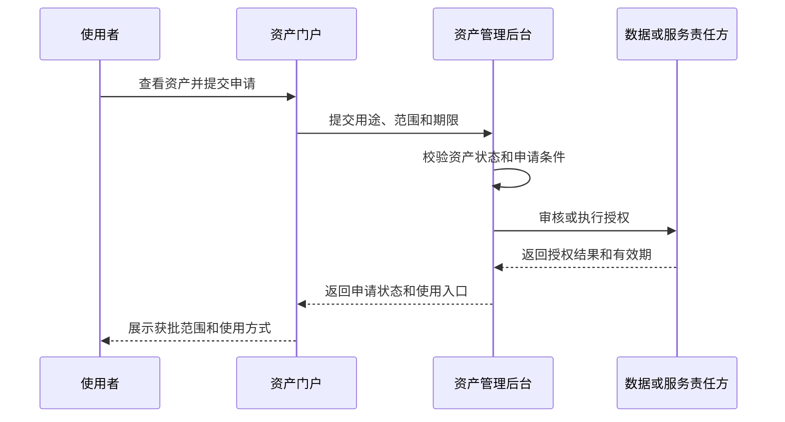

# 044 数据资产管理后台和资产门户有什么区别，二者如何协同？

## 一句话回答

> 数据资产管理后台主要面向资产管理者、数据责任人和运营人员，负责把已有的数据治理成果组织成可发布、可使用、可持续运营的数据资产；资产门户主要面向业务人员、分析人员和开发者，负责资产的发现、申请、获取、使用和反馈。

资产管理后台不是数据生产工具，也不应替代数据开发、数据建模、数据标准、数据质量和数据服务等专业能力。它负责的是资产化过程中的选择、组合、编目、准入、发布和运营。

资产门户也不只是一个展示资产卡片的网站。完整的门户应帮助使用者完成从发现资产、理解资产，到申请权限、获得使用方式，再到评价和反馈的消费闭环。

## 一、先区分三类工作

数据从产生到进入业务场景，通常会经过三类性质不同的工作：

| 工作 | 主要参与者 | 主要工具 | 主要产出 |
| --- | --- | --- | --- |
| 数据生产与治理 | 数据工程师、建模人员、质量人员、业务专家 | 数据汇聚、开发、建模、标准、质量和服务工具 | 数据集、模型、指标、标签、服务及治理结果 |
| 数据资产管理 | 资产管理者、数据责任人、资产运营人员 | 资产管理后台 | 资产边界、编目信息、发布状态、使用条件和运营机制 |
| 数据资产消费 | 业务人员、分析人员、应用开发者 | 资产门户或数据市场 | 发现、申请、授权、访问、评价和反馈 |

这三类工作互相依赖，但不能由一个系统全部承担。

数据生产与治理解决“怎样形成可信、可用的资源”；资产管理解决“哪些成果值得作为资产持续运营”；资产门户解决“用户怎样找到并使用这些资产”。

## 二、资产管理后台是否负责完成数据治理

不负责替代专业的数据治理工作，但需要检查和组织治理结果。

资产管理后台通常不直接完成：

- 数据采集、汇聚和清洗；
- 数据仓库分层和数据建模；
- 指标、标签和算法开发；
- 数据质量规则执行和问题修复；
- 主数据合并和黄金记录形成；
- 数据服务和API开发；
- 数据处理任务的调度和运行。

这些工作应当在相应的专业工具中完成，并由具备专业能力的数据工程师、建模人员、质量人员和业务专家负责。

资产管理后台需要做的是引用这些治理成果，并判断它们是否达到资产化和发布要求。例如：

- 引用已经确认的业务术语和数据标准；
- 查看质量检查结果和已知问题；
- 关联数据来源、加工血缘和当前版本；
- 确认数据责任人和维护机制；
- 检查安全等级、敏感性和授权条件；
- 确认使用入口是否稳定可用。

可以这样区分：

> 质量工具负责发现和推动修复质量问题；资产管理后台引用质量状态，并决定当前是否满足上架条件。

> 数据开发人员负责形成模型、指标和服务；资产管理后台负责将这些成果选择、组合、说明并发布为资产。

资产管理后台承担的是资产准入和运营治理，而不是包办全部数据治理。

## 三、资产管理后台主要管理什么

### 1. 识别和选择资产候选

资产管理者从企业数据目录中查找已经形成的数据集、模型、指标、标签、服务或算法成果，判断哪些内容具有明确的用户、场景和持续复用价值。

不是所有资源都需要成为资产。临时表、调试文件、过程缓存和没有稳定用途的中间结果，可以继续作为资源管理，但不必进入资产运营范围。

### 2. 确定资产边界和组成关系

资产不一定等于一张表或一个文件。一项“供应链库存主题资产”可以由库存明细、库存周转指标和库存查询服务共同组成。

后台需要明确：

- 一项资产包含哪些数据和服务；
- 资产的业务颗粒度和内容范围；
- 哪些资源是核心组成，哪些只是使用入口；
- 一个底层资源是否被多个资产复用；
- 资产变更时会影响哪些用户和应用。

### 3. 完成业务编目

资产编目通常包括：

- 资产名称、业务说明和适用场景；
- 所属业务域、主题和发布分类；
- 目标用户和典型使用方式；
- 数据责任人、维护部门和服务联系人；
- 来源、组成资源、血缘和版本；
- 质量状态、鲜活度和已知限制；
- 安全等级、申请条件和授权方式；
- 查询、下载、订阅、服务或应用入口。

编目不是重新录入一套技术元数据。表结构、字段、指标定义和服务版本应继续引用相应专业系统中的权威事实。

### 4. 管理发布准入

资产管理后台需要确认资产是否具备面向目标用户持续提供的条件，例如：

1. 业务含义和用途清楚；
2. 资产边界和组成关系稳定；
3. 责任人和维护机制明确；
4. 质量和鲜活度满足声明的用途；
5. 权限、敏感性和申请条件已经确定；
6. 使用入口已经验证；
7. 版本、变更和问题反馈机制已经建立。

准入条件不必对所有资产完全相同。公开统计文件、内部经营指标和包含个人信息的客户明细，显然需要不同的治理深度和发布条件。

### 5. 管理资产生命周期

后台还需要管理：

- 草稿、待确认、已发布、已下架和已退出等状态；
- 新版本发布和旧版本退出；
- 资产责任、质量和使用条件变化；
- 用户申请、授权和到期记录；
- 使用统计、评价和问题反馈；
- 长期无人使用或维护成本过高时的调整。

这些内容属于资产持续运营，第045问还会进一步展开。

## 四、资产生产者是否需要使用资产管理后台

可能需要参与，但它不是资产生产者的主要工作台。

资产生产者可以在后台中：

- 推荐或提交资产候选；
- 确认资产的技术来源和组成内容；
- 补充业务说明、更新周期和已知限制；
- 认领维护责任；
- 处理资产使用者反馈的问题；
- 提交新版本或下架建议。

但数据汇聚、建模、指标开发和质量修复仍然回到专业工具中完成。

在规模较小的组织里，同一个人可能同时承担数据工程师、资产责任人和资产管理员等多个角色。这是人员兼职，不代表系统职责可以混为一体。

## 五、资产门户主要提供什么

资产门户面向数据消费者，应围绕用户的真实使用过程设计。

### 1. 发现资产

门户应支持：

- 按业务域、主题和场景浏览；
- 按资产类型、区域、时间、鲜活度和质量筛选；
- 通过名称、描述、字段、指标和标签搜索；
- 查看热门、最新、推荐或已认证资产；
- 从一个资产发现相关数据、指标、服务和产品。

门户展示的是当前用户允许发现的已发布资产，不是企业内部全部资源的镜像。

### 2. 理解资产

资产详情需要帮助使用者判断“是否适合我的场景”，而不只是展示名称和责任部门。

重要信息包括：

- 解决什么业务问题；
- 包含哪些内容，颗粒度是什么；
- 数据从哪里来，怎样更新；
- 当前质量和鲜活度如何；
- 有哪些已知限制；
- 可以通过什么方式使用；
- 申请需要满足什么条件；
- 出现问题应该联系谁。

对于允许预览的资产，门户可以提供字段、样例、指标口径、服务说明或应用截图，但预览不能绕过安全和权限控制。

### 3. 申请和获得资产

门户可以让用户填写：

- 使用目的和业务场景；
- 需要的使用方式；
- 使用范围和预计期限；
- 是否涉及下载、应用调用或跨部门共享；
- 必要的安全和合规承诺。

申请提交后，用户应能够查看审核状态、有效期限和当前可用入口。

### 4. 使用和反馈

获得授权后，门户应提供与资产类型匹配的入口，例如：

- 数据查询或受控下载；
- 消息订阅；
- API和数据服务说明；
- 指标和标签查询；
- 报表、看板或业务应用入口；
- 算法模型的调用说明。

用户还应能够评价资产、报告问题、提出需求并订阅变更通知。

## 六、企业数据目录、资产管理后台和资产门户如何衔接

三者解决不同的问题：

```text
专业生产和治理工具
    ↓ 形成数据、模型、指标、标签和服务
企业数据目录
    ↓ 统一关联和发现治理成果
资产管理后台
    ↓ 选择、组合、编目、审核和发布
数据资产目录
    ↓ 面向消费者展示
资产门户或数据市场
    ↓
申请、授权、使用和反馈
```

企业数据目录可以包含发现、开发和治理中的各类资源；资产管理后台从中选择值得持续运营的成果；资产门户只展示已经发布且当前用户允许发现的资产。

资产门户产生的申请、使用和反馈信息，又会回到资产管理后台，帮助资产管理者调整治理优先级、发布条件和运营策略。

## 七、后台和门户不能各建一套资产台账

资产名称、组成内容、发布版本、质量状态、责任、权限和使用条件，应有统一的事实来源。

资产门户可以根据用户角色和使用场景重新组织展示，但不能自行维护另一套资产事实。否则容易出现：

- 后台已经下架，门户仍然可以申请；
- 后台修改了指标口径，门户仍展示旧说明；
- 后台调整了权限，门户仍暴露下载入口；
- 同一资产在后台和门户拥有不同责任人；
- 用户评价和使用数据无法回到资产运营过程。

正确的关系应当是：后台管理资产事实和生命周期，门户提供面向消费者的视图和交互。

## 八、发布、可发现和可访问是三件事

资产已经发布，不代表所有人都可以看到，更不代表所有人可以直接访问内容。

可以区分以下状态：

| 状态 | 用户能够做什么 |
| --- | --- |
| 不可发现 | 搜索和目录中不展示资产及其存在 |
| 可发现但未授权 | 可以查看允许公开的说明并提交申请 |
| 已授权 | 可以使用获批范围内的数据、服务或应用 |
| 授权到期或被撤销 | 可以查看历史申请，但不能继续访问受控内容 |

对于一般内部资产，可以允许更多员工查看资产说明，再根据用途申请访问；对于高度敏感资产，连资产名称、字段和样例都可能只对特定人员可见。

门户中的“查看详情”“预览数据”和“正式使用”也应分别控制，不能把看见资产卡片等同于获得数据访问权。

## 九、申请和授权怎样协同

资产门户负责提供申请体验，资产管理后台负责处理资产运营流程，真正的数据访问控制仍应由相应的数据源、服务或授权体系执行。

一个较完整的过程是：



门户不应自行决定用户可以访问哪些数据，也不应因为申请表提交成功就提前展示受控内容。

对于低风险资产，审批可以由规则自动完成；对于敏感数据或特殊用途，可以由资产责任人、安全人员或相关业务部门审核。流程复杂度应与风险匹配，而不是所有资产都采用相同的多级审批。

## 十、版本和变更怎样协同

资产管理后台负责版本和生命周期事实，资产门户负责把与使用者相关的变化清楚传达出去。

后台需要处理：

- 新版本的内容范围和变更原因；
- 指标口径、字段结构和服务接口变化；
- 旧版本继续可用还是停止使用；
- 变化会影响哪些用户、报表和应用；
- 资产下架或替代方案。

门户需要展示：

- 当前有效版本和更新时间；
- 即将发生的重大变化；
- 旧版本停止时间；
- 已知问题和使用限制；
- 需要用户采取的迁移动作。

用户不应在毫无通知的情况下发现字段消失、指标口径改变或者API无法调用。

## 十一、什么时候可以称为数据市场

只有资产分类和详情页面，通常只能称为资产门户或资产目录前台。

当它进一步具备以下能力时，才更接近数据市场或数据产品市场：

- 统一搜索和推荐；
- 面向场景的资产组合；
- 自助申请和自动授权；
- 标准化交付和服务承诺；
- 使用量、成本或计量信息；
- 用户评价、问题反馈和需求征集；
- 版本、订阅和变更通知；
- 数据产品负责人和持续运营机制。

这里的“市场”不一定意味着对外交易或收费，重点是建立供需双方可以持续互动的数据运营机制。

## 十二、案例：供应链库存主题资产

某制造企业希望让采购、生产、销售和仓储部门统一掌握库存情况。

### 1. 专业人员形成治理成果

数据团队汇聚采购、生产、销售和仓储系统的数据，建立库存明细模型，计算现有库存、可用库存、库存周转天数和缺货风险等指标，并发布受控查询服务。

这些工作分别在数据开发、建模、指标、质量和服务等专业工具中完成，不由资产管理后台计算。

### 2. 资产管理后台组织和发布

资产管理者将以下内容组织成“供应链库存主题资产”：

- 库存明细主题数据集；
- 库存周转天数和缺货风险指标；
- 库存查询服务；
- 数据质量状态和更新时间说明。

后台明确资产责任人、适用范围、更新频率、已知限制和申请条件，并确认数据质量和服务入口满足发布要求。

### 3. 资产门户支持消费

采购人员可以搜索缺货风险资产，销售人员可以查找可用库存，仓储人员可以查看库存周转指标。不同角色看到相同资产的业务说明，但需要按照用途申请不同范围的数据和服务权限。

用户发现库存状态延迟后，可以在门户提交问题；资产管理后台将问题转交数据责任人和生产团队处理，并向受影响用户反馈结果。

这个案例说明，专业工具负责生产和治理，资产管理后台负责资产化和运营，资产门户负责消费体验和反馈闭环。

## 十三、常见误区

### 误区一：资产管理后台应该完成所有数据治理

资产管理后台负责引用治理结果、执行资产准入和运营管理，不替代数据开发、建模、标准、质量和服务工具。

### 误区二：资产门户就是资产管理系统

门户面向消费者，后台面向管理者。用户、功能和权限边界都不同，不能只换一套页面样式就视为两个系统。

### 误区三：门户应该展示全部数据资源

全部资源应在企业数据目录中管理。门户只展示经过治理和发布、并允许当前用户发现的资产。

### 误区四：资产上架后所有人都可以直接使用

上架、可发现、可预览和可访问是不同状态，正式使用仍需遵守授权和用途限制。

### 误区五：门户可以自行决定数据权限

门户负责收集申请和展示结果，真正的访问控制需要由资产管理流程和数据或服务责任方执行。

### 误区六：后台和门户各自维护一套目录更灵活

两套事实会产生状态、版本和责任冲突。门户可以有不同展示视图，但必须引用统一资产事实。

### 误区七：门户访问量高就证明资产价值高

点击量只能说明关注度。资产是否产生业务价值，还要结合实际使用、业务效果、维护成本和用户反馈判断。

## 十四、实践检查清单

1. 是否区分了数据生产与治理、资产管理和资产消费三类工作？
2. 资产管理后台是否引用专业治理结果，而不是重复实现开发、建模和质量能力？
3. 资产候选是否来自企业数据目录，并允许一个资产关联多个资源？
4. 后台是否管理资产边界、责任、质量、权限、版本、上下架和运营状态？
5. 门户是否只展示已发布且当前用户允许发现的资产？
6. 是否区分资产发布、可发现、可预览和可访问？
7. 申请、审核和真实授权是否各有明确责任方？
8. 后台和门户是否引用同一套资产事实和生命周期状态？
9. 资产变更和下架是否能够通知受影响用户？
10. 门户是否形成发现、理解、申请、使用和反馈的完整闭环？

## 结语

专业数据工具负责生产和治理数据，企业数据目录负责统一关联和发现成果，资产管理后台负责把值得持续运营的成果组织成资产，资产门户负责让用户发现、申请、使用和反馈。

资产管理后台不是万能的数据治理平台，资产门户也不是后台的简单只读页面。只有明确生产、管理和消费三类职责，并让治理结果、资产事实和用户反馈在它们之间顺畅流动，数据资产才能真正进入业务场景并持续产生价值。

## 延伸阅读

- 第039问：资产管理应该包括哪些内容？
- 第042问：数据资源如何从盘点、治理、编目到发布，形成可运营的数据资产？
- 第043问：企业数据目录如何统一各类资源目录，并支撑数据资产目录？
- 第045问：数据资产如何评价和持续运营，为什么编目上架不是终点？
