# 时空数据治理体系建设实践与智能化初探（全文版）

> Markdown 转存说明：来源为用户提供的同名 DOCX，见[原始文档](../../数据治理100问/时空数据治理体系建设实践与智能化初探（全文版）.docx)。保留原文非空段落及顺序，分节标题为阅读导航补入，不改变原文观点。原文没有独立 Word 表格，表格内容均在配图中。
>
> 原文 35 张配图均保留对应位置：20 张通用图保留原图；15 张界面截图或复合图改为明确标注的匿名文字说明，省略地名、客户与项目标识、账号和测试明细。因此本稿为匿名阅读转存稿，不是逐像素还原版；完整图像仍在原 DOCX 中。报告署名保留以标明来源。
>
> 本稿用于素材核对，不是新书正文。原报告中的“数据治理”范围及部分绝对化表述尚未按新书口径修订。案例提炼与待核实事项见[案例库讨论稿](../案例库讨论稿.md#实践报告补充素材)。

编者按：本文是2025年空间智能软件大会的数据治理与数据要素分论坛上，曾志明博士的报告图文并茂版，做了少量的修订和增补。

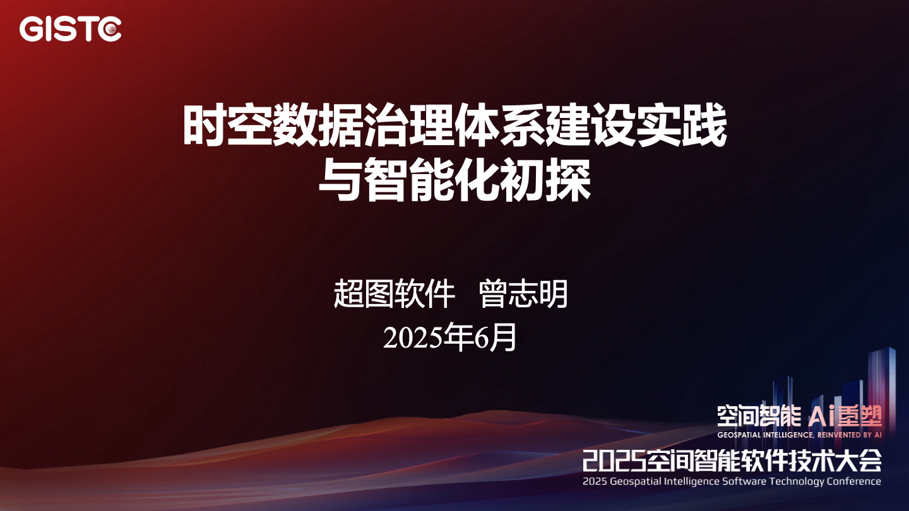

## 开场

各位领导，各位来宾，大家上午好。很高兴今天能有机会和大家一起交流我对数据治理的一些认识。

我们都知道，数据治理是一个非常庞大的体系。要在短时间讲清楚挺不容易，我想借鉴马斯克的“第一性原理”，首先探讨数据治理到底是要解决什么问题。

## 一 数据治理的出发点

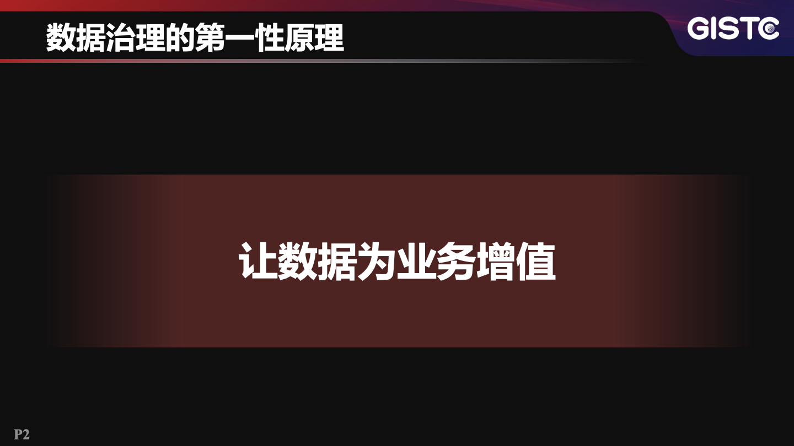

就我的理解，数据治理最根本的目的是“让数据为业务增值”。这是因为要做好数据治理其实非常不容易，投入大且还不容易看到立竿见影的成果。如果不能从“为业务增值”为出发点，很容易半途而废。

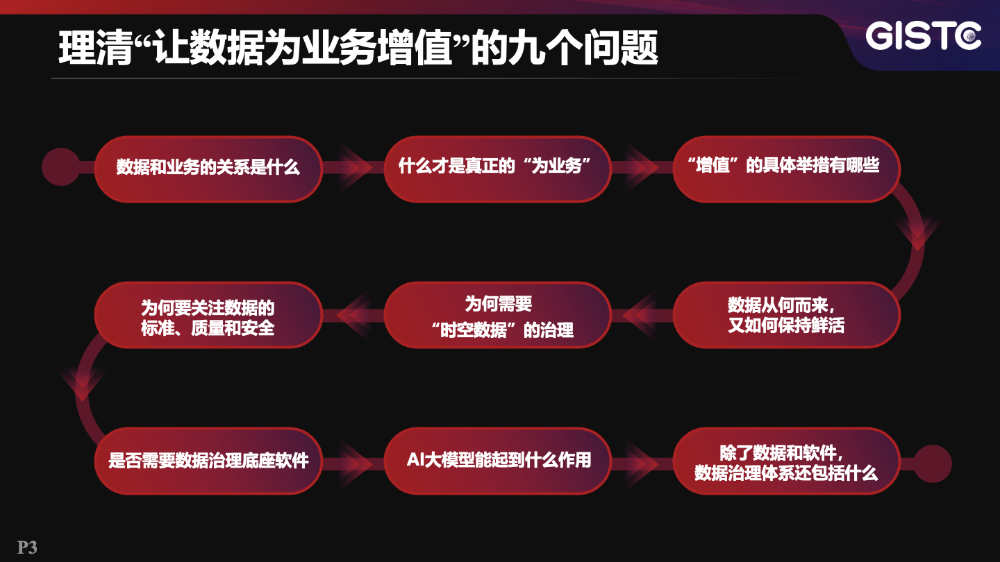

那么如何才能做到“让数据为业务增值”呢？我们可以从下面九个问题展开讨论。

首先，我们要明确数据和业务到底是什么关系。

接着，要弄清楚什么才是真正的为业务。是不是仅仅把数据汇聚起来，或者把数据规整好，就算是为业务呢？

再次，要为业务增值有哪些具体的举措？

第四，数据治理是为了让“数据”为业务增值，那么数据从哪里来，又如何保持鲜活度？不能数据过时了还在使用。

再者，为什么需要“时空数据”的治理？

还有，为什么要关注数据的标准、质量和安全？不理会它们会有什么样的问题吗？

再有，是否需要“数据治理的底座软件”？是否可以依靠人工或者软件硬编码的方式进行数据治理？

另外，近年来，AI大模型发展迅猛，能否在数据治理中发挥作用？

最后，除了前面提到的数据和软件，一个完整的数据治理体系还应该包括哪些内容？

## 二 数据与业务的关系

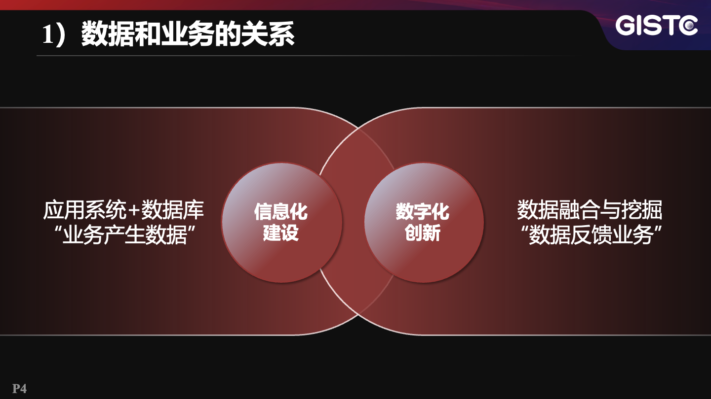

要充分理解数据治理，首先我们还是要回顾一下数据和业务的关系，从而了解“数据治理”从何而来。

最初，要做的事情叫做“信息化建设”。也就是建设应用系统，把纸面流程电子化，把信息存储到数据库中。这个过程是：“业务产生数据”。在这个阶段，实际上不需要数据治理。

等到信息化建设有初步成效，尤其是有了多个业务系统后；把多个业务系统中存储的数据进行融合和挖掘，通过数据来创新，从而服务于业务。这时就必须打破数据孤岛、统一数据标准，这个时候，数据治理就显得尤为重要。

## 三 应用场景与业务价值

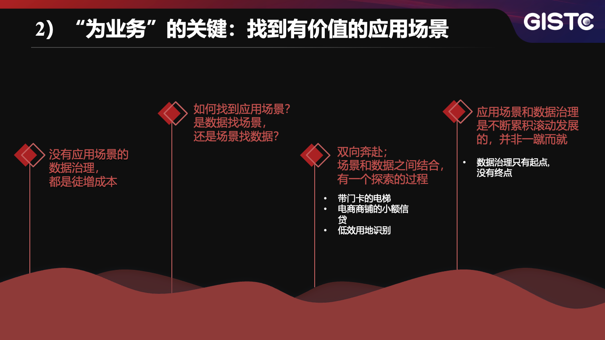

数据治理要做到真正‘为业务“的关键，是要找到数据治理能实现的应用场景。如果没有具体的应用场景，数据治理过程中，无论是数据的传输、存储、计算，还是人员和设备的投入，都是巨大的成本。没有实际的价值产出，数据治理很容易虎头蛇尾，无疾而终。

那么，如何才能找到应用场景呢？ 是根据现有数据来找应用场景，还是先明确有价值的场景，再来确定需要哪些数据？

其实，这是一个双向奔赴的过程。我们通过几个例子来阐述。

第一个例子。在一些办公楼或者酒店，电梯内需要刷卡。如果能将刷卡信息与电梯的调度系统关联，就不必再手动按楼层，提高了电梯的运行效率。

第二个例子。电商商铺需要资金周全，可能只要几万块钱，那么借贷方如何判断商铺的信用呢？对于银行而言，一方面是审查成本过高，另一方面电商的小商铺也没有什么可抵押的。所以这笔生意做不成。

但对于电商平台而言，可以使用利用“商铺答复问题的时间”来判断商铺的勤勉度，再结合其他数据指标，就能在几分钟之内自动计算出商铺的可贷款额度。

第三个例子。经济发达地区的土地资源有限，需要对当前的城市用地情况做一个盘点，识别出低效用地。这里需要定义什么是“低效用地”，比如包括：批而未供、供而未建、建后利用率低等等。

这些就需要统筹各个相关环节业务系统中的数据，同时还要获取到相应的社会经济生产数据来进行综合计算。

找到对应的应用场景，即使一开始只有一两个，才能验证数据治理的成果，奠定一个良好的开端。随着容纳进来的数据维度越多，应用场景也会不断累积发展。所以说，数据治理只有起点、没有终点。

## 四 业务增值的具体举措

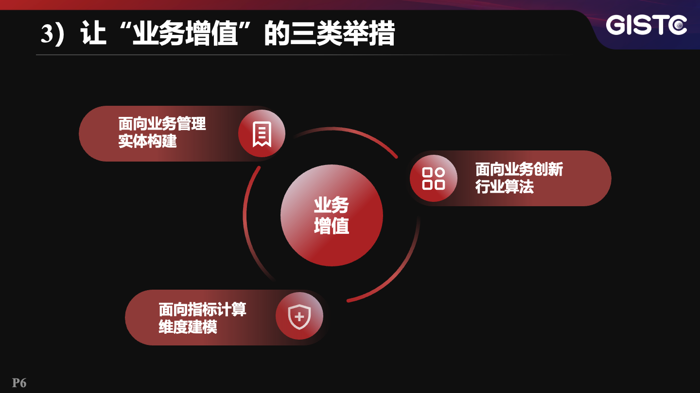

实践中要让“业务增值”，可以分为三类举措。

第一类：面向业务管理，构建业务实体。

这里需要强调的是：”业务管理“，即必须服务于管理。

举个不一定恰当的例子：疫情期间，小区需要做防疫管控，那么就得看如何定义“防疫小区”？它并不完全等同于住宅小区，而是需要有围墙和明确的出入口；同时还要考虑商场和写字楼。

再举个例子：同样说的是”道路路段“，测绘行业关心的是道路的连续性，地图导航关心的是路口和交通规则，交警则关心的是交通的拥堵情况。对路段的定义和管理自然会有所不同。

这一部分涉及到的技术是业务建模，构建业务实体。

第二类，是做指标计算，面向精细管理。

举个例子：某手机厂家拥有多个型号的手机，线上线下都有销售渠道。那么，不同渠道、不同地区、不同型号、不同时间段的销售增长率、销售占比是多少等，这些就都是指标。这些都需要通过指标来分析，从而调整和优化经营策略。

这部分涉及的技术是维度建模，限于时间和篇幅，就不展开论述了，有很多专业的书籍可供参考。

第三类：相对更复杂了，往往需要进行算法开发，以实现特定的能力。

例如，我们通过天气预报预测一片区域在未来某个时间段的降水量，如何推算出河流水位呢？这需要结合地形、河道等，进行水动力模型的分析计算。之前提到的电商商铺的贷款额度，也是需要通过计算和综合来得出的。

这部分涉及的技术是算法和数据开发。

**图 07：业务实体建模（匿名文字说明，非原图）**

- 原图展示新增实体的名称、类型、来源、分级等配置，以及业务实体间的包含和关联关系。
- 示例围绕土地开发利用与林地组织关系；界面账号和无关测试信息不转录。

上述是“新增业务实体”和实体建模的功能截图。

**图 08：维度建模与指标体系（匿名文字说明，非原图）**

- 原图包含维度建模、原子指标设置、衍生指标设置和业务指标体系四个界面。
- 建模界面涉及模型类型、数据来源等配置；指标配置涉及单位、计算字段、聚合方式、统计周期和业务限定。
- 此处记录界面展示的能力，不将截图中的测试指标、日期或状态作为项目成果。

上述是维度建模和构建指标体系的截图。

维度建模需要做好数据仓库的分层规划，明确颗粒度，设计事实表和维度表，然后逐层汇总，计算各个指标。

之所以这样做，核心是构建和维护统一的数据仓库，统一指标的业务口径。避免新增一个指标时，需要从头计算一遍，从而节省计算资源，尤其是在数据量大时，计算成本非常高。

对于行业算法，我们内置了一些空间与非空间的算子，也支持算子的拖拽进行编排。当然，不同领域的算法差别很大，因此必须提供算子的扩展开发。这里提供了SQL和Java的算子扩展开发能力。

**图 09：算子与数据开发（匿名文字说明，非原图）**

- 原图展示内置空间和非空间算子、可视化算子编排、扩展开发三部分。
- 编排示例将数据输入、缓冲区分析、求交和叠加结果等步骤连接起来。
- 省略截图中的地区、项目目录、账号和测试数据名称；不保留具名截图。

## 五 数据来源与鲜活度

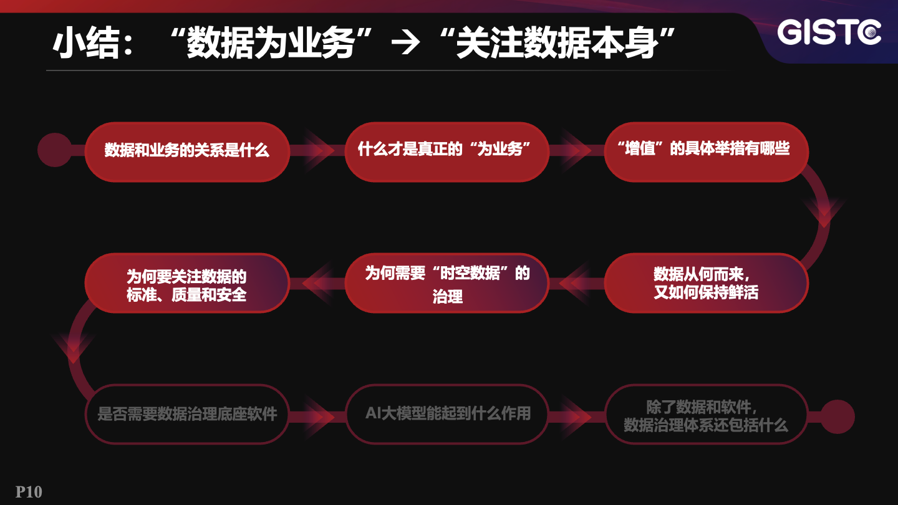

小结一下，我们已经了解了数据和业务的关系是”业务产生数据、数据反哺业务“，数据治理的核心目标就是让数据能为业务增值，具体的举措包括：构建业务实体、指标计算和开发算法实现业务创新等。

下面我们来关注和数据本身相关的三个问题，分别是：”数据从何而来、如何保持鲜活度“，”为何需要时空数据的治理“，以及”为何要关注数据的标准、质量和安全“。

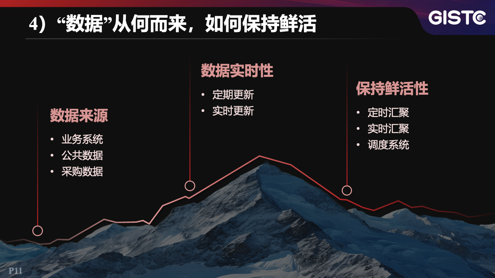

首先是数据从何而来，又如何保持鲜活度。

数据的来源，核心肯定是从已有的业务系统中来，另外还有公开的数据，或者能够协调共享的数据；当然，也有一些数据是需要采购的。

从数据的实时性上看，有些数据是定期更新的，例如公开或采购的数据，而有些数据，如业务数据，则是实时更新的。

做数据治理，非常重要的一点就是必须要“保持数据的鲜活度”。这是因为数据治理的成果是要为业务的应用场景服务的。如果数据过时了，得到的成果自然也是不可靠的。例如，最新天气预报提供降水量已经发生变化，自然得用新的数据重新计算预测河流的水位高度。

因此，就必须按照一定周期进行数据的汇聚，以保证数据的鲜活度和业务效果。根据实际业务的不同，数据汇聚分为定时汇聚和实时汇聚。这些能力背后，需要一个调度系统来支撑。

**图 12：数据源与汇聚任务（匿名文字说明，非原图）**

- 原图展示多种数据源类型、定时汇聚与周期调度、增量更新，以及实时汇聚的不同触发入口。
- 更新配置包含新增、合并、更新及全量、时间范围、自定义条件等选项；这些是原图界面内容。
- 省略任务目录中的具体地区、项目名称、连接地址和账号。

这是数据汇聚模块的几个截图。包括多种类型的数据源，定时汇聚，是全量汇聚还是增量汇聚，以及多种实时汇聚的触发方式，等等

## 六 时空与全域数据

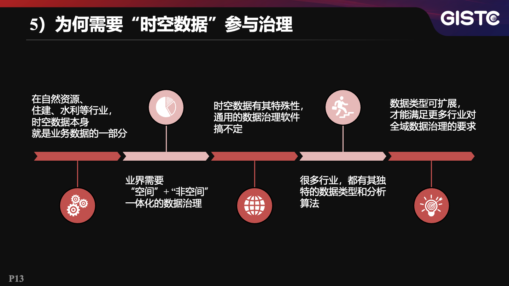

那么，为什么需要时空数据参与数据治理呢？是不是仅作为底图就可以了吗？

这肯定不行。因为在自然资源、住建、水利等多个行业，时空数据本身就是业务数据的一部分，就是业务所管理的对象。同时，如果把时空数据和其它业务分别治理，也容易造成两者的割裂和不一致，导致最后的业务场景不可用。

故而，不能把空间数据与其他业务数据隔离开，需要空间数据与非空间数据一体化的数据治理。

同时，由于时空数据的特殊性，包括数据类型、数据格式、质量规则、分析算法、空间服务、地图展示等多个方面，和一般的属性数据有所不同。因此，通用的数据治理软件和工具无法解决这个问题，需要GIS业界提供针对性的、一体化的数据治理平台。

其实，再进一步思考，很多行业都有其独特的数据类型和分析算法等。例如，地质行业有地震波数据，气象行业也有自己特定的数据格式。一个特定的数据治理平台，也无法一开始就能支持所有的数据格式，而用户肯定希望能够一体化管理和治理自己所有的数据。

因此，数据治理平台必须支持数据类型和数据格式的可扩展性，才能满足更多行业对全域数据治理的需求。

**图 14：时空数据的专业差异（匿名文字说明，非原图）**

- 原图包含数据类型选择、空间质量规则、空间数据服务和地图展示四部分。
- 规则示例包括几何、拓扑、空间位置等检查；服务与地图界面说明空间成果有不同的发布和浏览方式。
- 地图中的具体地名、图层名及项目标识不转录，保留能力类别。

这里展示了时空数据在数据类型、数据格式、质量规则，服务类型，地图展示等方面的不同。

## 七 数据标准、质量与安全

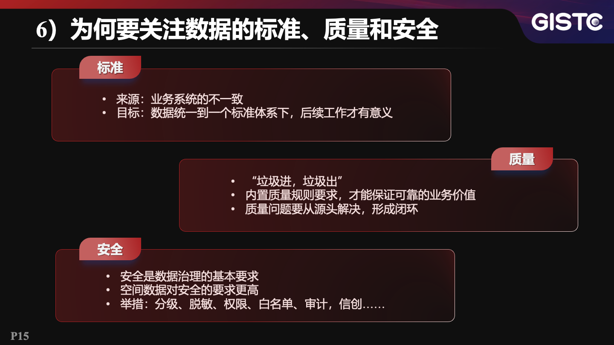

我们将全域的数据汇聚后，为什么要关注数据的标准、质量和安全呢？

数据标准问题的来源是：原始数据来自多个业务系统和渠道，天然就存在数据形式不一致的可能性；例如坐标系不统一、数字字典不一样等。为了后续工作有意义，必须将数据统一到一个标准体系下。

数据要服务于业务，和AI一样，存在“垃圾进，垃圾出”的问题。因此，必须从源头抓好数据质量。数据质量和数据标准的问题有所不同。数据标准的问题可以在数据治理环节，通过数据转换统一到一个标准下。而数据质量问题，虽然是在数据治理环节发现的，但要解决，一般都需要回到数据源头，也就是数据生产方来解决。

数据安全是数据治理的基本要求，其重要性堪比守护神。其他工作做得再好，也是加分项，而一旦数据安全出现大问题，成果将直接归零，甚至变成负分。因为其他业务系统即便数据泄露，也只是单个系统的问题，而数据治理是先汇聚或者能访问到各方面的数据，因此，数据安全方面万万不能出问题。

**图 16：数据标准（匿名文字说明，非原图）**

- 原图展示标准文件管理、度量单位、数据字典和标准表配置。
- 标准表界面将字段及类型等配置与标准规范关联；标准文件作为可查阅资料展示。
- 省略地区目录、人员信息和测试标准详情；截图中的编号及占位值不作为正式规范依据。

上述是数据标准的一些功能截图，包括：标准文件的集中管理、数据字典定义、度量单位标准和标准表定义等。

**图 17：数据质量（匿名文字说明，非原图）**

- 原图展示内置及可扩展规则、质检方案配置和质量概览。
- 质量概览包含规则、方案、检查结果及问题分布；这些界面计数不作为业务质量成效。
- 界面账号、任务名和测试值不转录。

上述是数据质量的一些功能截图，包括：内置质量规则、质量规则可扩展、制定质检方案，以及查看质量概览等。

上述是数据安全的几个截图，包括数据分级分类、数据脱敏、分角色授权和审计等。

**图 18：数据安全（匿名文字说明，非原图）**

- 原图展示数据分级、脱敏规则、角色授权及审计日志。
- 脱敏界面配置规则方式与样本验证；授权界面按组织、角色和人员选择范围；审计界面记录访问行为。
- 具体客户机构、人员、账号和网络地址不转录。

## 八 数据底座与 DataOps

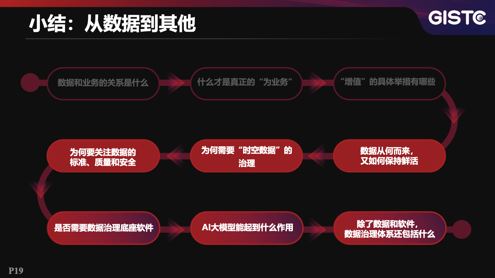

介绍完数据本身的三个问题，我们继续最后几个问题，分别是数据底座软件和AI大模型在数据治理中发挥的作用，  以及数据治理体系还包括哪些内容。

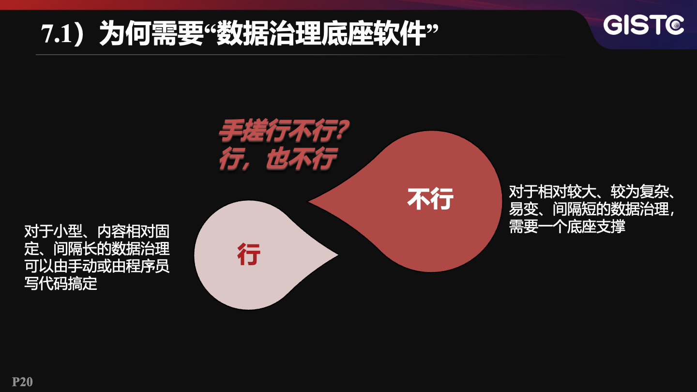

前面我们也看到了不少数据治理软件的截图。这类软件可能叫做“数据治理平台”、”数据治理底座“、”数据中台“或”数据资源平台“等等。那么，数据治理实施，能否不用这类软件，自己手搓，也就是手工治理或硬编码实现呢？

其实也行，但只适合以下几种情况：一是数据治理链路不多，且不复杂，靠人工能管得过来；二是变化不大，要求相对固定；或者是运行的间隔长，比如每三个月才需要处理一次数据。这时，手动也是可以的。

但一旦：数据源多了，数据治理链路复杂了；要求变化快，如新增指标或指标含义变化；或者需要T+1，隔天就要新的数据成果。那么，手动或自己硬编码，肯定是无法应对的。

举个程序员懂的例子，就像写一个只有三五个代码文件的小程序，自己用记事本其实也没问题；如果要写十个人一起工作几个月，有上百个代码文件的软件，肯定得使用集成开发环境（IDE）。

数据治理底座软件所发挥的作用，还有一个专门的术语，叫做：DataOps。

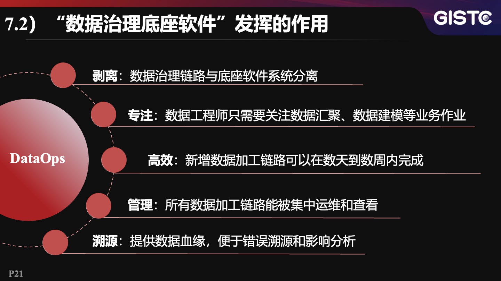

其核心就是做到下面六个目标：

剥离：将数据治理链路与底座软件系统的开发分离开；

专注：使得数据工程师只需关注数据汇聚、数据建模等业务作业，从而大幅度降低数据治理从业者的技术门槛；

高效：同时，新增数据加工链路可以在数天到数周内完成，相比软件开发动辄所需数月的时间，效率大大提高；

管理：所有数据加工链路可以集中运维和查看，业务方能有效管理数据治理的产出；

溯源：由于数据链路都在一个底座之上，可以提供数据血缘，便于错误溯源和修改后的影响分析。

**图 22：数据加工链路管理（匿名文字说明，非原图）**

- 原图展示流程编排、加工任务统一管理、数据工作全貌和数据血缘四部分。
- 编排连接多个算子，任务列表展示运行状态；总览展示资源与任务信息，血缘图连接来源、处理和结果。
- 省略项目目录、客户标识、地区、账号和测试计数，不将界面资源数量作为已验证规模。

再看几个功能截图。 一个是数据加工链路，可以通过编排方式实现，降低技术门槛；二是所有数据加工链路统一管理和运维；三是数据治理的全貌也能一目了然地看到；最后一个，数据资产的血缘关系也能被提炼和记录下来。

我们再看一下数据治理底座软件的功能架构图。 最底下是数据汇聚模块，上面是数据建模，包括业务实体建模和维度建模；更上面有数据开发，右边是数据的标准、质量和安全；然后还有数字资产管理体系，由于时间关系未做详细介绍。两边是统一的账号权限与运维监控管理。

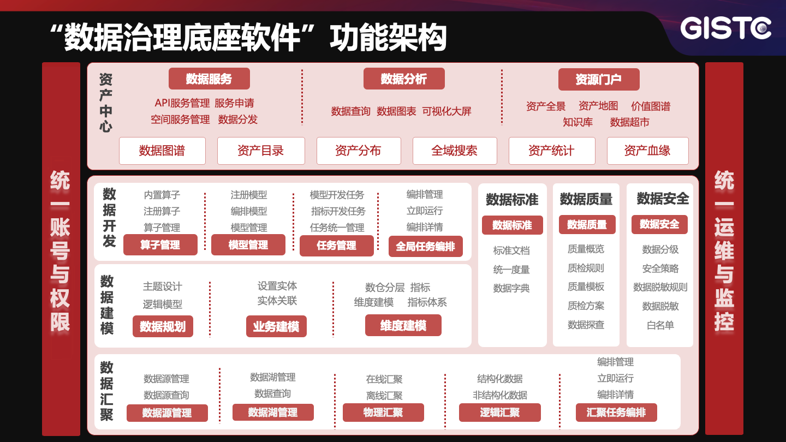

## 九 AI 辅助数据工作

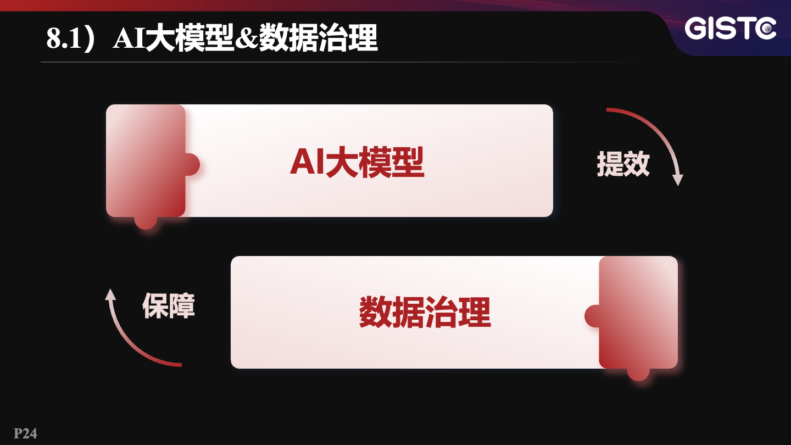

从前面的介绍能了解到，数据治理是一个庞杂而繁琐的工作。 虽然有了数据治理底座软件的协助，做好数据治理仍然需要大量的时间和精力。

AI大模型这几年发展迅猛，其本质是要解决人的脑力劳动。因此，一方面，我们可以在数据治理中嵌入大模型能力，让大模型有效地辅助人的工作；另一方面，大模型也需要可靠的高质量数据集和知识库，这些都需要以做好行业数据治理为基础。

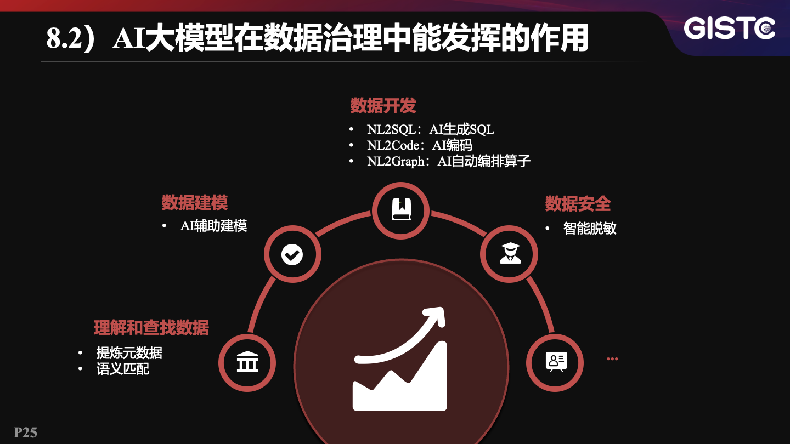

数据治理的环节很多，包括理解和查找数据、数据建模、数据开发、数据安全等等，AI大模型都能在其中发挥重要作用。 例如用大模型提炼元数据，这样就可以用语义而非仅仅文字匹配的方式来查找数据。还可以通过自然语言生成SQL语句，让业务人员直接查询数据。还可以通过自然语言输入任务要求，自动完成复杂的算子编排。

**图 26：AI 自动编排演示（匿名文字说明，非原图）**

- 原图为编排界面，显示“第一步：输入命令”。正文进一步描述根据任务要求、知识库和算子描述生成编排，展示后由用户确认再运行。
- 该静态图没有展示完整执行结果或成功率；不补写具体提示词和业务效果。
- 省略界面中的地区、项目目录和账号。

我们来看这个效果。 首先输入一个任务要求，大模型进行分析、结合内部的知识库和算子描述等，自动完成对应算子的编排。由于当前大模型还存在幻觉和不可靠的地方，我们会把编排结果展示出来，用户确认后再运行。

## 十 组织、实施与持续运营

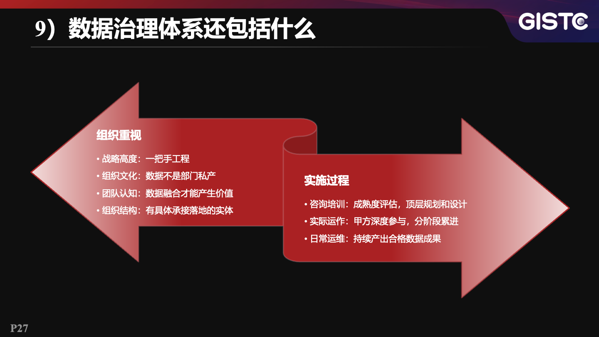

数据治理作为一个体系，除了前面提到的内容外，还有两个方面也非常重要。

一方面是开展数据治理的组织必须从战略高度上重视。这不仅仅是规整数据的技术工作，由于数据治理和业务创新紧密关联，必然需要高层领导的鼎力支持。从组织文化上，也需要有共识和认知基础。还需要有实际承接工作的组织结构实体，否则容易落空。

另一个方面是在实施过程中，若是首次开展数据治理工作，最好有一个咨询培训的过程，做好现状评估和顶层设计。实施时，除了引入实施团队外，业主单位也必须深度参与，只有业主才能评判应用场景和业务价值。同时，实施应分阶段进行，逐步投入，逐步见效。

在运维方面，数据治理与一般的软件系统有一个显著的不同之处，那就是需要日常监控数据加工链路，确保能够持续产出合格的数据成果。这不仅仅是保证软件功能正常运行，因为定期汇聚数据本身也在刷新，而支撑数据汇聚和数据计算的软硬件软件也有可能出现问题，这些都需要持续监控和排查。

**图 28：整体解决方案（匿名文字说明，非原图）**

- 原图从左到右列出数据咨询设计、数据建模建仓、数据治理平台、数据治理实施、数据资产运营。
- 咨询设计涉及管理体系、战略、架构、应用、安全、质量、标准和生命周期；建模建仓包括实体与维度建模。
- 平台列出汇聚、开发、可视化、标准、质量和安全；实施包括载入、转换、建模、映射、质检、导入、管理，以及数据关联融合和利用。
- 资产运营展示产品检索与交易入口。省略复合截图中的地名、项目名称及二维码；这些模块是报告的方案表达，并非每个项目都必须具备。

我们再看一下数据治理的整体解决方案。首先是咨询与设计，关键是理清现状，做好评估，设计战略和架构等。然后可以开展数据建模的工作，基于数据治理平台进行数据治理实施。最后，进行数据的运维与监控，确保数据产品的产出，以及资产运营等工作。

## 十一 回顾

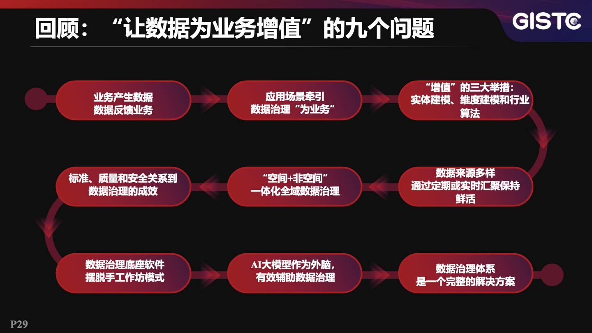

我们再整体回顾一下数据治理体系实现”让数据为业务增值“的九个问题。

了解”业务产生数据，不同维度的数据融合反馈创新业务“；

要做到真正为业务增值，找到具体的应用场景牵引是关键；

具体的增值举措包括：实体建模达成业务管理、维度建模以实现指标计算和行业算法创新三大类；

数据的来源多样，但必须保持鲜活度；

需要汇聚”空间“+”非空间“，实现一体化的全域数据治理；

标准、质量和安全关系到数据治理的成败；

数据治理底座软件使得数据治理过程摆脱手工作坊模式，实现流水线工厂作业；

AI大模型作为外脑，可在多个方面有效辅助数据治理；

数据治理体系，还包括前期的咨询培训和后续的运维，是一个完整的体系。

## 十二 实践案例

### 案例一 自然资源咨询项目

**图 30：自然资源数据治理咨询项目（匿名文字说明，非原图）**

- 原图主线为：现状调研 → 成熟度评估 → 建立制度体系 → 方案验证。
- 进一步列出完善数据管理制度、开展数据资源规划设计、夯实数据中台能力、走通数据产品路径。
- 图中含自评表和能力评分表；仅转写评估维度与工作过程，不转录机构文件名和未经核验的分数。

我们来看几个实际案例。第一个案例是某市自然资源的咨询项目。首先进行现状调查，再进行成熟度评估；然后剖析问题，围绕数据汇聚、标准、质量、安全、开发利用等多个维度进行顶层设计，制定一套制度体系，最后验证方案的合理性。

### 案例二 自然资源一体化项目

**图 31：自然资源一体化项目（匿名文字说明，非原图）**

- 原图按数据资源、数据中台、统一应用支撑和业务应用组织架构。
- 资源包括现状、规划、管理和社会经济数据；中台包括数据入湖、数据关联和目录共享。
- 统一支撑涉及用户、技术能力、服务运维、空间数据处理、场景、集成交换及移动使用，并衔接公共服务能力。
- 上层列出调查监测、规划用途管制、确权登记、权益与开发利用、执法督查、政务办公、生态修复、矿业权、测绘和地灾防治等业务。
- 左侧为数据标准、数据库、服务接口、系统开发、运维维护和制度保障规范；该图展示方案覆盖，不据此认定各项均已建成或产生效果。

第二个案例是某省自然资源一体化项目。该项目汇聚了自然资源相关的各类数据，建立了统一的数据资源目录；在统一的国土空间基础平台之上，支撑各个业务工作。

### 案例三 城市驾驶舱项目

**图 32：城市驾驶舱项目（匿名文字说明，非原图）**

- 原图将现状、规划管控、管理和社会经济数据组织为指标库、台账库，支持仪表盘、专题应用和移动应用。
- 图示区分部门与场景仪表盘、业务专题、移动决策指挥，并配有能力支撑、感知设施和云网资源。
- 保障体系包括制度规范、运维管理、安全防控和考核评估。
- 已去除原图中的具体城市、下属区域与具名平台，不保留具名架构截图。

第三个案例的核心是某市的城市驾驶舱项目，汇总了与城市管理各方面相关的数据，建设了指标体系和多维度的城市仪表盘。

### 案例四 规划设计集团数据中台项目

**图 33：规划设计集团的数据与知识复用（匿名文字说明，非原图）**

- 原图的数据来源分为项目类、管理类和外采类；核心资源分为时空数据库、管理数据库和知识库。
- 时空资源包括项目成果、专题整理和外采空间数据；管理资源涉及人力、项目、经营财务和综合办公。
- 知识库包括指标、算子、模型、项目成果档案、集团整理知识和外部采购知识；数据产品示例涉及土地利用、生态环境、历史文化、公服设施及社会经济。
- 图示能力包括数据规划、标准、汇聚、开发、服务、安全、质量和标签，以及指标与算子管理、模型编排调度、数据与服务集市。
- 知识能力列出检索、浏览、互动、统计、训练、推送、问答和知识图谱。统一门户区分资产管理者、资产拥有者、资产使用者，提供上传、发布、构建、检索、申请、调用等入口。
- 以上是架构图表达的范围，不能直接当作已完成清单或复用成效。具体单位和产品品牌不作为案例必要信息转录。

第四个案例是某省规划设计集团的数据中台建设。规划设计对外服务是一个个独立的规划项目，项目完成后，数据和知识分散在各个项目中，无法得到充分的利用。通过数据中台建设，整合数据、做好模型、发布服务、管理知识，并结合AI，有助于提升集团的整体能力。

## 十三 展望

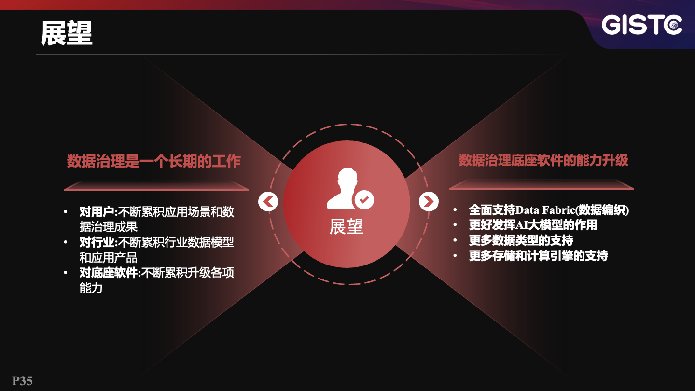

最后，我们认识到，数据治理本身是一项长期的工作。

对于用户而言，需要不断累积数据治理的成果，以满足更多应用场景的需求。对于行业而言，也需要不断累积行业的数据模型和对应的数据产品。

对于数据治理的底座软件，也需要不断地迭代升级，涵盖以下方面：

全面支持数据编织（Data Fabric）；

更好的发挥AI大模型的作用；

支持更多数据类型和数据格式，并保持开放性；

支持更多存储和计算引擎。

我的报告就到这里，谢谢大家。
