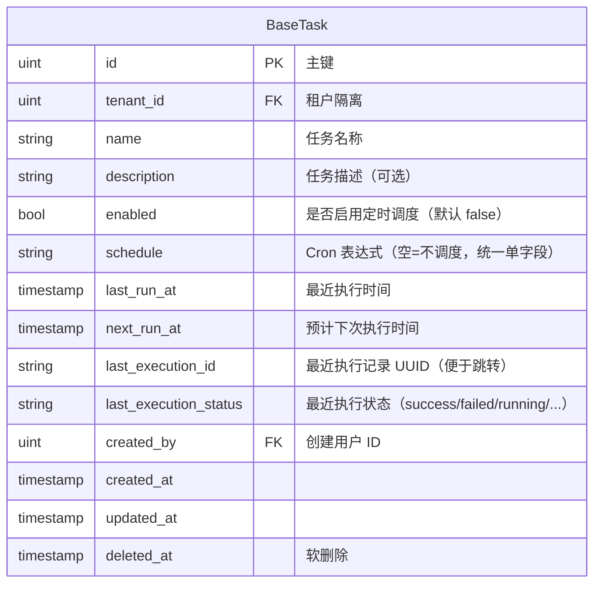
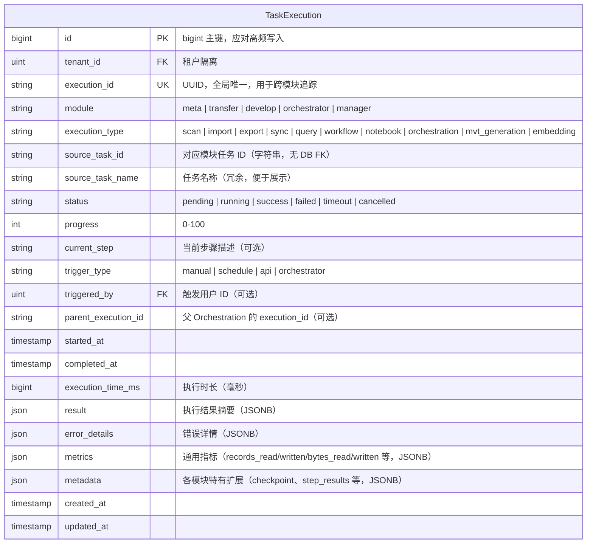
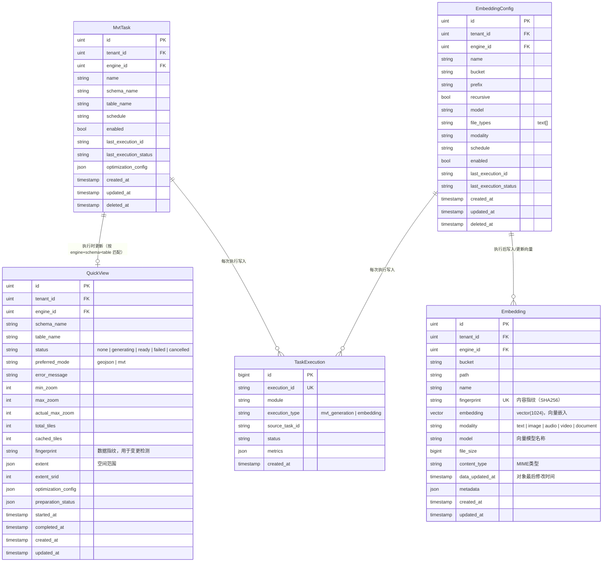
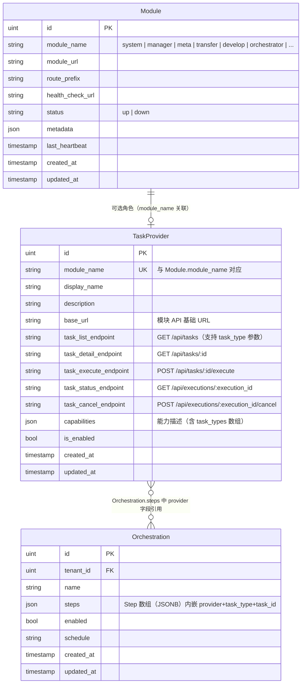
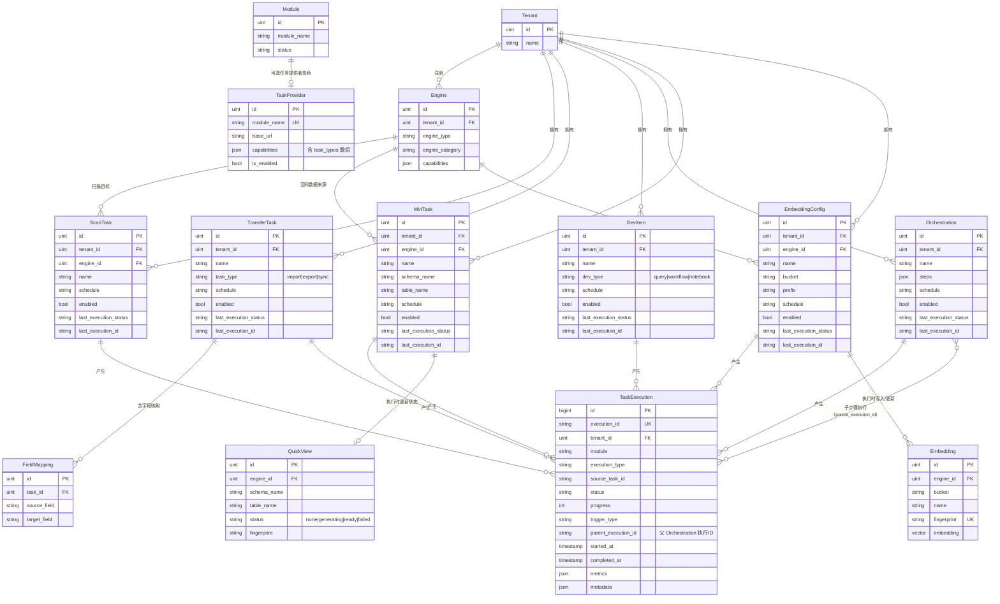

# ADDP 任务体系：目标设计方案

> 本文档整理当前任务相关对象的现状问题，并给出理想的统一设计方案（含 ER 图），作为分步实施的基础。
>
> 分析日期：2026-03-03

---

## 一、设计目标（统一原则）

1. **命名统一**：Go 结构体 `XxxTask`，PG 表 `schema.xxx_tasks`，含完整 schema 前缀
2. **基类字段统一**：所有任务定义对象共享一组公共字段（调度、最近执行状态）
3. **执行记录统一**：所有执行记录写入 `common.task_executions`，废弃各模块独立执行记录表
4. **Manager 纳入体系**：MVT 生成和向量化升级为正式 Task 对象，可被调度和编排
5. **TaskProvider 标准化**：统一 API 契约，支持多任务类型模块，Orchestrator 统一发现和调用

---

## 二、统一命名规范

### 2.1 任务定义对象

| 当前 Go 名 | 目标 Go 名 | 当前表名 | 目标表名 | 变更原因 |
|-----------|-----------|---------|---------|---------|
| `Task`（Transfer） | `TransferTask` | `tasks`（无 schema 前缀） | `transfer.transfer_tasks` | 名称歧义；表名缺 schema 前缀 |
| `ScanTask` | `ScanTask` | `metadata.scan_tasks` | `metadata.scan_tasks` | ✅ 保持 |
| `DevItem` | `DevItem` | `develop.dev_items` | `develop.dev_items` | 保持——DevItem 是开发工件，任务角色通过 TaskProvider 暴露 |
| `Orchestration` | `Orchestration` | `orchestrator.orchestrations` | `orchestrator.orchestrations` | 保持——编排定义，有业务语义 |
| `EmbeddingTask`（执行记录） | 拆分 → `EmbeddingConfig`（定义）| `manager.embedding_tasks` | `manager.embedding_configs` | 当前是执行记录，缺少可复用的任务定义 |
| 无 | `MvtTask`（新增） | `manager.quick_view`（混合） | `manager.mvt_tasks` | MVT 生成升级为正式 Task |

### 2.2 执行记录对象

| 当前表 | 目标 | 变更原因 |
|-------|------|---------|
| `transfer.task_executions` | 废弃 → 写入 `common.task_executions` | 消除双轨 |
| `metadata.scan_task_runs` | 废弃 → 写入 `common.task_executions` | 消除碎片化 |
| `develop.dev_executions` | 废弃 → 写入 `common.task_executions` | 消除碎片化 |
| `orchestrator.executions` | 废弃 → 写入 `common.task_executions` | 消除碎片化 |
| `manager.embedding_tasks`（执行部分） | 废弃 → 写入 `common.task_executions` | 消除碎片化 |
| `common.task_executions` | ✅ 唯一执行记录表 | 目标态 |

---

## 三、任务定义基类（概念模型）

> `BaseTask` 是概念抽象，无实体表。所有派生任务在自己的表中物理包含这些字段。



**说明**：
- `schedule` 统一为 Cron 字符串，空字符串表示不调度。删除 ScanTask 现有的 `schedule_type` 冗余字段
- `last_execution_id` 引用 `common.task_executions.execution_id`（UUID 字符串，无 DB FK，跨 schema）
- `last_execution_status` 冗余存储最近执行结果，避免每次查任务列表都要 JOIN 执行记录表

---

## 四、任务定义体系 ER 图

> 六类任务定义，各自继承 BaseTask 的公共字段，再加各自特有字段。

```mermaid
erDiagram
    ScanTask {
        uint id PK
        uint tenant_id FK
        uint engine_id FK "存储类引擎（元数据来源）"
        string name
        string description
        bool enabled
        string schedule "Cron 表达式"
        timestamp last_run_at
        timestamp next_run_at
        string last_execution_id
        string last_execution_status
        uint created_by FK
        json parameters "扫描目标配置（指定节点/深度/类型等）"
        timestamp created_at
        timestamp updated_at
        timestamp deleted_at
    }

    TransferTask {
        uint id PK
        uint tenant_id FK
        string name
        string description
        string task_type "import | export | sync"
        bool enabled
        string schedule "Cron 表达式"
        timestamp last_run_at
        timestamp next_run_at
        string last_execution_id
        string last_execution_status
        uint created_by FK
        json config "Reader-Transform-Writer 管道配置"
        int batch_size "批大小（默认 1000）"
        bool auto_scan_metadata "完成后自动触发扫描"
        timestamp created_at
        timestamp updated_at
        timestamp deleted_at
    }

    FieldMapping {
        uint id PK
        uint task_id FK "关联 TransferTask"
        string source_field
        string target_field
        string default_value
        string field_type
        string format
        bool nullable
        timestamp created_at
    }

    DevItem {
        uint id PK
        uint tenant_id FK
        string name
        string display_name
        string dev_type "query | workflow | notebook"
        bool enabled "是否启用定时调度（新增）"
        string schedule "Cron 表达式"
        timestamp last_run_at "（新增，改名自 last_executed_at）"
        timestamp next_run_at "（新增）"
        string last_execution_id
        string last_execution_status
        uint created_by FK
        json content "工作流节点定义 / SQL 语句等"
        json execution_config "引擎 ID / 执行参数"
        int timeout "超时时间（秒）"
        string tags "text[]"
        string status "active | inactive | archived（发布状态）"
        timestamp created_at
        timestamp updated_at
        timestamp deleted_at
    }

    Orchestration {
        uint id PK
        uint tenant_id FK
        string name
        string description
        bool enabled
        string schedule "Cron 表达式"
        timestamp last_run_at "（新增）"
        timestamp next_run_at "（新增）"
        string last_execution_id "（新增）"
        string last_execution_status "（新增）"
        uint created_by FK "（新增）"
        json steps "Step 内嵌数组（JSONB）"
        timestamp created_at
        timestamp updated_at
        timestamp deleted_at
    }

    MvtTask {
        uint id PK
        uint tenant_id FK
        uint engine_id FK "存储类引擎（空间数据来源）"
        string name
        string description
        bool enabled
        string schedule "Cron 表达式（定时重新生成）"
        timestamp last_run_at
        timestamp next_run_at
        string last_execution_id
        string last_execution_status
        uint created_by FK
        string schema_name "目标 schema"
        string table_name "目标表名"
        int min_zoom "最小缩放级别（默认 0）"
        int max_zoom "最大缩放级别（默认 18）"
        json optimization_config "简化/精度优化配置"
        timestamp created_at
        timestamp updated_at
        timestamp deleted_at
    }

    EmbeddingConfig {
        uint id PK
        uint tenant_id FK
        uint engine_id FK "对象存储引擎"
        string name
        string description
        bool enabled
        string schedule "Cron 表达式（定时增量向量化）"
        timestamp last_run_at
        timestamp next_run_at
        string last_execution_id
        string last_execution_status
        uint created_by FK
        string bucket "存储桶"
        string prefix "路径前缀（空=整个 bucket）"
        bool recursive "是否递归子目录"
        string model "向量模型名称"
        string file_types "text[]，指定文件类型（空=全部）"
        string modality "text/image/audio/video/document/auto"
        timestamp created_at
        timestamp updated_at
        timestamp deleted_at
    }

    TransferTask ||--o{ FieldMapping : "含字段映射"
```



**说明**：
- `MvtTask` 是对某张空间表的 MVT 生成任务定义，一张表对应一条记录；执行时写入 `common.task_executions` 并更新 `QuickView`
- `EmbeddingConfig` 是对某个存储路径的向量化任务定义；执行时写入 `common.task_executions` 并写入/更新 `manager.embeddings`
- `DevItem.enabled` 是新增字段，当前 DevItem 靠 `status` 兼顾业务状态，需要独立的调度开关
- `Orchestration` 新增 `last_run_at/next_run_at/last_execution_id/last_execution_status/created_by` 五个字段

---

## 五、执行记录统一 ER 图

> 所有任务执行记录统一写入 `common.task_executions`，废弃各模块独立执行记录表。



**各模块 execution_type 映射**：

| module | execution_type | 对应任务对象 |
|--------|---------------|------------|
| meta | scan | ScanTask |
| transfer | import | TransferTask（task_type=import） |
| transfer | export | TransferTask（task_type=export） |
| transfer | sync | TransferTask（task_type=sync） |
| develop | query | DevItem（dev_type=query） |
| develop | workflow | DevItem（dev_type=workflow） |
| develop | notebook | DevItem（dev_type=notebook） |
| orchestrator | orchestration | Orchestration |
| manager | mvt_generation | MvtTask |
| manager | embedding | EmbeddingConfig |

**新增字段说明**：
- `parent_execution_id`：当某次执行是由 Orchestration 编排触发时，记录 Orchestration 的 execution_id，实现执行树追踪
- `metrics` JSONB：统一存放各模块的性能指标，替代原来分散的 `records_read/written/bytes_read/written/rows_affected` 等字段
- `metadata` JSONB：各模块特有数据，如 Transfer 的 `checkpoint_state`、Orchestrator 的 `step_results`

---

## 六、Manager 新增任务对象 ER 图



**说明**：
- `MvtTask` 与 `QuickView` 通过 `(engine_id, schema_name, table_name)` 自然关联（非 FK），MvtTask 执行完成后更新对应 QuickView 的状态
- `EmbeddingConfig` 与 `Embedding` 通过 `(engine_id, bucket, prefix)` 关联，每次执行后将新增/更新对应的向量记录
- 两类任务的执行记录均写入 `common.task_executions`

---

## 七、TaskProvider 注册体系 ER 图

### 7.1 数据模型



### 7.2 `capabilities` JSONB 结构设计

每个 TaskProvider 注册时声明其支持的任务类型：

```json
{
  "task_types": [
    {
      "type": "scan",
      "display_name": "元数据扫描",
      "description": "扫描引擎的表/文件元数据",
      "icon": "scan"
    }
  ],
  "supports_cancel": true,
  "supports_schedule": true,
  "max_concurrent": 5
}
```

**各模块 capabilities 示例**：

| 模块 | task_types |
|------|-----------|
| meta | `["scan"]` |
| transfer | `["import", "export", "sync"]` |
| develop | `["query", "workflow", "notebook"]` |
| manager | `["mvt_generation", "embedding"]` |
| orchestrator | `["orchestration"]`（本身也是任务提供者，可被嵌套编排） |

---

## 八、Orchestration Step 设计

### 8.1 Step JSONB 结构（目标态）

> 删除旧架构的 `module/action/endpoint/method` 字段，统一为 `provider + task_type + task_id`。

```json
{
  "steps": [
    {
      "id": "step-scan",
      "name": "扫描数据源元数据",
      "provider": "meta",
      "task_type": "scan",
      "task_id": 42,
      "parameters": {},
      "depends_on": [],
      "timeout": 600
    },
    {
      "id": "step-transfer",
      "name": "导入到目标库",
      "provider": "transfer",
      "task_type": "import",
      "task_id": 15,
      "parameters": {
        "batch_size": 5000
      },
      "depends_on": ["step-scan"],
      "timeout": 3600
    },
    {
      "id": "step-mvt",
      "name": "生成空间瓦片缓存",
      "provider": "manager",
      "task_type": "mvt_generation",
      "task_id": 3,
      "parameters": {},
      "depends_on": ["step-transfer"],
      "timeout": 1800
    }
  ]
}
```

### 8.2 Orchestrator 执行流程

```
Orchestrator 触发某个 Orchestration 执行：

1. 写入 common.task_executions（module=orchestrator, status=running）
2. 按依赖关系排序 Steps
3. 对每个 Step：
   a. 查 system.task_providers WHERE module_name = step.provider
   b. 构造执行请求：POST {base_url}{task_execute_endpoint}
      Body: { trigger_type: "orchestrator",
               triggered_by: user_id,
               parent_execution_id: orchestration_execution_id }
   c. 模块返回 { execution_id, status: "pending" }
   d. 轮询 GET {base_url}{task_status_endpoint}（替换 :execution_id）
   e. 模块完成后，common.task_executions 中该执行记录的 parent_execution_id 指向 Orchestration
4. 所有步骤完成，更新 Orchestration 的 common.task_executions 为 success/failed
5. 回写 Orchestration.last_execution_id + last_execution_status + last_run_at
```

---

## 九、标准 TaskProvider API 契约

> 所有 TaskProvider 模块必须实现此标准接口，Orchestrator 和 Monitor 通过此接口交互。

### 9.1 任务列表

```
GET /api/tasks?task_type=xxx&page=1&page_size=20

Response:
{
  "items": [
    {
      "id": 42,
      "name": "每日扫描",
      "task_type": "scan",          // 任务类型
      "enabled": true,
      "schedule": "0 2 * * *",
      "last_run_at": "2026-03-02T02:00:00Z",
      "last_execution_status": "success",
      "last_execution_id": "uuid-xxx"
    }
  ],
  "total": 10
}
```

### 9.2 执行触发

```
POST /api/tasks/:id/execute

Request:
{
  "trigger_type": "orchestrator",    // manual | schedule | api | orchestrator
  "triggered_by": 1,                 // 用户 ID（可选）
  "parent_execution_id": "uuid-yyy", // 父 Orchestration execution_id（可选）
  "parameters": {}                   // 覆盖参数（可选）
}

Response:
{
  "execution_id": "uuid-xxx",        // common.task_executions.execution_id
  "status": "pending"
}
```

### 9.3 执行状态查询

```
GET /api/executions/:execution_id

Response:
{
  "execution_id": "uuid-xxx",
  "status": "running",               // pending | running | success | failed | timeout | cancelled
  "progress": 45,                    // 0-100
  "current_step": "正在扫描 schema public",
  "started_at": "2026-03-03T10:00:00Z",
  "metrics": {
    "records_read": 1500,
    "records_written": 1450
  }
}
```

### 9.4 执行取消

```
POST /api/executions/:execution_id/cancel

Response:
{
  "execution_id": "uuid-xxx",
  "status": "cancelled"
}
```

**注意**：模块实现此接口时，直接读写 `common.task_executions`，无需维护独立的执行记录表。

---

## 十、全景关系图



---

## 十一、多任务类型模块的管理模式

### 11.1 问题场景

当一个模块有多种任务类型时（如 Develop 有 query/workflow/notebook，Manager 有 mvt_generation/embedding），如何统一管理？

### 11.2 设计方案：任务类型作为一等公民字段

**每个 TaskProvider 模块：**
- 在各自的任务定义表中，保留 `task_type` 字段（TransferTask 的 `task_type`，DevItem 的 `dev_type`，以此类推）
- 对外统一通过 `/api/tasks?task_type=xxx` 过滤
- `system.task_providers.capabilities` 中的 `task_types` 数组声明所有支持的类型

**对于 Manager 模块（两张不同的表）**：
- 任务列表接口在后端 UNION 两张表的结果，统一格式返回
- 区分字段：`task_type` = `"mvt_generation"` 或 `"embedding"`
- 执行接口通过 `task_type` 路由到不同的处理器

### 11.3 前端：任务创建/编辑的路由

`TaskProvider.capabilities` 中的 `task_types` 还包含前端路由信息：

```json
{
  "task_types": [
    {
      "type": "mvt_generation",
      "display_name": "MVT 瓦片生成",
      "create_url": "/manager/mvt-tasks/create",
      "edit_url": "/manager/mvt-tasks/:id/edit"
    },
    {
      "type": "embedding",
      "display_name": "向量化配置",
      "create_url": "/manager/embedding-configs/create",
      "edit_url": "/manager/embedding-configs/:id/edit"
    }
  ]
}
```

Orchestrator 前端选择步骤时：
1. 从 `system.task_providers` 获取所有 TaskProvider
2. 展开 `capabilities.task_types`，作为两级选择（先选模块，再选任务类型）
3. 在选定 task_type 后，调用模块的任务列表接口，选择具体 task_id

---

## 十二、现状差异对照（待改动清单）

### 12.1 需要新增的字段（现有表）

| 表 | 新增字段 | 说明 |
|----|---------|------|
| `metadata.scan_tasks` | `last_execution_id`, `last_execution_status` | 补充基类字段 |
| `metadata.scan_tasks` | 删除 `schedule_type` | 保留单字段 `schedule`，统一规范 |
| `transfer.transfer_tasks`（改名） | `last_execution_id`, `last_execution_status`, `last_run_at`, `next_run_at`, `deleted_at`, `task_type` | 补充基类字段 + 软删除 + 任务类型 |
| `develop.dev_items` | `enabled`, `next_run_at`（改名 `last_run_at`） | 补充调度开关 |
| `orchestrator.orchestrations` | `last_run_at`, `next_run_at`, `last_execution_id`, `last_execution_status`, `created_by` | 补充基类字段 |

### 12.2 需要新增的表

| 表 | 说明 |
|----|------|
| `manager.mvt_tasks` | MVT 生成任务定义（从 quick_view 拆分） |
| `manager.embedding_configs` | 向量化任务定义（从 embedding_tasks 重新设计） |

### 12.3 需要废弃的表

| 表 | 替代方案 |
|----|---------|
| `transfer.task_executions` | `common.task_executions` |
| `metadata.scan_task_runs` | `common.task_executions` |
| `develop.dev_executions` | `common.task_executions` |
| `orchestrator.executions` | `common.task_executions` |
| `manager.embedding_tasks`（执行部分） | `common.task_executions`（执行记录） + `manager.embedding_configs`（定义） |

### 12.4 需要更新的 TaskProvider 注册

| 模块 | 当前 capabilities | 目标 capabilities |
|------|-----------------|-----------------|
| meta | 未知 | `{"task_types": ["scan"]}` |
| transfer | 未知 | `{"task_types": ["import", "export", "sync"]}` |
| develop | 未知 | `{"task_types": ["query", "workflow", "notebook"]}` |
| manager | 未注册 | `{"task_types": ["mvt_generation", "embedding"]}` |
| orchestrator | 未注册 | `{"task_types": ["orchestration"]}` |

---

## 十三、分阶段实施路线图

### 第一阶段：基础统一（最小改动，最大收益）
> **目标**：统一所有任务定义对象的公共字段和命名

1. `ScanTask` 删除 `schedule_type`，补充 `last_execution_id`、`last_execution_status`
2. `Transfer.Task` 重命名为 `TransferTask`，表名 `transfer.transfer_tasks`，补充缺失的基类字段 + 软删除 + `task_type` 字段
3. `DevItem` 新增 `enabled`、`next_run_at`
4. `Orchestration` 补充 `last_run_at`、`next_run_at`、`last_execution_id`、`last_execution_status`、`created_by`
5. `common.task_executions` 补充 `parent_execution_id` 字段，将 module 枚举扩展为包含 `'meta'`、`'manager'`

### 第二阶段：执行记录统一
> **目标**：所有执行记录写入 `common.task_executions`，废弃独立执行记录表

6. Transfer 模块改写执行记录写入 `common.task_executions`，废弃 `transfer.task_executions`
7. Meta 模块改写扫描记录写入 `common.task_executions`，废弃 `metadata.scan_task_runs`
8. Develop 模块改写执行记录写入 `common.task_executions`，废弃 `develop.dev_executions`
9. Orchestrator 模块改写执行记录写入 `common.task_executions`，废弃 `orchestrator.executions`
10. 各模块实现标准 `/api/executions/:execution_id` 状态查询接口（从 common 读取）

### 第三阶段：Manager 纳入体系
> **目标**：MVT 生成和向量化成为正式可调度/可编排的 Task

11. 新增 `manager.mvt_tasks` 表，迁移 `quick_view` 中的调度逻辑
12. 新增 `manager.embedding_configs` 表，将 `embedding_tasks` 改为写入 `common.task_executions`
13. Manager 模块实现标准 TaskProvider API（任务列表、执行触发、状态查询）
14. 在 `system.task_providers` 中注册 Manager 模块

### 第四阶段：Orchestration Step 格式迁移
> **目标**：Orchestration 步骤统一使用 `provider+task_type+task_id` 格式

15. 迁移存量 Orchestration 数据，将旧格式 step（module/action/endpoint/method）转换为新格式
16. Orchestrator 执行引擎改写，统一通过 TaskProvider API 调用各模块
17. 更新 `system.task_providers` 的 capabilities，完整声明各模块 task_types
18. 前端 Orchestration 编辑器更新，支持两级选择（模块 → 任务类型 → 具体任务）
