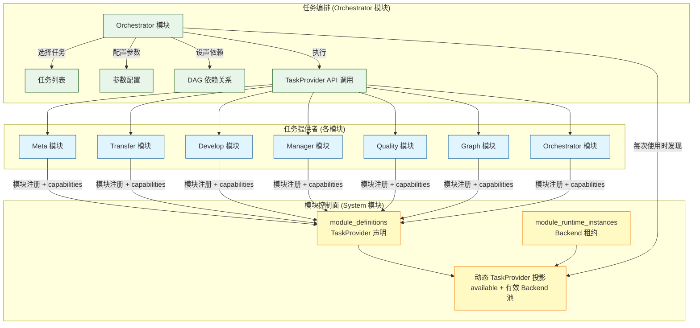
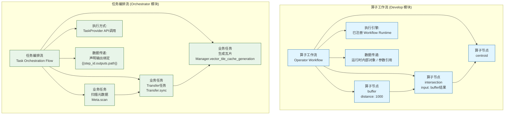
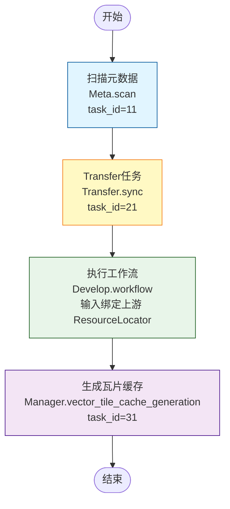
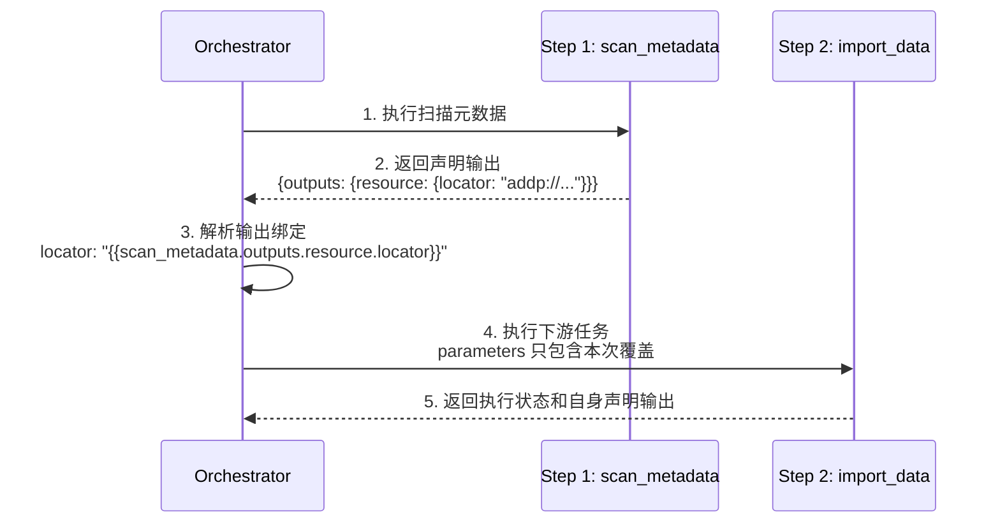

# ADDP 任务编排体系图

本文档展示 ADDP 平台的任务库机制、任务编排流与算子工作流的区别、以及跨模块编排能力。任务定义、执行记录、TaskProvider、Orchestrator 和 Monitor 的正式约束以 [ADDP 任务体系规范](../spec/addp任务体系规范.md) 为准。

---

## 目录

1. [任务编排概述](#任务编排概述)
2. [任务库机制](#任务库机制)
3. [任务编排流 vs 算子工作流](#任务编排流-vs-算子工作流)
4. [编排 DAG 示例](#编排-dag-示例)
5. [依赖管理与输出绑定](#依赖管理与输出绑定)
6. [调度方式](#调度方式)

---

## 任务编排概述

**任务编排流** 是基于业务任务的跨模块 DAG 工作流,用于复杂的数据流水线和 ETL 作业。

**核心特点**:
- **节点粒度**: 粗粒度业务任务 (扫描元数据、Transfer 任务、生成瓦片)
- **DAG 层级**: 任务级别的有向无环图
- **数据传递**: 从显式依赖步骤声明的稳定 `outputs` 中选择值，内部保存为 `{{step_id.outputs.declared.path}}`
- **执行方式**: 通过 TaskProvider 调用各模块已存在的任务定义 (Meta、Transfer、Develop、Manager、Quality、Graph、Orchestrator 等)
- **适用场景**: 跨模块数据流水线、定时 ETL 作业

---

## 任务库机制

**任务库** 是由各模块提供的可复用任务集合,通过 TaskProvider capabilities 注册机制实现跨模块调用。



### 任务库工作原理

**步骤 1: 模块注册时一并发布任务能力**
- Backend 通过唯一的模块注册调用同时发布运行实例和可选 TaskProvider 声明，不存在独立 TaskProvider 注册路径
- 声明保存在 `module_definitions.task_provider`，包括标准 API endpoint，以及 `task_capabilities[]` 中的任务类型、定义 schema、执行 schema 和调度/取消能力
- Provider ID 复用稳定的模块定义 ID；重复相同声明是幂等的，只有声明变化才递增模块版本

**步骤 2: Orchestrator 动态发现任务**
- System 每次读取都用当前有效 Backend 租约投影 `available`、`unavailable_reason` 和有效 Backend 池；运行地址不写入模块定义
- Orchestrator 不缓存运行可用性，在查询、详情、执行和执行状态轮询时重新解析；同一模块的多个有效 Backend 以稳定顺序轮询选择，非幂等执行请求不做跨实例自动重放
- 前端保留离线模块的声明，但禁止选择和调用；模块 Backend 恢复后，刷新即可继续使用

**步骤 3: 配置编排**
- 用户选择任务、配置参数、设置依赖关系
- 保存为编排定义 JSON

**步骤 4: 执行调用**
- Orchestrator 通过 TaskProvider 标准接口调用对应模块的任务
- 编排步骤只能引用 owner 模块已保存的任务定义；固定值和上游输出绑定只作为本次执行参数覆盖传入，不创建或改写 owner 任务定义

### 任务示例

| 模块 | 任务名称 | 任务 API | 参数示例 |
|------|---------|---------|---------|
| **Meta** | 扫描元数据 | `POST /api/v1/meta/tasks/{task_type}/{id}/execute` | `task_type=scan` |
| **Transfer** | Transfer 任务 | `POST /api/v1/transfer/tasks/{task_type}/{id}/execute` | `task_type=sync` |
| **Develop** | 执行查询 | `POST /api/v1/develop/task-provider/tasks/{task_type}/{id}/execute` | `task_type=query` |
| **Develop** | 执行工作流 | `POST /api/v1/develop/task-provider/tasks/{task_type}/{id}/execute` | `task_type=workflow` |
| **Develop** | 执行脚本 | `POST /api/v1/develop/task-provider/tasks/{task_type}/{id}/execute` | `task_type=script`，接入父 Execution Authorization 前拒绝编排 |
| **Manager** | 生成瓦片缓存 | `POST /api/v1/manager/tasks/{task_type}/{id}/execute` | `task_type=vector_tile_cache_generation` |
| **Manager** | 矢量物化视图 | `POST /api/v1/manager/tasks/{task_type}/{id}/execute` | `task_type=vector_materialized_view_generation` |
| **Manager** | 向量化 | `POST /api/v1/manager/tasks/{task_type}/{id}/execute` | `task_type=embedding` |
| **Quality** | 质量检查 | `POST /api/v1/quality/tasks/{task_type}/{id}/execute` | `task_type=check` |
| **Graph** | 图谱构建 | `POST /api/v1/graph/tasks/{task_type}/{id}/execute` | `task_type=kg_build` |
| **Orchestrator** | 已保存编排 | `POST /api/v1/orchestrator/tasks/{task_type}/{id}/execute` | `task_type=orchestration` |

---

## 任务编排流 vs 算子工作流

ADDP 提供两种工作流:任务编排流(Orchestrator)和算子工作流(Develop)。



### 对比表格

| 维度 | 算子工作流 (Develop) | 任务编排流 (Orchestrator) |
|------|---------------------|-------------------------|
| **节点粒度** | 细粒度算子 (buffer, centroid) | 粗粒度业务任务 (扫描元数据, Transfer 任务) |
| **DAG 层级** | 算子级别 DAG | 任务级别 DAG |
| **执行引擎/方式** | 已注册 Workflow Runtime，例如 GeoPython Workflow、Spark Workflow、SuperMap Workflow | 跨模块 TaskProvider API 调用 |
| **数据传递** | 运行时内部对象或参数引用；例如 Python GeoDataFrame、SuperMap C++ 类型化内存句柄 | 仅传递任务契约声明的持久稳定输出，例如 ResourceLocator；UI 从上游输出中选择 |
| **适用场景** | 空间数据分析、地理计算 | 跨模块数据流水线、ETL 作业 |
| **存储表** | `develop.dev_tasks` | `orchestrator.orchestrations` |
| **执行记录** | `common.task_executions`（`module=develop`） | `common.task_executions`（`module=orchestrator`） |
| **前端界面** | 工作流画布 (算子拖拽) | 编排表单 (步骤配置) |

### 嵌套调用模式

Orchestrator 可以调用 Develop 模块已经创建好的工作流任务作为一个步骤。算子工作流必须先在 Develop 中编排并保存为 `workflow` 任务，再以 `provider=develop, task_type=workflow, task_id=...` 的形式进入 Orchestrator。Orchestrator 不创建 Develop 内部算子工作流，也不把算子节点直接拖入任务编排 DAG:

```json
{
  "steps": [
    {
      "id": "extract_data",
      "name": "提取数据",
      "provider": "develop",
      "task_type": "workflow",
      "task_id": 101,
	  "parameters": {}
    },
    {
      "id": "spatial_analysis",
      "name": "空间分析工作流",
      "provider": "develop",
      "task_type": "workflow",
      "task_id": 102,
	  "parameters": {
		"load_1": {
		  "source_resource": {
			"locator": "{{extract_data.outputs.save_3.resource.locator}}"
		  }
		}
	  }
    },
    {
      "id": "run_transfer_task",
      "name": "执行 Transfer 任务",
      "provider": "transfer",
      "task_type": "sync",
      "task_id": 201,
      "parameters": {}
    }
  ]
}
```

---

## 编排 DAG 示例

### 数据处理流水线示例



### 编排定义 JSON

```json
{
  "name": "数据处理流水线",
  "description": "从数据扫描到瓦片生成的完整流程",
  "steps": [
    {
      "id": "scan_metadata",
      "name": "扫描元数据",
      "provider": "meta",
      "task_type": "scan",
      "task_id": 11,
      "parameters": {},
      "depends_on": [],
      "timeout": 300
    },
    {
      "id": "import_data",
      "name": "Transfer任务",
      "provider": "transfer",
      "task_type": "sync",
      "task_id": 21,
      "parameters": {},
      "depends_on": ["scan_metadata"],
      "timeout": 600
    },
    {
      "id": "execute_workflow",
      "name": "执行空间分析工作流",
      "provider": "develop",
      "task_type": "workflow",
      "task_id": 22,
	  "parameters": {
		"load_1": {
		  "source_resource": {
			"locator": "{{import_data.outputs.resource.locator}}"
		  }
		}
	  },
      "depends_on": ["import_data"],
      "timeout": 900
    },
    {
      "id": "generate_tile_cache",
      "name": "生成瓦片缓存",
      "provider": "manager",
      "task_type": "vector_tile_cache_generation",
      "task_id": 31,
      "parameters": {},
      "depends_on": ["execute_workflow"],
      "timeout": 1200
    }
  ],
  "schedule": "0 2 * * *"
}
```

---

## 依赖管理与输出绑定

### 依赖管理 (DAG 拓扑排序)

Orchestrator 使用拓扑排序解析任务依赖。`depends_on` 表示当前步骤依赖的前置步骤，执行器必须先执行依赖步骤，再执行当前步骤:

```mermaid
graph LR
    A[Task A<br/>depends_on: []] --> C[Task C<br/>depends_on: [A,B]]
    B[Task B<br/>depends_on: []] --> C
    C --> D[Task D<br/>depends_on: [C]]

    subgraph "拓扑排序结果"
        Order["执行顺序:<br/>1. A<br/>2. B<br/>3. C<br/>4. D"]
    end

    classDef task fill:#e1f5ff,stroke:#01579b
    classDef result fill:#fff9c4,stroke:#f57f17

    class A,B,C,D task
    class Order result
```

**依赖检测**:
- **循环依赖检测**: 防止死锁(如 A → B → C → A)
- **缺失依赖检测**: `depends_on` 引用不存在的步骤时直接失败
- **拓扑排序**: 按依赖顺序执行；当前主干不承诺并行执行
- **多上游汇聚**: Step 只有在全部直接依赖均成功完成后才进入可执行状态，固定为 `all_success`，不支持 OR 条件
- **多下游分发**: 一个 Step 成功后可以使多个直接下游进入可执行状态；是否并行执行不属于 v1 DAG 关系语义

### 上游输出绑定

用户从直接依赖步骤的已声明稳定输出中选择目标参数来源。内部只使用完整字符串 `{{step_id.outputs.declared.path}}` 保存绑定关系；`step_id` 必须存在且在当前 Step 的 `depends_on` 中显式声明。任意结果字段、整个步骤结果、局部字符串插值和数组索引均不支持：



**绑定规则**:

- 允许：`{{step1.outputs.save_3.resource.locator}}`
- 禁止：`{{step1}}`、`{{step1.result}}`、`{{step1.metadata.result}}`
- 来源路径必须由来源任务 `output_schema` 声明，目标路径必须由目标任务 `input_schema` 声明，且类型兼容。
- 绑定解析返回原始值，不做隐式类型转换；结果或路径不存在时当前 Step 必须失败。
- 画布参数连线必须连接明确的稳定输出端口和执行输入端口，并原子地写入绑定和 `depends_on`；同一任务对有参数连线时不再重复显示纯控制连线。
- 一个输入最多绑定一个上游输出，一个输出可以连接多个下游输入；多条参数连线共享去重后的 `depends_on`。
- 纯控制连线和参数连线共同参与环路检测。参数表单选择“上游输出”和画布参数连线必须双向同步。

---

## 调度方式

### 定时调度 (Cron)

编排调度只决定某个 orchestration 何时启动一次编排 run。被 Step 引用的 owner 任务如果自身也配置了定时计划，该计划仍然是独立入口；编排不会继承、覆盖或关闭子任务自身调度。


约束：

- Orchestrator 调度的是 orchestration run，不是把 Step 对应 owner 任务的调度“搬到编排里”。
- Step 执行时消费的是 owner 任务定义和执行接口，不读取其 `schedule` / `next_run_at` 作为编排依赖。
- 如果同一个 owner 任务既启用了自身调度，又被某个已调度的 orchestration 引用，两者会形成两个独立执行入口。

**Cron 表达式示例**:
- `0 2 * * *`: 每天凌晨 2 点执行
- `*/15 * * * *`: 每 15 分钟执行
- `0 0 * * 0`: 每周日凌晨执行

### 手动触发

用户通过 API 或前端手动触发执行。Orchestrator 会把 `parameters` 作为本次执行参数传给 owner provider；如果对应 provider 不支持参数覆盖，必须明确拒绝，不能静默忽略。

---

## 典型使用场景

**任务编排流场景**:
- 每日凌晨扫描数据库元数据 → 生成瓦片缓存 → 刷新热点区域瓦片缓存产物
- 从 CSV 导入数据 → 执行空间分析 → 导出结果到 S3
- 多数据源同步: PostgreSQL → MySQL → MongoDB
- 跨模块工作流: Meta 扫描 → Transfer 传输 → Manager 预览

---

## 相关文档

- [返回核心概念关系图](addp核心概念关系图.md)
- [ADDP 数据开发体系图](addp数据开发体系图.md)
- [ADDP 监控与执行体系图](addp监控与执行体系图.md)
- [ADDP 任务体系规范](../spec/addp任务体系规范.md)
- [Orchestrator 模块详情](../../orchestrator/CLAUDE.md)

---

**文档版本**: v1.1
**创建日期**: 2026-02-16
**更新日期**: 2026-06-09
**作者**: ADDP 开发团队
