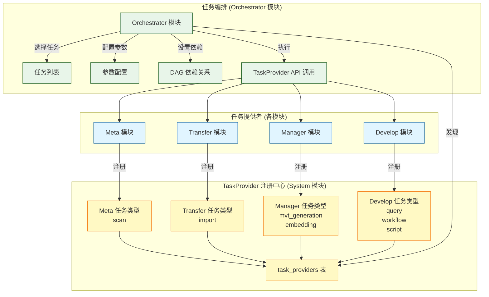
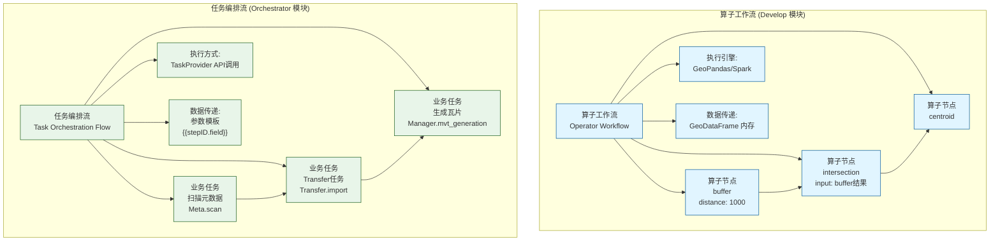
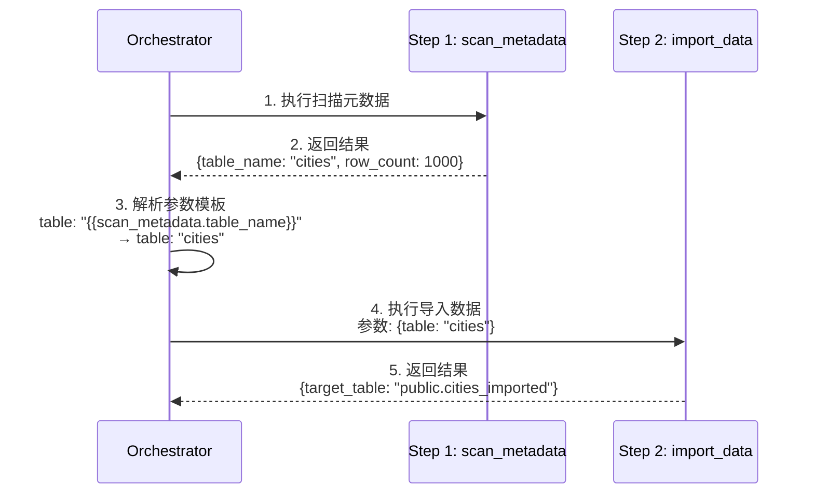
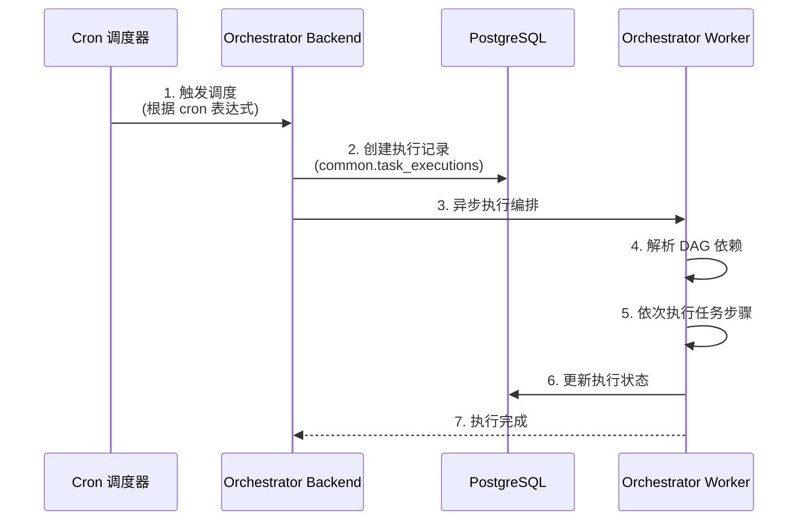

# ADDP 任务编排体系图

本文档展示 ADDP 平台的任务库机制、任务编排流与算子工作流的区别、以及跨模块编排能力。

---

## 目录

1. [任务编排概述](#任务编排概述)
2. [任务库机制](#任务库机制)
3. [任务编排流 vs 算子工作流](#任务编排流-vs-算子工作流)
4. [编排 DAG 示例](#编排-dag-示例)
5. [依赖管理与参数模板化](#依赖管理与参数模板化)
6. [调度方式](#调度方式)

---

## 任务编排概述

**任务编排流** 是基于业务任务的跨模块 DAG 工作流,用于复杂的数据流水线和 ETL 作业。

**核心特点**:
- **节点粒度**: 粗粒度业务任务 (扫描元数据、Transfer 任务、生成瓦片)
- **DAG 层级**: 任务级别的有向无环图
- **数据传递**: 参数模板 `{{stepID.field}}` 引用前序任务结果
- **执行方式**: 通过 TaskProvider 调用各模块已存在的任务定义 (Meta、Transfer、Manager、Develop 等)
- **适用场景**: 跨模块数据流水线、定时 ETL 作业

---

## 任务库机制

**任务库** 是由各模块提供的可复用任务集合,通过能力注册机制实现跨模块调用。



### 任务库工作原理

**步骤 1: 模块注册任务能力**
- 各模块在启动时向 System 模块注册自己的 TaskProvider 能力
- 注册信息包括:模块名、任务类型集合、API 端点、定义 schema、执行 schema 和调度/取消能力

**步骤 2: Orchestrator 发现任务**
- Orchestrator 通过 TaskProvider 注册中心发现可用任务
- 前端展示任务列表供用户选择

**步骤 3: 配置编排**
- 用户选择任务、配置参数、设置依赖关系
- 保存为编排定义 JSON

**步骤 4: 执行调用**
- Orchestrator 通过 TaskProvider 标准接口调用对应模块的任务
- 仅当对应任务类型声明支持内联执行参数时,才允许在编排步骤中传入参数模板

### 任务示例

| 模块 | 任务名称 | 任务 API | 参数示例 |
|------|---------|---------|---------|
| **Meta** | 扫描元数据 | `POST /api/v1/meta/tasks/{task_type}/{id}/execute` | `task_type=scan` |
| **Transfer** | Transfer 任务 | `POST /api/v1/transfer/tasks/{task_type}/{id}/execute` | `task_type=import` |
| **Manager** | 生成 MVT 瓦片 | `POST /api/v1/manager/tasks/{task_type}/{id}/execute` | `task_type=mvt_generation` |
| **Manager** | 向量化 | `POST /api/v1/manager/tasks/{task_type}/{id}/execute` | `task_type=embedding` |
| **Develop** | 执行查询 | `POST /api/v1/develop/tasks/{task_type}/{id}/execute` | `task_type=query` |
| **Develop** | 执行工作流 | `POST /api/v1/develop/tasks/{task_type}/{id}/execute` | `task_type=workflow` |

---

## 任务编排流 vs 算子工作流

ADDP 提供两种工作流:任务编排流(Orchestrator)和算子工作流(Develop)。



### 对比表格

| 维度 | 算子工作流 (Develop) | 任务编排流 (Orchestrator) |
|------|---------------------|-------------------------|
| **节点粒度** | 细粒度算子 (buffer, centroid) | 粗粒度业务任务 (扫描元数据, Transfer 任务) |
| **DAG 层级** | 算子级别 DAG | 任务级别 DAG |
| **执行引擎/方式** | GeoPandas/Spark 工作流引擎 | 跨模块 TaskProvider API 调用 |
| **数据传递** | GeoDataFrame 内存传递 | 已声明支持内联参数的任务可使用参数模板 `{{stepID.field}}` |
| **适用场景** | 空间数据分析、地理计算 | 跨模块数据流水线、ETL 作业 |
| **存储表** | `develop.dev_tasks` | `orchestrator.orchestrations` |
| **执行记录** | `common.task_executions`（`module=develop`） | `common.task_executions`（`module=orchestrator`） |
| **前端界面** | 工作流画布 (算子拖拽) | 编排表单 (步骤配置) |

### 嵌套调用模式

Orchestrator 可以调用 Develop 模块已经创建好的工作流任务作为一个步骤。算子工作流必须先在 Develop 中编排并保存为 `workflow` 任务,再以 `provider=develop, task_type=workflow, task_id=...` 的形式进入 Orchestrator:

```json
{
  "steps": [
    {
      "id": "extract_data",
      "name": "提取数据",
      "provider": "develop",
      "task_type": "query",
      "task_id": 101,
      "parameters": {"engine_id": 1, "sql": "SELECT * FROM cities"}
    },
    {
      "id": "spatial_analysis",
      "name": "空间分析工作流",
      "provider": "develop",
      "task_type": "workflow",
      "task_id": 102,
      "parameters": {
        "workflow_name": "city_buffer_analysis",
        "input_table": "{{extract_data.result_table}}"
      }
    },
    {
      "id": "export_result",
      "name": "导出结果",
      "provider": "transfer",
      "task_type": "import",
      "task_id": 201,
      "parameters": {}
    }
  ]
}
```

---

## 编排 DAG 示例

### 数据处理流水线示例

```mermaid
flowchart TD
    Start([开始]) --> ScanMeta[扫描元数据<br/>Meta.scan<br/>task_id=11]
    ScanMeta --> ImportData[Transfer任务<br/>Transfer.import<br/>task_id=21]
    ImportData --> ExecuteWorkflow[执行工作流<br/>Develop.workflow<br/>参数: input={{ImportData.target_table}}]
    ExecuteWorkflow --> GenerateMVT[生成MVT瓦片<br/>Manager.mvt_generation<br/>task_id=31]
    GenerateMVT --> End([结束])

    classDef meta fill:#e1f5ff,stroke:#01579b
    classDef transfer fill:#fff9c4,stroke:#f57f17
    classDef develop fill:#e8f5e9,stroke:#1b5e20
    classDef manager fill:#f3e5f5,stroke:#4a148c

    class ScanMeta meta
    class ImportData transfer
    class ExecuteWorkflow develop
    class GenerateMVT manager
```

### 编排定义 JSON

```json
{
  "name": "数据处理流水线",
  "description": "从数据扫描到瓦片生成的完整流程",
  "steps": [
    {
      "id": "scan_metadata",
      "name": "扫描元数据",
      "provider": "meta",
      "task_type": "scan",
      "task_id": 11,
      "parameters": {},
      "depends_on": [],
      "timeout": 300
    },
    {
      "id": "import_data",
      "name": "Transfer任务",
      "provider": "transfer",
      "task_type": "import",
      "task_id": 21,
      "parameters": {},
      "depends_on": ["scan_metadata"],
      "timeout": 600
    },
    {
      "id": "execute_workflow",
      "name": "执行空间分析工作流",
      "provider": "develop",
      "task_type": "workflow",
      "task_id": 22,
      "parameters": {
        "workflow_name": "buffer_analysis",
        "input_table": "{{import_data.target_table}}"
      },
      "depends_on": ["import_data"],
      "timeout": 900
    },
    {
      "id": "generate_mvt",
      "name": "生成MVT瓦片",
      "provider": "manager",
      "task_type": "mvt_generation",
      "task_id": 31,
      "parameters": {},
      "depends_on": ["execute_workflow"],
      "timeout": 1200
    }
  ],
  "schedule": "0 2 * * *"
}
```

---

## 依赖管理与参数模板化

### 依赖管理 (DAG 拓扑排序)

Orchestrator 使用 **Kahn 算法**自动解析任务依赖:

```mermaid
graph LR
    A[Task A<br/>depends_on: []] --> C[Task C<br/>depends_on: [A,B]]
    B[Task B<br/>depends_on: []] --> C
    C --> D[Task D<br/>depends_on: [C]]

    subgraph "拓扑排序结果"
        Order["执行顺序:<br/>1. A, B (并行)<br/>2. C<br/>3. D"]
    end

    classDef task fill:#e1f5ff,stroke:#01579b
    classDef result fill:#fff9c4,stroke:#f57f17

    class A,B,C,D task
    class Order result
```

**依赖检测**:
- **循环依赖检测**: 防止死锁(如 A → B → C → A)
- **拓扑排序**: 按依赖顺序执行
- **并行执行**: 无依赖关系的任务并行执行

### 参数模板化

支持 `{{stepID.field}}` 语法引用前序任务结果:



**模板语法**:
- 简单字段引用: `{{step1.result}}`
- 嵌套字段引用: `{{step1.result.nested.field}}`
- 数组索引引用: `{{step1.result.items[0]}}`
- 自动类型转换: 字符串、数字、对象

---

## 调度方式

### 定时调度 (Cron)



**Cron 表达式示例**:
- `0 2 * * *`: 每天凌晨 2 点执行
- `*/15 * * * *`: 每 15 分钟执行
- `0 0 * * 0`: 每周日凌晨执行

### 手动触发

用户通过 API 或前端手动触发执行,支持传入参数覆盖默认配置。

---

## 典型使用场景

**任务编排流场景**:
- 每日凌晨扫描数据库元数据 → 生成 MVT 瓦片 → 预缓存热点区域
- 从 CSV 导入数据 → 执行空间分析 → 导出结果到 S3
- 多数据源同步: PostgreSQL → MySQL → MongoDB
- 跨模块工作流: Meta 扫描 → Transfer 传输 → Manager 预览

---

## 相关文档

- [返回核心概念关系图](addp核心概念关系图.md)
- [ADDP 数据开发体系图](addp数据开发体系图.md)
- [ADDP 监控与执行体系图](addp监控与执行体系图.md)
- [Orchestrator 模块详情](../../orchestrator/CLAUDE.md)

---

**文档版本**: v1.0
**创建日期**: 2026-02-16
**作者**: ADDP 开发团队
