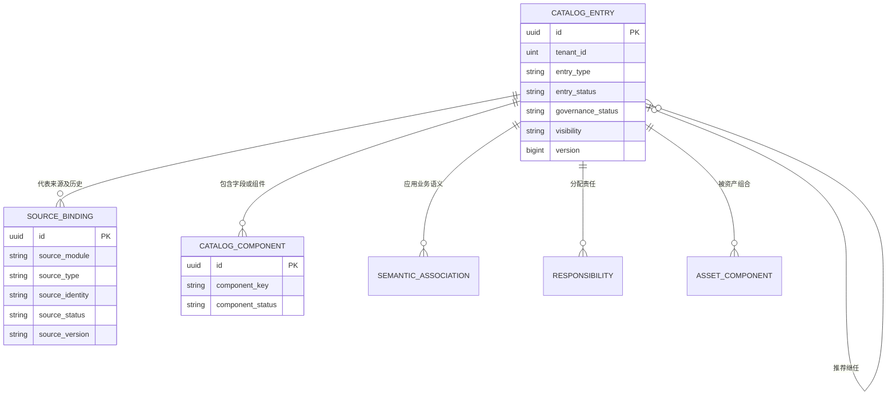
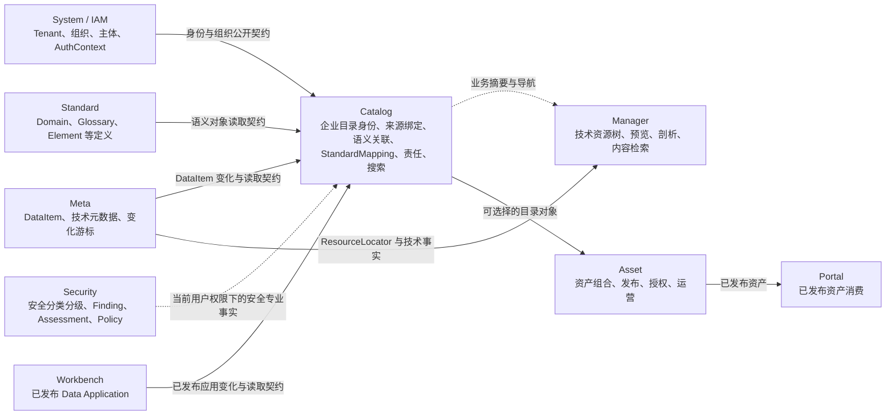
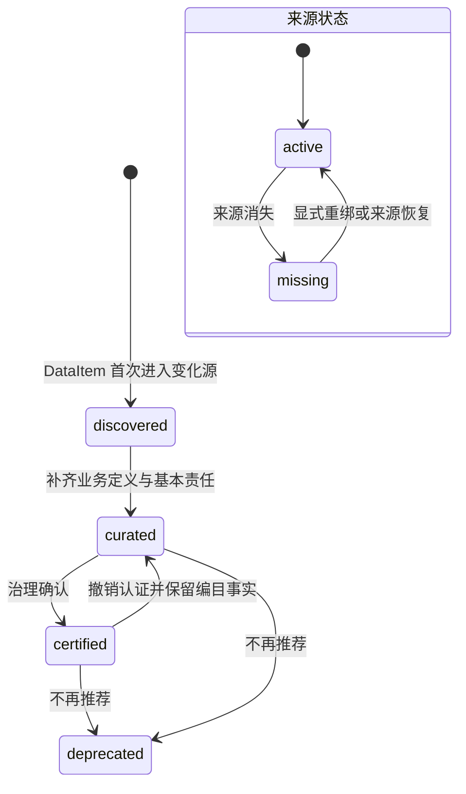
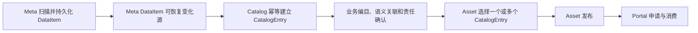

# ADDP 企业资源目录体系图

本文定义 ADDP 企业资源目录（Enterprise Catalog）的概念边界、事实所有权和用户视图。实现约束见 [企业资源目录实现规范](../spec/addp企业资源目录实现规范.md)。

## 一、为什么需要独立 Catalog

Meta 能回答“技术上扫描到了什么”，Standard 能回答“企业语义是什么”，Asset 能回答“哪些治理成果已经发布”。三者之间仍缺少一个稳定的企业资源身份和关联层，用来回答：

- 企业当前有哪些资源；
- 这些资源在业务上叫什么、是什么意思；
- 由哪个部门和哪些人员负责；
- 资源与业务域、术语、数据元之间如何关联；
- 来源消失、迁移或重命名后，既有治理历史如何延续；
- 哪些资源仍待治理，哪些已经可以被组合为资产。

ADDP 因此设置独立 `Catalog` 模块。Catalog 不接管专业模块 CRUD，也不把技术资源树改造成业务目录树。

## 二、核心对象

- `CatalogEntry` 是企业资源目录稳定身份。它独立于当前物理路径、工作区和资产发布状态。
- `SourceBinding` 是 CatalogEntry 与专业资源之间的权威绑定及历史。关联只保存在 Catalog。
- `CatalogComponent` 是字段或内部组件级从属对象，默认不成为顶级企业目录条目。
- `StandardMapping` 是 CatalogComponent 到确定数据元修订的可审核关系事实，记录来源、置信度、证据、审核状态和并发版本；AI 只能生成候选，审核通过后才可被 Quality 消费。
- 条目级业务语义关联、责任关系、治理状态和推荐继任关系以 CatalogEntry 为锚点；字段级落标关系以 CatalogComponent 为目标，不提升为顶级 CatalogEntry。

Catalog 不提供任意 `CatalogRelation` 或可配置关系类型。当前唯一由 Catalog 拥有的跨条目关系是弃用条目指向一个推荐继任项：它表达“两个不同企业身份之间的治理迁移建议”，不表达数据血缘、专业依赖、同义词或同一身份合并。

Meta DataItem fingerprint 是技术资源身份；`CatalogEntry.id` 是企业目录身份。二者不能互相替代。

## 三、模块事实所有权

箭头表示事实消费方向，不表示数据库外键或启动顺序。除 System 和自身必需 Infra 外，Catalog 不把任何业务模块可达性作为启动或 Ready 条件；其他模块也不得把 Catalog 作为自身启动或 Ready 条件。

事实边界固定为：

| Owner | 权威事实 |
| --- | --- |
| Meta | DataItem fingerprint、路径、结构、格式、扫描与技术元数据 |
| Standard | 业务域、术语、数据元、指标和码值等业务语义定义 |
| Security | 敏感数据类型、安全分类分级、敏感发现、资源安全评估、保护策略和 Owner-specific 保护投影 |
| Workbench | Data Application 草稿、Component、布局、参数绑定、不可变 Revision、发布状态和运行入口 |
| Catalog | CatalogEntry、来源绑定、具体资源的语义关联、字段/组件到确定标准修订的 StandardMapping、责任、治理状态和目录可见性 |
| Manager | 预览、剖析、快显、内容读取和内容检索 |
| Asset | 资产身份与版本、CatalogEntry 组合、AssetCategory 多级资产目录、发布、申请、授权、评价和运营 |
| System / IAM | Tenant、Department、Project Group、User、成员关系和 AuthContext |

Catalog 可以保存专业资源的最小“已观察摘要”用于列表、搜索和离线展示，但该摘要是可重建投影，不是专业事实源。Meta 和 Standard 不保存 `catalog_entry_id` 反向投影。

Security 与 Catalog 是 Meta 事实的并行消费者，不构成先后流程：Catalog 消费全量可恢复变化建立企业目录身份，Security 只精确读取显式纳管目标的必要事实。Security 事实直接绑定 owner 稳定专业资源引用；Catalog 建档后通过 SourceBinding 联邦展示，不要求 Security 将事实迁移或改绑到 CatalogEntry ID。Catalog 不存在不得阻止 Manager 等 Owner 执行已生效的保护投影。

## 四、自动建档与生命周期

所有被 Meta 正式识别并持久化的 DataItem 都自动获得一个最小 CatalogEntry。自动建档只代表企业资源盘点中存在该身份，不代表已经完成业务编目、获得内容访问权或形成资产。

Workbench Data Application 只有在首次发布不可变 Revision 后才自动获得 CatalogEntry；私人未发布草稿不进入企业资源盘点。CatalogEntry 标识应用聚合根而不是单个 Revision，重新发布和下线沿用同一企业身份。

来源状态、治理状态、目录记录状态和资产发布状态相互独立：

- `source_status`：`active` / `missing`；
- `governance_status`：`discovered` / `curated` / `certified` / `deprecated`；
- `entry_status`：`active` / `merged`；
- 资产 `draft` / `published` / `offline` 状态只属于 Asset。

物理路径变化产生新的 fingerprint。平台不得通过名称或结构相似度自动猜测重命名；治理人员可以通过显式重绑把新来源接到原 CatalogEntry，并把临时 CatalogEntry 留作指向原身份的 `merged` 墓碑。

治理人员把 `curated` 或 `certified` 条目推进为 `deprecated` 时，可以同时指定一个推荐继任 CatalogEntry。推荐继任项必须是同 Tenant、来源有效且当前为 `curated` 或 `certified` 的 active 条目。旧条目仍可独立读取并保留历史，不自动跳转；这与 `merged` 表达的“同一企业身份归并”严格区分。

认证针对 CatalogEntry 当前聚合版本，而不是一份可脱离条目存在的认证副本。`certified` 状态下业务名称、说明、条目级语义关联、责任和可见性冻结；字段 StandardMapping 作为独立版本化关系事实，也必须遵守已认证条目的写入门禁。需要修改时必须先由具有认证权限的治理人员填写原因并撤销认证，使同一 CatalogEntry 回到 `curated`，再完成编目编辑、映射审核和重新认证。该闭环只推进既有身份的版本序列并写入独立领域审计，不新增认证副本或第二个 CatalogEntry。

## 五、组织、协作和 Workspace

Department 表达长期组织责任，Project Group 表达阶段性协作，User 表达具体责任人或参与者。它们影响责任、权限和视图，但都不决定 CatalogEntry 是否存在。

- CatalogEntry 不归属于 Workspace；
- `curated` 及以上条目必须有可移交的责任部门，不能只归个人；
- Department 或 User 变为不可引用时，Catalog 保留责任历史、标记待移交并形成治理队列；修复仍通过 CatalogEntry 完整责任聚合完成；
- Project Group 可以拥有目录集合、草稿、任务和临时协作范围；
- “我的目录”由当前 User 的责任、任务、收藏、关注和最近访问动态形成；
- 当前跨模块评估结论是不新增统一 Workspace 实体，不预建模块或 `workspace_id`。

第一阶段实际落地时，“我的目录”由责任、收藏和关注三种 Catalog 关系查询组成；治理任务沿用责任治理队列，最近访问沿用 Console 最近访问，Catalog 不复制这两类 owner 事实。收藏和关注是当前 User 的个人标记，不改变 CatalogEntry；Project Group 目录集合是独立协作聚合，集合成员关系也不改变 CatalogEntry。集合访问必须同时满足有效项目组成员关系、精确 Scope Permission 和条目自身目录可见性。Project Group 名称是 System 的可变组织事实，Catalog 只按 AuthContext 中已授权的 membership ID 动态精确解析；名称既不进入 Token，也不复制到 Catalog。

只有当 Catalog、Develop、Model、Quality 等多个 owner 模块在同一端到端用例中确实需要共享同一稳定身份、成员边界、创建/关闭生命周期、工具或运行环境和跨模块产物集合，且 System Project Group 加模块自有聚合无法在不复制事实的前提下表达时，才重新评估独立 Workspace 能力。引擎插件中的 `SpatialWorkspace` 是 Engine Instance 技术能力事实，与企业协作 Workspace 无关。

## 六、目录视图与搜索

企业资源目录不是一棵单一树，采用“主业务域 + 分面筛选 + 关系导航”。Standard Domain 表达少量、稳定的治理责任边界；Department、来源系统、对象类型、责任、治理状态、质量和鲜活度等作为分面。Catalog 不为满足门户导航而扩张 Domain 层级，也不持久化一棵通用企业资源树。

| 搜索能力 | Owner | 目标 |
| --- | --- | --- |
| 技术资源树搜索 | Meta | 在引擎、node 和 DataItem 中按技术路径定位 |
| 企业元数据搜索 | Catalog | 按业务语义、责任、治理和关系发现企业资源 |
| 内容、全文、向量和空间检索 | Manager | 查找 DataItem 内容并进入预览或分析 |
| 已发布资产搜索 | Asset | 查找可申请、授权和运营的正式资产 |

这些能力可以共用 Meilisearch 基础设施，但必须使用不同索引、文档语义和权限过滤。搜索索引始终是可重建投影。

Catalog 提供三个权限感知视图：

1. 治理目录：Catalog 的默认业务视图，查看允许发现的 `curated`、`certified` 和 `deprecated` 条目；即使调用者拥有盘点权限，也不因此默认混入 `discovered` 条目。
2. 资源盘点：只对同时具有 `catalog.entry.read` 和 `catalog.inventory.read` 的治理、技术人员开放，查看允许发现的 `discovered` 及以上条目；自动建档的 DataItem 全量可查，但只在该视图中默认进入结果集。
3. 资产门户：消费者通过 Asset / Portal 的 AssetCategory 多级资产目录查看已发布资产，不直接浏览 Catalog 全量盘点。

Catalog 列表中的 Domain、Department 和 Engine Instance 都是稳定引用：稳定 ID 留在 API、URL 和聚合内部，用户通过可搜索的名称选择器交互，列表不把裸 ID 当作业务文案。“当前可见 CatalogEntry 中出现了哪些引用”由 Catalog 计算，引用名称、编码、类型和状态由 Standard / System 动态解析。Catalog 不复制 owner 完整列表，owner 短时不可达也不能阻塞 Catalog 列表、启动或 Ready。

Catalog 编目编辑器同样不要求用户识别稳定 ID。Domain、Glossary、Element、Department 和 User 通过 Catalog 的统一远程候选入口选择，Catalog 再以 `addp-catalog` 运行身份向事实 owner 查询当前可引用候选；候选按搜索分页返回且不在 Catalog 落库。推荐继任项和治理任务条目筛选直接复用 CatalogEntry 名称搜索。动态查询失败必须明确提示当前候选不可用，不能退回裸 ID 输入或 owner 全量副本。

资源盘点仍使用 Catalog 的分面与分页列表，不在 Catalog 重建 Engine—Node—DataItem 技术资源树；技术路径树继续归 Meta / Manager。

治理覆盖率也是资源盘点的动态读模型：Catalog 直接聚合当前 CatalogEntry、语义关联、责任和组件已审核 StandardMapping，按适用对象计算分母，不保存第二份覆盖率投影。它回答“企业目录治理完成到什么程度”，不替代 Quality 数据质量评分，也不推断 owner 专业模型是否完整。

目录详情中的影响分析采用联邦组合：Meta 提供血缘，Model / Standard 提供专业关系，Catalog 提供推荐继任和来源绑定解析。前端始终使用当前 User Token 查询事实 owner；Catalog 只把 owner 节点的稳定来源身份解析到当前可见 CatalogEntry，便于继续目录导航。三类关系保留各自 owner、方向、类型和证据，不合并为无来源的通用边，也不在 Catalog 复制专业关系。

## 七、端到端主线

AssetCategory 与 Catalog 的组织方式相互独立：Catalog 组织和治理 CatalogEntry，AssetCategory 只对已发布 Asset 提供面向消费者的多级导航。Asset 可以组合跨业务域的多个 CatalogEntry，因此其分类由发布人显式确认，不能照搬任一组成条目的 Domain 或企业目录视图。消费者选择任一 AssetCategory 时，目录浏览范围包含该节点及全部后代节点中的已发布 Asset；后台资产工作台的分类筛选仍表示资产的直接归属，不能把两种语义混为一条管理查询。

AssetCategory 的父子关系不是独立关联实体，而是目录节点聚合状态的一部分。调整目录位置必须与名称、说明、排序和并发版本作为一次完整更新；只能选择同 Tenant 的非自身、非后代节点作为新父目录，也可显式选择根目录。前端展示目录名称和层级，稳定 ID 只作为选项值传递。

这是一条唯一主路径。不得把业务元数据写回 Meta，不得让 Asset 绕过 Catalog 自动发现专业资源，也不得用 Manager 技术资源树替代企业目录。

## 八、相关文档

- [ADDP 术语表](addp术语表.md)
- [ADDP 核心概念关系图](addp核心概念关系图.md)
- [ADDP 模块架构图](addp模块架构图.md)
- [企业资源目录实现规范](../spec/addp企业资源目录实现规范.md)
- [企业资源目录与 Catalog 模块专题](../next/ADDP企业资源目录能力专题.md)
