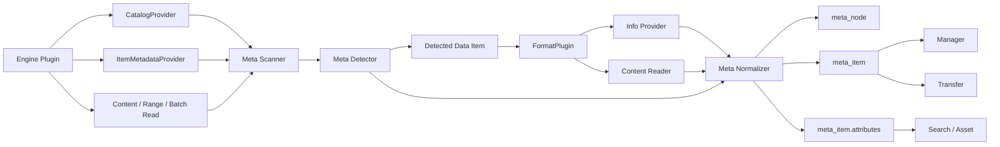
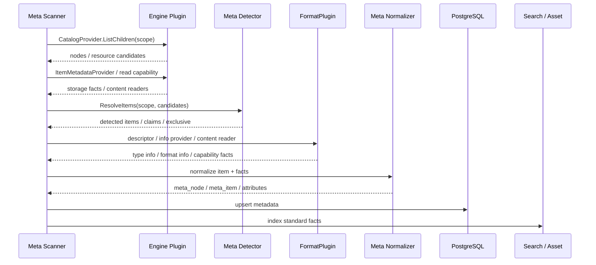

# ADDP 元数据体系图

本文从概念层说明 ADDP 的元数据体系如何把引擎资源转换为平台数据项，并写入 `meta_item` 与 `attributes`。数据项、数据类型、格式和读取能力的详细边界分别见：

- [ADDP 数据项体系图](addp数据项体系图.md)
- [ADDP 数据类型和格式体系图](addp数据类型和格式体系图.md)
- [ADDP 元数据扫描机制规范](../spec/addp元数据扫描机制规范.md)
- [ADDP 元数据 attributes 规范](../spec/addp元数据attributes规范.md)
- [ADDP 数据项探测器规范](../spec/addp数据项探测器规范.md)
- [ADDP 数据类型与格式能力规范](../spec/addp数据类型与格式能力规范.md)

## 核心结论

Meta 模块的职责是：**从 engine 资源树中识别 data item，裁决 item 身份，编排格式和数据类型能力，生成标准 attributes，并落库。**

Meta 不负责：

- Manager 面向前端的 DTO。
- Transfer 执行计划。
- FormatPlugin 内部解析细节。
- Frontend 展示策略。

元数据主链路是：

```text
engine catalog / metadata
  -> Meta scanner
  -> Meta detector
  -> FormatPlugin / info provider / content reader 提供候选事实
  -> Meta normalizer
  -> meta_node / meta_item / attributes
  -> search / asset / manager / transfer 消费
```

## 总览



## 元数据核心对象

| 对象 | 含义 | 事实源 |
|---|---|---|
| engine | 数据来自哪个引擎，以及如何连接和读取 | system engine 配置、engine plugin |
| node | 引擎资源树节点，例如 schema、bucket、prefix、目录 | `meta_node` |
| data item | 平台管理的核心数据对象 | `meta_item` |
| attributes | data item 的结构化扩展事实 | `meta_item.attributes` |

`node` 用于组织资源树，不等于 data item。`data item` 才是预览、检索、授权、传输、资产治理的核心对象。

## 资源层次

不同引擎的层次不同，但 Meta 统一落到 node 和 data item。

| 引擎类型 | 典型 node | 典型 data item |
|---|---|---|
| PostgreSQL / MySQL | database、schema | table、view |
| MongoDB | database | collection |
| Neo4j | database | graph |
| MinIO / S3 | bucket、prefix | object |
| NFS / 本地文件系统 | root、dir | file |

文件、对象、表、集合、graph 是否成为 data item，由 Meta detector 根据引擎稳定 catalog 边界和格式规则裁决。`meta_item.item_type` 保留 catalog item 术语；表格、文档、媒体、容器、图等内容语义写入 `attributes.item.data_type`。

对图数据库，Meta 以 graph 整体作为 data item。Neo4j label、relationship type 和连接模式属于 graph item 的结构事实，不作为独立 `meta_item`。这样可以避免多 label 节点被重复归属，也让图的预览、查询、资产治理围绕同一个 graph item 展开。

## Meta Scanner

Meta Scanner 负责调度扫描，不直接定义格式语义。

它主要做：

1. 读取 engine 的 `CatalogModelSpec`，结合 provider 组合选择扫描策略。
2. 调用 engine capability 获取资源树和基础元信息。
3. 把扫描范围交给 Meta detector。
4. 根据 detector 结果构造必要的读取抽象。
5. 调用 FormatPlugin、info provider 或 content reader 获取候选事实。
6. 调用 normalizer 生成 `meta_item` 和标准 attributes。
7. 写入数据库，并触发搜索或资产侧消费。

Scanner 不应：

- 按 Manager 需求拼前端 DTO。
- 在不同引擎里重复写同一格式的解析逻辑。
- 绕过 detector 自行拼装 multi / whole item。
- 只根据 `engine_family` 推断 catalog 层级、item 术语或读取路径。

`engine_family` 只适合做粗分类。Meta 对引擎的统一，不是把 MinIO / S3 和 NFS 视为同一种“文件树”，而是把它们都视为“具备 `CatalogModelSpec` 的存储层级”：差异留在 catalog model 与插件实现里，Meta 只按 `CatalogNode`、`CatalogPath`、`ItemMetadata` 和 provider 契约消费。

Scanner 的扫描深度、覆盖和刷新语义由 `scan_depth`、`scanned_depth`、`force` 和扫描目标共同决定。详细规则见 [ADDP 元数据扫描机制规范](../spec/addp元数据扫描机制规范.md)。

## Meta Detector

Meta Detector 是 data item 识别的唯一入口。

它回答：

- 当前扫描范围能生成几个 data item。
- 每个 data item 的内容布局是什么。
- 主资源或 whole scope 根范围是什么。
- ref 资源有哪些。
- 哪些资源已被 claims 认领。
- 当前范围是否 exclusive。

Detector 可以使用 FormatPlugin 的布局声明和格式探测结果，但最终 data item 边界由 Meta 裁决。详细规则见 [ADDP 数据项探测器规范](../spec/addp数据项探测器规范.md)。

## FormatPlugin 与 provider / reader

Meta 可以调用 `common/format` 的能力，但必须保持职责边界：

| 能力 | Meta 如何使用 | 写入位置 |
|---|---|---|
| FormatPlugin descriptor / capability | 判断格式身份、默认 data type、布局和可用能力 | `attributes.item` 的候选来源 |
| FormatInfoProvider | 获取格式私有元信息 | `attributes.format_info.<format>` |
| TableInfoProvider | 获取表字段、行数、主键等类型信息 | `attributes.type_info.table` |
| DocumentInfoProvider | 获取文档标题、页数、语言、提取状态等 | `attributes.type_info.document` |
| MediaInfoProvider | 获取媒体宽高、编码、时长等 | `attributes.type_info.media` |
| ContainerInfoProvider | 获取容器 child 摘要、默认入口、child refs 等 | `attributes.type_info.container` |
| GraphMetadataProvider | 获取 graph node shapes、relationship shapes、连接模式和计数 | `attributes.type_info.graph` |
| DocumentTextReader | 获取文档正文片段，用于全文索引或预览摘要 | `capabilities.extraction` 状态、外部索引；正文不写入 `type_info.document` |
| Content reader | 获取内容片段、样本或读取索引需要的事实 | 通常不直接落内容；必要索引写入 `content_index` |

内容样本、原始内容、Manager 前端 DTO 不属于元数据属性，不能塞进 `type_info` 或 `format_info`。

`type_info` 的事实源是 `common/datatype` 中的 `TableInfo`、`DocumentInfo`、`MediaInfo`、`ContainerInfo`、`GraphInfo` 等通用结构。Meta 可以消费 engine `ItemMetadata` 或 format info provider，但最终落库必须通过统一 normalizer 写入标准分区，Manager / Transfer / Search 不应再自行拼装这些主事实。

## Attributes 分区

Meta normalizer 是 attributes 标准分区的最终裁决点。

```json
{
  "schema_version": 1,
  "storage": {},
  "item": {},
  "type_info": {},
  "format_info": {},
  "content_index": {},
  "capabilities": {}
}
```

| 分区 | 写入内容 |
|---|---|
| `storage` | 引擎侧存储属性，例如 path、bucket、size、etag、last_modified_at |
| `item` | layout、data_type、format、refs、scope_exclusive |
| `type_info` | data type 通用元数据，例如 table fields、document page_count、media width |
| `format_info` | 文件、容器或格式解析层面的私有信息，例如 csv encoding、shapefile refs |
| `content_index` | 内容读取索引，例如 table sparse row index |
| `capabilities` | spatial、temporal、statistics、extraction 等横切事实 |

`meta_item` 表字段是 item 身份事实源，不重复写入 attributes。

`attributes.type_info.file` 不存在。文件、对象、目录、bucket、prefix、root 等只表示 catalog / storage 形态；路径、名称、大小、MIME、etag、hash、last_modified 等基础事实写入 `storage` 或 catalog node/item 标准字段。内容语义无法识别时，`item.data_type=unknown`。

## 扫描流程



## 基础扫描与深度扫描

| 扫描类型 | 目标 | 典型内容 |
|---|---|---|
| 基础扫描 | 快速发现资源树和 data item | node、item 身份、storage、item 分区、轻量格式判断；原则上不读取 file/object 内容 |
| 深度扫描 | 补充类型信息和横切事实 | table fields、row_count、container children、media info、document info、spatial、statistics、content_index |

基础扫描和深度扫描都必须遵守同一套 data item 与 attributes 规范。深度扫描只是补充事实，不改变 item 身份规则。

文档全文检索属于深度扫描或提取任务的内容处理结果，不改变 `DocumentInfo` 主事实边界。Meta 负责调用 `DocumentTextReader` 或外部 extractor，把正文送入搜索索引，并在 attributes 中记录提取状态、预览和索引引用；Manager 只提供检索入口和结果展示，不解析文档正文。

`scanned_depth` 表示 node / item 当前已经达到的扫描深度，`scan_status` 表示扫描任务过程状态。二者不能混用：一个 item 可以历史上已经 deep 完成，同时最近一次扫描任务失败。

Manager 刷新和预览补齐只能要求 Meta 对目标 engine / node / item 执行相应深度扫描，不应判断 Shapefile、CSV、Excel 等格式内部 attributes 是否齐全。

## 消费边界

| 模块 | 消费方式 | 不应做的事 |
|---|---|---|
| Manager | 读取已入库 data item 和 attributes，构造内容读取和前端 DTO | 重新探测 item、重新猜组件 |
| Transfer | 基于 data item、engine capability、contentio 抽象和 format 能力规划读写 | 重复推断字段类型、绕过 provider 硬编码格式 |
| Asset / Search | 索引标准 attributes 和必要私有命名空间 | 自行解析文件格式 |
| Frontend | 展示后端 DTO | 直接访问 engine 或裁决 data item 边界 |

## 设计约束

1. Meta 是 data item 识别和 attributes normalizer 的所有者。
2. FormatPlugin 只提供格式身份、能力和解析实现，不裁决最终 item。
3. Info provider 提供元数据，content reader 提供内容数据，二者不能混用。
4. 旧 `FileMetadataExtractor` 旁路机制已删除；新增格式必须通过 FormatPlugin、info provider 和 content reader 进入主线。
5. `TableInfo` 不再通过开放式扩展接口承载补充事实；格式私有事实进入 `format_info`，横切事实进入 `capabilities`，内容读取索引进入 `content_index`。
6. Manager / Transfer / Asset / Search 只能消费已入库 data item，不复刻 Meta detector。

## 相关文档

- [返回核心概念关系图](addp核心概念关系图.md)
- [ADDP 数据项体系图](addp数据项体系图.md)
- [ADDP 数据类型和格式体系图](addp数据类型和格式体系图.md)
- [ADDP 元数据扫描机制规范](../spec/addp元数据扫描机制规范.md)
- [ADDP 元数据 attributes 规范](../spec/addp元数据attributes规范.md)
- [ADDP 数据项探测器规范](../spec/addp数据项探测器规范.md)
- [ADDP 数据类型与格式能力规范](../spec/addp数据类型与格式能力规范.md)
- [Meta 模块详情](../../meta/CLAUDE.md)
