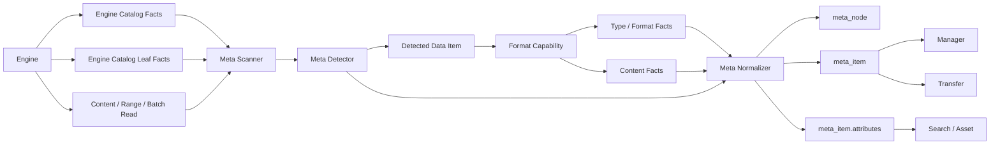
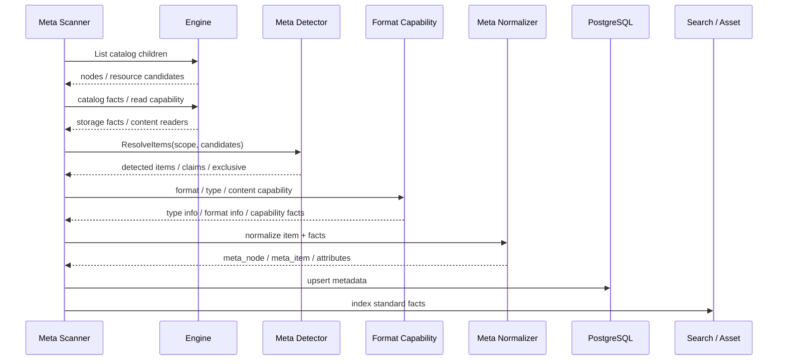

# ADDP 元数据体系图

本文从概念层说明 ADDP 的元数据体系如何把引擎资源转换为平台数据项，并写入 `meta_item` 与 `attributes`。数据项、数据类型、格式和读取能力的详细边界分别见：

- [ADDP 数据项体系图](addp数据项体系图.md)
- [ADDP 数据类型和格式体系图](addp数据类型和格式体系图.md)
- [ADDP 元数据扫描机制规范](../spec/addp元数据扫描机制规范.md)
- [ADDP 元数据 attributes 规范](../spec/addp元数据attributes规范.md)
- [ADDP 数据项探测器规范](../spec/addp数据项探测器规范.md)
- [ADDP 数据类型与格式能力规范](../spec/addp数据类型与格式能力规范.md)

## 核心结论

Meta 模块的职责是：**从 engine 资源树中识别 data item，裁决 item 身份，编排格式和数据类型能力，生成标准 attributes，并落库。**

Meta 不负责：

- Manager 面向前端的 DTO。
- Transfer 执行计划。
- 格式能力内部解析细节。
- Frontend 展示策略。

元数据主链路是：

```text
engine catalog / facts
  -> Meta scanner
  -> Meta detector
  -> 格式、数据类型和内容读取能力提供候选事实
  -> Meta normalizer
  -> meta_node / meta_item / attributes
  -> search / asset / manager / transfer 消费
```

## 总览



## 元数据核心对象

| 对象 | 含义 | 事实源 |
|---|---|---|
| engine | 数据来自哪个引擎，以及如何连接和读取 | system engine 配置、engine plugin |
| node | 引擎资源树节点，例如 schema、bucket、prefix、目录 | `meta_node` |
| data item | 平台管理的核心数据对象 | `meta_item` |
| attributes | data item 的结构化扩展事实 | `meta_item.attributes` |

`node` 用于组织资源树，不等于 data item。`data item` 才是预览、检索、授权、传输、资产治理的核心对象。

## 资源层次

不同引擎的层次不同，但 Meta 统一落到 node 和 data item。

| 引擎类型 | 典型 node | 典型 data item |
|---|---|---|
| PostgreSQL / MySQL | database、schema | table、view |
| MongoDB | database | collection |
| Neo4j | database | graph |
| MinIO / S3 | bucket、prefix | object |
| NFS / 本地文件系统 | root、dir | file |

文件、对象、表、集合、graph 是否成为 data item，由 Meta detector 根据引擎稳定 catalog 边界和格式规则裁决。`meta_item.item_type` 保留 catalog leaf 术语；表格、文档、媒体、容器、图等内容语义写入 `attributes.item.data_type`。

对图数据库，Meta 以 graph 整体作为 data item。Neo4j label、relationship type 和连接模式属于 graph item 的结构事实，不作为独立 `meta_item`。这样可以避免多 label 节点被重复归属，也让图的预览、查询、资产治理围绕同一个 graph item 展开。

## Meta Scanner

Meta Scanner 负责调度扫描，不直接定义格式语义。

它主要做：

1. 读取引擎 catalog model，结合能力声明选择扫描策略。
2. 调用引擎能力获取资源树和基础元信息。
3. 把扫描范围交给 Meta detector。
4. 根据 detector 结果构造必要的读取抽象。
5. 调用格式、类型信息或内容读取能力获取候选事实。
6. 调用 normalizer 生成 `meta_item` 和标准 attributes。
7. 写入数据库，并触发搜索或资产侧消费。

Scanner 不应：

- 按 Manager 需求拼前端 DTO。
- 在不同引擎里重复写同一格式的解析逻辑。
- 绕过 detector 自行拼装 multi / whole item。
- 只根据 `engine_family` 推断 catalog 层级、leaf 术语或读取路径。

`engine_family` 只适合做粗分类。Meta 对引擎的统一，不是把 MinIO / S3 和 NFS 视为同一种“文件树”，而是要求每类引擎提供稳定 catalog 层级和 leaf 术语；差异留在 catalog model 与插件实现里，Meta 只消费稳定契约。

Scanner 的扫描深度、覆盖和刷新语义由 `scan_depth`、`scanned_depth`、`force` 和扫描目标共同决定。详细规则见 [ADDP 元数据扫描机制规范](../spec/addp元数据扫描机制规范.md)。

## Meta Detector

Meta Detector 是 data item 识别的唯一入口。

它回答：

- 当前扫描范围能生成几个 data item。
- 每个 data item 的内容布局是什么。
- 主资源或 whole scope 根范围是什么。
- ref 资源有哪些。
- 哪些资源已被 claims 认领。
- 当前范围是否 exclusive。

Detector 可以使用格式布局声明和格式探测结果，但最终 data item 边界由 Meta 裁决。详细规则见 [ADDP 数据项探测器规范](../spec/addp数据项探测器规范.md)。

## 事实来源与内容读取

Meta 可以消费引擎、格式和内容读取能力，但必须保持职责边界：

| 来源类别 | Meta 如何使用 | 边界 |
|---|---|---|
| 引擎 catalog 和 catalog facts | 获取资源层级、原生 leaf、基础结构事实 | 不按 `engine_family` 猜测 catalog 层级，不把展示需求写回引擎模型 |
| 格式身份和布局能力 | 辅助判断格式、默认数据类型、multi / whole 归并候选 | 不裁决最终 data item 边界 |
| 类型信息能力 | 获取 table、document、media、container、graph 等结构事实 | 只提供元数据，不返回内容样本或前端 DTO |
| 格式私有信息能力 | 获取某个格式内部的私有事实 | 不替代通用 type info，也不承载横切能力 |
| 内容读取能力 | 获取内容片段、表格样本、正文片段或访问索引所需事实 | 内容本身通常不直接落 attributes；全文和索引引用进入相应能力分区 |

内容样本、原始内容、Manager 前端 DTO 不属于元数据属性，不能塞进 `type_info` 或 `format_info`。

type info 是 data type 的通用结构事实。Meta 可以消费引擎或格式侧提供的事实，但最终落库必须通过统一 normalizer 写入标准分区，Manager / Transfer / Search 不应再自行拼装这些主事实。具体 provider 和 reader 接口见规范层文档。

## Attributes 分区

Meta normalizer 是 attributes 标准分区的最终裁决点。

```json
{
  "schema_version": 1,
  "storage": {},
  "item": {},
  "type_info": {},
  "format_info": {},
  "access_index": {},
  "capabilities": {}
}
```

| 分区 | 写入内容 |
|---|---|
| `storage` | 引擎侧存储属性，例如 path、bucket、size、etag、last_modified_at |
| `item` | layout、data_type、format、refs、scope_exclusive |
| `type_info` | data type 通用元数据，例如 table fields、document page_count、media width |
| `format_info` | 文件、容器或格式解析层面的私有信息，例如 csv encoding、shapefile refs |
| `access_index` | 内容读取索引，例如 table sparse row index |
| `capabilities` | spatial、temporal、statistics、extraction 等横切事实 |

`meta_item` 表字段是 item 身份事实源，不重复写入 attributes。

`attributes.type_info.file` 不存在。文件、对象、目录、bucket、prefix、root 等只表示 Engine Catalog / storage 形态；路径、名称、大小、MIME、etag、hash、last_modified 等基础事实写入 `storage`，或进入 `EngineCatalogEntry` / Meta item 的标准字段。内容语义无法识别时，`item.data_type=unknown`。

## 扫描流程



## 基础扫描与深度扫描

| 扫描类型 | 目标 | 典型内容 |
|---|---|---|
| 基础扫描 | 快速发现资源树和 data item | node、item 身份、storage、item 分区、轻量格式判断；原则上不读取 file/object 内容 |
| 深度扫描 | 补充类型信息和横切事实 | table fields、row_count、container children、media info、document info、spatial、statistics、access_index |

基础扫描和深度扫描都必须遵守同一套 data item 与 attributes 规范。深度扫描只是补充事实，不改变 item 身份规则。

文档全文检索属于深度扫描或提取任务的内容处理结果，不改变 document 主事实边界。Meta 负责把正文送入搜索索引，并在 attributes 中记录提取状态、预览和索引引用；Manager 只提供检索入口和结果展示，不解析文档正文。

`scanned_depth` 表示 node / item 当前已经达到的扫描深度，`scan_status` 表示扫描任务过程状态。二者不能混用：一个 item 可以历史上已经 deep 完成，同时最近一次扫描任务失败。

`attributes` 只表达被扫描对象的事实，不表达扫描流程是否已经完成。deep scan 是否完成只能看 `scanned_depth` 或扫描任务结果，不能通过 `metadata_extracted` 之类 attributes 标记，也不能通过检查某个格式字段是否存在来推断。

Manager 刷新和预览补齐只能要求 Meta 对目标 engine / node / item 执行相应深度扫描，不应判断 Shapefile、CSV、Excel 等格式内部 attributes 是否齐全。

## 消费边界

| 模块 | 消费方式 | 不应做的事 |
|---|---|---|
| Manager | 读取已入库 data item 和 attributes，构造内容读取和前端 DTO | 重新探测 item、重新猜组件 |
| Transfer | 基于 data item、engine capability、内容读取抽象和 format 能力规划读写 | 重复推断字段类型、绕过统一能力硬编码格式 |
| Asset / Search | 索引标准 attributes 和必要私有命名空间 | 自行解析文件格式 |
| Frontend | 展示后端 DTO | 直接访问 engine 或裁决 data item 边界 |

## 设计约束

1. Meta 是 data item 识别和 attributes normalizer 的所有者。
2. 格式能力只提供格式身份、能力和解析实现，不裁决最终 item。
3. 类型信息能力提供元数据，内容读取能力提供内容数据，二者不能混用。
4. 旧文件元数据提取旁路机制已删除；新增格式必须通过正式格式能力、类型信息能力和内容读取能力进入主线。
5. table 主事实不再通过开放式扩展接口承载补充事实；格式私有事实、横切事实和内容读取索引各自进入对应分区。
6. Manager / Transfer / Asset / Search 只能消费已入库 data item，不复刻 Meta detector。

## 相关文档

- [返回核心概念关系图](addp核心概念关系图.md)
- [ADDP 数据项体系图](addp数据项体系图.md)
- [ADDP 数据类型和格式体系图](addp数据类型和格式体系图.md)
- [ADDP 元数据扫描机制规范](../spec/addp元数据扫描机制规范.md)
- [ADDP 元数据 attributes 规范](../spec/addp元数据attributes规范.md)
- [ADDP 数据项探测器规范](../spec/addp数据项探测器规范.md)
- [ADDP 数据类型与格式能力规范](../spec/addp数据类型与格式能力规范.md)
- [Meta 模块详情](../../meta/CLAUDE.md)
