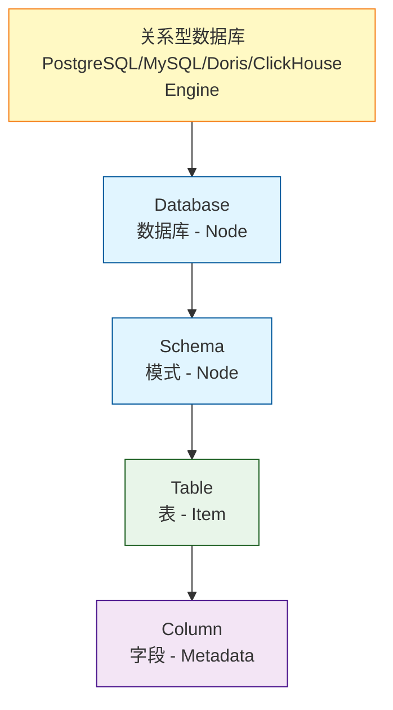
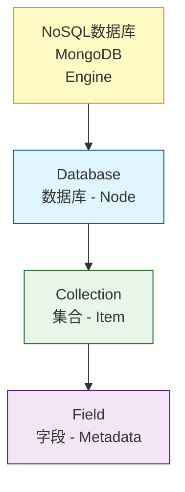
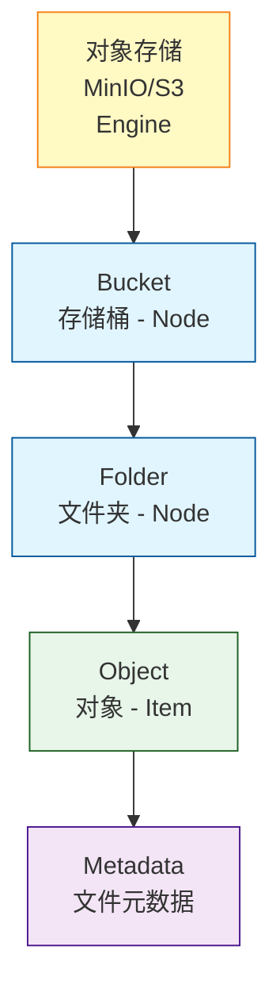
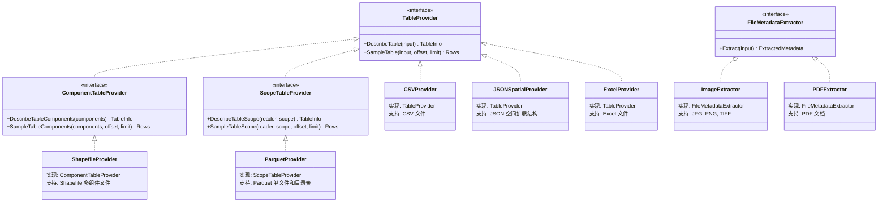
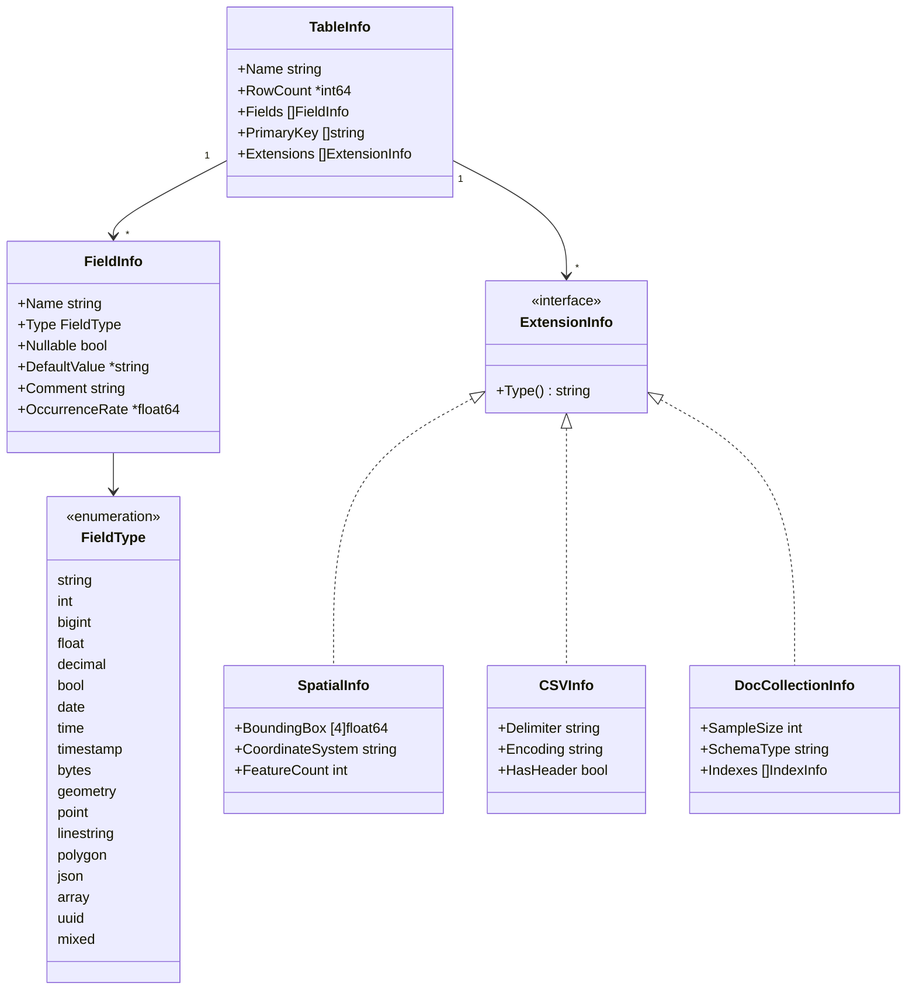
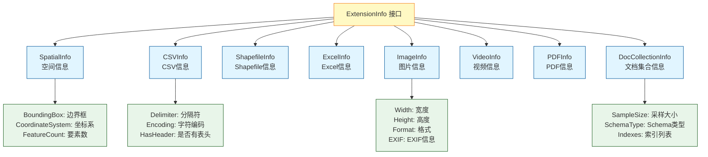
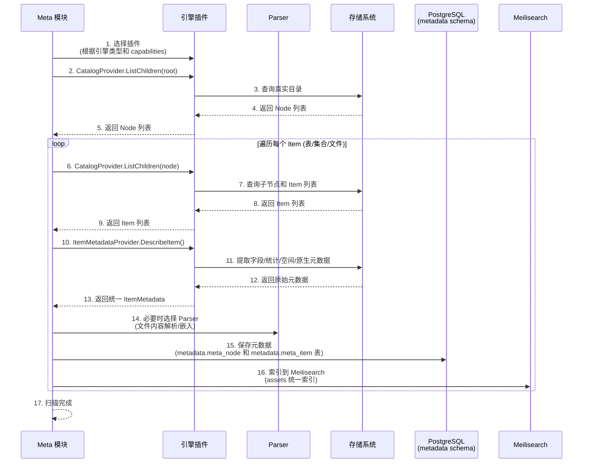

# ADDP 元数据体系图

本文档展示 ADDP 平台的元数据管理体系，包括层次结构和扫描流程。引擎目录和元数据能力统一来自 `CatalogProvider` 与 `ItemMetadataProvider`，接口规范见 [../spec/addp引擎插件接口规范.md](../spec/addp引擎插件接口规范.md)。

---

## 目录

1. [元数据概念](#元数据概念)
2. [元数据层次结构](#元数据层次结构)
3. [Parser 体系架构](#parser-体系架构)
4. [TableInfo 统一数据结构](#tableinfo-统一数据结构)
5. [ExtensionInfo 扩展机制](#extensioninfo-扩展机制)
6. [元数据扫描流程](#元数据扫描流程)

---

## 元数据概念

**元数据 (Metadata)** 是描述数据的数据,包括:
- **数据库元数据**: 库名、表名、字段名、数据类型
- **文件元数据**: 文件名、大小、格式、路径
- **空间元数据**: 坐标系、边界框、要素数量
- **统计元数据**: 记录数、字段分布、空值率

**ADDP 元数据管理的核心抽象**:
- **数据节点 (Node)**: 数据的层次结构节点(数据库、Schema、Bucket 等)
- **数据项 (Item)**: 可查询的数据单元(表、集合、文件等)

---

## 元数据层次结构

ADDP 将不同类型存储引擎的层次结构统一抽象为**数据节点**和**数据项**。真实层级由插件的 Catalog Model 声明。

### 2.1 关系型数据库层次结构

### 2.2 NoSQL 数据库层次结构

### 2.3 对象存储层次结构

### 层次结构对照表

| 存储类型 | 层级1 (Engine) | 层级2 (Node) | 层级3 (Node) | 层级4 (Item) | 层级5 (Metadata) |
|---------|---------------|-------------|-------------|------------|-----------------|
| **PostgreSQL** | PostgreSQL | Schema | - | Table/View | Column |
| **MySQL/Doris/ClickHouse** | 引擎 | Database | - | Table/View | Column |
| **MongoDB** | MongoDB | Database | - | Collection | Field |
| **Neo4j** | Neo4j | Database | - | Label/Relationship | Property |
| **对象存储** | MinIO/S3 | Bucket | Prefix | Object | Object Metadata |
| **NFS** | NFS Engine | Root (`""`) | Dir | File | File Metadata |

**抽象规则**:
- **Node**: 层次结构的容器,用于组织数据(Database、Schema、Bucket、Folder、Root、Dir)
- **Item**: 可描述、预览或读取的数据单元，是元数据扫描的目标（Table、Collection、Label、Relationship、Object、File）
- **Metadata**: Item 的详细描述信息(Column、Field、File Metadata)

**文件系统 vs 对象存储的 Node 类型区别**:
- 对象存储使用 `bucket` / `prefix`（prefix 是虚拟目录，对象键的前缀）
- 文件系统使用 `root` / `dir`（真实目录树，root 来自引擎配置不进入路径）

---

## Provider / Extractor 体系架构

ADDP 当前将格式侧表格能力收口到 `TableProvider`。`TableProvider` 是上层消费文件表、组件表、scope 表语义的主入口；数据库表和文档集合属于 engine-native 数据，由 engine capability 或后续 data type provider 提供平台语义。文件元数据增强仍由 `FileMetadataExtractor` 负责。

### Provider / Extractor 类型说明

**1. TableProvider (表数据类型 Provider)**:
- **用途**: 从外部提供的资源流或组件读取抽象中提取表格语义。
- **支持格式**: CSV、Shapefile、JSON 空间扩展、Excel、Parquet。
- **核心方法**:
  - `DescribeTable()`: 提取表结构(字段定义、行数、扩展信息)。
  - `SampleTable()`: 读取采样或分页数据。
- **使用场景**: Manager 文件表预览，以及后续 Meta / Transfer 对文件表能力的统一消费。
- **边界**: 不接 engine id，不构造读取器，不决定 item 归并，不返回 Manager 专用 DTO。

**2. ComponentTableProvider (多组件表 Provider)**:
- **用途**: 从一组已确认组件中提取表格语义。
- **典型格式**: Shapefile。
- **边界**: 组件集合由 Meta 或上层编排提供，format provider 只负责组件解码。

**3. ScopeTableProvider (范围表 Provider)**:
- **用途**: 从目录、prefix 或 manifest scope 中提取表格语义。
- **典型格式**: Parquet 目录表。
- **边界**: 范围列举和内容打开由 `common/resource.ResourceReader` 提供。

**4. FileMetadataExtractor (文件元数据提取器)**:
- **用途**: 从文件内容提取媒体、文档、文本等增强元数据。
- **支持类型**: 图片 (JPEG、PNG、TIFF)、视频 (MP4、AVI)、文档 (PDF)。
- **核心方法**:
  - `Extract()`: 提取 `ExtractedMetadata`。
- **使用场景**: Meta 模块提取图片/视频/PDF 的元数据，并按 attributes 规范写入 `storage`、`type_info.media`、`type_info.document`、`capabilities.extraction`。

---

## TableInfo 统一数据结构

无论是关系型表、文件表还是文档集合,都统一返回 `TableInfo` 结构:

### TableInfo 字段说明

| 字段 | 类型 | 说明 | 示例 |
|------|------|------|------|
| `Name` | string | 表名/集合名/文件名 | `"users"`, `"cities.geojson"` |
| `RowCount` | *int64 | 记录数/文档数(可选) | `1000000` |
| `Fields` | []FieldInfo | 字段列表 | `[{Name: "id", Type: "int"}, ...]` |
| `PrimaryKey` | []string | 主键字段(MongoDB 为 `["_id"]`) | `["id"]`, `["_id"]` |
| `Extensions` | []ExtensionInfo | 扩展信息(根据数据源类型不同) | `[SpatialInfo, CSVInfo, ...]` |

### FieldInfo 字段说明

| 字段 | 类型 | 说明 | 适用场景 |
|------|------|------|---------|
| `Name` | string | 字段名 | 所有数据源 |
| `Type` | FieldType | 统一字段类型 | 所有数据源 |
| `Nullable` | bool | 是否可为空 | 关系型数据库、文件 |
| `DefaultValue` | *string | 默认值(可选) | 关系型数据库 |
| `Comment` | string | 字段注释 | 关系型数据库 |
| `OccurrenceRate` | *float64 | 字段出现率(可选,0.0-1.0) | MongoDB (灵活 Schema) |

**OccurrenceRate 说明**:
- MongoDB 等 NoSQL 数据库支持灵活 Schema,不同文档可能有不同字段
- `OccurrenceRate` 表示字段在采样文档中的出现率
- 示例: `OccurrenceRate = 0.95` 表示 95% 的文档包含该字段

---

## ExtensionInfo 扩展机制

ADDP 通过 `ExtensionInfo` 接口为不同数据源提供特定的扩展信息:

### ExtensionInfo 类型说明

| ExtensionInfo 类型 | 适用数据源 | 主要字段 |
|-------------------|-----------|---------|
| **SpatialInfo** | Shapefile、JSON 空间扩展、PostGIS 表 | 边界框、坐标系、要素数 |
| **CSVInfo** | CSV 文件 | 分隔符、字符编码、是否有表头 |
| **ShapefileInfo** | Shapefile 文件 | .shp、.shx、.dbf、.prj 文件路径 |
| **ExcelInfo** | Excel 文件 | 工作表列表、活动工作表 |
| **ImageInfo** | 图片文件 (JPEG、PNG、TIFF) | 宽度、高度、格式、EXIF 信息 |
| **VideoInfo** | 视频文件 (MP4、AVI) | 时长、分辨率、编码格式 |
| **PDFInfo** | PDF 文件 | 页数、作者、创建时间 |
| **DocCollectionInfo** | MongoDB Collection | 采样信息、Schema 类型、索引 |

---

## 元数据扫描流程

ADDP 根据引擎类型自动选择合适的扫描方式:

### 扫描流程说明

**步骤 1-5**: 获取数据节点(Node)
- Meta 模块根据引擎类型和 `engine.capabilities/v1` 选择对应插件
- 调用 `CatalogProvider.ListChildren(root)`
- 获取层次结构的容器节点(Database、Schema、Bucket、Prefix、Directory 等)

**步骤 6-9**: 获取数据项(Item)
- 遍历每个 Node，继续调用 `CatalogProvider.ListChildren(node)`
- 获取统一数据项列表(Table、Collection、Object、File 等)

**步骤 10-14**: 解析元数据
- Meta 模块通过 `ItemMetadataProvider.DescribeItem()` 获取详细元数据
- 插件返回统一的 ItemMetadata，包含字段、统计、索引、约束、空间信息和原生属性
- 文件内容解析、文档嵌入等增强流程再按数据类型选择 Parser

**步骤 15-16**: 存储和索引
- 将 Node 数据保存到 PostgreSQL `metadata.meta_node` 表
- 将 Item 元数据保存到 PostgreSQL `metadata.meta_item` 表
- 索引到 Meilisearch `assets` 索引（统一资产索引,包含 table 和 object 类型）,支持全文搜索

### 扫描深度

**基础扫描 (Basic Scan)**:
- 获取基本结构信息(schema/库名、表名、字段名、bucket、对象路径)
- **增量扫描策略**：如果资源未变化(修改时间、大小无变化),则跳过更新
- **保留已有深度元数据**：不会覆盖已存在的深度扫描元数据
- 快速扫描,资源占用少
- 适合大量数据源的初步扫描和定期检查

**深度扫描 (Deep Scan)**:
- **强制全量扫描**：扫描所有资源(即使未变化也重新扫描) （todo：这个处理逻辑待改进）
- **提取详细元数据**：
  - 关系型数据库：记录数、大小、字段类型、空间字段信息
  - 对象存储：文件内容类型、编码、分辨率、空间数据的边界框和坐标系
- **生成搜索索引**：将元数据同步到 Meilisearch
- **资源清理**：检测并软删除已删除的资源
- 耗时较长,资源占用大
- 适合重要数据源的详细分析和首次扫描

---

## 相关文档

- [返回核心概念关系图](addp核心概念关系图.md)
- [ADDP 数据类型与格式体系图](../next/addp数据类型与格式体系图.md)
- [ADDP 数据格式扩展指南](../next/addp数据格式扩展指南.md)
- [Meta 模块详情](../../meta/CLAUDE.md)

---

**文档版本**: v1.0
**创建日期**: 2026-02-16
**作者**: ADDP 开发团队
