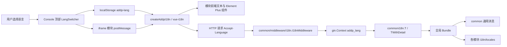
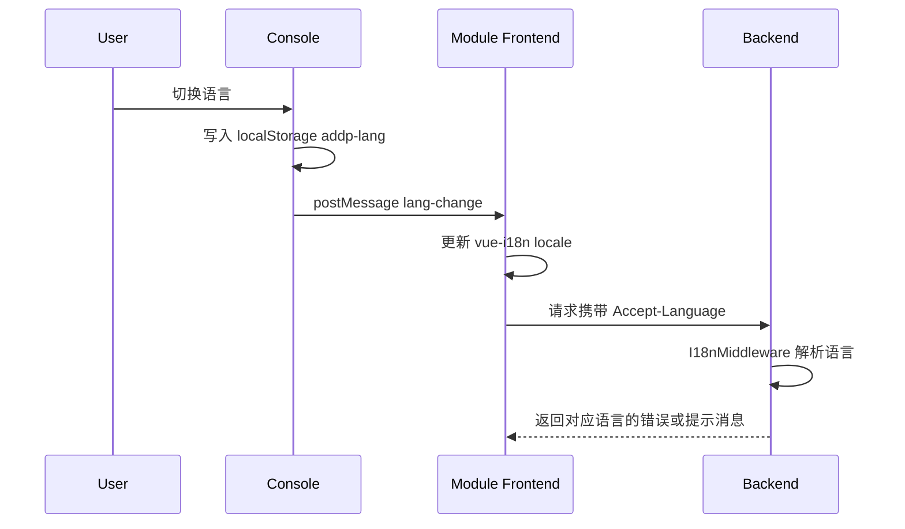

# ADDP 国际化体系图

本文档说明 ADDP 国际化体系的整体设计、语言偏好流转、前后端职责边界和模块扩展方式。

## 目标

ADDP 面向中文和国际用户提供统一的多语言体验。当前内置语言为：

- `zh-cn`：简体中文，默认语言。
- `en`：英文。

国际化体系必须支持运行时切换语言，不要求刷新页面或重启服务；新增模块时应沿用统一机制，不在模块内重复实现语言状态、翻译加载和请求头处理。

## 总体架构



## 前端职责

前端国际化由 `common-frontend/basic` 提供统一基础能力：

- `createAddpI18n()`：创建 Vue I18n 实例，合并公共翻译和模块翻译。
- `useAddpI18n()`：组件内统一使用 `t()`、`locale` 和 `switchLang()`。
- `LangSwitcher.vue`：统一语言切换组件。
- `localStorage` 中的 `addp-lang`：保存用户语言偏好。
- Console 通过 `postMessage` 将语言切换广播给 iframe 中的模块前端。

模块前端只维护本模块业务词条，不维护全局语言状态。Console 是语言切换入口，各 iframe 模块接收 Console 语言切换消息并同步自身 Vue I18n locale。

## 后端职责

后端国际化由 `common/middleware/i18n` 提供统一基础能力：

- `I18nMiddleware()`：解析请求 `Accept-Language`，将标准语言代码写入 `gin.Context`。
- `GetLang()`：读取当前请求语言，缺省返回 `zh-cn`。
- `RegisterBundle()`：允许各模块注册自己的 TOML 翻译文件。
- `T()`：按当前请求语言翻译消息 ID，失败时回退到 `zh-cn`，仍失败则返回消息 ID。
- `TWithDetail()`：翻译静态消息并追加动态错误详情。

各模块后端维护自己的 `i18n` 包和 `locales` 目录，在 `init()` 中注册模块翻译文件。业务 Handler 使用 `commoni18n.T(c, modulei18n.MsgXxx)` 返回用户可见错误消息。

## 文件组织

国际化文件遵循就近原则：共享词条放共享模块，业务词条放业务模块。

```text
common-frontend/basic/src/i18n/
├── zh-cn.json
└── en.json

<module>/frontend/src/i18n/
├── zh-cn.json
└── en.json

common/middleware/i18n/
├── i18n.go
├── translator.go
└── locales/
    ├── zh-cn.toml
    └── en.toml

<module>/backend/i18n/
├── i18n.go
└── locales/
    ├── zh-cn.toml
    └── en.toml
```

## 职责边界

| 层级 | 放置内容 | 不应放置 |
| --- | --- | --- |
| `common-frontend/basic` | 公共 UI 文本、语言切换、Vue I18n 初始化能力 | 业务模块专属词条 |
| 模块前端 `src/i18n` | 本模块页面、菜单、表单、提示、状态文本 | 跨模块公共词条 |
| `common/middleware/i18n` | 语言解析、翻译 Bundle、通用消息 key | 业务模块错误消息 |
| 模块后端 `i18n` | 本模块错误消息 key 和 TOML 翻译 | 其他模块消息 |
| Swagger 注解 | 面向 API 文档的人类可读双语说明 | 运行时错误消息翻译 |

## 请求语言流转



## 当前实施状态

国际化基础设施和模块落地已完成：

- 共享前端、Console、System、Manager、Meta、Transfer 以及主要业务模块已具备前端翻译文件。
- Go 后端模块已具备 `common/middleware/i18n` 基础设施和模块级 `i18n/locales` 注册机制。
- Swagger 注解已采用 `中文 | English` 双语格式。
- `bash scripts/swagger/check-route-coverage.sh all` 已验证 Go 后端模块 Swagger 路由覆盖一致；Agent、Copilot 为 FastAPI 模块，使用运行时 `/openapi.json`。

新增模块或新增用户可见文本时，应按 [国际化开发规范](../spec/addp国际化开发规范.md) 维护词条和代码调用。

