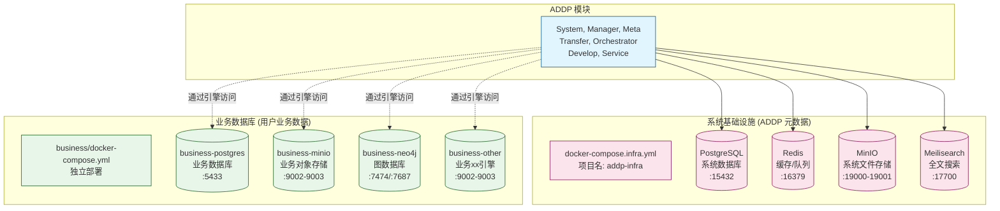
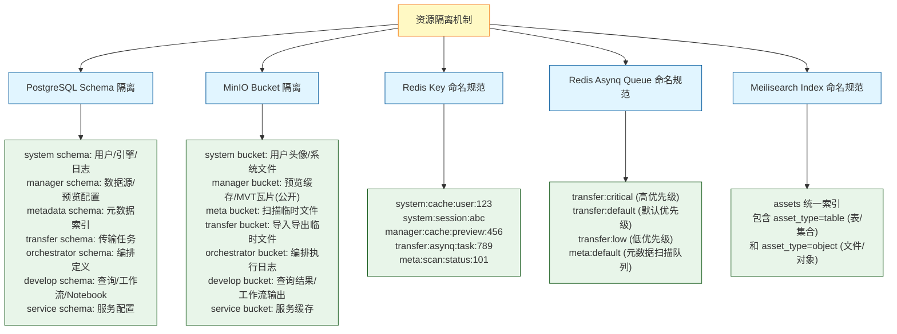

# ADDP 基础设施隔离图

本文档展示 ADDP 平台的基础设施架构,包括系统基础设施与业务数据库的隔离,以及各类资源的隔离机制。

---

## 目录

1. [基础设施架构概述](#基础设施架构概述)
2. [系统基础设施 vs 业务数据库](#系统基础设施-vs-业务数据库)
3. [资源隔离机制](#资源隔离机制)

---

## 基础设施架构概述

ADDP 采用**系统与业务数据分离**架构设计,确保平台元数据与用户业务数据隔离。

---

## 系统基础设施 vs 业务数据库

### 系统基础设施 (docker-compose.infra.yml)

**存储 ADDP 系统元数据**,包括:

**PostgreSQL** (端口 15432):
- 用户信息 (`system.users`)
- 引擎配置 (`system.engines`)
- 元数据存储 (`metadata.meta_node`, `metadata.meta_item`)
- 任务定义 (`orchestrator.orchestrations`)
- 服务配置 (`service.services`)
- Schema 隔离: `system`, `manager`, `metadata`, `transfer`, `orchestrator`, `develop`, `service`

**Redis** (端口 16379):
- 用户会话缓存
- 引擎配置缓存
- 元数据缓存
- Asynq 任务队列 (Transfer 模块)
- Key 命名规范: `{module}:{middleware}:{function}:{id}`

**MinIO** (端口 19000-19001):
- 用户头像 (`system` bucket)
- 预览缓存 (`manager` bucket)
- MVT 瓦片 (`manager` bucket,公开读)
- 临时文件
- Bucket 隔离: `system`, `manager`, `meta`, `transfer`, `orchestrator`, `develop`, `service`

**Meilisearch** (端口 17700):
- 统一资产搜索索引: `assets` (开发环境) / `metadata-assets` (生产环境)
- Meta 和 Manager 模块共享此索引,通过 `asset_type` 区分数据类型 (table/object)

### 业务数据库 (business/docker-compose.yml, 独立部署)

**存储用户通过 ADDP 管理的实际业务数据**:

**business-postgres** (端口 5433):
- 用户上传的 PostgreSQL 数据
- 由用户手动注册为引擎
- ADDP 通过引擎插件访问

**business-minio** (端口 9002-9003):
- 用户上传的业务文件 (Shapefile、GeoJSON、图片、视频)
- 由用户手动注册为引擎
- ADDP 通过引擎插件访问

**business-neo4j** (端口 7474/7687):
- 图结构业务数据（知识图谱、关系网络）
- Neo4j Community Edition，支持 Cypher 查询语言
- Browser UI：http://localhost:7474，Bolt 协议：bolt://localhost:7687
- 由用户手动注册为引擎
- ADDP 通过引擎插件访问

---

## 资源隔离机制

ADDP 采用**模块化资源隔离**策略,确保模块资源独立管理:

### 隔离机制详情

**1. PostgreSQL Schema 隔离**:
- 按模块隔离: `system`、`manager`、`metadata`、`transfer`、`orchestrator`、`develop`、`service`
- 避免表名冲突,权限独立管理
- 租户隔离: 所有业务表包含 `tenant_id` 字段

**2. MinIO Bucket 隔离**:
- 按模块隔离: `system`、`manager`、`meta`、`transfer`、`orchestrator`、`develop`、`service`
- 避免文件冲突,配额独立管理
- `manager` bucket 设置为公开读 (MVT 瓦片需前端直接访问)
- 其他 bucket 均为私有访问

**3. Redis Key 命名规范**:
- 格式: `{module}:{middleware}:{function}:{id}`
- 示例: `system:cache:user:123`、`transfer:asynq:task:456`
- 便于按模块管理和清理

**4. Redis Asynq Queue 命名规范**:
- 格式: `{module}:{priority}`
- 示例: `transfer:critical`、`meta:default`
- 支持按优先级调度

**5. Meilisearch Index 命名**:
- **当前实现**: 使用统一索引 `assets` (开发环境) / `metadata-assets` (生产环境)
- Meta 和 Manager 模块共享此索引,通过 `asset_type` 字段区分数据类型
- **规范建议** (未实现): 格式 `{module}:{entity_type}`,如 `meta:tables`、`manager:datasources`

---

## 相关文档

- [返回核心概念关系图](addp核心概念关系图.md)
- [ADDP 配置介绍](../spec/addp配置介绍.md)
- [ADDP 端口分配](../spec/addp端口分配.md)

---

**文档版本**: v1.0
**创建日期**: 2026-02-16
**作者**: ADDP 开发团队
