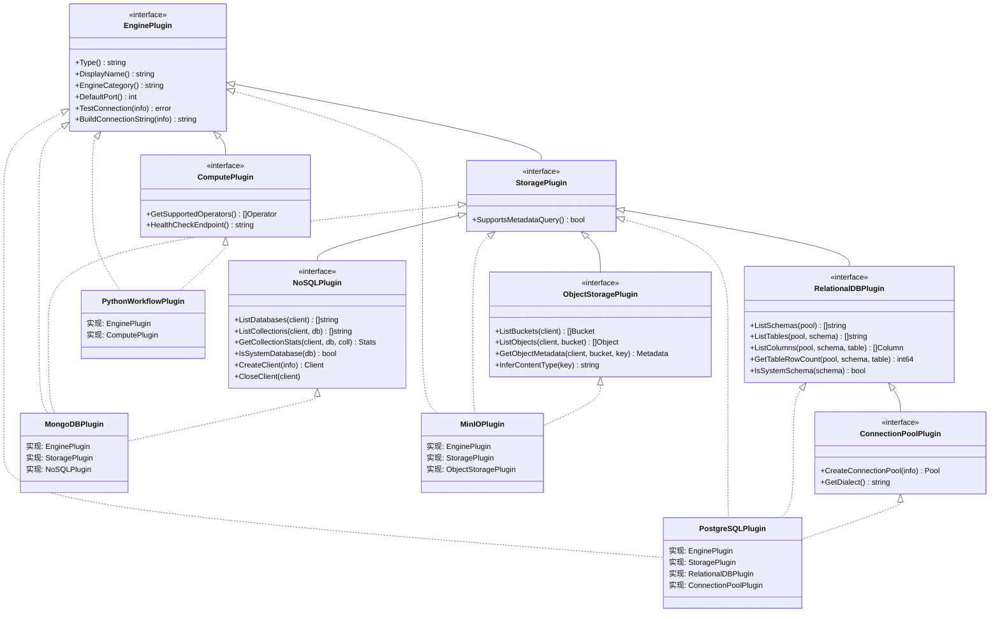
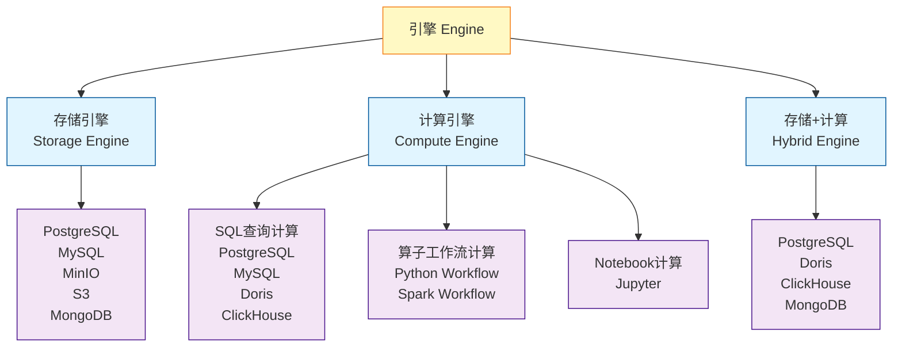
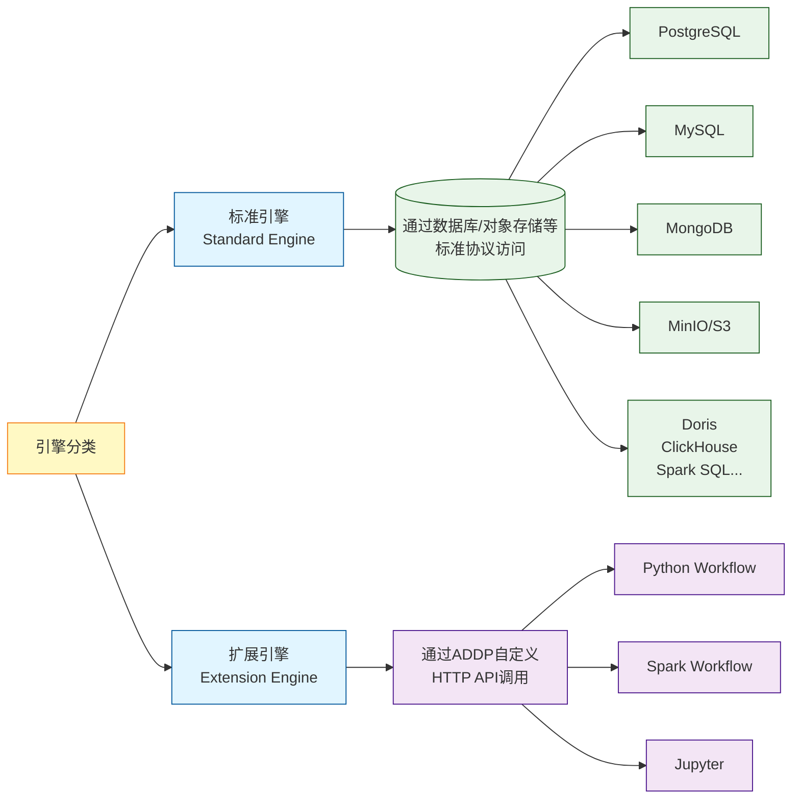
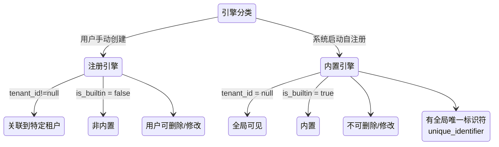
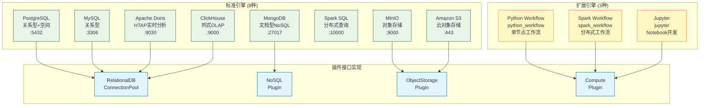
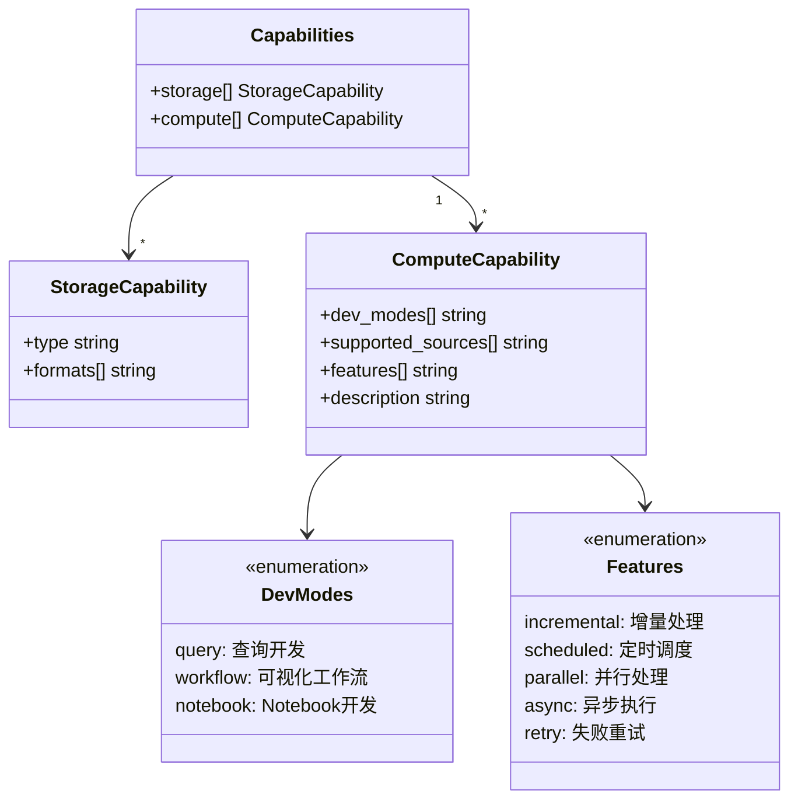
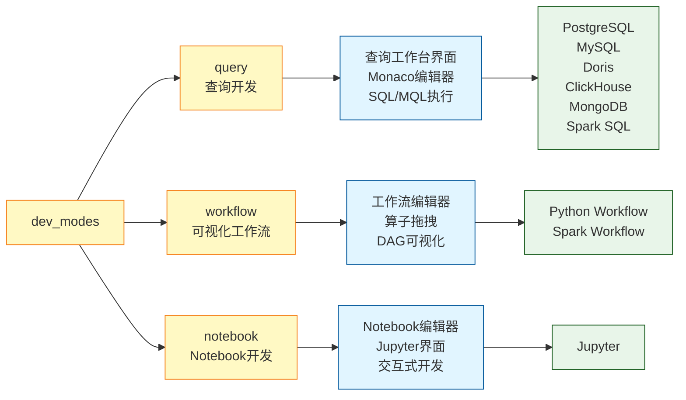
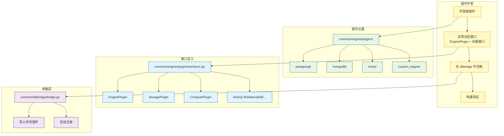

# ADDP 引擎体系图

本文档展示 ADDP 平台的引擎系统架构、分类体系和能力声明机制。

---

## 目录

1. [引擎概念](#引擎概念)
2. [引擎插件三层接口架构](#引擎插件三层接口架构)
3. [引擎分类体系](#引擎分类体系)
4. [支持的引擎列表](#支持的引擎列表)
5. [引擎能力声明](#引擎能力声明)

---

## 引擎概念

**引擎 (Engine)** 是 ADDP 平台中所有数据源和计算资源的统一抽象。引擎代表一个可以存储数据或执行计算的外部系统(数据库、对象存储)或内部模块(空间计算引擎)。

**核心属性**:
- **引擎类型** (EngineType): 如 `postgresql`、`mongodb`、`python_workflow`
- **引擎分类** (EngineCategory): `standard` 或 `extension`
- **连接信息** (ConnectionInfo): 数据库连接串、API 端点等
- **能力声明** (Capabilities): 引擎支持的功能列表(JSONB 格式)

---

## 引擎插件三层接口架构

ADDP 采用三层接口架构实现引擎插件化,支持灵活扩展:



**架构说明**:

**第一层:EnginePlugin (引擎基础接口)**
- 所有引擎必须实现的基础接口
- 定义引擎的基本信息和连接测试能力

**第二层:按功能分类的标记接口**
- **StoragePlugin**: 存储引擎标记(支持元数据查询)
- **ComputePlugin**: 计算引擎标记(支持算子/查询)

**第三层:按存储类型细分的功能接口**
- **RelationalDBPlugin**: 关系型数据库(PostgreSQL、MySQL、Doris、ClickHouse)
- **NoSQLPlugin**: NoSQL 数据库(MongoDB)
- **ObjectStoragePlugin**: 对象存储(MinIO、S3)
- **ConnectionPoolPlugin**: 连接池管理(用于关系型数据库)

**接口组合示例**:
- **PostgreSQL**: EnginePlugin + StoragePlugin + RelationalDBPlugin + ConnectionPoolPlugin
- **MongoDB**: EnginePlugin + StoragePlugin + NoSQLPlugin
- **MinIO**: EnginePlugin + StoragePlugin + ObjectStoragePlugin
- **Python Workflow**: EnginePlugin + ComputePlugin

---

## 引擎分类体系

ADDP 从多个维度对引擎进行分类,不同分类之间存在交叉。

### 1. 按功能分类



**分类说明**:
- **存储引擎**: 提供数据存储能力(PostgreSQL、MinIO、MongoDB 等)
- **计算引擎**: 提供数据处理和分析能力
  - **SQL 查询计算**: 执行 SQL/MQL 查询
  - **算子工作流计算**: 执行空间和非空间算子工作流
  - **Notebook 计算**: Jupyter Notebook 交互式开发
- **存储+计算**: 同时提供存储和计算能力(PostgreSQL、Doris 等)

### 2. 按标准/扩展分类



**分类说明**:
- **标准引擎**: 通过标准协议(JDBC、S3、MongoDB Wire Protocol)访问的数据库/对象存储等
  - 类型命名: 直接使用数据库名称(如 `postgresql`、`mysql`、`mongodb`)
  - 一般由用户手动注册,需要填写连接信息
- **扩展引擎**: 通过ADDP自定义的 HTTP API 调用
  - 类型命名: 使用引擎名称(如 `python_workflow`、`spark_workflow`、`jupyter`)
  - 当前均为系统engines下几个模块自动注册,也可由用户自定义注册

### 3. 按注册方式分类



**分类说明**:
- **注册引擎 (Registered Engine)**:
  - 由用户通过前端表单或 API 手动创建
  - 关联到特定租户 (`tenant_id != null`)
  - 可被用户删除或修改
  - `is_builtin = false`
- **内置引擎 (Builtin Engine)**:
  - 由系统启动时自动注册
  - 不属于任何租户 (`tenant_id = null`),全局可见
  - 不可删除或修改核心配置(防止误操作)
  - `is_builtin = true`
  - 具有全局唯一标识符 (`unique_identifier`,如 `python_workflow`)

---

## 支持的引擎列表

ADDP 平台当前支持 **11 种**数据引擎:



### 标准引擎详情

| 引擎 | 类型 | 默认端口 | 插件接口 | 主要能力 |
|------|------|---------|---------|---------|
| **PostgreSQL** | 关系型数据库 | 5432 | RelationalDB + ConnectionPool | SQL 查询,支持 PostGIS 空间扩展 |
| **MySQL** | 关系型数据库 | 3306 | RelationalDB + ConnectionPool | SQL 查询 |
| **Apache Doris** | HTAP 分析数据库 | 9030 | RelationalDB + ConnectionPool | 实时分析,OLAP 查询 |
| **ClickHouse** | 列式 OLAP 数据库 | 9000 | RelationalDB + ConnectionPool | 高性能分析查询 |
| **MongoDB** | 文档型 NoSQL | 27017 | NoSQL | MQL 查询,采样推断 Schema |
| **Spark SQL** | 分布式 SQL 引擎 | 10000 | Compute | 大规模 SQL 查询 |
| **MinIO** | 对象存储 | 9000 | ObjectStorage | S3 兼容,文件存储 |
| **Amazon S3** | 云对象存储 | 443 | ObjectStorage | AWS 云存储 |

### 扩展引擎详情

| 引擎 | 类型 | 能力 | 适用场景 |
|------|------|------|---------|
| **Python Workflow** | 工作流计算 | 21 个空间算子 | 中小规模数据分析(< 100 万行) |
| **Spark Workflow** | 分布式工作流 | 空间与非空间算子 | 大规模数据分析(> 100 万行) |
| **Jupyter** | Notebook 开发 | Python/Shell 交互式开发 | 数据探索,变量传递 |

---

## 引擎能力声明

引擎的 `capabilities` 字段是 JSONB 格式,声明引擎支持的功能。

### 能力结构



### 能力示例

**PostgreSQL 引擎** (存储+计算):
```json
{
  "storage": [
    {
      "type": "relational_db",
      "formats": ["sql", "csv", "parquet"]
    }
  ],
  "compute": [
    {
      "dev_modes": ["query"],
      "supported_sources": ["postgresql"],
      "features": ["incremental", "scheduled"],
      "description": "SQL查询"
    }
  ]
}
```

**Python Workflow 引擎** (纯计算):
```json
{
  "compute": [
    {
      "dev_modes": ["workflow"],
      "supported_formats": ["geojson", "shapefile", "wkt"],
      "features": ["dag", "memory_efficient", "batch"],
      "description": "空间数据分析工作流"
    }
  ]
}
```

**MongoDB 引擎** (存储+计算):
```json
{
  "storage": [
    {
      "type": "document_db",
      "formats": ["json", "bson"]
    }
  ],
  "compute": [
    {
      "dev_modes": ["query"],
      "supported_sources": ["mongodb"],
      "features": ["aggregation", "flexible_schema"],
      "description": "MQL查询和聚合"
    }
  ]
}
```

### 开发方式 详解

**dev_modes 是引擎能力的核心字段**,声明引擎在 Develop 模块中提供的开发界面类型:



**dev_modes 说明**:
- **query**: 查询开发,对应查询工作台界面,支持 SQL、MQL 等查询语言
- **workflow**: 可视化工作流,对应工作流编辑器,支持算子拖拽和 DAG 编排
- **notebook**: Notebook 开发,对应 Jupyter Notebook 编辑器,支持 Python 和 Shell

---

## 引擎插件系统

ADDP 采用插件化架构支持新引擎扩展:



**新增引擎流程**(3 步):
1. 在 `common/engine/plugins/<enginetype>/` 创建插件,实现对应接口
2. 在 `common/dbbridge/bridge.go` 添加导入语句
3. 构建测试和功能验证

**详细指南**: 参考 [ADDP 数据引擎扩展指南](../addp数据引擎扩展指南.md)

---

## 相关文档

- [返回核心概念关系图](../addp核心概念关系图.md)
- [ADDP 数据引擎扩展指南](../addp数据引擎扩展指南.md)
- [ADDP 核心概念说明(详版)](../addp核心概念说明（详版）.md)

---

**文档版本**: v1.0
**创建日期**: 2026-02-16
**作者**: ADDP 开发团队
