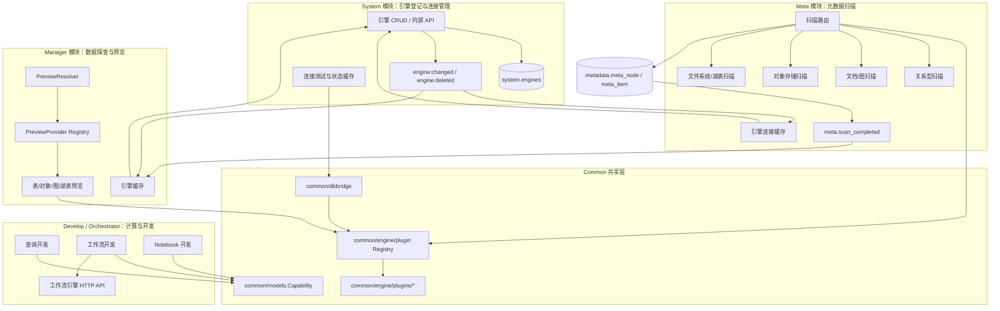
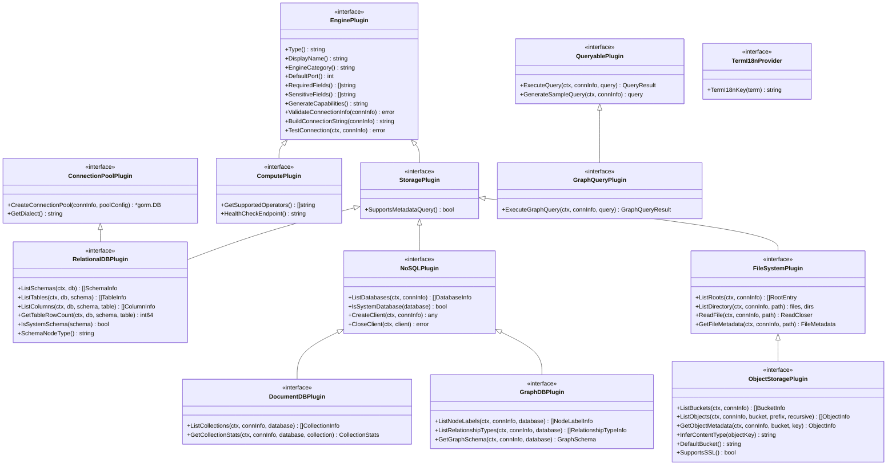
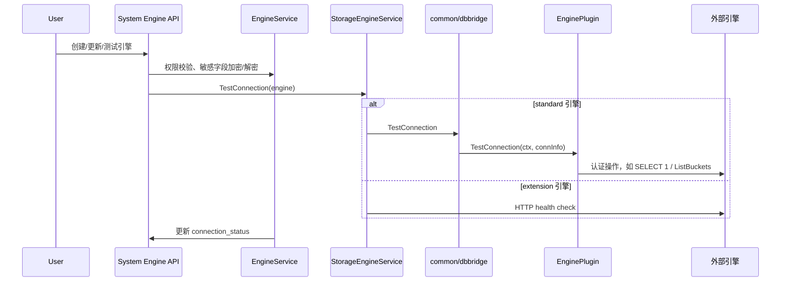
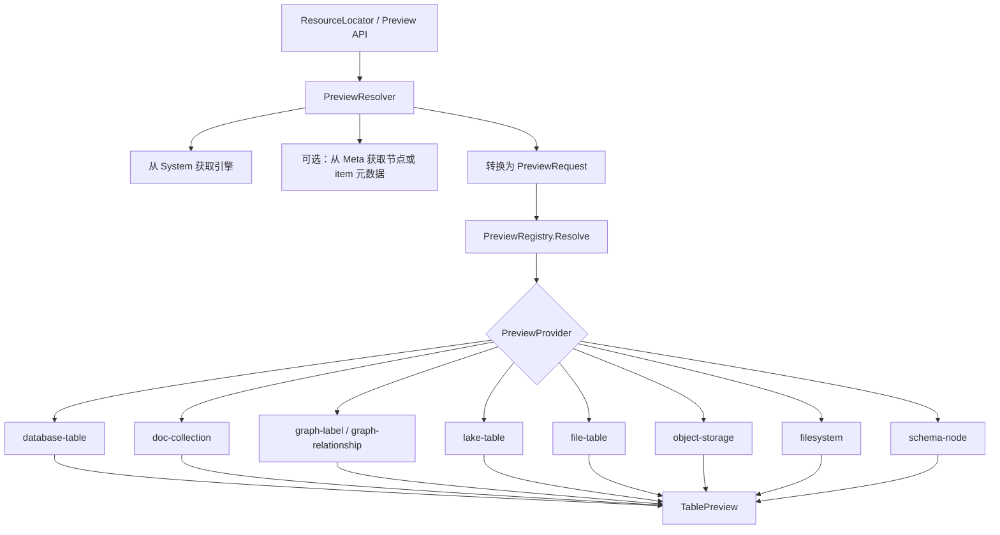
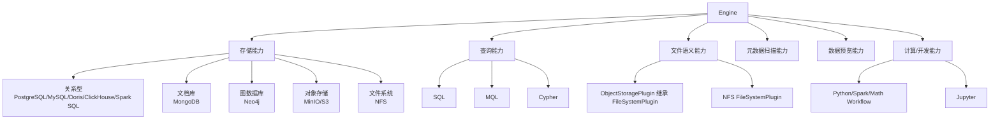
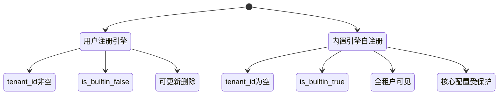

# ADDP 引擎体系图

本文档描述 ADDP 当前实际使用的引擎抽象、插件接口、模块调用链和能力声明机制。这里的“引擎”覆盖数据源、文件系统语义存储、对象存储、图数据库、查询引擎、工作流计算引擎和 Notebook 运行环境。

本文档重点说明当前实现状态，后续架构优化应以本文档作为讨论基线。

---

## 目录

1. [核心概念](#核心概念)
2. [全局架构](#全局架构)
3. [插件接口体系](#插件接口体系)
4. [模块调用链](#模块调用链)
5. [当前支持的引擎](#当前支持的引擎)
6. [能力声明](#能力声明)
7. [注册、缓存与事件](#注册缓存与事件)
8. [预览体系](#预览体系)
9. [当前待统一的问题](#当前待统一的问题)
10. [相关代码与文档](#相关代码与文档)

---

## 核心概念

**引擎 (Engine)** 是 ADDP 对外部数据系统、内部计算运行时和数据访问能力的统一登记对象。引擎配置存储在 `system.engines` 表中，其他模块通过 System 内部 API 获取解密后的连接信息。

核心字段：

| 字段 | 含义 |
| --- | --- |
| `id` | 引擎实例 ID，作为跨模块引用主键 |
| `tenant_id` | 租户 ID；内置平台级引擎通常为空 |
| `name` | 用户可见名称 |
| `engine_type` | 引擎类型，如 `postgresql`、`minio`、`neo4j`、`python_workflow` |
| `engine_category` | `standard` 或 `extension` |
| `connection_info` | 连接信息 JSON，敏感字段由 System 加密保存 |
| `capabilities` | 能力声明 JSON，用于过滤和前端功能入口判断 |
| `scan_config` | 元数据扫描配置 |
| `connection_status` | 连接状态缓存：`online`、`offline`、`unknown`、`checking` |
| `is_builtin` | 是否内置引擎 |

需要区分两组概念：

- **引擎实例**：用户或系统注册到 `system.engines` 的一条连接配置。
- **引擎插件**：`common/engine/plugins/<engine_type>` 下的 Go 实现，提供连接测试、元数据枚举、查询、文件读取等能力。

---

## 全局架构



模块分工：

- **System** 是引擎配置的事实来源，负责权限、加密、能力声明、连接状态和事件发布。
- **Common** 提供插件接口、插件注册表、连接池、DSN 构建和跨模块模型。
- **Meta** 通过插件扫描元数据，构建 `meta_node` / `meta_item` 目录树。
- **Manager** 通过 Meta 元数据和插件能力进行数据预览、空间快显、对象浏览。
- **Develop / Orchestrator** 主要消费 `capabilities.compute`，对接查询、工作流和 Notebook 运行时。

---

## 插件接口体系

当前插件接口集中在 `common/engine/plugin/interfaces.go` 和 `common/engine/plugin/filesystem.go`。



接口组合示例：

| 引擎 | 主要接口组合 |
| --- | --- |
| PostgreSQL / MySQL / Doris / ClickHouse / Spark SQL | `EnginePlugin` + `StoragePlugin` + `RelationalDBPlugin` + `ConnectionPoolPlugin` |
| MongoDB | `EnginePlugin` + `StoragePlugin` + `NoSQLPlugin` + `DocumentDBPlugin` + `QueryablePlugin` |
| Neo4j | `EnginePlugin` + `StoragePlugin` + `NoSQLPlugin` + `GraphDBPlugin` + `QueryablePlugin` + `GraphQueryPlugin` |
| MinIO / S3 | `EnginePlugin` + `StoragePlugin` + `FileSystemPlugin` + `ObjectStoragePlugin` |
| NFS | `EnginePlugin` + `StoragePlugin` + `FileSystemPlugin` |
| Python Workflow / Spark Workflow / Math Workflow | `EnginePlugin` + `ComputePlugin` |
| Jupyter | 当前主要实现 `EnginePlugin`，通过能力声明暴露 Notebook 能力 |

---

## 模块调用链

### System：连接测试和登记



System 还会发布 `engine:changed` / `engine:deleted` 事件，通知 Meta 和 Manager 清理缓存或处理扫描配置。

### Meta：元数据扫描

```mermaid
flowchart TB
    Start[扫描请求 / 定时任务 / immediate_scan] --> LoadEngine[从 System 获取解密引擎信息]
    LoadEngine --> GetPlugin[plugin.Get(engine_type)]
    GetPlugin --> Route{接口类型}

    Route -->|RelationalDBPlugin| Rel[关系型扫描<br/>schema/database -> table -> field]
    Route -->|DocumentDBPlugin| Doc[文档库扫描<br/>database -> collection -> sampled fields]
    Route -->|GraphDBPlugin| Graph[图数据库扫描<br/>database -> label / relationship]
    Route -->|ObjectStoragePlugin| Obj[对象存储扫描<br/>bucket -> prefix -> object]
    Route -->|FileSystemPlugin| FS[文件系统扫描<br/>root -> dir -> file/lake_table]

    FS --> Detector[CompositeItemDetector<br/>识别目录型湖表]
    Obj --> MetaStore[(metadata.meta_node / meta_item)]
    Rel --> MetaStore
    Doc --> MetaStore
    Graph --> MetaStore
    Detector --> MetaStore
    MetaStore --> Search[Meilisearch 索引]
    MetaStore --> Event[meta:scan_completed]
```

Meta 当前扫描分支：

| 分支 | 入口服务 | 主要数据结构 |
| --- | --- | --- |
| 关系型数据库 | `DatabaseScanService` | `schema/database` 节点，`table` item，字段属性 |
| 文档数据库 | `NoSQLScanService` | `database` 节点，`collection` item，采样字段 |
| 图数据库 | `NoSQLScanService` | `database` 节点，`label` / `relationship` item |
| 对象存储 | `ObjectStorageScanService` | `bucket` / `prefix` 节点，`object` item |
| 文件系统 | `FileSystemScanService` | `root` / `dir` 节点，`file` / `lake_table` item |

### Manager：数据预览



Manager 后端预览 Provider 负责把不同引擎的数据转换成统一的 `TablePreview` / `ObjectPreview` 响应；前端再通过内容预览插件选择具体渲染组件。

---

## 当前支持的引擎

当前插件注册集中在 `common/dbbridge/bridge.go`，插件实现位于 `common/engine/plugins/*`。

| 引擎类型 | 分类 | 默认端口 | 主要接口 | system 连接测试 | meta 扫描 | manager 预览 |
| --- | --- | ---: | --- | --- | --- | --- |
| `postgresql` | 标准 / 关系型 / SQL 查询 | 5432 | `RelationalDBPlugin`、`ConnectionPoolPlugin` | 插件认证查询 | schema/table/field，PostGIS 空间元数据 | 表格、空间字段、MVT |
| `mysql` | 标准 / 关系型 / SQL 查询 | 3306 | `RelationalDBPlugin`、`ConnectionPoolPlugin` | 插件认证查询 | database/table/field | 表格 |
| `doris` | 标准 / HTAP / SQL 查询 | 9030 | `RelationalDBPlugin`、`ConnectionPoolPlugin` | 插件认证查询 | database/table/field | 表格 |
| `clickhouse` | 标准 / OLAP / SQL 查询 | 9000 | `RelationalDBPlugin`、`ConnectionPoolPlugin` | 插件认证查询 | database/table/field | 表格 |
| `spark_sql` | 标准 / 分布式 SQL 查询 | 10000 | `RelationalDBPlugin`、`ConnectionPoolPlugin` | 插件连接测试 | database/table/field | 表格能力取决于 Provider 兼容情况 |
| `mongodb` | 标准 / 文档数据库 / MQL 查询 | 27017 | `DocumentDBPlugin`、`QueryablePlugin` | 插件认证命令 | database/collection/字段采样 | 集合表格预览 |
| `neo4j` | 标准 / 图数据库 / Cypher 查询 | 7687 | `GraphDBPlugin`、`GraphQueryPlugin` | 插件认证命令 | database/label/relationship | 标签/关系预览、图 Schema |
| `minio` | 标准 / 对象存储 / 文件语义 | 9000 | `ObjectStoragePlugin`、`FileSystemPlugin` | `ListBuckets` 等认证 API | bucket/prefix/object，湖表识别 | 对象、目录、文件表、湖表 |
| `s3` | 标准 / 对象存储 / 文件语义 | 443 | `ObjectStoragePlugin`、`FileSystemPlugin` | `ListBuckets` 等认证 API | bucket/prefix/object，湖表识别 | 对象、目录、文件表、湖表 |
| `nfs` | 标准 / 文件系统语义存储 | 2049 | `FileSystemPlugin` | 文件系统访问检查 | root/dir/file/lake_table | 目录、文件、湖表 |
| `python_workflow` | 扩展 / 工作流计算 | 8099 | `ComputePlugin` | HTTP health 或插件 health | 不参与存储扫描 | 作为计算运行时使用 |
| `spark_workflow` | 扩展 / 工作流计算 | 8098 | `ComputePlugin` | HTTP health 或插件 health | 不参与存储扫描 | 作为计算运行时使用 |
| `math_workflow` | 扩展 / 工作流计算 | 8089 | `ComputePlugin` | HTTP health 或插件 health | 不参与存储扫描 | 作为计算运行时使用 |
| `jupyter` | 扩展 / Notebook | 8097 | `EnginePlugin` + Notebook 能力声明 | HTTP health 或插件 health | 不参与存储扫描 | Notebook 开发入口 |

按能力维度可分为：



---

## 能力声明

`capabilities` 是 System 存储的 JSONB 字段，用于模块过滤和前端功能入口判断。当前 Go 结构定义在 `common/models/capability.go`。

当前结构：

```go
type Capability struct {
    Storage []StorageCapability `json:"storage,omitempty"`
    Compute []ComputeCapability `json:"compute,omitempty"`
}

type StorageCapability struct {
    Type string `json:"type,omitempty"`
}

type ComputeCapability struct {
    SupportedSources []string               `json:"supported_sources,omitempty"`
    SupportedFormats []string               `json:"supported_formats,omitempty"`
    DevModes         []string               `json:"dev_modes,omitempty"`
    Features         []string               `json:"features,omitempty"`
    APIEndpoints     map[string]interface{} `json:"api_endpoints,omitempty"`
}
```

常见能力字段：

| 字段 | 用途 |
| --- | --- |
| `storage[].type` | Meta 和 System 内部 API 按存储类型过滤，如 `relational_db`、`nosql_db`、`graph_db`、`object_storage`、`filesystem`、`generic` |
| `compute[].dev_modes` | Develop 前端选择查询、工作流或 Notebook 入口，取值通常为 `query`、`workflow`、`notebook` |
| `compute[].supported_sources` | 工作流或计算引擎支持的数据源类型 |
| `compute[].supported_formats` | 工作流或计算引擎支持的数据格式 |
| `compute[].features` | 功能标签，如 `distributed`、`async`、`dag` |
| `compute[].api_endpoints` | 工作流引擎 HTTP API 路径，如 operators、execute、workflow |

示例：

```json
{
  "storage": [
    {
      "type": "relational_db",
      "engine": "postgresql",
      "supports_query": true
    }
  ],
  "compute": [
    {
      "dev_modes": ["query"],
      "description": "SQL查询"
    }
  ]
}
```

```json
{
  "storage": [
    {
      "type": "graph_db",
      "engine": "neo4j",
      "supports_query": true
    }
  ],
  "compute": [
    {
      "dev_modes": ["query"],
      "description": "图数据库查询（Cypher）",
      "features": ["graph_algorithms", "knowledge_graph", "cypher_query", "property_graph"]
    }
  ]
}
```

```json
{
  "compute": [
    {
      "dev_modes": ["workflow"],
      "api_endpoints": {
        "operators": "/api/operators",
        "execute": "/api/operators/:name/execute",
        "workflow": "/api/workflow"
      },
      "features": ["dag", "async"]
    }
  ]
}
```

注意：当前各插件返回的能力 JSON 尚未完全规范化，后续需要统一字段 schema 和校验逻辑。

---

## 注册、缓存与事件

### 插件注册

Go 插件通过包导入触发 `init()` 注册：

```mermaid
flowchart LR
    Bridge[common/dbbridge/bridge.go] --> Import[import _ common/engine/plugins/*]
    Import --> Init[插件 init()]
    Init --> Register[plugin.Register]
    Register --> Registry[全局 Registry]
```

新增插件的一般步骤：

1. 在 `common/engine/plugins/<engine_type>/` 实现 `EnginePlugin` 和需要的功能接口。
2. 在 `common/dbbridge/bridge.go` 添加匿名导入。
3. 更新能力声明、前端表单和必要的预览 Provider。
4. 验证 System 连接测试、Meta 扫描、Manager 预览。

### 引擎实例注册



### 缓存与事件

| 事件 | 发布方 | 订阅方 | 用途 |
| --- | --- | --- | --- |
| `engine:changed` | System | Meta、Manager | 引擎创建/更新后清理连接缓存；Meta 处理 scan_config |
| `engine:deleted` | System | Meta、Manager | 引擎删除后清理缓存和扫描任务 |
| `meta:scan_completed` | Meta | Manager | 扫描完成后清理目录和预览相关缓存 |

Meta 和 Manager 都会缓存从 System 获取的解密连接信息，并通过事件主动失效。

---

## 预览体系

Manager 后端预览使用 `PreviewProvider` 注册表，与 `common/engine/plugin` 是两套不同层次的扩展点：

- `common/engine/plugin` 解决“如何连接和读取某类引擎”。
- `manager PreviewProvider` 解决“如何把某类资源转换成统一预览响应”。
- 前端预览插件解决“如何把响应渲染为文本、表格、地图、图片、视频、PDF 等组件”。

当前内置 Provider：

| Provider | 处理场景 |
| --- | --- |
| `database-table` | 关系型数据库表预览 |
| `doc-collection` | MongoDB 等文档集合预览 |
| `graph-label` | Neo4j 节点标签预览 |
| `graph-relationship` | Neo4j 关系类型预览 |
| `object-storage` | MinIO/S3 对象和目录预览 |
| `filesystem` | NFS 等文件系统目录和文件预览 |
| `file-table` | CSV、Excel、Shapefile、GeoJSON 等文件表格预览 |
| `lake-table` | Parquet/湖表预览 |
| `schema-node` | Schema / Database / Bucket 等节点预览 |

对象、文件和湖表预览还会复用 `common/format` 中的格式检测和解析能力。

---

## 当前待统一的问题

以下是当前实现中已经暴露出来、需要后续讨论优化的点。它们不是本文档的规范结论，而是后续架构评审的输入。

1. **能力声明 schema 不够统一**
   各插件手写 `GenerateCapabilities()` JSON，字段存在不一致。建议后续改为结构化构造并集中校验。

2. **接口能力和 capabilities 可能不一致**
   某些引擎实现了元数据扫描接口，但能力声明没有明确表达对应 storage 类型，可能影响按能力过滤。

3. **连接检测路径需要收敛**
   手动测试和异步检测对 `extension` 引擎的路径并不完全一致，建议统一到一个 System 内部入口。

4. **Manager 仍有硬编码类型判断**
   `isObjectStorageType`、`isFileSystemType`、部分 MinIO/GORM 构造和 PostgreSQL 空间处理还没有完全沉到插件抽象。

5. **文件语义和对象存储语义需要更清楚的边界**
   `ObjectStoragePlugin` 继承 `FileSystemPlugin` 是合理方向，但扫描和预览中仍存在对象存储专属逻辑与通用文件系统逻辑交叉。

6. **数据源引擎和计算引擎复用同一张 engines 表**
   当前可行，但文档和代码需要持续明确“实例登记”和“能力维度”的区别，避免只靠 `standard` / `extension` 二分承载所有语义。

7. **Resource / Engine / StorageEngine 术语需要收敛**
   多个模块中仍混用资源、引擎、数据源等名称，建议后续统一术语或明确兼容别名。

---

## 相关代码与文档

关键代码：

- `common/engine/plugin/interfaces.go`：插件接口定义。
- `common/engine/plugin/filesystem.go`：文件系统语义接口。
- `common/engine/plugins/*`：各类引擎插件实现。
- `common/dbbridge/bridge.go`：插件导入、连接池和查询桥接。
- `common/models/engine.go`：引擎模型和扫描配置。
- `common/models/capability.go`：能力声明模型。
- `system/backend/internal/service/engine_service.go`：引擎 CRUD、权限、加密、能力声明和连接状态。
- `system/backend/internal/service/storage_engine_service.go`：连接测试入口。
- `meta/backend/internal/service/scan_service.go`：Meta 扫描总路由。
- `manager/backend/internal/service/preview_registry.go`：Manager 预览 Provider 注册表。
- `manager/backend/internal/service/preview_resolver.go`：预览解析入口。

相关文档：

- [ADDP 数据引擎扩展指南](../spec/addp数据引擎扩展指南.md)
- [ADDP 工作流计算引擎接口规范](../spec/addp工作流计算引擎接口规范.md)
- [ADDP 数据类型与格式体系图](addp数据类型与格式体系图.md)
- [ADDP 元数据体系图](addp元数据体系图.md)
- [ADDP 数据开发体系图](addp数据开发体系图.md)

---

**文档版本**：v1.1
**更新日期**：2026-04-30
**维护说明**：本文档描述当前实际实现；接口和能力声明优化完成后需要继续更新。
