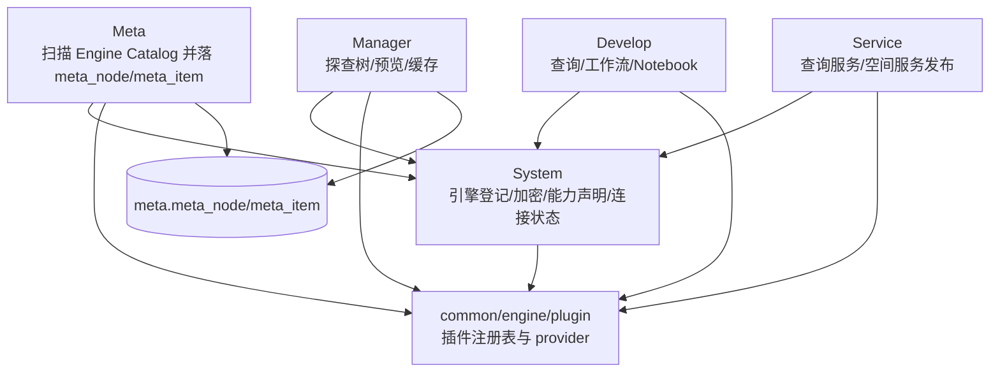
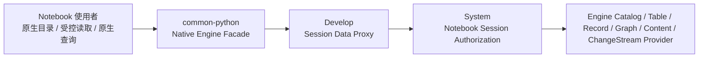

# ADDP 引擎体系图

本文档只描述 ADDP 引擎体系的概念关系和模块调用链。插件接口规范见 [../spec/addp引擎插件接口规范.md](../spec/addp引擎插件接口规范.md)，能力声明结构见 [../spec/addp引擎能力声明规范.md](../spec/addp引擎能力声明规范.md)，路径语义见 [../spec/addp存储引擎路径体系规范.md](../spec/addp存储引擎路径体系规范.md)。

---

## 一、核心概念

| 概念 | 含义 |
| --- | --- |
| Engine Instance | System 中的一条引擎实例，保存租户、名称、类型、连接配置、能力声明、生命周期和连通性观测；一条记录只绑定一个确定的物理端点。 |
| Engine Plugin | `common/engine/plugins/<engine_type>` 下的内置引擎适配实现，负责非通用的连接、校验、测试和能力暴露；实现标准 Workflow Runtime 协议的外部运行时不要求编译期 Plugin。 |
| Capability | 插件返回的结构化能力声明，版本为 `engine.capabilities/v1`。 |
| Engine Catalog | 引擎中的真实目录层级和事实读取抽象，如 schema/table、bucket/object、database/graph；跨模块类型统一使用 `EngineCatalog*`，不带限定词的 Catalog 保留给企业资源目录。 |
| Item | 可被描述、预览、读取或写入的叶子数据项。 |
| AI Inference Runtime | 对 ADDP 调用方提供统一 `addp.inference/v1` 数据面的计算 Runtime；Provider、模型和凭据是 Runtime 内部强类型资源。 |

`inference/` 是拥有 Provider Connection、Model Deployment、Model Profile、凭据和配置管理入口的业务 owner 模块，不是引擎插件目录。`common/engine/plugins/inference_runtime` 是 System 和调用方消费统一引擎契约的编译期插件，`system.engines` 中的 `inference_runtime` Engine Instance 只登记该模块数据面 Runtime 的确定端点。仓库目录、插件位置和 Engine Instance 登记是三个不同维度；不得因为 Runtime 被 System 登记就把整个 owner 模块移动到 `engines/`，也不得在 `engines/` 下复制第二套 Inference 控制面。

### Engine Instance 身份与生命周期

- `engine_id` 是 Engine Instance 的平台身份，不是可重定向到任意物理引擎的连接槽位。
- 可注册插件通过 `ConnectionSpec()` 统一声明连接字段；其中 `identity=true` 的字段构成 Engine Instance 身份。PostgreSQL 一类数据库通常使用 `host + port + database`；MongoDB 使用 `host + port + user + auth_source`，其中 `database` 仅是可选初始数据库；对象存储通常使用 `endpoint`，NFS 使用 `server + export_path`。
- 名称、描述、凭据和非身份连接参数可以原地更新；任何身份字段变化都必须创建新的 Engine Instance，不得保留原 ID 并改指向另一物理端点。
- `engine_id` 由数据库 identity sequence 单调分配，永久保留且不得回收、复用、手工指定或通过重置 sequence 重新分配。删除 Engine Instance 不释放其 ID。
- System 根据 `tenant scope + engine_type + ConnectionSpec identity fields` 规范化生成持久身份键。相同身份的重复注册是幂等操作：`active` 或 `disabled` 实例返回原 ID，不创建重复记录，也不绕过管理员禁用状态；`deleting` 实例拒绝注册；`deleted` 实例返回“需要恢复”的冲突，必须通过显式恢复操作继续沿用原 ID。名称相同不构成同一实例，身份字段不同必须创建新 ID。
- 生命周期统一为 `active`、`disabled`、`deleting`、`deleted`。业务选择器展示已注册、`active` 且目标 capability 匹配的引擎；`connection_status` 不负责隐藏选择项，而是决定其是否可选。只有 `online` 实例可建立新绑定或发起使用，离线、未知或检测中的实例保留展示并明确禁选。删除前先在原生命周期执行只读影响评估；用户确认后才进入 `deleting`，冻结新绑定和新执行并保留连接配置供权威复扫和 cleanup 使用。参与模块不可用、存在运行任务或复扫影响变化时删除必须暂停；cleanup 完成后转为 `deleted` 墓碑，保留 ID、Tenant、类型、身份键和删除审计，移除敏感凭据并退出普通列表、选择器、Runtime Descriptor 和执行路径。System 不物理删除墓碑。
- 生命周期是平台管理意图，表示引擎实例是否被启用；连通性观测是 System 最近一次检测的运行事实，两者独立维护。连通性观测只更新 `connection_status`、`last_check_at` 和 `check_message`，不得递增 Engine Instance 聚合根 `version`，也不得改变资源 `updated_at`；否则后台巡检会使用户编辑基线无效。`active + offline` 表示实例仍被启用但当前不是可用引擎候选，不表示生命周期已自动停用。System 引擎管理清单必须继续展示该实例，供用户查看失败原因、修改连接、重新测试或删除。
- 业务模块返回的新建任务、查询、工作流、Notebook、扫描、传输等引擎选择列表，应包含 `active + capability matched` 的注册选择项并返回 `connection_status`；只有 `active + online + capability matched` 的 Engine Instance 才是当前可执行候选。Backend 候选接口或共享选择层必须给出该判定，前端必须展示但禁用非 `online` 项；真正绑定或执行时 Backend 必须根据 System 当前事实再次校验，不得依赖前端状态。
- 已保存任务或配置引用的 Engine Instance 后续变为 offline、unknown、checking、disabled、deleting、deleted 或缺失时，owner 仍显示原绑定及其不可用原因，但禁止新执行；不得静默清空、自动改选或按名称匹配替代实例。
- Engine 删除不物理删除用户创建的任务、服务或治理配置；owner 模块将其保留为可重绑定状态，或禁用并标记 `missing_engine`。Meta 快照、缓存和明确登记的派生产物可由各 owner cleanup executor 物理回收。
- 恢复 `deleted` Engine Instance 必须由用户显式确认并提交与原身份键一致的完整连接配置；System 使用新凭据重新生成能力，将生命周期置为 `active`、连通性置为 `unknown`，再异步检测。恢复沿用原 `engine_id`，因此仍引用该 ID 的旧任务和配置可在实例重新 `online` 后恢复可执行；这一效果只能由显式恢复触发。若用户要绑定不同物理端点，必须创建新 Engine Instance，再由 owner 校验能力并原子重绑。ResourceLocator 重绑定保留 path/type，清除旧 Meta `node_id/item_id`。
- 用户登记的 Engine Instance 归当前 Tenant，不归登记人。`created_by` 只记录审计来源，不能成为后续读取、写入、DDL 或执行授权依据。
- `tenant_id=NULL` 只允许平台共享的内置计算 Runtime；共享 Runtime 只提供计算能力，不因此获得任意 Tenant 数据权限。
- `inference_runtime` Engine Instance 绑定一个确定的 Inference Runtime 服务端点，而不是一个在线厂商账号或模型端点。Provider Connection、Model Deployment 和 Model Profile 归 Inference owner，不进入 `system.engines`。

### 模块启动独立性

- 零个 Engine Instance 是平台合法状态。System 及各业务模块 Backend、Worker 的启动和 readiness 不得依赖任何 Engine Instance 存在、active 或在线，内置 Engine Runtime 也不例外。
- 模块自身必需的 Infra 不在此限制内。owner 数据库、队列、缓存、对象存储等 Infra 仍可作为模块启动或 readiness 的必要条件；Infra 不因此登记为 Engine Instance。
- System 只维护 Engine Instance 控制面事实。连接巡检与实例能力刷新在 System 就绪后按实例异步执行；单个实例失败不得终止 System、阻塞其他实例或清空最后一次成功的能力事实。
- Engine Runtime 在自身服务就绪后通过统一 Runtime 注册接口异步自注册，System 不代注册。注册失败只表示该 Runtime 尚不可被平台发现，不影响 System 或其他模块启动。
- 上层模块只在具体请求或 execution 需要引擎时解析绑定。实例缺失、disabled、deleting、offline、unknown、checking 或能力不匹配时，失败范围限定为当前请求或 execution，不得退出 Backend 或 Worker，也不得自动改选其他实例。可用候选过滤只是提前排除已知不可用实例，不能代替执行期再次校验。

### 实时 Engine Catalog、元数据快照和数据预览的边界

ADDP 中容易混淆的三个概念需要明确区分：

| 概念 | 回答的问题 | 归属模块 | 典型场景 |
| --- | --- | --- | --- |
| 实时 Engine Catalog | 真实引擎当前有什么？ | System | 扫描前选择 PostgreSQL schema、MinIO bucket/prefix、MongoDB collection、NFS 目录等。 |
| 元数据快照 | 平台已经扫描、记录、纳管了什么？ | Meta | 查询 `meta.meta_node`、`meta.meta_item`，展示已扫描资产树、字段、空间信息和扫描状态。 |
| 数据预览 | 用户要查看真实数据内容。 | Manager | 表格预览、对象/文件预览、空间瓦片和后端 preview provider 组合。 |

边界原则：

- System 负责引擎控制面、连通性检测和实时 Engine Catalog 发现，对外提供 `POST /api/v1/system/engines/:id/catalog/children`。路由中的 `catalog` 已由 `engines/:id` 限定，不表示企业 Catalog。连通性字段是最近一次检测缓存，不是长期持有的连接句柄。
- MongoDB 实时 Engine Catalog 只展示当前认证主体经原生 roles 授权的数据库和集合；ADDP 的 Tenant/Engine 使用授权控制“谁能使用该 Engine Instance”，不复制或覆盖 MongoDB 内部数据库权限。
- Meta 负责扫描任务、元数据落库、元数据快照查询和索引事件，不再提供新的实时浏览公共接口。
- Manager 负责数据管理体验和数据预览；展示已纳管资产时消费 Meta 快照，读取真实内容时走 Manager 后端预览能力。

---

## 二、全局架构



---

## 三、Provider 关系

```mermaid
classDiagram
    class EnginePlugin {
        +Type()
        +DisplayName()
        +EngineOrigin()
        +ValidateConnectionInfo()
        +TestConnection()
        +Capabilities()
    }

    class DSNProvider {
        +BuildDSN()
    }

    class EngineCatalogModelProvider {
        +EngineCatalogModel()
    }

    class EngineCatalogProvider {
        +ListChildren()
        +ResolvePath()
    }

    class EngineCatalogFactsProvider {
        +DescribeEngineCatalogFacts()
    }

    class StoreProvider {
        +StoreSemantics()
    }

    class ContentReadableProvider {
        +OpenContent()
    }

    class ContentWritableProvider {
        +CreateContent()
    }

    class RangeReadableProvider {
        +OpenRange()
    }

    class RangeWritableProvider {
        +WriteRange()
    }

    class BatchReadableProvider {
        +ReadBatch()
    }

    class RecordReadSessionProvider {
        +OpenRecordReadSession()
    }

    class BatchWritableProvider {
        +WriteBatch()
    }

    class ChangeStreamReaderProvider {
        +OpenChangeStream()
        +PositionRanges()
    }

    class QueryRuntimeProvider {
        +QueryLanguages()
        +GenerateSampleQuery()
        +PrepareQuery()
    }

    class PreparedQuery {
        +Analysis()
        +ReadSet()
        +Execute()
    }

    class QueryReadSessionProvider {
        +OpenQueryReadSession()
    }

    class FederatedQueryRuntimeProvider {
        +QueryLanguages()
        +ExecuteFederatedQuery()
    }

    class WorkflowRuntimeProvider {
        +ListOperators()
        +ExecuteWorkflow()
    }

    class ScriptRuntimeProvider {
        +OpenSession()
    }

    EnginePlugin <|-- EngineCatalogModelProvider
    EnginePlugin <|-- EngineCatalogProvider
    EnginePlugin <|-- EngineCatalogFactsProvider
    EnginePlugin <|-- DSNProvider
    EnginePlugin <|-- StoreProvider
    StoreProvider <|-- ContentReadableProvider
    StoreProvider <|-- ContentWritableProvider
    StoreProvider <|-- RangeReadableProvider
    StoreProvider <|-- RangeWritableProvider
    StoreProvider <|-- BatchReadableProvider
    StoreProvider <|-- RecordReadSessionProvider
    StoreProvider <|-- BatchWritableProvider
    StoreProvider <|-- ChangeStreamReaderProvider
    EnginePlugin <|-- QueryRuntimeProvider
    QueryRuntimeProvider --> PreparedQuery
    QueryRuntimeProvider <|-- QueryReadSessionProvider
    EnginePlugin <|-- FederatedQueryRuntimeProvider
    EnginePlugin <|-- WorkflowRuntimeProvider
    EnginePlugin <|-- ScriptRuntimeProvider
```



---

## 四、模块消费关系

| 模块 | 消费方式 |
| --- | --- |
| System | 调用 `EnginePlugin` 做连接测试、连接信息校验和 capabilities 刷新；连接信息统一保存为 `connection_info` map。 |
| Meta | 调用 `EngineCatalogProvider` 和 `EngineCatalogFactsProvider` 扫描真实目录与 Engine Catalog leaf facts；先按 `EngineCatalogModelSpec` 理解目录层级，再结合 provider 组合选择扫描策略。 |
| Manager | 使用 Meta 树展示探查目录；预览结构化数据优先使用 preview / batch read，预览对象或文件优先使用 preview / content read。 |
| Develop | 根据 `capabilities.compute` 选择查询、工作流或 Notebook 引擎；普通查询只消费 `QueryRuntimeProvider.PrepareQuery()` 返回的 PreparedQuery，从同一计划取得读依赖并执行。 |
| Service | 使用 query runtime 和 Meta item/spatial 元数据发布数据服务；固定 SQL 的读依赖快照与真实执行统一来自 PreparedQuery。 |
| Transfer | bounded table/content 路径消费 batch/session/content Provider；只读原生查询结果搬运先准备 PreparedQuery，再由 `QueryReadSessionProvider` 从同一计划打开连续读会话；源引擎游标连续返回批次，不经过查询预览上限；continuous source 消费 `ChangeStreamReaderProvider`，从同一 reader 获取分区 earliest/latest position 用于 lag/retention 诊断，由 Transfer adapter 归一化 ChangeEvent 并组合目标 Provider。 |

Workflow Runtime 的发现以 System Engine Instance 和 Runtime Descriptor 为唯一控制面路径。Common 使用一个通用 HTTP `WorkflowRuntimeProvider` 消费所有声明 `compute.workflow.runtime_api=addp.workflow/v1` 的实例；GeoPython、Spark、Math、Model3D、PointCloud、SuperMap 和用户自研 Runtime 不分别维护重复协议插件。SuperMap SDX+ for PostgreSQL 等领域能力仍保留专用 table/session Provider，但 Provider 只依赖工作区绑定 Runtime ID、Runtime Descriptor 和必需 direct 算子，不依赖固定运行时 `engine_type`。

### DuckDB 联邦查询 Runtime 边界

DuckDB 是 `engines/duckdb` 提供的平台共享联邦查询 Runtime。System 保存一条 `engine_type=duckdb`、`tenant_id=NULL`、`is_builtin=true` 的 Runtime Engine Instance，其 `connection_info` 只保存 `protocol/host/port`，能力声明为 `compute.query.supported=true` 且 `compute.query.federation.supported=true`。

执行边界：

- DuckDB Runtime 通过 `FederatedQueryRuntimeProvider` 和 `addp.query-runtime/v1` 协议调用，不进入工作流算子发现。
- DuckDB 是平台共享能力引擎，不是 Tenant 注册的 Storage Engine，不声明 `storage` 能力，也不拥有可供 Meta 扫描或查询工作台导航的 Engine Catalog。
- 查询工作台选择 DuckDB 后，数据源资源树必须从当前 Tenant 的 Meta Engine 列表中按 `compute.query.federation.source_engine_types` 过滤 Source Engine，并加载这些 Source Engine 的 resource-tree；不得向 Meta 请求 DuckDB Runtime 的 resource-tree。
- Develop 查询任务使用 `execution_config.engine_id` 绑定 DuckDB Runtime；不再存在 `query_mode=duckdb`、虚拟 `engine_id=0` 或 Develop 私有查询模式。
- 数据源选择结果的 ResourceLocator 始终保留真实 Source Engine ID，联邦 SQL 的首段使用 Source Engine 名称的规范标识符；Runtime ID 只表达执行目标，不能覆盖 Source Engine 身份。
- Service 查询服务使用 `runtime_engine_id` 绑定查询 Runtime；表和 SQL 引用的数据源继续通过 ResourceLocator、Source Engine ID 和依赖快照表达，不复用 Runtime Engine ID。
- Develop 和 Service 先解析本次 SQL 或已发布服务快照涉及的 Source Engine，为唯一 execution 签发 audience 为 `duckdb` 的只读 Execution Authorization，再调用 Runtime。
- DuckDB Runtime 使用 `addp-duckdb` Tenant Service Access Token 消费授权，逐个从 System 获取本次允许的明文连接；调用方不得把 User Token、长期凭据或 Source Engine 明文连接发送给 Runtime。
- 每次执行创建隔离 DuckDB 连接，只挂载授权内数据源和对象表白名单；执行结束销毁连接，不跨 execution 或 Tenant 复用 attachment。
- DuckDB、扩展二进制、挂载、SQL 重写和查询执行实现只存在于 `engines/duckdb`；Develop、Service 和 `common/` 不链接 DuckDB 原生运行库。

### Develop Notebook 引擎绑定边界

Notebook 是 Develop `script` 任务的当前交互形态。任务必须在 `execution_config.engine_id` 中绑定一个 System Engine Instance；该实例必须处于 `active` 状态，并声明 `compute.script.supported=true` 且 `compute.script.modes` 包含 `notebook`。

- Develop 通过 System Runtime Descriptor 发现 Notebook 引擎，只消费非敏感的 `protocol/host/port` 端点投影。
- Develop 必须通过 `ScriptRuntimeProvider.OpenSession()` 打开运行会话，再使用返回的 endpoint 查询 Kernel 或提交执行；不得配置 `JUPYTER_URL`、按引擎类型拼接固定地址，或绕过 Provider 直接读取 `connection_info`。
- Notebook 上传时必须选择并保存 `engine_id`。Kernel 属于该引擎实例的运行时能力，只能在选定引擎后查询并保存到任务内容中。
- Notebook 执行只使用任务已绑定的引擎，不允许在执行请求中临时改绑。绑定实例缺失、失效或不再具备 Notebook 能力时，保存的任务仍保留，但执行必须明确拒绝。
- 用户可以在 Notebook 任务定义上显式更换引擎和 Kernel；Develop 必须先校验目标实例及 Kernel，再原子更新原任务的 `execution_config.engine_id` 和 `content.kernel`。该操作不复制任务、不迁移 Notebook 文件，也不自动猜测替代引擎。
- 任务重绑定只影响后续执行。每次执行创建时保存的 `execution_config` 是历史执行快照，不能因任务之后重绑定而被回写或改写。
- 引擎健康状态由 System 连接检查负责，Develop 不提供 Jupyter 专用健康代理 API。

### Notebook 原生引擎门面

Notebook 面向算法工程师提供 `Notebook Native Engine Facade`。Facade 只存在于 `common-python` 用户表达层；System、Develop 和 Engine Plugin 继续使用唯一 `EngineCatalogModelSpec`、`EngineCatalogPath`、`EngineCatalogEntry`、`EngineCatalogFacts`、`EngineCatalogProvider.ListChildren` 和 `EngineCatalogFactsProvider.DescribeEngineCatalogFacts` 契约。



Facade 按精确 `engine_type` 选择显式注册的原生客户端，并用 Runtime Descriptor 中的 capabilities 与 `EngineCatalogModelSpec` 校验该客户端是否适配；不得只按 `engine_family` 猜测，不得为未知引擎回退到一个暴露内部 Engine Catalog 术语的通用客户端。`engines.list()` 只返回当前 Notebook Session Authorization 可访问、处于 `active` 且声明受支持 `EngineCatalogModelSpec` 的数据引擎；授权复核与列表生成必须在 System 的同一请求中完成。DuckDB 是联邦查询 Runtime，不拥有可导航的数据源 Engine Catalog，因此不进入 `engines.list()` 和 `engines.client()`。

PostgreSQL 使用示例：

```python
pg = engines.client(engine_id)
pg.schemas()
pg.tables(schema="public")
pg.table(schema="public", name="roads")
```

全部支持引擎沿同一注册机制扩展：

| Engine | Facade 原生层级 | 公开发现方法 | 公开读取方法 |
| --- | --- | --- | --- |
| PostgreSQL | schema -> table/view | `schemas()`、`tables(schema=...)` | table/view: `head()`、`scan()`、`to_pandas()`；engine: `sql()` |
| MySQL、Doris、ClickHouse、Spark SQL | database -> table/view | `databases()`、`tables(database=...)` | table/view: `head()`、`scan()`、`to_pandas()`；engine: `sql()` |
| MongoDB | database -> collection | `databases()`、`collections(database=...)` | collection: `head()`、`scan()`、`to_pandas()`；engine: `mql()` |
| Neo4j | database -> graph | `databases()`、`graphs(database=...)` | graph: `sample()`；engine: `cypher()` |
| MinIO、S3 | bucket -> prefix -> object | `buckets()`、`objects(bucket=..., prefix=...)` | object: `open()`、`read_range()` |
| NFS | directory -> file | `directories(path=...)`、`files(path=...)` | file: `open()`、`read_range()` |
| Kafka | service -> topic | `topics()` | topic: `stream(initial_position=..., positions=...)` |

列表方法返回可继续导航的原生资源对象，而不是无结构 `dict`；对象公开 `name` 和所属原生父级，内部保留服务端返回的规范 `EngineCatalogPath`。`table()` 等单对象方法也必须通过实时列举结果解析并保存服务端路径，不能根据 schema、database、bucket 或名称自行拼接路径。名称不存在时返回明确错误，不能生成一个未经引擎确认的对象。

延迟和新鲜度规则：

- Notebook Interactive Session 创建时只签发一次 Notebook Session Authorization；每个 Facade 方法不得重新签发授权。
- Develop 到 System 的一次 Engine Catalog 请求必须同时完成授权校验和 `ListChildren`，不能先调用授权检查 API 再发第二次 Engine Catalog 请求。
- SDK 默认使用单一端到端 deadline，并把取消向 Develop、System 和 Provider 传播；多层调用不能在每一层重新开始完整超时。
- SDK 可以在当前 Python Engine Client 内缓存服务端已经返回的 root 和 branch `EngineCatalogPath`，减少 `tables(schema=...)` 等后续导航的重复列举；不得缓存 children 列表、EngineCatalogFacts 或失败响应。
- 首次按名称直接访问尚未缓存的父级时，SDK 通过逐层 `ListChildren` 找到规范路径。第一阶段不为减少一次往返新增 Engine Catalog resolve API；先以真实 E2E 延迟度量决定是否需要扩展唯一 Engine Catalog 契约。

数据读取沿用同一 Facade，但不使用 Session Authorization 直接访问数据：

```python
table = pg.table(schema="public", name="farmland")
table.head(100)
table.scan(batch_size=65536)
table.to_pandas(memory_limit="8GiB")
pg.sql("SELECT * FROM public.farmland WHERE id > $1", params=[100], max_rows=1000, timeout=30)
```

- 关系表的 `head()` 是有显式 `max_rows` 的单次只读查询；`scan()` 复用 `TableReadSessionProvider`，以服务端 Cursor 和 Arrow IPC 流返回扫描开始时的一致快照，不得使用 `LIMIT/OFFSET` 假装全量流。
- MongoDB collection 的 `scan()` 使用 `RecordReadSessionProvider`，保留 MongoDB Cursor 的读取与关闭语义，通过 Arrow IPC 返回动态 schema 记录；不复用表语义的 `TableReadSessionProvider`。
- Neo4j `sample()` 复用 `GraphSampleProvider` 返回有界图结果，`cypher()` 复用 `GraphQueryProvider` 并保留 node / relationship 语义；不将图伪装为表扫描。
- MinIO/S3/NFS 复用 `ContentReadableProvider` 和 `RangeReadableProvider`，`open()` 返回可关闭的流，`read_range()` 必须显式给出非负 offset 和正 length。
- Kafka `stream()` 复用 `ChangeStreamReaderProvider`，要求显式 `initial_position` 或 partition positions；迭代器关闭、Session 关闭、超时或授权失效都必须取消 poll 并关闭 reader。
- 每次查询或扫描由 Develop 生成独立 execution，并通过 Notebook Session Authorization 原子派生只读 Execution Authorization 与执行期 Engine Access；连接信息只在 Develop 受控 Runtime 内使用，不返回 Kernel。
- Develop 对外只保留同一 Notebook Kernel Session 下的通用受控代理：`table-scans`、`record-scans`、`queries`、`graph-samples`、`graph-queries`、`content-reads`、`change-streams`。这些路径按 Provider 契约分流，不按 PostgreSQL、MongoDB、Neo4j、MinIO 或 Kafka 新增专用 API。
- `to_pandas()` 只能消费同一条 `scan()` 路径。它先用 Engine Catalog Facts 估算，并持续检查实际解码字节；超过调用者显式 `memory_limit` 时抛出类型化异常且不返回半截 DataFrame。
- 长扫描采用短租约周期复核 Session、Family 与授权版本；Session 关闭、到期、登出、Family 撤销或授权失效时，Develop 必须取消活动请求并关闭 Cursor。当前不支持断点续读，连接中断后从新快照重新开始。
- `sql()`、`mql()` 和 `cypher()` 都必须显式给出返回上限和超时，Develop 按 Provider 原生语言执行只读请求；任意查询的无界流式读取需要独立 Query Cursor 契约，不得借用表或 collection 扫描接口。
- TB 级、需要容错或需要持久化中间结果的算法应转为 Managed Script、GeoPython Workflow 或 Spark Workflow，不在交互 Kernel 中强制全量入内存。

错误必须保持可区分且 fail-closed：空列表只表示引擎真实返回零个子项，权限失效、对象不存在、不支持、超时和 Provider 故障都不能降级为空列表或占位对象。Notebook Engine Catalog API 使用稳定 `error_code`，SDK 映射为类型化异常：

| HTTP | `error_code` | SDK 语义 | 是否自动重试 |
| --- | --- | --- | --- |
| 400 | `engine_catalog_request_invalid` | 参数或路径无效 | 否 |
| 401 | `notebook_session_unavailable` | Kernel Capability 或 Session 已失效 | 否，重新打开 Session |
| 403 | `notebook_engine_catalog_forbidden` | Notebook 会话授权、Membership 或 Permission 已失效 | 否 |
| 404 | `engine_not_found` / `engine_catalog_entry_not_found` | Engine 或原生对象不存在 | 否 |
| 422 | `engine_catalog_operation_unsupported` | Engine capabilities / Engine Catalog Model 不支持该方法 | 否 |
| 502 | `engine_catalog_control_plane_failed` | Develop 到 System 的服务认证、协议或响应异常 | 仅由调用者显式重试 |
| 502 | `engine_catalog_provider_failed` | Provider 返回未分类上游错误 | 仅由调用者显式重试 |
| 503 | `engine_unavailable` | Engine 当前不可用 | 可按 `retry_after` 重试 |
| 504 | `engine_catalog_timeout` | 端到端 deadline 到期 | 可重试 |

---

## 五、当前支持的引擎

| 引擎族 | 引擎 |
| --- | --- |
| 表格型 | PostgreSQL、Oracle、MySQL、OceanBase、Doris、ClickHouse、Spark SQL |
| 动态 schema 记录集合型 | MongoDB |
| 图数据库 | Neo4j |
| 对象存储 | MinIO、S3 |
| 文件系统 | NFS |
| 消息流 | Kafka（common 插件与 Transfer keyed JSON -> PostgreSQL/MySQL continuous v1 已实现，Console Wizard 已开放该单一路线） |
| 工作流运行时 | GeoPython Workflow / Spark Workflow、自动启动服务但手动注册的 Math Workflow 参考实现、Model3D Workflow、PointCloud Workflow、SuperMap Workflow，及用户自研扩展工作流运行时 |
| 脚本/Notebook | Jupyter |
| AI 推理运行时 | ADDP Inference Runtime（统一承载在线厂商连接与内网模型服务） |

---

## 六、调用原则

- 模块启动、健康检查和 readiness 不查询或探测可选 Engine Instance；引擎存在性与可用性只在后台协调和具体业务调用阶段处理。模块自身必需 Infra 的健康状态仍按模块部署契约判定。
- 上层模块优先按 capabilities 判断可用性，不按 `engine_type` 硬编码功能入口。
- `engine_family` 只保留粗分类意义；涉及 Engine Catalog 层级、leaf 术语和 Meta 扫描编排时，统一以 `EngineCatalogModelSpec` 与 provider 组合为准。
- Meta 的扫描目标字段使用 `catalog_paths` 表达文件系统、对象存储等 Engine Catalog model 下的路径；该线上字段由 Engine 上下文限定并保留。
- 目录发现统一走 `EngineCatalogProvider.ListChildren`。
- Engine Catalog leaf facts 统一走 `EngineCatalogFactsProvider.DescribeEngineCatalogFacts`。
- 查询统一走对应 runtime provider。
- 旧 `ListSchemas/ListTables/ListColumns/ListBuckets/ListCollections` 只能作为插件内部 helper，不作为上层契约。
- 引擎能力只表达引擎自身 native 能力与 common/engine provider 能力；Transfer、Manager 预览等模块适配状态不进入 `engine.capabilities/v1`。
- 工作流算子发现和执行通过 `WorkflowRuntimeProvider`；算子列表、参数、端口等动态能力不写入 capabilities。
- 交互式 SQL、Workflow 和 Jupyter 的数据访问权限来自本次执行发起者；已发布查询服务的权限来自其冻结的数据源绑定和公开/私有访问策略。调用方必须创建绑定 execution 的短期 Execution Authorization，再由 Runtime Service Principal 消费；Runtime 身份、服务创建人和 Engine 创建人都不是业务授权来源。
- Runtime Service Principal 只负责机器认证、心跳、控制面注册和消费匹配 audience 的 Execution Authorization。除显式平台自动任务外，不授予通用 Tenant 数据权限或通用明文 Engine 读取权限。
- Develop、Agent、Copilot、Manager 等调用方发现可用 Runtime Engine Instance 时只读取 Engine Runtime Descriptor。Descriptor 只暴露实例身份、能力和工作流、脚本、联邦查询、AI 推理运行时的 `protocol/host/port`；数据引擎明文连接只能在消费 Execution Authorization 时按单个 Engine 即时取得。
- Jupyter 必须由 Develop 创建受控计算会话，不向 Notebook 注入长期明文 Engine 连接，不直接返回共享 Lab 作为数据访问主路径。Notebook 只能获得按 Execution Authorization 收窄的临时访问能力。
- Kafka topic 通过 `service -> topic` Engine Catalog 暴露；partition 只作为 ChangeStreamReader assignment、position 和 diagnostics，不进入资源树。
- 业务 Kafka 是 System Engine；Infra Kafka 来自 ADDP 部署配置，不注册 Engine Instance，但复用相同 Kafka client/reader 底层实现。
- SQL metadata 复用只允许在事实来源和语义一致的引擎家族内发生，例如 MySQL、OceanBase MySQL 模式和 Doris 共享 `information_schema` helper；PostgreSQL、ClickHouse、Spark SQL 等差异较大的实现保留在各自插件内。共享协议或 SQL 方言不改变 `engine_type`；所有方言差异必须由 `SQLQueryRuntimeProvider.SQLDialect()` 声明，上层不维护兼容引擎白名单。
- AI 调用统一走 `InferenceRuntimeProvider` 和 `addp.inference/v1`。调用方不得直连 OpenAI、DashScope、Ollama 或其他厂商协议，也不得读取厂商 API Key。
- 第一版只允许一个 active、平台内置且声明 `compute.inference.supported=true` 的 Inference Runtime Engine Instance。调用方必须通过 System Runtime Descriptor 精确解析该实例；零个或多个候选都明确失败，不得使用模块环境变量、固定端口、列表第一项或隐藏 fallback 选择 Runtime。
- `compute.inference` 只声明 Runtime 支持的统一操作和输入模态，不保存动态 Provider、Deployment 或 Profile 列表；动态资源由 Inference 控制面查询。
- Inference Runtime Instance 按网络区域、安全域、GPU 集群、故障域或 SLA 拆分，不按厂商、账号或模型拆分。第一版一个 Model Profile 只绑定一个 Deployment，禁止隐藏 fallback。
