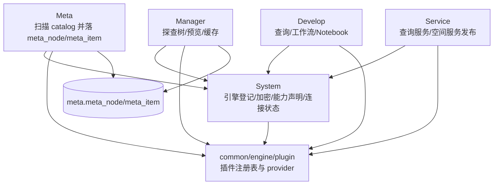
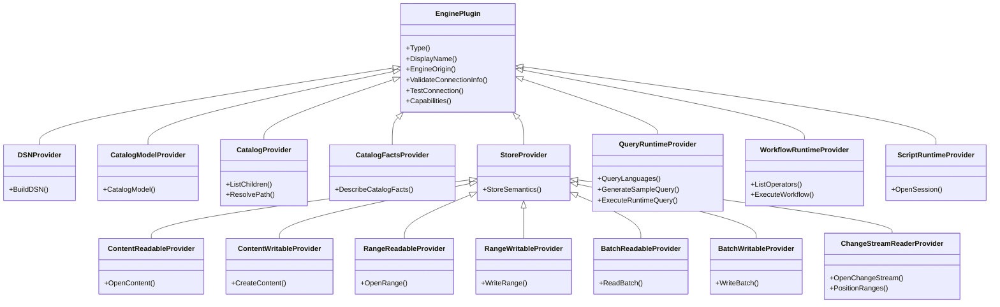

# ADDP 引擎体系图

本文档只描述 ADDP 引擎体系的概念关系和模块调用链。插件接口规范见 [../spec/addp引擎插件接口规范.md](../spec/addp引擎插件接口规范.md)，能力声明结构见 [../spec/addp引擎能力声明规范.md](../spec/addp引擎能力声明规范.md)，路径语义见 [../spec/addp存储引擎路径体系规范.md](../spec/addp存储引擎路径体系规范.md)。

---

## 一、核心概念

| 概念 | 含义 |
| --- | --- |
| Engine Instance | System 中的一条引擎实例，保存租户、名称、类型、连接配置、能力声明、生命周期和连接状态；一条记录只绑定一个确定的物理端点。 |
| Engine Plugin | `common/engine/plugins/<engine_type>` 下的插件实现，负责连接、校验、测试和能力暴露。 |
| Capability | 插件返回的结构化能力声明，版本为 `engine.capabilities/v1`。 |
| Catalog | 引擎中的真实目录层级，如 schema/table、bucket/object、database/graph。 |
| Item | 可被描述、预览、读取或写入的叶子数据项。 |

### Engine Instance 身份与生命周期

- `engine_id` 是 Engine Instance 的平台身份，不是可重定向到任意物理引擎的连接槽位。
- 插件通过 `ConnectionIdentityFields()` 声明物理端点身份字段。PostgreSQL 一类数据库通常使用 `host + port + database`，对象存储通常使用 `endpoint`，NFS 使用 `server + export_path`。
- 名称、描述、凭据和非身份连接参数可以原地更新；任何身份字段变化都必须创建新的 Engine Instance，不得保留原 ID 并改指向另一物理端点。
- 删除后重新注册始终产生新的自增 ID。平台不根据相似连接信息自动关联新旧 Engine Instance，也不迁移旧 locator、fingerprint 或 owner 状态。
- 生命周期统一为 `active`、`disabled`、`deleting`。只有 `active` 进入业务消费列表。删除前先在原生命周期执行只读影响评估；用户确认后才进入 `deleting`，冻结新绑定和新执行并保留连接配置供权威复扫和 cleanup 使用。参与模块不可用、存在运行任务或复扫影响变化时删除必须暂停；cleanup 完成后才物理删除 System 记录和凭据。
- Engine 删除不物理删除用户创建的任务、服务或治理配置；owner 模块将其保留为可重绑定状态，或禁用并标记 `missing_engine`。Meta 快照、缓存和明确登记的派生产物可由各 owner cleanup executor 物理回收。
- 用户登记的 Engine Instance 归当前 Tenant，不归登记人。`created_by` 只记录审计来源，不能成为后续读取、写入、DDL 或执行授权依据。
- `tenant_id=NULL` 只允许平台共享的内置计算 Runtime；共享 Runtime 只提供计算能力，不因此获得任意 Tenant 数据权限。

### 实时 Catalog、元数据快照和数据预览的边界

ADDP 中容易混淆的三个概念需要明确区分：

| 概念 | 回答的问题 | 归属模块 | 典型场景 |
| --- | --- | --- | --- |
| 实时 Catalog | 真实引擎当前有什么？ | System | 扫描前选择 PostgreSQL schema、MinIO bucket/prefix、MongoDB collection、NFS 目录等。 |
| 元数据快照 | 平台已经扫描、记录、纳管了什么？ | Meta | 查询 `meta.meta_node`、`meta.meta_item`，展示已扫描资产树、字段、空间信息和扫描状态。 |
| 数据预览 | 用户要查看真实数据内容。 | Manager | 表格预览、对象/文件预览、空间瓦片和后端 preview provider 组合。 |

边界原则：

- System 负责引擎控制面和实时 catalog 发现，对外提供 `POST /api/v1/system/engines/:id/catalog/children`。
- Meta 负责扫描任务、元数据落库、元数据快照查询和索引事件，不再提供新的实时浏览公共接口。
- Manager 负责数据管理体验和数据预览；展示已纳管资产时消费 Meta 快照，读取真实内容时走 Manager 后端预览能力。

---

## 二、全局架构

---

## 三、Provider 关系

---

## 四、模块消费关系

| 模块 | 消费方式 |
| --- | --- |
| System | 调用 `EnginePlugin` 做连接测试、连接信息校验和 capabilities 刷新；连接信息统一保存为 `connection_info` map。 |
| Meta | 调用 `CatalogProvider` 和 `CatalogFactsProvider` 扫描真实目录与 catalog leaf facts；先按 `CatalogModelSpec` 理解目录层级，再结合 provider 组合选择扫描策略。 |
| Manager | 使用 Meta 树展示探查目录；预览结构化数据优先使用 preview / batch read，预览对象或文件优先使用 preview / content read。 |
| Develop | 根据 `capabilities.compute` 选择查询、工作流或 Notebook 引擎。 |
| Service | 使用 query runtime 和 Meta item/spatial 元数据发布数据服务。 |
| Transfer | bounded table/content 路径消费 batch/session/content Provider；continuous source 消费 `ChangeStreamReaderProvider`，从同一 reader 获取分区 earliest/latest position 用于 lag/retention 诊断，由 Transfer adapter 归一化 ChangeEvent 并组合目标 Provider。 |

### Develop / Service 内置 DuckDB 联邦查询边界

DuckDB 当前不是用户在 System 中注册的外部 Engine Instance，也不是工作流运行时。它是 Develop 查询工作台和 Service 查询服务复用的内置联邦 SQL 执行模式：执行时根据 SQL 引用动态挂载 PostgreSQL、MySQL、MinIO/S3 等真实 System 引擎，并基于 Meta 标准 attributes 将对象存储表改写为 DuckDB `read_parquet(...)` 等读取表达式。

因此：

- DuckDB 不进入 `GET /api/v1/develop/workflow-engines`，不参与工作流算子发现。
- DuckDB 不作为普通 System 引擎实例要求 `connection_info`；Develop 查询工作台可以保留内置联邦查询入口，但该入口必须通过 Develop 查询模式发现接口暴露，不得混入 `/api/v1/develop/engines`。
- Develop 查询任务持久化时，普通 SQL 查询使用 `execution_config.engine_id` 指向具备 query 能力的 System 引擎；DuckDB 联邦查询使用 `execution_config.query_mode="duckdb"`，不得写入虚拟 `engine_id=0` 或伪造 System 引擎记录。
- 若未来要把 DuckDB 抽象为可注册的内置查询运行时，应单独设计 `compute.query` / `federated_query` 能力、租户隔离、扩展安装和数据源挂载规则，不在工作流引擎规范中旁路实现。

### Develop Notebook 引擎绑定边界

Notebook 是 Develop `script` 任务的当前交互形态。任务必须在 `execution_config.engine_id` 中绑定一个 System Engine Instance；该实例必须处于 `active` 状态，并声明 `compute.script.supported=true` 且 `compute.script.modes` 包含 `notebook`。

- Develop 通过 System Runtime Descriptor 发现 Notebook 引擎，只消费非敏感的 `protocol/host/port` 端点投影。
- Develop 必须通过 `ScriptRuntimeProvider.OpenSession()` 打开运行会话，再使用返回的 endpoint 查询 Kernel 或提交执行；不得配置 `JUPYTER_URL`、按引擎类型拼接固定地址，或绕过 Provider 直接读取 `connection_info`。
- Notebook 上传时必须选择并保存 `engine_id`。Kernel 属于该引擎实例的运行时能力，只能在选定引擎后查询并保存到任务内容中。
- Notebook 执行只使用任务已绑定的引擎，不允许在执行请求中临时改绑。绑定实例缺失、失效或不再具备 Notebook 能力时，保存的任务仍保留，但执行必须明确拒绝。
- 用户可以在 Notebook 任务定义上显式更换引擎和 Kernel；Develop 必须先校验目标实例及 Kernel，再原子更新原任务的 `execution_config.engine_id` 和 `content.kernel`。该操作不复制任务、不迁移 Notebook 文件，也不自动猜测替代引擎。
- 任务重绑定只影响后续执行。每次执行创建时保存的 `execution_config` 是历史执行快照，不能因任务之后重绑定而被回写或改写。
- 引擎健康状态由 System 连接检查负责，Develop 不提供 Jupyter 专用健康代理 API。

---

## 五、当前支持的引擎

| 引擎族 | 引擎 |
| --- | --- |
| 表格型 | PostgreSQL、MySQL、Doris、ClickHouse、Spark SQL |
| 动态 schema 记录集合型 | MongoDB |
| 图数据库 | Neo4j |
| 对象存储 | MinIO、S3 |
| 文件系统 | NFS |
| 消息流 | Kafka（common 插件与 Transfer keyed JSON -> PostgreSQL continuous v1 已实现，Console Wizard 已开放该单一路线） |
| 工作流运行时 | GeoPython Workflow / Spark Workflow、自动启动服务但手动注册的 Math Workflow 参考实现、Model3D Workflow、PointCloud Workflow、SuperMap Workflow，及用户自研扩展工作流运行时 |
| 脚本/Notebook | Jupyter |

---

## 六、调用原则

- 上层模块优先按 capabilities 判断可用性，不按 `engine_type` 硬编码功能入口。
- `engine_family` 只保留粗分类意义；涉及 catalog 层级、leaf 术语和 Meta 扫描编排时，统一以 `CatalogModelSpec` 与 provider 组合为准。
- Meta 的扫描目标字段使用 `catalog_paths` 表达文件系统、对象存储等 catalog model 下的路径。
- 目录发现统一走 `CatalogProvider.ListChildren`。
- Catalog leaf facts 统一走 `CatalogFactsProvider.DescribeCatalogFacts`。
- 查询统一走对应 runtime provider。
- 旧 `ListSchemas/ListTables/ListColumns/ListBuckets/ListCollections` 只能作为插件内部 helper，不作为上层契约。
- 引擎能力只表达引擎自身 native 能力与 common/engine provider 能力；Transfer、Manager 预览等模块适配状态不进入 `engine.capabilities/v1`。
- 工作流算子发现和执行通过 `WorkflowRuntimeProvider`；算子列表、参数、端口等动态能力不写入 capabilities。
- SQL、Workflow 和 Jupyter 的数据访问权限来自本次执行发起者。调用方必须把算子或语句归类为 `read | write | ddl | external_effect`，创建绑定 execution 的短期 Execution Authorization，再由 Runtime Service Principal 消费；Engine Runtime 身份和 Engine 创建人都不是业务授权来源。
- Runtime Service Principal 只负责机器认证、心跳、控制面注册和消费匹配 audience 的 Execution Authorization。除显式平台自动任务外，不授予通用 Tenant 数据权限或通用明文 Engine 读取权限。
- Develop 等控制面调用方发现可用 Engine Instance 时只读取 Engine Runtime Descriptor。Descriptor 只暴露实例身份、能力和工作流/脚本运行时的 `protocol/host/port`；数据引擎明文连接只能在消费 Execution Authorization 时按单个 Engine 即时取得。
- Jupyter 必须由 Develop 创建受控计算会话，不向 Notebook 注入长期明文 Engine 连接，不直接返回共享 Lab 作为数据访问主路径。Notebook 只能获得按 Execution Authorization 收窄的临时访问能力。
- Kafka topic 通过 `service -> topic` Catalog 暴露；partition 只作为 ChangeStreamReader assignment、position 和 diagnostics，不进入资源树。
- 业务 Kafka 是 System Engine；Infra Kafka 来自 ADDP 部署配置，不注册 Engine Instance，但复用相同 Kafka client/reader 底层实现。
- SQL metadata 复用只允许在事实来源和语义一致的引擎家族内发生，例如 MySQL/Doris 共享 `information_schema` helper；PostgreSQL、ClickHouse、Spark SQL 等差异较大的实现保留在各自插件内。
