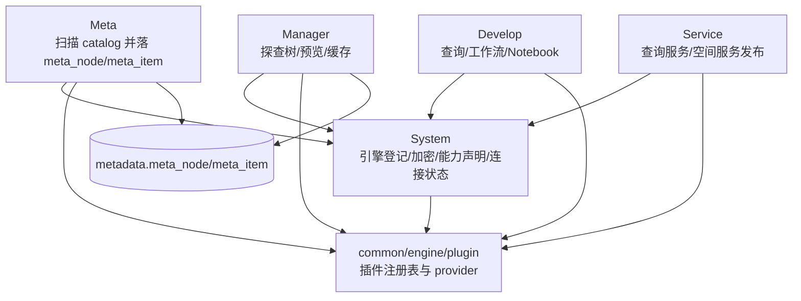
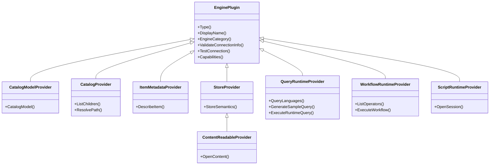

# ADDP 引擎体系图

本文档只描述 ADDP 引擎体系的概念关系和模块调用链。插件接口规范见 [../spec/addp引擎插件接口规范.md](../spec/addp引擎插件接口规范.md)，能力声明结构见 [../spec/addp引擎能力声明规范.md](../spec/addp引擎能力声明规范.md)，路径语义见 [../spec/addp存储引擎路径体系规范.md](../spec/addp存储引擎路径体系规范.md)。

---

## 一、核心概念

| 概念 | 含义 |
| --- | --- |
| Engine Instance | System 中的一条引擎实例，保存租户、名称、类型、连接配置、能力声明和连接状态。 |
| Engine Plugin | `common/engine/plugins/<engine_type>` 下的插件实现，负责连接、校验、测试和能力暴露。 |
| Capability | 插件返回的结构化能力声明，版本为 `engine.capabilities/v1`。 |
| Catalog | 引擎中的真实目录层级，如 schema/table、bucket/object、database/label。 |
| Item | 可被描述、预览、读取或写入的叶子数据项。 |

### 实时 Catalog、元数据快照和数据预览的边界

ADDP 中容易混淆的三个概念需要明确区分：

| 概念 | 回答的问题 | 归属模块 | 典型场景 |
| --- | --- | --- | --- |
| 实时 Catalog | 真实引擎当前有什么？ | System | 扫描前选择 PostgreSQL schema、MinIO bucket/prefix、MongoDB collection、NFS 目录等。 |
| 元数据快照 | 平台已经扫描、记录、纳管了什么？ | Meta | 查询 `metadata.meta_node`、`metadata.meta_item`，展示已扫描资产树、字段、空间信息和扫描状态。 |
| 数据预览 | 用户要查看真实数据内容。 | Manager | 表格预览、对象/文件预览、空间瓦片和后端 preview provider 组合。 |

边界原则：

- System 负责引擎控制面和实时 catalog 发现，对外提供 `POST /api/v1/system/engines/:id/catalog/children`。
- Meta 负责扫描任务、元数据落库、元数据快照查询和索引事件，不再提供新的实时浏览公共接口。
- Manager 负责数据管理体验和数据预览；展示已纳管资产时消费 Meta 快照，读取真实内容时走 Manager 后端预览能力。
- `/api/v1/system/engines/:id/namespaces` 和 `/api/v1/system/engines/:id/items` 仅作为浅层快捷封装，长期抽象应以 `catalog/children` 为准。

---

## 二、全局架构

---

## 三、Provider 关系

---

## 四、模块消费关系

| 模块 | 消费方式 |
| --- | --- |
| System | 调用 `EnginePlugin` 做连接测试、连接信息校验和 capabilities 刷新。 |
| Meta | 调用 `CatalogProvider` 和 `ItemMetadataProvider` 扫描真实目录与叶子元数据。 |
| Manager | 使用 Meta 树展示探查目录，预览时组合 metadata、content read 和 query runtime。 |
| Develop | 根据 `capabilities.compute` 选择查询、工作流或 Notebook 引擎。 |
| Service | 使用 query runtime 和 Meta item/spatial 元数据发布数据服务。 |
| Transfer | 执行面仍由 Transfer Reader/Writer 承担，后续通过插件能力和 TransferAdapter 统一配置来源。 |

---

## 五、当前支持的引擎

| 引擎族 | 引擎 |
| --- | --- |
| 表格型 | PostgreSQL、MySQL、Doris、ClickHouse、Spark SQL |
| 文档型 | MongoDB |
| 图数据库 | Neo4j |
| 对象存储 | MinIO、S3 |
| 文件系统 | NFS |
| 工作流运行时 | Python Workflow、Spark Workflow、Math Workflow |
| 脚本/Notebook | Jupyter |

---

## 六、调用原则

- 上层模块优先按 capabilities 判断可用性，不按 `engine_type` 硬编码功能入口。
- 目录发现统一走 `CatalogProvider.ListChildren`。
- 叶子元数据统一走 `ItemMetadataProvider.DescribeItem`。
- 查询统一走对应 runtime provider。
- 旧 `ListSchemas/ListTables/ListColumns/ListBuckets/ListCollections` 只能作为插件内部 helper，不作为上层契约。
