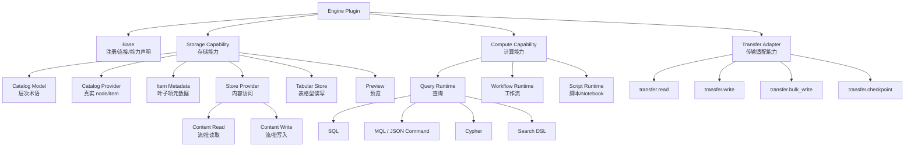
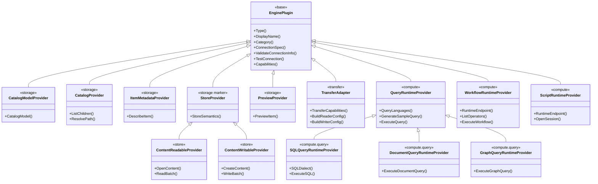

# ADDP 引擎插件接口体系规范草案

本文档用于讨论 ADDP engine plugin 接口体系的目标形态。它不是当前代码的逐行说明，而是面向后续重构的概念规范草案。

ADDP 的目标是成为“全域数据平台”。因此，引擎体系要把企业已有的数据库、对象存储、文件系统、查询引擎，以及 ADDP 扩展的计算引擎统一纳入登记、发现和消费体系，避免各模块各自维护一套数据源或运行时注册逻辑。

---

## 目录

1. [设计目标](#设计目标)
2. [核心边界](#核心边界)
3. [概念定义](#概念定义)
4. [基本原则](#基本原则)
5. [能力模型](#能力模型)
6. [目标接口总图](#目标接口总图)
7. [基础插件接口](#基础插件接口)
8. [Catalog 与 Store](#catalog-与-store)
9. [存储能力接口](#存储能力接口)
10. [计算能力接口](#计算能力接口)
11. [Transfer 集成边界](#transfer-集成边界)
12. [预览能力](#预览能力)
13. [叶子插件映射](#叶子插件映射)
14. [需要删除或弱化的现有接口](#需要删除或弱化的现有接口)
15. [开放问题](#开放问题)
16. [建议演进路径](#建议演进路径)

---

## 设计目标

引擎插件体系承担三件事：

1. **统一注册**  
   所有可被 ADDP 使用的外部或内部引擎，都通过 System 模块登记为 `engine` 实例。Meta、Manager、Develop、Transfer、Service 等上层模块不再重复维护自己的数据源或运行时注册表。

2. **统一连接测试**  
   每个插件必须知道如何对自己的引擎做真实连接测试。连接测试必须验证认证和最小可用操作，而不是只验证网络可达。

3. **统一能力发现**  
   插件必须结构化声明引擎能力，供上层模块判断自己是否能消费该引擎。例如：
   - Develop 消费 `compute.query`、`compute.workflow`、`compute.script`。
   - Meta 消费 `storage.catalog`、`storage.metadata`。
   - Manager 消费 `storage.catalog`、`storage.preview`、`storage.content_read`。
   - Transfer 消费 `transfer.read`、`transfer.write`、`transfer.bulk_write`。
   - Service 消费 `compute.query` 和查询发布能力。

插件本身不应该承载某一个业务模块的私有逻辑。业务模块可以消费插件能力，但不应该反向污染插件接口。

---

## 核心边界

### Engine Plugin 是控制面入口

Engine Plugin 负责：

- 注册引擎类型。
- 描述连接字段和敏感字段。
- 校验连接配置。
- 测试连接。
- 声明能力。
- 暴露目录、元数据、查询、运行时、内容读写等通用能力。

Engine Plugin 不负责：

- Transfer 任务调度。
- Transfer 高吞吐读写执行。
- Manager 页面展示逻辑。
- Meta 持久化模型。
- Develop 编辑器交互逻辑。

### Transfer Reader/Writer 是执行面入口

Transfer 由于要支持全量读写、高吞吐、批处理、断点续传、并行写入和格式转换，应保留自己的 `Reader` / `Writer` / `DataBatch` / `ConnectorRegistry` 体系。

二者的关系是：

- Engine Plugin 提供统一注册、能力发现和连接配置适配。
- Transfer 根据插件声明和适配结果创建自己的 Reader/Writer。
- Transfer 不再根据 `engine_type` 硬编码推断连接器配置。

目标不是“把 Transfer Reader/Writer 合并进 EnginePlugin”，而是“让 Transfer Reader/Writer 的可用性和配置来源由 Engine Plugin 统一管理”。

---

## 概念定义

| 概念 | 定义 |
| --- | --- |
| Engine Instance | System 模块中一条已注册的引擎实例，包含租户、名称、类型、连接配置、连接状态和能力声明。 |
| Engine Plugin | 某个 `engine_type` 对应的 Go 插件实现，负责连接、校验、测试和能力暴露。 |
| Capability | 插件对外承诺的结构化能力，供各模块判断是否可消费。 |
| Catalog Model | 插件声明的层次模型和专业术语，例如 `schema -> table`、`bucket -> prefix -> object`。 |
| Catalog Provider | 连接真实引擎，返回真实存在的目录节点和叶子数据项。 |
| Catalog Node | Catalog 中的一个真实节点，可以是容器，也可以是叶子 item。 |
| Item | 可被元数据描述、预览、读取或写入的叶子数据项，例如 table、collection、label、object、file。 |
| Metadata Provider | 描述叶子 item 的结构、统计、索引、空间字段、文件属性等。 |
| Store Provider | 访问 item 内容的能力，例如读表、读对象流、写文件、写表。 |
| Runtime Provider | 执行计算任务的能力，例如 query、workflow、script/notebook。 |
| Transfer Adapter | 将 Engine Instance 转换为 Transfer Reader/Writer 所需连接器配置和能力声明的适配层。 |
| Connection Provider | 创建具体客户端或连接池的实现 helper，例如 GORM、database/sql、Mongo client、Neo4j driver、S3 client。 |

---

## 基本原则

1. **基础接口只表达所有引擎共有的事实**  
   例如类型、显示名、连接字段、连接测试、能力声明。不是所有引擎都有连接串、连接池、Schema、文件目录或算子，所以这些不应放进基础接口。

2. **能力接口正交组合**  
   一个具体引擎可以同时具备多个能力。例如 PostgreSQL 既有存储能力，也有 SQL query 计算能力；MinIO 有对象存储能力和内容读取能力，但没有计算能力。

3. **Catalog 不等于 Store**  
   Catalog 回答“有什么”；Metadata 回答“它是什么样”；Store 回答“如何读写内容”。三者不应混成一个大接口。

4. **SQL 不等于表格型存储**  
   SQL 是查询语言，属于计算能力。表、视图、字段、分区等属于表格型存储的 catalog/metadata 能力。因此不应使用 `SQLCatalogPlugin` 这样的命名。

5. **GORM 不等于 SQL**  
   GORM 是部分 SQL 引擎的实现工具，不是 SQL 查询能力的抽象边界。Spark SQL、ClickHouse、Doris、Hive、DuckDB 等不应被迫继承 GORM 连接池能力。

6. **对象存储和文件系统必须分离建模**  
   MinIO/S3/OSS 可以提供 bucket、prefix、object 的类目录视图，也可以支持对象流式读取或 range read，但不能承诺 POSIX 文件系统语义。NFS/HDFS/local filesystem 才属于文件系统语义。

7. **术语由插件提供，上层按术语渲染**  
   PostgreSQL 的第一层叫 `schema`，MySQL/Doris/ClickHouse 的第一层叫 `database`，Neo4j 的叶子项可以叫 `label` / `relationship`。Meta 和 Manager 不能强行把所有层次叫成同一套名字。

8. **统一入口优先，专业接口作为补充**  
   Meta、Manager 等公共消费方应优先使用统一 `CatalogProvider.ListChildren` 和 `ItemMetadataProvider.DescribeItem`。`ListBuckets`、`ListCollections` 等强类型方法可作为插件内部 helper 或专业扩展口。

---

## 能力模型

引擎能力分为三大类：**存储能力**、**计算能力**、**传输适配能力**。一个引擎可以只具备其中一种，也可以同时具备多种。



能力说明：

| 能力 | 说明 | 典型消费方 |
| --- | --- | --- |
| `storage.catalog_model` | 获取引擎层次模型、术语和节点类型 | Meta、Manager、Console |
| `storage.catalog` | 获取真实目录节点和叶子 item | Meta、Manager |
| `storage.metadata` | 获取叶子 item 字段、索引、大小、行数、空间信息等 | Meta |
| `storage.content_read` | 读取对象、文件、表、集合等内容 | Manager、Transfer |
| `storage.content_write` | 写入对象、文件、表等内容 | Transfer |
| `storage.preview` | 生成统一预览数据或声明可组合预览方式 | Manager |
| `compute.query` | 执行 SQL、MQL、Cypher、Search DSL 等查询 | Develop、Service |
| `compute.workflow` | 执行 ADDP 工作流规范 | Develop、Orchestrator |
| `compute.script` | 执行 Notebook 或脚本 | Develop |
| `transfer.read` | 可作为 Transfer 数据源 | Transfer |
| `transfer.write` | 可作为 Transfer 目标 | Transfer |
| `transfer.bulk_write` | 支持批量写入、COPY、批量 load 等高性能写入 | Transfer |

---

## 目标接口总图



说明：

- 上图表达能力组合关系，不要求 Go 代码必须完全按继承层次实现。
- `Capabilities()` 是面向模块消费的结构化声明。
- Go 接口应只表达调用方真正要调用的方法。
- GORM、database/sql、Mongo client、Neo4j driver、S3 client 等属于实现 helper，不进入领域主接口树。

---

## 基础插件接口

建议基础接口：

```go
type EnginePlugin interface {
    Type() string
    DisplayName() string
    Category() EngineCategory

    ConnectionSpec() ConnectionSpec
    ValidateConnectionInfo(conn ConnectionInfo) error
    TestConnection(ctx context.Context, conn ConnectionInfo) error

    Capabilities() EngineCapabilities
}
```

`ConnectionSpec` 用于描述连接字段：

- 必填字段。
- 可选字段。
- 默认值。
- 敏感字段。
- 字段类型。
- 展示分组。
- 校验规则。

`EngineCapabilities` 应是结构化对象，由 System 统一序列化到数据库，而不是插件返回 JSON 字符串。

不建议放在基础接口里的内容：

- `BuildConnectionString`：不是所有引擎都有连接串。
- `CreateConnectionPool`：连接池是部分引擎的实现方式。
- `ListSchemas` / `ListBuckets`：这些是存储能力，不是基础能力。
- `GetSupportedOperators`：工作流算子应从运行时动态获取。

---

## Catalog 与 Store

这是当前最容易混乱的边界，建议明确分成四层。

### Catalog Model：声明层次和术语

Catalog Model 描述一个引擎的目录形态，不访问真实数据。

示例：

| 引擎族 | Catalog Model |
| --- | --- |
| PostgreSQL | `schema -> table/view` |
| MySQL / Doris / ClickHouse | `database -> table/view` |
| MongoDB | `database -> collection` |
| Neo4j | `database -> label/relationship` |
| MinIO / S3 | `bucket -> prefix -> object` |
| NFS / HDFS | `root -> directory -> file` |

建议模型：

```go
type CatalogModelProvider interface {
    EnginePlugin
    CatalogModel() CatalogModel
}
```

`CatalogModel` 至少包含：

- 根节点术语。
- 每层节点术语。
- 每层是否容器。
- 叶子 item 类型。
- 系统节点过滤规则说明。
- 默认展示 icon / i18n key。

### Catalog Provider：获取真实 node 和 item

Catalog Provider 负责连接真实引擎，返回真实存在的目录节点和叶子 item。

```go
type CatalogProvider interface {
    EnginePlugin
    ListChildren(ctx context.Context, conn ConnectionInfo, parent CatalogPath, opts ListOptions) ([]CatalogNode, error)
    ResolvePath(ctx context.Context, conn ConnectionInfo, path CatalogPath) (*CatalogNode, error)
}
```

`CatalogNode` 至少应包含：

- `Name`
- `Path`
- `Term`
- `Kind`
- `IsContainer`
- `IsItem`
- `Stats`
- `Attributes`
- `Actions`

其中：

- `IsContainer=true` 表示可以继续调用 `ListChildren`。
- `IsItem=true` 表示可以调用 `DescribeItem`、`PreviewItem` 或内容读写能力。

### Metadata Provider：描述叶子 item

```go
type ItemMetadataProvider interface {
    EnginePlugin
    DescribeItem(ctx context.Context, conn ConnectionInfo, path CatalogPath, opts MetadataOptions) (*ItemMetadata, error)
}
```

`ItemMetadata` 应覆盖：

- 字段信息。
- 行数、文档数、对象大小。
- 索引、主键、唯一键。
- 空间字段、SRID、范围。
- 文件类型、内容类型、修改时间、ETag。
- 采样信息。
- 引擎原生属性。

### Store Provider：访问内容

Store Provider 负责读写 item 内容。它不负责声明目录术语，也不负责保存 Meta 的持久化结果。

```go
type StoreProvider interface {
    EnginePlugin
    StoreSemantics() StoreSemantics
}
```

Store 可继续细分：

```go
type ContentReadableProvider interface {
    StoreProvider
    OpenContent(ctx context.Context, conn ConnectionInfo, path CatalogPath, opts ReadOptions) (io.ReadCloser, error)
}

type BatchReadableProvider interface {
    StoreProvider
    ReadBatch(ctx context.Context, conn ConnectionInfo, path CatalogPath, opts BatchReadOptions) (*DataBatch, error)
}

type ContentWritableProvider interface {
    StoreProvider
    CreateContent(ctx context.Context, conn ConnectionInfo, path CatalogPath, opts WriteOptions) (io.WriteCloser, error)
}

type BatchWritableProvider interface {
    StoreProvider
    WriteBatch(ctx context.Context, conn ConnectionInfo, path CatalogPath, batch *DataBatch, opts BatchWriteOptions) error
}
```

说明：

- 文件和对象适合 `OpenContent` / `CreateContent`。
- 表、集合、图更适合 `ReadBatch` / `WriteBatch`。
- Transfer 可以使用自己的 `pipeline.DataBatch`，规范中只表达“批数据”的概念，具体类型后续可放到 common。

---

## 存储能力接口

存储能力不是一个大接口，而是一组可以组合的能力。

### TabularCatalogProvider

表格型存储对应 PostgreSQL、MySQL、Doris、ClickHouse、Spark/Hive Catalog、DuckDB 等。

注意：这里叫 `Tabular`，不叫 `SQL`。因为这是存储目录能力，不是查询语言能力。

公共调用方优先使用 `CatalogProvider.ListChildren`。强类型接口只作为专业扩展或插件内部复用：

```go
type TabularCatalogProvider interface {
    CatalogModelProvider
    CatalogProvider
    ItemMetadataProvider
}

type TabularNativeProvider interface {
    ListNamespaces(ctx context.Context, conn ConnectionInfo) ([]NamespaceInfo, error)
    ListTabularItems(ctx context.Context, conn ConnectionInfo, namespace string) ([]TabularItemInfo, error)
    ListColumns(ctx context.Context, conn ConnectionInfo, namespace, item string) ([]ColumnInfo, error)
}
```

说明：

- `namespace` 在 PostgreSQL 中显示为 `schema`。
- `namespace` 在 MySQL/Doris/ClickHouse 中显示为 `database`。
- `TabularItemInfo.Kind` 可区分 `table`、`view`、`materialized_view`、`external_table`、`temporary_table`、`lake_table` 等。
- 是否用 GORM、database/sql、JDBC、Thrift、HTTP API，应由具体插件决定。

### TabularStoreProvider

表格型存储的内容访问接口，主要面向 Transfer，也可被 Preview 组合器复用。

```go
type TabularStoreProvider interface {
    StoreProvider
    BatchReadableProvider
    BatchWritableProvider
}
```

说明：

- `TabularStoreProvider` 只负责行数据的批量读写，不负责 SQL 执行。
- Develop 执行 SQL 应走 `SQLQueryRuntimeProvider`，而不是表格型 Store。
- 如果某个表格型引擎只支持读不支持写，也可以只实现 `BatchReadableProvider`。

### DocumentCatalogProvider 与 DocumentStoreProvider

文档库对应 MongoDB 等引擎族。

```go
type DocumentCatalogProvider interface {
    CatalogModelProvider
    CatalogProvider
    ItemMetadataProvider
}

type DocumentStoreProvider interface {
    StoreProvider
    BatchReadableProvider
    BatchWritableProvider
}
```

可选强类型扩展：

```go
type DocumentNativeProvider interface {
    ListDatabases(ctx context.Context, conn ConnectionInfo) ([]DatabaseInfo, error)
    ListCollections(ctx context.Context, conn ConnectionInfo, database string) ([]CollectionInfo, error)
    SampleCollectionSchema(ctx context.Context, conn ConnectionInfo, database, collection string, opts SampleOptions) (*DocumentSchema, error)
}
```

### GraphCatalogProvider 与 GraphStoreProvider

图数据库对应 Neo4j 等属性图引擎族。

```go
type GraphCatalogProvider interface {
    CatalogModelProvider
    CatalogProvider
    ItemMetadataProvider
}

type GraphStoreProvider interface {
    StoreProvider
    BatchReadableProvider
    BatchWritableProvider
}
```

可选强类型扩展：

```go
type GraphNativeProvider interface {
    ListDatabases(ctx context.Context, conn ConnectionInfo) ([]DatabaseInfo, error)
    ListNodeLabels(ctx context.Context, conn ConnectionInfo, database string) ([]NodeLabelInfo, error)
    ListRelationshipTypes(ctx context.Context, conn ConnectionInfo, database string) ([]RelationshipTypeInfo, error)
    GetGraphSchema(ctx context.Context, conn ConnectionInfo, database string) (*GraphSchema, error)
}
```

### ObjectCatalogProvider 与 ObjectStoreProvider

对象存储对应 S3、MinIO、OSS 等。

```go
type ObjectCatalogProvider interface {
    CatalogModelProvider
    CatalogProvider
    ItemMetadataProvider
}

type ObjectStoreProvider interface {
    StoreProvider
    ContentReadableProvider
    ContentWritableProvider
}
```

可选强类型扩展：

```go
type ObjectNativeProvider interface {
    ListBuckets(ctx context.Context, conn ConnectionInfo) ([]BucketInfo, error)
    ListObjects(ctx context.Context, conn ConnectionInfo, bucket, prefix string, opts ListObjectOptions) ([]ObjectInfo, error)
    GetObjectMetadata(ctx context.Context, conn ConnectionInfo, bucket, key string) (*ObjectInfo, error)
    OpenObject(ctx context.Context, conn ConnectionInfo, bucket, key string, opts ObjectReadOptions) (io.ReadCloser, error)
}
```

对象存储的限制应进入能力声明：

```json
{
  "storage": {
    "families": ["object"],
    "semantics": ["bucket", "prefix_listing", "object", "stream_read", "range_read"],
    "not_supported": ["posix_random_write", "atomic_rename", "real_directory"]
  }
}
```

### FileCatalogProvider 与 FileStoreProvider

文件系统语义存储对应 NFS、HDFS、本地文件系统。

```go
type FileCatalogProvider interface {
    CatalogModelProvider
    CatalogProvider
    ItemMetadataProvider
}

type FileStoreProvider interface {
    StoreProvider
    ContentReadableProvider
    ContentWritableProvider
}
```

可选强类型扩展：

```go
type FileNativeProvider interface {
    ListRoots(ctx context.Context, conn ConnectionInfo) ([]RootEntry, error)
    ListDirectory(ctx context.Context, conn ConnectionInfo, path string) ([]FileEntry, []DirEntry, error)
    OpenFile(ctx context.Context, conn ConnectionInfo, path string, opts ReadOptions) (io.ReadCloser, error)
    GetFileMetadata(ctx context.Context, conn ConnectionInfo, path string) (*FileMetadata, error)
}
```

说明：

- 文件系统可以表达目录、路径、rename、随机读写等能力，但不同文件系统仍需在 capabilities 中声明具体支持情况。
- 对象存储不要继承文件系统接口。二者最多共享 `ContentReadableProvider` / `ContentWritableProvider`。
- 表格型 store 不应和 tabular catalog 混为一体，前者是内容读写，后者是目录发现。

---

## 计算能力接口

计算能力面向 Develop、Orchestrator、Service 等模块。

### QueryRuntimeProvider

Query 是计算能力，不等于 SQL。它包括 SQL 和非 SQL 查询语言。

```go
type QueryRuntimeProvider interface {
    EnginePlugin
    QueryLanguages() []QueryLanguage
    GenerateSampleQuery(ctx context.Context, conn ConnectionInfo, opts SampleQueryOptions) (query string, language QueryLanguage)
    ExecuteQuery(ctx context.Context, conn ConnectionInfo, req QueryRequest) (*QueryResult, error)
}
```

建议按查询语言族细分：

```go
type SQLQueryRuntimeProvider interface {
    QueryRuntimeProvider
    SQLDialect() SQLDialect
    ExecuteSQL(ctx context.Context, conn ConnectionInfo, sql string, opts QueryOptions) (*QueryResult, error)
}

type DocumentQueryRuntimeProvider interface {
    QueryRuntimeProvider
    ExecuteDocumentQuery(ctx context.Context, conn ConnectionInfo, command string, opts QueryOptions) (*QueryResult, error)
}

type GraphQueryRuntimeProvider interface {
    QueryRuntimeProvider
    ExecuteGraphQuery(ctx context.Context, conn ConnectionInfo, cypher string, opts QueryOptions) (*GraphQueryResult, error)
}

type SearchQueryRuntimeProvider interface {
    QueryRuntimeProvider
    ExecuteSearchQuery(ctx context.Context, conn ConnectionInfo, query string, opts QueryOptions) (*QueryResult, error)
}
```

查询语言示例：

| 引擎 | Query 类型 |
| --- | --- |
| PostgreSQL / MySQL / Doris / ClickHouse / Spark SQL | SQL |
| MongoDB | MQL / JSON Command |
| Neo4j | Cypher |
| Elasticsearch | Search DSL |

GORM 相关能力应作为实现 helper：

```go
type GormConnectionProvider interface {
    CreateGormDB(conn ConnectionInfo, pool *PoolConfig) (*gorm.DB, error)
    GormDialect() string
}

type DatabaseSQLConnectionProvider interface {
    OpenSQLDB(conn ConnectionInfo, pool *PoolConfig) (*sql.DB, error)
}
```

原则：

- 按查询语言区分 query runtime。
- 不按 GORM/非 GORM 区分领域能力。
- GORM 可以支撑部分 `SQLQueryRuntimeProvider`，但不是所有 SQL 引擎的父接口。

### WorkflowRuntimeProvider

工作流引擎目前主要是内置运行时，但允许用户按 ADDP 工作流计算引擎接口规范扩展。

```go
type WorkflowRuntimeProvider interface {
    EnginePlugin
    RuntimeEndpoint(ctx context.Context, conn ConnectionInfo) (string, error)
    HealthEndpoint() string
    ListOperators(ctx context.Context, conn ConnectionInfo) ([]OperatorMetadata, error)
    ExecuteWorkflow(ctx context.Context, conn ConnectionInfo, req WorkflowExecuteRequest) (*WorkflowExecuteResult, error)
}
```

原则：

- 工作流能力以 ADDP 工作流计算引擎 HTTP API 规范为边界。
- 算子列表从运行时动态获取，不长期硬编码在 Go 插件里。
- 用户扩展的工作流引擎必须通过同一套 API 验证。

### ScriptRuntimeProvider

脚本能力目前仅对应 Jupyter Notebook。

```go
type ScriptRuntimeProvider interface {
    EnginePlugin
    RuntimeEndpoint(ctx context.Context, conn ConnectionInfo) (string, error)
    OpenSession(ctx context.Context, conn ConnectionInfo, req ScriptSessionRequest) (*ScriptSession, error)
}
```

当前可以只支持 `notebook` 模式。未来如果支持 Python shell、R、容器脚本等，再扩展 script runtime。

---

## Transfer 集成边界

Transfer 当前有自己的高吞吐执行体系：

- `Reader`：微批读取、schema、seek、batch/stream/micro-batch 模式。
- `Writer`：批量写入、flush、close。
- `ConnectorRegistry`：注册 Reader/Writer 工厂。
- `DataBatch`：统一批数据结构。

这套体系应该保留，因为它解决的是执行态问题。

Engine Plugin 与 Transfer 的集成建议通过 `TransferAdapter`：

```go
type TransferAdapter interface {
    EnginePlugin
    TransferCapabilities() TransferCapabilities
    BuildReaderConfig(ctx context.Context, engine EngineInstance, item CatalogPath, opts TransferReadOptions) (*TransferConnectorConfig, error)
    BuildWriterConfig(ctx context.Context, engine EngineInstance, target CatalogPath, opts TransferWriteOptions) (*TransferConnectorConfig, error)
}
```

`TransferCapabilities` 示例：

```json
{
  "read": true,
  "write": true,
  "bulk_write": true,
  "stream_read": false,
  "checkpoint": true,
  "connector_types": {
    "reader": "jdbc",
    "writer": "postgres_copy"
  },
  "supported_formats": ["table", "csv", "geojson", "parquet"]
}
```

建议边界：

- `TransferAdapter` 只做配置映射和能力声明。
- Reader/Writer 的高性能实现仍在 Transfer 模块。
- Transfer 任务仍使用自己的批大小、重试、checkpoint、并行度、postprocessor 等配置。
- `engine_type -> connector type` 的硬编码应逐步移到插件或统一 registry。

---

## 预览能力

Manager 关心的是能否获取 item 的预览数据。预览能力可以有两种实现方式：

1. **插件直接提供 Preview 能力**  
   引擎插件自己知道如何预览某个 item。

2. **Manager 基于低层能力组合出预览**  
   例如：
   - 表格型数据：用 `TabularCatalogProvider` + `SQLQueryRuntimeProvider` 查询前 N 行。
   - MongoDB 集合：用 `DocumentCatalogProvider` + `DocumentQueryRuntimeProvider` 读取样本。
   - Neo4j 图数据：用 `GraphCatalogProvider` + `GraphQueryRuntimeProvider` 生成图/表预览。
   - 对象文件：用 `ObjectStoreProvider.OpenContent`，再交给 `common/format` parser。
   - NFS 文件：用 `FileStoreProvider.OpenContent`，再交给 `common/format` parser。

建议目标：

- 短期保留 Manager 的 `PreviewProvider`。
- 中期让 `PreviewProvider` 只依赖标准能力接口，不再硬编码 `engine_type`。
- 不建议把所有预览逻辑都下沉到 engine plugin，否则插件会被 Manager 业务细节污染。

---

## 叶子插件映射

目标上的叶子插件应对应某一类具体引擎或运行时。

| 插件 | 存储能力 | 计算能力 | Transfer 能力 | 关键接口 |
| --- | --- | --- | --- | --- |
| PostgreSQLPlugin | tabular catalog、metadata、batch store | SQL query | read、write、bulk_write | `TabularCatalogProvider`、`SQLQueryRuntimeProvider`、`TransferAdapter`、可选 `GormConnectionProvider` |
| MySQLPlugin | tabular catalog、metadata、batch store | SQL query | read、write | `TabularCatalogProvider`、`SQLQueryRuntimeProvider`、`TransferAdapter`、可选 `GormConnectionProvider` |
| DorisPlugin | tabular catalog、metadata、batch store | SQL query | read、write、bulk_write | `TabularCatalogProvider`、`SQLQueryRuntimeProvider`、`TransferAdapter` |
| ClickHousePlugin | tabular catalog、metadata、batch store | SQL query | read、write、bulk_write | `TabularCatalogProvider`、`SQLQueryRuntimeProvider`、`TransferAdapter` |
| SparkSQLPlugin | tabular catalog、metadata | SQL query | read、write 可选 | `TabularCatalogProvider`、`SQLQueryRuntimeProvider`，不强依赖 GORM |
| MongoDBPlugin | document catalog、metadata、batch store | MQL / JSON command | read、write 可选 | `DocumentCatalogProvider`、`DocumentStoreProvider`、`DocumentQueryRuntimeProvider` |
| Neo4jPlugin | graph catalog、metadata、graph store | Cypher | read、write 可选 | `GraphCatalogProvider`、`GraphStoreProvider`、`GraphQueryRuntimeProvider` |
| MinIOPlugin | object catalog、metadata、content store | 无 | read、write | `ObjectCatalogProvider`、`ObjectStoreProvider`、`TransferAdapter` |
| S3Plugin | object catalog、metadata、content store | 无 | read、write | `ObjectCatalogProvider`、`ObjectStoreProvider`、`TransferAdapter` |
| NFSPlugin | file catalog、metadata、content store | 无 | read、write | `FileCatalogProvider`、`FileStoreProvider`、`TransferAdapter` |
| PythonWorkflowPlugin | 无 | workflow | 无 | `WorkflowRuntimeProvider` |
| SparkWorkflowPlugin | 无 | workflow | 无 | `WorkflowRuntimeProvider` |
| MathWorkflowPlugin | 无 | workflow | 无 | `WorkflowRuntimeProvider` |
| JupyterPlugin | 无 | script/notebook | 无 | `ScriptRuntimeProvider` |

---

## 需要删除或弱化的现有接口

### StoragePlugin.SupportsMetadataQuery

当前它只是一个布尔值，容易和真实接口实现不一致。目标上应通过 capabilities 和接口实现判断是否可扫描。

建议：

- 短期保留兼容。
- 中期删除，改为 `storage.catalog`、`storage.metadata` 能力声明和接口断言。

### ComputePlugin.GetSupportedOperators

工作流算子应由运行时动态返回。Go 插件里的静态列表容易过期。

建议：

- 短期保留兼容。
- 中期并入 `WorkflowRuntimeProvider.ListOperators`，从运行时 API 获取。

### EnginePlugin.BuildConnectionString

不是所有引擎都有连接串。对象存储、文件系统、HTTP 运行时往往只是把连接信息转成 JSON、URL 或 SDK client config。

建议：

- 从基础接口移除。
- SQL 类引擎可提供 `ConnectionStringProvider`。
- GORM 类引擎可提供 `GormConnectionProvider`。

### RelationalDBPlugin 强制继承 ConnectionPoolPlugin

这会把表格型 catalog 能力和 GORM 连接池能力绑死，不利于 Spark SQL、Hive、JDBC、DuckDB 等扩展。

建议：

- 拆成 `TabularCatalogProvider`、`SQLQueryRuntimeProvider` 和连接 helper。
- GORM 只是连接 helper 的一种。

### SQLCatalogPlugin 命名

不建议使用。SQL 是查询语言，不是 catalog 类型。

建议：

- 使用 `TabularCatalogProvider` 表达表格型存储目录。
- 使用 `SQLQueryRuntimeProvider` 表达 SQL 查询能力。

### NoSQLPlugin

`NoSQL` 是分类标签，不是稳定接口边界。MongoDB 和 Neo4j 的领域模型不同，把它们强放在同一个父接口下意义有限。

建议：

- 文档里保留 NoSQL 分类。
- Go 接口层弱化或删除 `NoSQLPlugin`。
- 直接使用 `DocumentCatalogProvider`、`DocumentStoreProvider`、`GraphCatalogProvider`、`GraphStoreProvider`。

### ObjectStoragePlugin 继承 FileSystemPlugin

对象存储不是文件系统，不应继承文件系统语义接口。

建议：

- `ObjectStoreProvider` 和 `FileStoreProvider` 并列。
- 二者共享 `ContentReadableProvider` / `ContentWritableProvider`。
- POSIX 能力、range read、atomic rename 等进入结构化 capabilities。

### Transfer 内部 engine_type 映射

Transfer 当前存在 `engine_type -> connector config` 的硬编码逻辑。随着 engine plugin 能力完善，这部分应迁移到 `TransferAdapter`。

建议：

- 短期保留兼容。
- 中期由插件提供 `BuildReaderConfig` / `BuildWriterConfig`。
- 长期 Transfer 只依赖 engine capabilities 和 transfer adapter。

---

## 开放问题

以下问题已达成讨论结论，后续将进入 capability 规范化与字段细化阶段：

1. `Capabilities()` 结构化对象的 JSON Schema 如何定义？
2. `CatalogNode.Kind`、`Term`、`Path` 是否需要平台级枚举和版本号？
3. `DataBatch` 是否应从 Transfer 下沉到 `common/engine` 或 `common/data`，供 Store/Preview/Transfer 复用？
4. `PreviewProvider` 是否继续作为独立扩展点，还是只作为 Manager 基于标准能力组合出的服务？
5. 是否需要统一 `ConnectionHandle` 抽象，隐藏 GORM、database/sql、Mongo client、Neo4j driver、S3 client 等具体实现？
6. Transfer Adapter 是放在 `common/engine/plugin`，还是由 Transfer 模块注册 adapter 到统一 registry？
7. 能力声明中的术语、层次、预览、读写、查询语言、Transfer 能力需要形成 JSON Schema。

本轮已确认的方向：

- 需要结构化 `Capabilities()`，不再使用字符串 JSON 作为插件返回值。
- `Capabilities()` 需要形成平台级 JSON Schema。
- `CatalogNode.Kind`、`Term`、`Path` 需要平台级规范，但不必全部写死成单一闭集枚举。
- `DataBatch` 暂不下沉，先保留 Transfer 自己的批数据体系。
- `PreviewProvider` 先保留独立扩展点，但实现上优先组合标准能力。
- 暂不引入统一大 `ConnectionHandle`，保留各类连接 helper。
- `TransferAdapter` 的标准定义放在 common，具体适配继续由插件和 Transfer 协同实现。

---

## 建议演进路径

1. **先定文档和命名**  
   基于本文档确认目标接口树、能力名称和术语。

2. **调整能力声明结构**  
   先把 capabilities 规范化，避免继续靠 `engine_type` 字符串分支。

3. **引入 Catalog Model 和统一 Catalog Provider**  
   先让 Meta、Manager 通过 `ListChildren` 获取真实 node/item，同时保留现有强类型方法作为适配层。

4. **拆分 Store、Query、Connection helper**  
   将 `RelationalDBPlugin + ConnectionPoolPlugin` 拆成 `TabularCatalogProvider`、`SQLQueryRuntimeProvider`、`GormConnectionProvider` 等。

5. **补齐 Transfer Adapter**  
   先迁移 PostgreSQL/MySQL、MinIO/S3、NFS 的 transfer 配置映射，减少 Transfer 内部硬编码。

6. **迁移核心引擎族**  
   先迁移 PostgreSQL/MySQL 和 MinIO/S3/NFS 两条最核心链路，再迁移 MongoDB/Neo4j，最后处理 workflow/Jupyter。

7. **删除旧接口和硬编码判断**  
   当 Meta、Manager、Develop、Transfer 都切到新能力接口后，再删除 `SupportsMetadataQuery`、强 GORM 继承、对象存储继承文件系统、硬编码 `engine_type` 判断。

---

**文档状态**：讨论草案  
**更新日期**：2026-05-01  
**适用范围**：ADDP engine plugin 接口体系重构讨论
